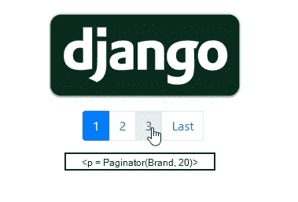

# Django —扩展分页

> 原文：<https://blog.devgenius.io/django-extended-pagination-36e18e21d10d?source=collection_archive---------10----------------------->



一般来说，大多数 Django 教程和书籍都很浅地触及了分页这个主题。当然，出于本文的目的，我将跳过使用 Django 模板有点过时这一点，最好是使用 Django 作为后端引擎。简而言之，现在让我们言归正传。

# **假设**

让我们假设我们正在创建一个基于 CBV 的简单细节视图，例如显示某种电子产品制造商品牌的信息。

*举例:*

```
class BrandDetailView*(*DetailView*)*:
    model = Brand
    context_object_name = 'brand'
    template_name = 'brands/brand_detail.html'
```

我们怎么能假设每个品牌都有一个产品列表，我们希望在同一个页面上显示品牌的详细信息。

# 扩展 DetailView 并添加分页

好，所以在这篇文章的开始，我们能够让我们的假设更精确。现在让我们继续实施我们的想法。

如果现在每个品牌都有产品，我们可以尝试先检索它们。为此，我们将通过覆盖 *get_context_data* 方法*来扩展我们的 *BrandDetailView* 。*我希望你对此很熟悉，但如果不熟悉，你可以在 Django 官方[文档](https://docs.djangoproject.com/en/3.2/topics/class-based-views/generic-display/#adding-extra-context)中阅读更多内容。

好了，看来现在我们可以在 BrandDetailPage 上列出所有品牌的产品了。但是本文的主题是分页，所以让我们扩展一些产品的假设。所以让我们假设一个品牌可以有成百上千种产品，对吗？

在一个页面上向用户提供如此大量的数据一点也不优雅。因此，最好的方法是将我们的产品包装到 Django Paginator 类中。

此外，我还在代码中添加了一些注释，使其不言自明。

快好了！现在我们必须在 HTML 模板中处理分页，为此，我将使用文档中的一个简单模板。但是请注意，我们的 Paginatior 对象现在是上下文管理器的“产品”。

**额外糖:**

上面的例子非常简单，对于大量的产品，Django 将对每个产品进行额外的数据库查询，例如，如果我们有 1000 个属于 Brand 的产品，那么 Django 将进行 1000 次以上的查询。这似乎不是一个有效的解决办法，不是吗？那么，如何防止数据库中的查询过度扩展呢？我再次简化了解决方案，但是 Django 让我们准备好使用依赖于模型之间关系的解决方案。您可以阅读更多关于 select_related 和 prefetch_related 的内容。

对于我们的示例，如果我们假设该品牌有许多产品，那么我们的 model.py 将如下所示:

```
class Brand*(*models.Model*)*:
    name = models.CharField*()* class Product*(*models.Model*)*:
    brand = models.ForeignKey*(*Brand, on_delete=models.CASCADE*)*
```

首先，我将覆盖 get_queryset 方法并添加几行附加代码，这样最终的有效代码将如下所示:

我希望通过这种简单的方式，我能够消除您对创建分页器对象的疑虑。

别忘了订阅我！:)