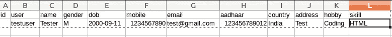
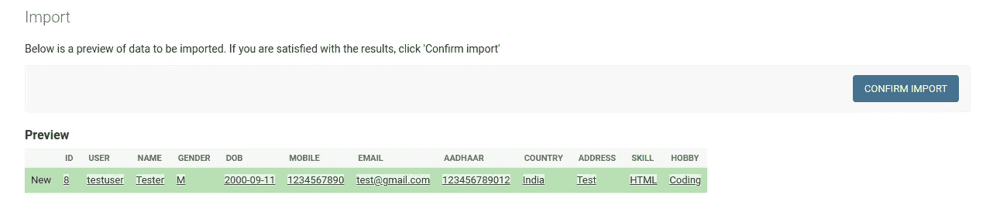
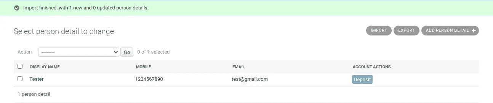
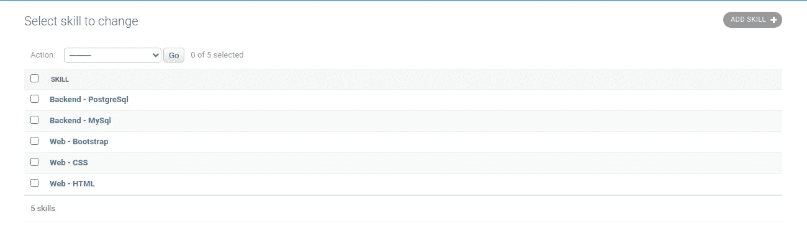
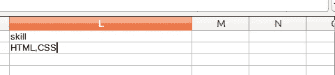
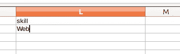
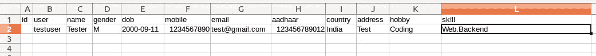
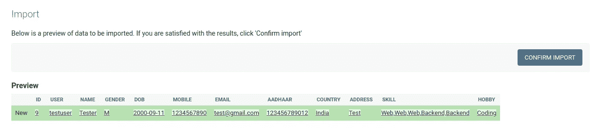
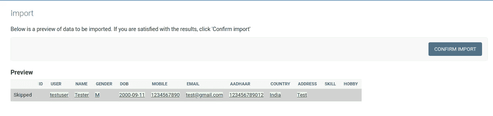
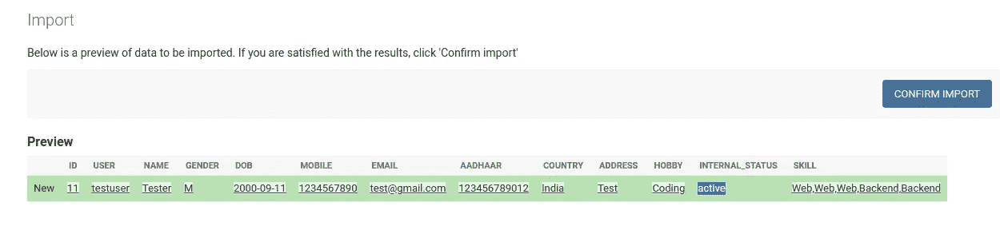

# Django 进出口技巧和提示

> 原文：<https://blog.devgenius.io/django-import-export-tricks-tips-562e45da35b6?source=collection_archive---------3----------------------->

使用导入导出及其特殊功能的提示

Django 的特殊库 [Django Import Export](https://django-import-export.readthedocs.io/en/latest/index.html) 使得在 Django 中导入导出数据变得更加容易。对于基本的实现和功能，请参考我的[以前的故事](https://vinaykumarmaurya30.medium.com/import-data-using-django-import-export-library-479871df2536)。在这个故事中，我将谈论一些打破常规的场景。

注意——所有进出口操作都将通过 Django admin 完成。

让我们清除模型结构，我将在这里使用。

在模型中. py

```
class Country(models.Model):
    name = models.CharField(max_length=30)
    code = models.CharField(max_length=10)
    status = models.IntegerField(default=1)
    created_at = models.DateTimeField(auto_now=True)
    updated_at = models.DateTimeField(auto_now_add=True)

    def __str__(self):
        return self.name

class Hobby(models.Model):
    name = models.CharField(max_length=30)
    status = models.IntegerField(default=1)
    created_at = models.DateTimeField(auto_now=True)
    updated_at = models.DateTimeField(auto_now_add=True)

    def __str__(self):
        return self.name

class SkillCategory(models.Model):
    name = models.CharField(max_length=20)
    status = models.IntegerField(default=1)
    created_at = models.DateTimeField(auto_now=True)
    updated_at = models.DateTimeField(auto_now_add=True)

    def __str__(self):
        return self.name

class Skill(models.Model):
    skill_type = models.ForeignKey(SkillCategory,on_delete=models.CASCADE)
    name = models.CharField(max_length=20)
    status = models.IntegerField(default=1)
    created_at = models.DateTimeField(auto_now=True)
    updated_at = models.DateTimeField(auto_now_add=True)

    def __str__(self):
        return "{} - {}".format(self.skill_type.name,self.name)

class PersonDetail(models.Model):
    GENDER = (
        ('M','Male'),
        ('F','Female')
    )
    user = models.ForeignKey(User,null=True,blank=True,on_delete=models.CASCADE)
    name = models.CharField(verbose_name='display name',max_length=20,help_text='Name of the Person')
    gender = models.CharField(max_length=10,choices=GENDER)
    dob = models.DateField()
    mobile = models.IntegerField()
    email = models.EmailField()
    aadhaar = models.IntegerField()
    country = models.ForeignKey(Country,on_delete=models.CASCADE)
    address = models.TextField()
    hobby = models.ManyToManyField(Hobby,null=True)
    skill = models.ManyToManyField(Skill,null=True)
    internal_status = models.CharField(max_length=20,choices=(('active','Active'),('suspended','Suspended')),null=True,blank=True)
    status = models.IntegerField(default=1)
    creation_time = models.TimeField(null=True,blank=True)
    created_at = models.DateTimeField(auto_now=True)
    updated_at = models.DateTimeField(auto_now_add=True)

    def __str__(self):
        return '{} - {}'.format(self.name,self.email)
```

所以我的主模型类是 **PersonDetail** ，其中 **Country** 模型是外键字段，而**爱好&技能**字段是多对多字段。现在让我们为基本导入编写资源类。

在 resources.py

```
from django.contrib.auth.models import User
from import_export import resources, fields
from import_export.widgets import ForeignKeyWidget, ManyToManyWidget,DateWidget
from .models import Country, Hobby, PersonDetail, Skillclass PersonDetailsAdminResource(resources.ModelResource):
    user = fields.Field(column_name='user', attribute='user', widget=ForeignKeyWidget(User, field='username'))
    country = fields.Field(column_name='country', attribute='country', widget=ForeignKeyWidget(Country, field='name'))
    hobby = fields.Field(column_name='hobby', attribute='hobby', widget=ManyToManyWidget(Hobby, field='name'))
    skill = fields.Field(column_name='skill', attribute='skill', widget=ManyToManyWidget(model=Skill,field='name'))

    class Meta:
        model = PersonDetail
        fields = (
            'id',
            'user',
            'name',
            'gender',
            'dob',
            'mobile',
            'email',
            'aadhaar',
            'country',
            'address',
            'hobby',
            'skill'
        )
```

在模型管理中添加这个资源类。在 admin.py

```
class PersonDetailAdmin(ImportExportModelAdmin):
    list_display = ('name','mobile','email','account_actions')
    resource_class = PersonDetailsAdminResourceadmin.site.register(PersonDetail,PersonDetailAdmin)
```

导入示例文件数据。In person_detail.csv



person_detail.csv



导入预览



导入的数据

# 在外键和 ManyToMany 字段中查找

默认情况下，导入导出库在外键字段中提供查找字段功能。查找字段默认使用主键(`**pk**`)作为查找标准，但可以定制为使用相关模型上的任何字段。

例如—

```
**class** **Meta**:
    fields = ('country__name',)
```

或者使用 **ForeignKeyWidget** 。它的优点是不仅可以用于导出，还可以导入具有外键关系的数据。

例如—

```
country = fields.Field(column_name='country', attribute='country', widget=ForeignKeyWidget(Country, field='name'))
```

虽然对于 **ManyToMany** 字段 **ManyToManyWidget** 不支持字段查找，但是我们可以对其进行定制以支持查找。

想象一下，我有一个 m2m 技术领域，拥有这些数据。



技能

有两种技能——网络和后台。我不想一个一个的提到某个类别的所有技能，我想提到类别名称，这样所有的技能都可以一次导入到那个类别中。



1.按技能名称导入技能



2.按技能类别导入技能

上面的第一个截图是按技能名称导入技能，但我们希望它按技能类别导入，任何属于上述类别的技能都将被导入。为此，我们需要在 m2m 小部件中进行一些定制。

widgets.py 中

```
class CustomManyToManyWidget(widgets.ManyToManyWidget):

    def __init__(self, model, separator=None, field=None, *args, **kwargs):
        self.lookup_field = kwargs.get('lookup_field', None)
        super(CustomManyToManyWidget, self).__init__(model)
        self.field=field

    def clean(self, value, row=None, *args, **kwargs):
        if not value:
            return self.model.objects.none()
        if isinstance(value, (float, int)):
            ids = [int(value)]
        else:
            ids = value.split(self.separator)
            ids = filter(None, [i.strip() for i in ids])

        return self.model.objects.filter(**{"{}__{}__in".format(self.field,self.lookup_field):ids})
```

这里我们添加了一个名为 **lookup_field** 的可选字段，并修改了 **clean 方法。**

在 resources.py

```
from django.contrib.auth.models import User
from import_export import resources, fields
from import_export.widgets import ForeignKeyWidget, ManyToManyWidget,DateWidget
from .models import Country, Hobby, PersonDetail, Skill
from .widgets import ForeignkeyRequiredWidget, CustomManyToManyWidget

class PersonDetailsAdminResource(resources.ModelResource):
    user = fields.Field(column_name='user', attribute='user', widget=ForeignKeyWidget(User, field='username'))
    country = fields.Field(column_name='country', attribute='country', widget=ForeignKeyWidget(Country, field='name'))
    hobby = fields.Field(column_name='hobby', attribute='hobby', widget=ManyToManyWidget(Hobby, field='name'))
    **skill = fields.Field(column_name='skill', attribute='skill', widget=CustomManyToManyWidget(model=Skill,field='skill_type',lookup_field='name'))**

    class Meta:
        model = PersonDetail
        fields = (
            'id',
            'user',
            'name',
            'gender',
            'dob',
            'mobile',
            'email',
            'aadhaar',
            'country',
            'address',
            'hobby',
            'skill'
        )
```

现在我们可以走了。



m2m_lookup_sample.csv



m2m _ 查找 _ 预览

# **自定义下拉小工具**

我的模型包含一个带有元组数据的下拉字段**性别**

```
GENDER = (
    ('M','Male'),
    ('F','Female')
)
```

为了导入性别字段，我必须提到 M 或 F，而不是男性或女性作为值，因此为此，我们可以创建我们的自定义下拉小部件。

widgets.py 中

```
class CustomDropDownWidget(widgets.Widget):
    def __init__(self, drop_down=None):
        self.dropdown = dict(drop_down)

    def clean(self, value, row=None, *args, **kwargs):
        if self.dropdown:
            for key,val in self.dropdown.items():
                if val == value:
                    return key
```

在 resources.py

```
class PersonDetailsAdminResource(resources.ModelResource):
    user = fields.Field(column_name='user', attribute='user', widget=ForeignKeyWidget(User, field='username'))
    country = fields.Field(column_name='country', attribute='country', widget=ForeignKeyWidget(Country, field='name'))
    hobby = fields.Field(column_name='hobby', attribute='hobby', widget=ManyToManyWidget(Hobby, field='name'))
    **gender = fields.Field(column_name='gender', attribute='gender',widget=CustomDropDownWidget(drop_down=PersonDetail.GENDER))**
    skill = fields.Field(column_name='skill', attribute='skill', widget=CustomManyToManyWidget(model=Skill,field='skill_type',lookup_field='name'))

    class Meta:
        model = PersonDetail
        fields = (
            'id',
            'user',
            'name',
            'gender',
            'dob',
            'mobile',
            'email',
            'aadhaar',
            'country',
            'address',
            'hobby',
            'skill'
        )
```

# **跳过行(避免重复数据)**

跳过行是一种强大的导入导出方法，有助于在某些违反数据验证的情况下跳过行。

例如，如果您有大量需要导入的用户配置文件数据，但这些数据也包含重复的配置文件。您可以覆盖 skip_row 方法来避免 Django 的唯一数据完整性。这个函数返回 **False** 作为默认值。

现在，我只想导入那些电子邮件 id 尚不存在的配置文件。

In resource.py

```
def skip_row(self, instance, original):

    return True if PersonDetail.objects.filter(email=instance.email).exists() else False
```



跳过行，具有此电子邮件的人员已经存在

# **导入前排**

现在，我想在导入数据时将 internal_status 激活，但该字段不会包含在 CSV 文件中，我们将通过覆盖 before_import_row 方法在内部处理此问题。您可以在导入行之前使用自己的逻辑。

在 resources.py

```
class PersonDetailsAdminResource(resources.ModelResource):
    user = fields.Field(column_name='user', attribute='user', widget=ForeignKeyWidget(User, field='username'))
    country = fields.Field(column_name='country', attribute='country', widget=ForeignKeyWidget(Country, field='name'))
    hobby = fields.Field(column_name='hobby', attribute='hobby', widget=ManyToManyWidget(Hobby, field='name'))
    gender = fields.Field(column_name='gender', attribute='gender',widget=CustomDropDownWidget(drop_down=PersonDetail.GENDER))
    skill = fields.Field(column_name='skill', attribute='skill', widget=CustomManyToManyWidget(model=Skill,field='skill_type',lookup_field='name'))

    **def before_import_row(self, row, **kwargs):
        try:
                row['internal_status'] = 'active'
        except Exception as e:
            print(e)

        return row**

    def skip_row(self, instance, original):

        return True if PersonDetail.objects.filter(email=instance.email).exists() else False

    class Meta:
        model = PersonDetail
        fields = (
            'id',
            'user',
            'name',
            'gender',
            'dob',
            'mobile',
            'email',
            'aadhaar',
            'country',
            'address',
            **'internal_status',**
            'hobby',
            'skill'
        )
```



导入行预览前

# **导入行后**

现在我想在导入概要文件后将 is_staff 设为 True。我们将通过重写 after_import_row 方法在内部处理这个问题。导入行后，您可以使用自己的逻辑。

在 resources.py

```
class PersonDetailsAdminResource(resources.ModelResource):
    user = fields.Field(column_name='user', attribute='user', widget=ForeignKeyWidget(User, field='username'))
    country = fields.Field(column_name='country', attribute='country', widget=ForeignKeyWidget(Country, field='name'))
    hobby = fields.Field(column_name='hobby', attribute='hobby', widget=ManyToManyWidget(Hobby, field='name'))
    gender = fields.Field(column_name='gender', attribute='gender',widget=CustomDropDownWidget(drop_down=PersonDetail.GENDER))
    skill = fields.Field(column_name='skill', attribute='skill', widget=CustomManyToManyWidget(model=Skill,field='skill_type',lookup_field='name'))

    def before_import_row(self, row, **kwargs):
        try:
                row['internal_status'] = 'active'
        except Exception as e:
            print(e)

        return row

    def skip_row(self, instance, original):

        return True if PersonDetail.objects.filter(email=instance.email).exists() else False

    **def after_import_row(self, row, row_result, row_number=None, **kwargs):
        *"""
        Override to add additional logic. Does nothing by default.
        """* try:
            User.objects.filter(username='user').update(is_staff=True)
        except Exception as e:
            print(e)**

    class Meta:
        model = PersonDetail
        fields = (
            'id',
            'user',
            'name',
            'gender',
            'dob',
            'mobile',
            'email',
            'aadhaar',
            'country',
            'address',
            'internal_status',
            'hobby',
            'skill'
        )
```

导入导出库还提供了其他方法，我们可以在其中放置这样的逻辑。这些场景只是为了指导如何使用导入导出内置方法。有了这个库，我们可以轻松处理许多事情。有关详细信息，请访问官方文档。

**谢谢！**对于阅读，希望会有帮助。