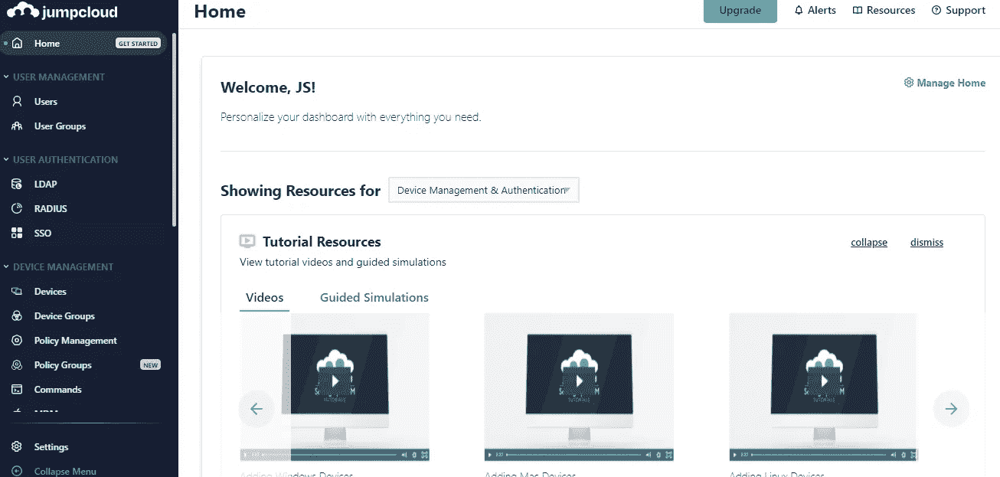
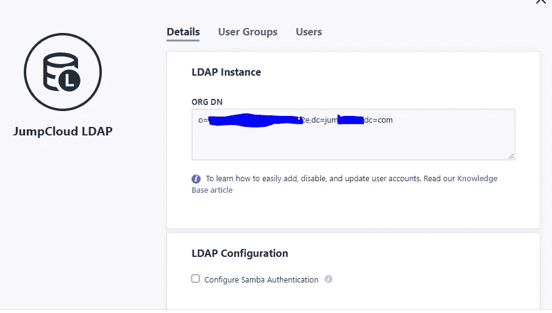
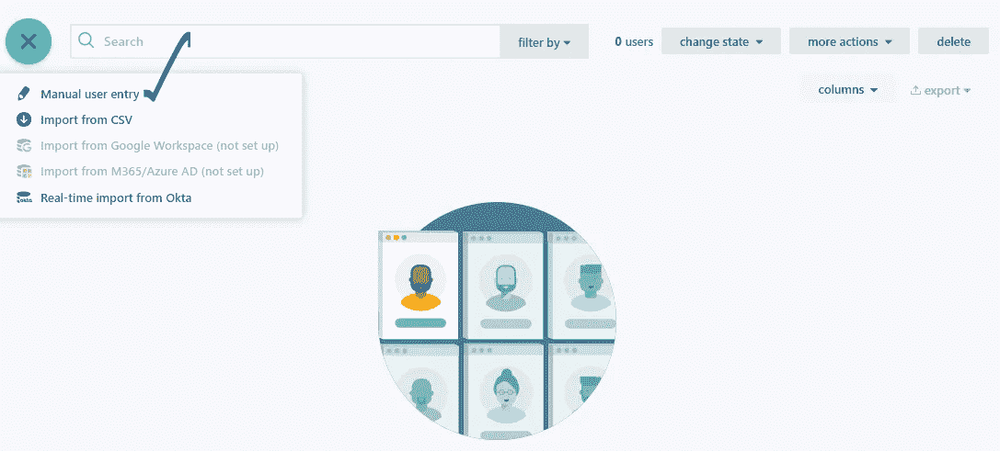
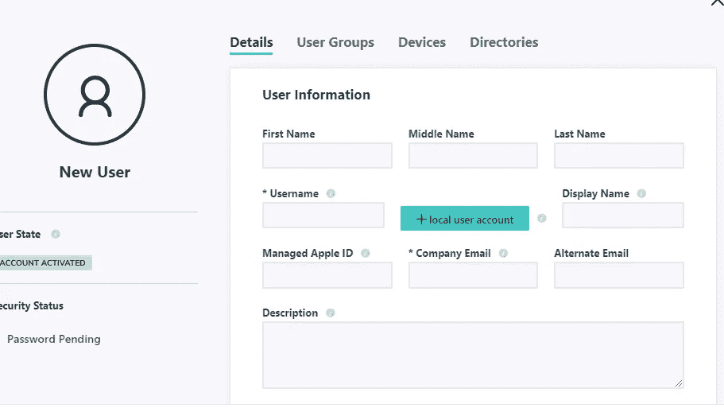
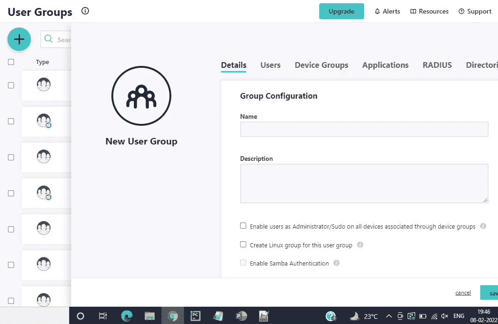
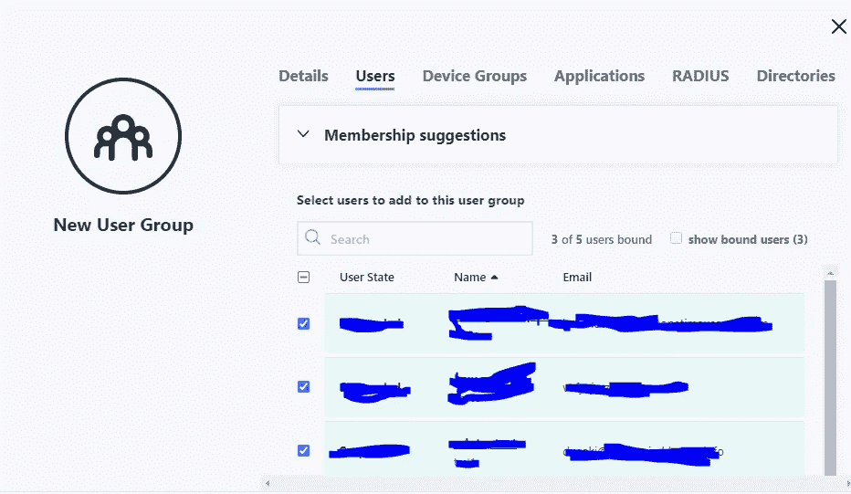
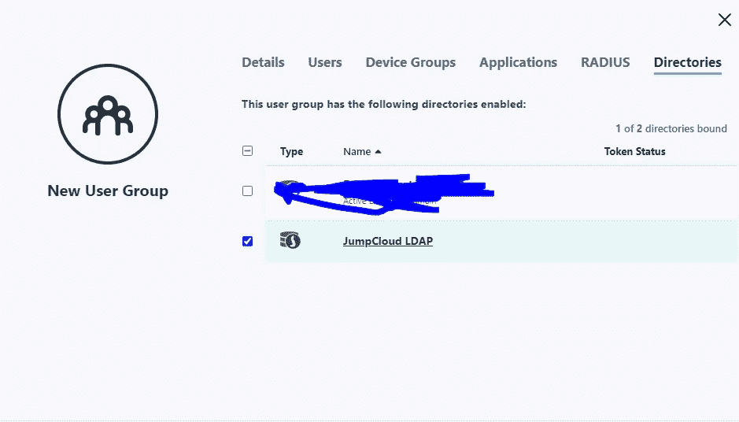
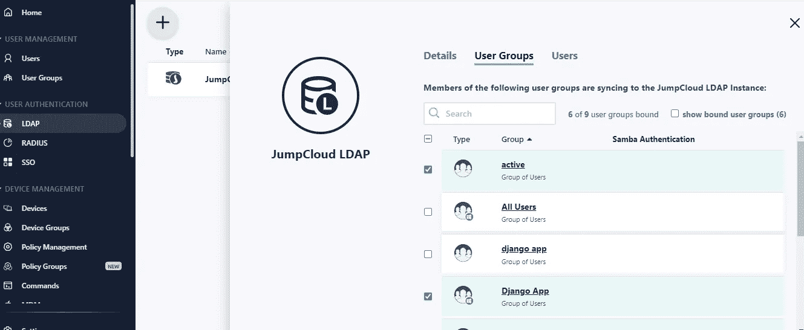
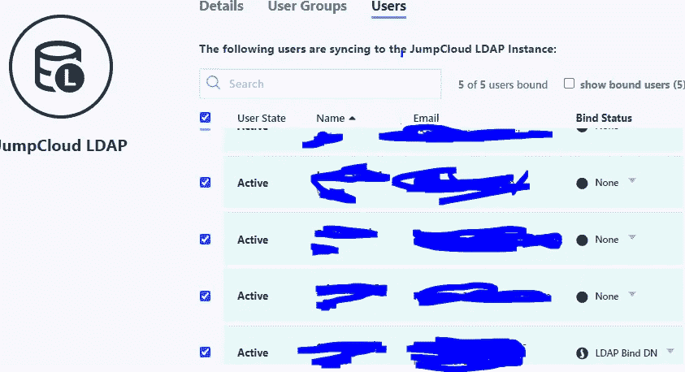
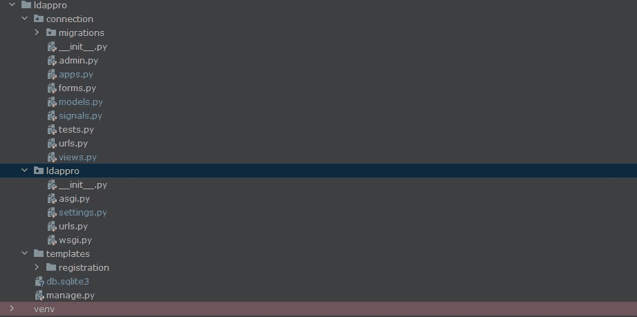

# Django LDAP 与 Jumpcloud Open LDAP 的集成

> 原文：<https://blog.devgenius.io/django-ldap-integration-with-jumpcloud-open-ldap-9307d86af7cc?source=collection_archive---------8----------------------->

**问题陈述:-** 任务是为我们的 Django 应用程序使用 Jump cloud open LDAP 进行身份验证，以及在我们的应用程序中进行授权

**背景:-** 我们都面临着在不同地方管理用户数据的问题，但这可以在 Jumpcloud 的帮助下集中起来。我不打算详细说明它提供的所有功能，你可以在他们的页面上查看。

**先决条件:-** 要求如下:-

*   用于开发组织级解决方案的 Jumpcloud 平台知识。
*   LDAP(轻量级目录访问协议)信息
*   Django 基础知识
*   阅读 Jumpcloud 提供的博客，对事情有更清楚的了解，点击此[链接](https://jumpcloud.com/blog/how-to-connect-your-application-to-ldap)

**所需包:-** 所需包如下:-

*   **django-auth-ldap** (这个包有助于将任何 ldap 与我们的 django 应用程序连接起来，这基本上是与 Django 后端和 mange 的所有东西连接起来)
*   **python-ldap**

**基本术语:-** 术语如下

*   **绑定操作**:作为一种验证凭证的方式，绑定操作可用于将客户端认证为特定用户，并为在该连接上执行的后续操作指定授权身份。
*   **CN:-** 俗名。(基本上是用户对象或组名)
*   **OU:-** 组织单位
*   **DC :-** 域组件(基本上是 Google.com 或任何其他)
*   **O:-** 组织

**由于 Jumpcloud 开放 LDAP 遵循开放 LDAP 标准，您可以查看此** [**链接**](https://www.openldap.org/doc/admin21/intro.html)

**工艺流程:-**

*   第一个用户尝试登录
*   首先使用所需的设置建立 LDAP 连接
*   获取用户数据及其各自 LDAP 支持的附加属性，并将其传递到后端
*   如果用户在 Jump cloud LDAP 或 Django 用户数据库中有凭据，而这些凭据在 Jump cloud LDAP 中不存在，则他将被验证(我们也可以设置只对 LDAP 用户验证用户)
*   用户填充在用户首次尝试进行身份验证时完成，其余时间，如果 Jumpcloud 用户中有任何更新，它会自动更新附加属性
*   基本上，对于每个新用户，它将填充字段，对于老用户，如果有任何变化，它将更新属性
*   一旦通过身份验证，您就可以访问这些页面

**下面是我们建立项目**要遵循的步骤

1.  **创建 Jumpcloud 账号**

我们可以免费创建跳云帐户 10 天，使用基本的东西，这足以了解跳云提供的所有功能。探索事物并最终将其用于我们自己的解决方案。他们还提供为期 10 天的实时聊天，你可以问问题，并从他们那里得到答案，除此之外，他们还有很好的博客来使用他们的应用程序，YouTube 上也有视频。



**Jumpcloud 面板**

**2)从 Jumpcloud OL (Open LDAP)中获取组织和 DN**



**Jumpcloud 组织和 DN**

**3)在我们的演示中，我们将通过向 Jumpcloud 中手动添加用户，在 Jumpcloud 中至少添加三个用户**



**Jumpcloud 手动用户输入**

正如您在上面看到的，您可以手动添加用户或从 csv 导入用户，方法是下载模板并将用户填充到 csv 中，然后上传同样的模板供批量用户加载，除此之外，您还可以执行 **Google integration 和 Azure AD (Active Directory)** 基本上分别将用户从 G **oogle** 、 **azure** 导入 jumpcloud。



**用户创建**

填写所有必需的数据用户名必须是唯一的，公司邮件也要填写尽可能多的详细信息下面是雇佣详细信息和角色详细信息，因为*我们还将添加用户配置文件数据，以及从 Jump cloud 获取其他属性，并将其添加到我们的用户配置文件模型中。* ***记得也通过做邮件验证和设置密码来激活用户。(如果操作得当，用户将变为活动状态)***

**用户组的创建**

现在 Django 提供了三种用户权限，分别是超级用户、职员和活动用户。我们将在 Jumpcloud 中使用用户组来根据权限标记我们的用户，例如**我在 jumpcloud 中创建了用户组 Django_active，并将其映射到 Django 中的活动权限，并向其中添加了一个用户。因此，在我们的认证过程中，Django_active 组中的任何用户都将在我们的用户数据库中被标记为活动的。**



**用户组创建 Jumpcloud**

这是我们创建用户组的步骤，因此这里将需要创建四个用户组，第一个用户组将是基本上是我们的应用程序组的用户组，因此这里我们将其命名为 **Django 应用程序。**在该用户组中，添加您可以通过进入用户侧选项卡完成的所有用户，并勾选所有用户。



**向群组添加用户**

**将用户组也分配到 jump cloud LDAP**



**将用户组添加到 Jumpcloud Ldap**

现在，在这样做之后，保存它并休息，剩下的组将被激活，职员，超级用户。对这些组也遵循相同的步骤，但是**不要将所有用户分配给 staff 和超级用户，这将有助于检查我们的后端是否正确映射了所有这些权限。**(请记住，您可以随意指定任何名称，但是我们也必须在 Django 设置中正确映射这些名称)

**4)检查所有用户和用户组是否映射到我们的 Jumpcloud Ldap**



**Jumpcloud Ldap 用户组映射**

您可以仔细检查我们的用户组是否已映射到我们的 Jumpcloud LDAP，方法是单击 jumpcloud LDAP 并转至**用户组选项卡，然后将标记** **映射组。对于用户也是一样，检查用户是否被标记。**

**5)剩下的最后一件事是用 LDAP 绑定用户**



**JumpCloud 用户绑定**

我们必须绑定一个用户，以便能够与我们的 Jump Cloud LDAP 建立连接。为此，只需单击 None 并选择 LDAP Bind DN。**请记住，绑定 DN 中必须至少有一个用户。稍后在 Django 设置中，您将需要这个绑定 DN 用户凭证**

最后，我们结束设置跳转云 LDAP 设置，下一部分是关于 Django 的。

# **Django 设置 LDAP**

在这里，我们将创建基本登录。模板也是从其他来源获取的。所以在这里，我们将只实现 Django 中的默认登录，还将用户配置文件添加到模型和配置文件页面，您可以在那里获取所有的配置文件

**1)基本代码为下面的登录代码片段:-**



**文件夹和文件结构**

这是下面的文件和文件夹结构，以供参考。

**连接**是应用程序名称，而 **ldappro** 是 django 项目名称

models.py

```
from django.db import models
from django.contrib.auth.models import User

# Create your models here.
class UserProfile(models.Model):
    # This field is required.
    user = models.OneToOneField(User,related_name='profile', on_delete=models.CASCADE)
    # Other fields here
    username = models.CharField(max_length=254 )
    first_name = models.CharField(max_length=254 )
    last_name = models.CharField(max_length=254 )
    email = models.EmailField(max_length=254 )
    middle_name = models.CharField(max_length=100 )
    display_name = models.CharField(max_length=100 )
    title = models.CharField(max_length=100 )
    department = models.CharField(max_length=100 )
    cost_center = models.CharField(max_length=100 )
    location = models.CharField(max_length=100 )
    employee_id = models.CharField(max_length=100 )
    employee_type = models.CharField(max_length=100 )
    company = models.CharField(max_length=100 )
    description = models.CharField(max_length=100 )
    phone_no = models.CharField(max_length=100 )

    def __str__(self):
        return   self.user
```

请注意，在用户配置文件模型中，我使用了 Jumpcloud LDAP 支持的那些字段。**可以参考这个** [**链接**](https://support.jumpcloud.com/support/s/article/user-attributes-2019-08-21-10-36-47) **。您必须向下滚动到 LDAP 属性映射** **表，在那里您可以看到映射，这在下面我们将映射字段时非常有用。我们可以获取大量的字段，因此对于任何个人资料数据来说都应该足够公平。**

管理. py

```
from django.contrib import admin
from .models import UserProfile

admin.site.register(UserProfile)
# Register your models here. 
```

在这里，我们已经注册了我们模型，以便我们可以在我们的管理页面结帐

Views.py

```
from django.shortcuts import render ,redirect
from django.contrib.auth.decorators import login_required
from django.http import HttpResponseRedirect
from .models import UserProfile
from django.contrib.auth.views import LoginView
from .forms import  LoginForm

class CustomLoginView(LoginView):
    form_class = LoginForm

    def form_valid(self, form):
        return super(CustomLoginView, self).form_valid(form)

@login_required
def profile(request):

    try:
        ldapuserprofile = request.user.profile
    except UserProfile.DoesNotExist:
        return HttpResponseRedirect('/login/')

    context = {'ldapuser': ldapuserprofile}
    return render(request, 'registration/profile.html', context)

def home(request):
    return render(request, 'registration/home.html') 
```

上面的代码都是关于主页，个人资料页和登录页的

模板文件

base.html

```
<!doctype html>
<html lang="en">
<head>
    <!-- Required meta tags -->
    <meta charset="utf-8">
    <meta name="viewport" content="width=device-width, initial-scale=1, shrink-to-fit=no">

    <!-- Bootstrap CSS -->
    <link rel="stylesheet" href="https://maxcdn.bootstrapcdn.com/bootstrap/4.0.0/css/bootstrap.min.css" integrity="sha384-Gn5384xqQ1aoWXA+058RXPxPg6fy4IWvTNh0E263XmFcJlSAwiGgFAW/dAiS6JXm" crossorigin="anonymous">

    <!--Font awesome icons -->
   <link rel="stylesheet" href="https://use.fontawesome.com/releases/v5.8.2/css/all.css" integrity="sha384-oS3vJWv+0UjzBfQzYUhtDYW+Pj2yciDJxpsK1OYPAYjqT085Qq/1cq5FLXAZQ7Ay" crossorigin="anonymous">

    <title>  </title>
</head>
<body>
  <div class="container p-3 my-3">
    <div class="row">
      <div class="col-md-12">
        <nav class="navbar navbar-expand-md navbar-light " style="background-color: #f0f5f5">
          <a href="/" class="navbar-brand">Home</a>
            <button type="button" class="navbar-toggler" data-toggle="collapse" data-target="#navbarCollapse">
                <span class="navbar-toggler-icon"></span>
            </button>
            <div class="collapse navbar-collapse" id="navbarCollapse">
                <div class="navbar-nav ml-auto">
                  
                    <a href="" class="nav-item nav-link">Profile</a>
                    <a href="" class="nav-item nav-link">Logout</a>
                  
                    <a href="" class="nav-item nav-link">Sign in</a>
                  

                </div>
            </div>
        </nav>
        <!--Any flash messages pop up in any page because this is the base template-->
        
          <div class="alert alert-dismissible" role="alert">
            
              <div class="alert alert-{{ message.tags }}">{{ message }}</div>
            
            <button type="button" class="close" data-dismiss="alert" aria-label="Close">
              <span aria-hidden="true">&times;</span>
            </button>
          </div>
        
        
      </div>
    </div>
  </div>

    <!-- jQuery first, then Popper.js, then Bootstrap JS -->
    <script src="https://code.jquery.com/jquery-3.2.1.slim.min.js" integrity="sha384-KJ3o2DKtIkvYIK3UENzmM7KCkRr/rE9/Qpg6aAZGJwFDMVNA/GpGFF93hXpG5KkN" crossorigin="anonymous"></script>
    <script src="https://cdnjs.cloudflare.com/ajax/libs/popper.js/1.12.9/umd/popper.min.js" integrity="sha384-ApNbgh9B+Y1QKtv3Rn7W3mgPxhU9K/ScQsAP7hUibX39j7fakFPskvXusvfa0b4Q" crossorigin="anonymous"></script>
    <script src="https://maxcdn.bootstrapcdn.com/bootstrap/4.0.0/js/bootstrap.min.js" integrity="sha384-JZR6Spejh4U02d8jOt6vLEHfe/JQGiRRSQQxSfFWpi1MquVdAyjUar5+76PVCmYl" crossorigin="anonymous"></script>

    <!-- A plugin for password show/hide  -->
    <script src="https://unpkg.com/bootstrap-show-password@1.2.1/dist/bootstrap-show-password.min.js"></script>

</body>
</html>
```

home.html

```

 Home Page 

    <div class="jumbotron">
        <p class="lead">
            This is <b> login system</b>
        </p>
        <hr class="my-4">
        <p class="lead">
            
              <p>You are welcome on Home Page</p>
    <p>Your name is - {{user.first_name}} {{user.last_name}}</p>
    <p>Your email is - {{user.email}}</p>
    <p>Your Display name is - {{user.display_name}}</p>
        <p>Your Description is - {{user.description}}</p>

                <a class="btn btn-primary btn-lg" href="" role="button">Logout</a>
            
                <a class="btn btn-primary btn-lg" href="" role="button">Sign in</a>
            
        </p>
    </div>


```

profile.html

```

Profile Page

    <div class="row my-3 p-3">
        <p> </p>
    </div>
    
        <div class="alert alert-danger alert-dismissible" role="alert">
            <div id="form_errors">
                
                    <strong>{{ value }}</strong>
                
            </div>
            <button type="button" class="close" data-dismiss="alert" aria-label="Close">
                <span aria-hidden="true">&times;</span>
            </button>
        </div>
    

            <div class="form-row">
                 <p>You are welcome on Home Page</p>
    <p>Your name is - {{ldapuser.first_name}} {{ldapuser.last_name}}</p>
    <p>Your email is - {{ldapuser.email}}</p>
     <p>Your middlename is - {{ldapuser.middle_name}}</p>

    </div>


```

login.html

```

 Login Page 

    <div class="form-content my-3 p-3">
        <div class="container">
            <div class="row justify-content-center">
                <div class="col-lg-5">
                    <div class="card shadow-lg border-0 rounded-lg mt-0 mb-3">
                        <div class="card-header justify-content-center">
                          <h3 class="font-weight-light my-1 text-center">Sign In</h3>
                        </div>
                        
                            <div class="alert alert-danger alert-dismissible" role="alert">
                                <div id="form_errors">
                                    
                                        <strong>{{ value }}</strong>
                                    
                                </div>
                                <button type="button" class="close" data-dismiss="alert" aria-label="Close">
                                    <span aria-hidden="true">&times;</span>
                                </button>
                            </div>
                        
                        <div class="card-body">
                            <form method="POST">
                                
                                <div class="form-row">
                                    <div class="col-md-10 offset-md-1">
                                        <div class="form-group">

                                            <label class="small mb-1">Username</label>
                                            {{ form.username }}
                                        </div>
                                    </div>
                                </div>
                                <div class="form-row">
                                    <div class="col-md-10 offset-md-1">
                                        <div class="form-group">
                                          <label class="small mb-1">Password</label>
                                          {{ form.password }}
                                        </div>
                                    </div>
                                </div>
                                <div class="form-row">
                                    <div class="col-md-10 offset-md-1">
                                        <div class="form-group">
                                            <!-- Add a Remember me functionality -->
                                            <label> Remember me</label>
                                        </div>
                                    </div>
                                </div>
                                <div class="form-row">
                                    <div class="col-md-10 offset-md-1">
                                        <div class="form-group mt-0 mb-1">
                                          <button name="login" class="col-md-12 btn btn-dark" id="login">Sign in</button>
                                        </div>
                                    </div>
                                </div>
                            </form>
                        </div>
                        <div class="card-footer text-center">

                        </div>
                    </div>
                </div>
            </div>
        </div>
     </div>

```

logout.html

```

Logout

    <div class="card" style="width: 18rem;">
        <div class="card-body">
        <h5 class="card-title">You have been logged out</h5>
        <p class="card-text">
            Thanks for your time, contact me for any comments or suggestions using my email address.
        </p>
        <br><hr><a href="" class="btn btn-primary">Sign in again</a>
        </div>
    </div>


```

urls.py

```
*"""ldappro URL Configuration

The `urlpatterns` list routes URLs to views. For more information please see:
    https://docs.djangoproject.com/en/3.0/topics/http/urls/
Examples:
Function views
    1\. Add an import:  from my_app import views
    2\. Add a URL to urlpatterns:  path('', views.home, name='home')
Class-based views
    1\. Add an import:  from other_app.views import Home
    2\. Add a URL to urlpatterns:  path('', Home.as_view(), name='home')
Including another URLconf
    1\. Import the include() function: from django.urls import include, path
    2\. Add a URL to urlpatterns:  path('blog/', include('blog.urls'))
"""* from django.contrib import admin
from django.urls import path, include
from django.contrib.auth import views as auth_views
from connection.views import *
from connection.forms import LoginForm

urlpatterns = [
    path('', home, name='users-home'),
    path('admin/', admin.site.urls),
    path('profile/', profile, name='users-profile'),
    path('login/', CustomLoginView.as_view(redirect_authenticated_user=True, template_name='registration/login.html',
                                           authentication_form=LoginForm), name='login'),

    path('logout/', auth_views.LogoutView.as_view(template_name='registration/logout.html'), name='logout'),

]
```

注意，这个 urls.py 属于项目 URL。你可以按照你的要求来设置你的网址。

```
import os
import logging

# Build paths inside the project like this: os.path.join(BASE_DIR, ...)
BASE_DIR = os.path.dirname(os.path.dirname(os.path.abspath(__file__)))

# Quick-start development settings - unsuitable for production
# See https://docs.djangoproject.com/en/3.0/howto/deployment/checklist/

# SECURITY WARNING: keep the secret key used in production secret!
SECRET_KEY = ''

# SECURITY WARNING: don't run with debug turned on in production!
DEBUG = True

ALLOWED_HOSTS = []

# Application definition

INSTALLED_APPS = [
    'django.contrib.admin',
    'django.contrib.auth',
    'django.contrib.contenttypes',
    'django.contrib.sessions',
    'django.contrib.messages',
    'django.contrib.staticfiles',
    'connection',
]

MIDDLEWARE = [
    'django.middleware.security.SecurityMiddleware',
    'django.contrib.sessions.middleware.SessionMiddleware',
    'django.middleware.common.CommonMiddleware',
    'django.middleware.csrf.CsrfViewMiddleware',
    'django.contrib.auth.middleware.AuthenticationMiddleware',
    'django.contrib.messages.middleware.MessageMiddleware',
    'django.middleware.clickjacking.XFrameOptionsMiddleware',
]

ROOT_URLCONF = 'ldappro.urls'

TEMPLATES = [
    {
        'BACKEND': 'django.template.backends.django.DjangoTemplates',
        'DIRS': [BASE_DIR + '/templates/', ],
        'APP_DIRS': True,
        'OPTIONS': {
            'context_processors': [
                'django.template.context_processors.debug',
                'django.template.context_processors.request',
                'django.contrib.auth.context_processors.auth',
                'django.contrib.messages.context_processors.messages',
            ],
        },
    },
]

WSGI_APPLICATION = 'ldappro.wsgi.application'

# Database
# https://docs.djangoproject.com/en/3.0/ref/settings/#databases

DATABASES = {
    'default': {
        'ENGINE': 'django.db.backends.sqlite3',
        'NAME': os.path.join(BASE_DIR, 'db.sqlite3'),
    }
}

# Password validation
# https://docs.djangoproject.com/en/3.0/ref/settings/#auth-password-validators

AUTH_PASSWORD_VALIDATORS = [
    {
        'NAME': 'django.contrib.auth.password_validation.UserAttributeSimilarityValidator',
    },
    {
        'NAME': 'django.contrib.auth.password_validation.MinimumLengthValidator',
    },
    {
        'NAME': 'django.contrib.auth.password_validation.CommonPasswordValidator',
    },
    {
        'NAME': 'django.contrib.auth.password_validation.NumericPasswordValidator',
    },
]

LOGIN_REDIRECT_URL = '/'
LOGIN_URL = 'login'

# Internationalization
# https://docs.djangoproject.com/en/3.0/topics/i18n/

LANGUAGE_CODE = 'en-us'

TIME_ZONE = 'UTC'

USE_I18N = True

USE_L10N = True

USE_TZ = True

# Static files (CSS, JavaScript, Images)
# https://docs.djangoproject.com/en/3.0/howto/static-files/

STATIC_URL = '/static/'
```

基本上在这里你只需要设置你的模板，并添加登录和注销网址。这让我们来设置 Django 应用程序的默认登录和注销。现在最后一件事是 settings.py

1.  使用 LDAP 设置来设置 settings.py 文件

```
import ldap
import logging
from django_auth_ldap.config import LDAPSearch, GroupOfNamesType, NestedActiveDirectoryGroupType, PosixGroupType,GroupOfUniqueNamesType
```

现在，你可以通过访问这个 [*链接*](https://django-auth-ldap.readthedocs.io/en/latest/authentication.html#search-bind) *和这个* [*链接*](https://django-auth-ldap.readthedocs.io/en/latest/groups.html) *来阅读上面的内容。*

现在我们将只使用 LDAPSearch，GroupOfNamesType 这两个来演示您自己的项目可能需要的其余部分

**LdapSearch:-** 标识相关组对象集合的对象。也就是说，用户可能属于的所有组以及我们可能需要了解的任何其他组(例如，在嵌套组的情况下)

现在，对于我们的需求，我们使用 **GroupOfNamesType** 进行搜索。它用于表示组关系。因为它们允许 DNs 作为成员，所以你也可以用它们来代表嵌套组。

```
LDAP_USER_NAME= 'binded_username'
AUTH_LDAP_SERVER_URI = 'ldap://ldap.jumpcloud.com:389'
AUTH_LDAP_BIND_DN = 'uid=binded_username,ou=users,o=,dc=,dc=com'
AUTH_LDAP_BIND_PASSWORD = 'binded_user_password'
AUTH_LDAP_USER_SEARCH = LDAPSearch('ou=users,o=,dc=,dc=com', ldap.SCOPE_SUBTREE,
                                   '(uid=%(user)s)')
AUTH_LDAP_GROUP_SEARCH = LDAPSearch('ou=users,o=,dc=,dc=com', ldap.SCOPE_SUBTREE,
                                    '(objectClass=top)')
AUTH_LDAP_GROUP_TYPE = GroupOfNamesType(name_attr="cn")
AUTH_LDAP_MIRROR_GROUPS = True
```

稍后将这段代码添加到 settings.py 文件的末尾

**现在，此处绑定的用户名必须替换为之前我们使用 Jumpcloud LDAP 绑定的用户名和 binded_user_password 字段的密码。您还必须添加 o= (organization)我们在 Jumpcloud Open LDAP 第二步中获得的这个值。您还获得了 o 值和 dn 值，并填充那些缺少的参数**

```
AUTH_LDAP_BIND_DN = 'uid=tester1,ou=users,o=xyzzf,dc=abc,dc=com'
```

在上面的例子中，tester1 是用户名，xyzzf 是组织值，abc 是域组件

默认情况下，Jumpcloud 遵循一些格式 ou =用户将始终相同，这是必须的，因为基本上我们在这里所做的是使用绑定的用户建立与 open Jumpcloud LDAP 的连接，我们基本上是在 org(o)内部 org(o)内部我们在这里查看组织单位(ou ),即用户

现在，在这里，我们将基本上获得我们的用户组，我们基本上是通过这些用户组进行映射的

```
AUTH_LDAP_GROUP_TYPE = GroupOfNamesType(name_attr="cn")
```

这里我们告诉映射 cn 作为组名，所以基本上我们得到的组名是 cn，正如我们在上面的行中提到的

```
AUTH_LDAP_REQUIRE_GROUP = "cn=Django App,ou=users,o=,dc=,dc=com"

AUTH_LDAP_USER_ATTR_MAP = {
    "first_name": "givenName",
    "last_name": "sn",
    "email": "mail",
    "username": "uid",
    "password": "userPassword",
    "middle_name": "initials",
    "display_name": "displayName",
    "title": "title",
    "department": "departmentNumber",
    "cost_center": "businessCategory",
    "location": "physicalDeliveryOfficeName",
    "employee_id": "employeeNumber",
    "employee_type": "employeeType",
    "company": "company",
    "description": "description",
    "phone_no": "mobile",

}
AUTH_PROFILE_MODULE = 'connection.UserProfile'

AUTH_LDAP_USER_FLAGS_BY_GROUP = {
    "is_active": "cn=active,ou=users,o=,dc=,dc=com",
    "is_staff": "cn=staff,ou=users,o=,dc=,dc=com",
    "is_superuser": "cn=superuser,ou=users,o=,dc=jumpcloud,dc=com"
}

AUTH_LDAP_ALWAYS_UPDATE_USER = True
AUTH_LDAP_FIND_GROUP_PERMS = True
AUTH_LDAP_CACHE_TIMEOUT = 3600

AUTH_LDAP_FIND_GROUP_PERMS = True

# Keep ModelBackend around for per-user permissions and maybe a local
# superuser.
AUTHENTICATION_BACKENDS = (
    'django_auth_ldap.backend.LDAPBackend',
    'django.contrib.auth.backends.ModelBackend',
)

# logging
logger = logging.getLogger('django_auth_ldap')
logger.addHandler(logging.StreamHandler())
logger.setLevel(logging.DEBUG)
DEFAULT_AUTO_FIELD='django.db.models.AutoField'
```

上面的代码是 setttings.py 文件中需要添加的最后一部分

请在这里填写 o 和 dc 值。现在，这里我们使用 cn= Django 应用程序，这意味着我们将搜索 Django 应用程序组中的所有成员，这基本上是 AUTH_LDAP_REQUIRE_GROUP 所做的工作。在这里，它将尝试匹配该组中存在的用户名，如果存在密码，还将使用密码进行身份验证。

AUTH_LDAP_USER_ATTR_MAP 什么都不是，但我们正在从 jumpcloud 获取其他配置文件字段。在这里，我刚刚创建了模型字段名称及其对应的 JumpCloud Open LDAP 属性名称的映射。在上面的部分，我还添加了链接，你可以在那里查看更多的字段，如果你想获得演示目的，这已经足够了

```
AUTH_PROFILE_MODULE = 'connection.UserProfile'
```

这只是将我们的概要文件模型设置为概要文件

```
AUTH_LDAP_USER_FLAGS_BY_GROUP = {
    "is_active": "cn=active,ou=users,o=,dc=,dc=com",
    "is_staff": "cn=staff,ou=users,o=,dc=,dc=com",
    "is_superuser": "cn=superuser,ou=users,o=,dc=jumpcloud,dc=com"
}
```

正如我之前所说的，我们需要将 Django active、staff 和 superuser 映射到 Jumpcloud 组，以便标记为 true。cn 指的是 Jumpcloud 组，所以在活动组中的任何用户都将在 Django 中被标记为活动，其他用户也一样。

# Logging 部分主要是您可以在终端上看到关于 LDAP 的日志错误，以及它主要用于搜索等的所有内容。

至此，我们终于完成了 settings.py。现在最后一件事是使用 signal 来默认存储我们的配置文件数据，用户配置文件在 Django 以下版本中存储，但对于以上版本，我们必须在 Signal 的帮助下对其进行编码。

**现在这个信号代码是工作区类型的代码。**

在你的应用中创建一个 signals.py

```
from __future__ import unicode_literals
import django_auth_ldap.backend
from .models import UserProfile
from django.contrib.auth.models import User

from django.db.models.signals import post_save
from django.dispatch import receiver
from django.conf import settings
## LDAP Bind User NAme
LDAP_USER_NAME = getattr(settings, "LDAP_USER_NAME", None)

def populate_user_profile(sender, user=None, ldap_user=None, **kwargs):
  if User.objects.filter(username=user).exists():
    temp_profile = None
    data = {}
    try:
        temp_profile = user.profile
    except:
        temp_profile = UserProfile.objects.create(user=user)
    data['display_name'] = ldap_user.attrs.get('displayName')
    data['middle_name'] = ldap_user.attrs.get('initials')
    data['email']= ldap_user.attrs.get('mail')
    data['first_name']= ldap_user.attrs.get('givenName')
    data['last_name']= ldap_user.attrs.get('sn')
    data['username']=ldap_user.attrs.get('uid')
    data['title']= ldap_user.attrs.get('title')
    data['department']= ldap_user.attrs.get('departmentNumber')
    data['cost_center']= ldap_user.attrs.get('businessCategory')
    data['location']= ldap_user.attrs.get('physicalDeliveryOfficeName')
    data['employee_id']= ldap_user.attrs.get('employeeNumber')
    data['employee_type']= ldap_user.attrs.get('employeeType')
    data['company']= ldap_user.attrs.get('company')
    data['description']= ldap_user.attrs.get('description')
    data['phone_no']= ldap_user.attrs.get('mobile')

    for key, value in data.items():
        if value:
            setattr(user.profile, key, value[0].encode('utf-8').decode())
    user.profile.save()

  else:
    pass  # This means  User is logging in first time so create_user_profile signal will handle profile data

django_auth_ldap.backend.populate_user.connect(populate_user_profile)

@receiver(post_save, sender=User)
def create_user_profile(sender, instance, created, **kwargs):
  if created:
    profile = UserProfile.objects.create(user=instance)
    data={}
    data['display_name'] = instance.ldap_user.attrs.get('displayName')
    data['middle_name'] = instance.ldap_user.attrs.get('initials')
    data['email'] = instance.ldap_user.attrs.get('mail')
    data['first_name'] = instance.ldap_user.attrs.get('givenName')
    data['last_name'] = instance.ldap_user.attrs.get('sn')
    data['username'] = instance.ldap_user.attrs.get('uid')
    data['title'] = instance.ldap_user.attrs.get('title')
    data['department'] = instance.ldap_user.attrs.get('departmentNumber')
    data['cost_center'] = instance.ldap_user.attrs.get('businessCategory')
    data['location'] = instance.ldap_user.attrs.get('physicalDeliveryOfficeName')
    data['employee_id'] = instance.ldap_user.attrs.get('employeeNumber')
    data['employee_type'] = instance.ldap_user.attrs.get('employeeType')
    data['company'] = instance.ldap_user.attrs.get('company')
    data['description'] = instance.ldap_user.attrs.get('description')
    data['phone_no'] = instance.ldap_user.attrs.get('mobile')
    print(instance.ldap_user)
    for key, value in data.items():
      if value:
        setattr(profile, key, value[0].encode('utf-8').decode())
    profile.save()
```

现在，我们可以使用 Django LDAP 提供的 populate_user_profile 函数来填充用户配置文件数据

```
populate_user_profile()
```

这个函数基本上处理过去已经认证的用户的用户配置文件数据。正如我上面提到的，每当用户第一次登录 Django 的数据库时，都会进行用户填充，其余时间基本上是从 LDAP 更新数据库。

因此，首先，如果检查该条件，如果用户存在于我们的 Django 数据库中，如果存在，那么在 try catch 语句中，我们基本上尝试获取用户配置文件，如果它存在于我们的数据库中，那么我们将从我们的 LDAP 对象更新配置文件数据，该对象包含来自 Jumpcloud LDAP 的配置文件数据的所有数据属性。在 except 语句中，我们基本上是在用户的帮助下创建新的用户配置文件。

在这个信号的末尾，如果用户在我们的数据库中不存在，那么用户被填充。

现在是第二个函数，它处理用户第一次登录，而我们在过去没有任何记录的情况。因此，在第一信号的帮助下，它肯定会被填充。

```
@receiver(post_save, sender=User)
def create_user_profile(sender, instance, created, **kwargs):
```

这里我使用 Django 信号通知我用户已经创建，现在是填充用户配置文件的时候了

```
if created:
    profile = UserProfile.objects.create(user=instance)
```

这里的 if created 基本上是一个标志，它告诉我用户是否创建成功，第二行基本上是从实例创建用户配置文件。

现在，在实例内部，我们也有 LDAP 对象，因此我们将利用它来获取配置文件数据，并将其保存到我们的数据库中。

如果您没有提到第二个信号，您将无法在用户首次登录时保存配置文件数据，这将需要第二次登录来保存配置文件数据。

最后，我们必须在我们的应用程序中提到这个信号

```
from django.apps import AppConfig

class ConnectionConfig(AppConfig):
    name = 'connection'

    def ready(self):
        import connection.signals
```

现在，signals.py 不是要使用的更干净的代码。如果有任何更好的方法来实现这一点，请分享。通过此设置，您将能够在您的应用程序中使用 Jumpcloud LDAP，您可以将其用于您自己的组织解决方案。

下次我将尝试使用 Jumpcloud 来覆盖 SAML SSO。

[**参考文献:**](https://stackoverflow.com/questions/40208862/django-ldap-auth-user-profile-in-django-1-7) **-** 下面是本文使用的一些代码参考文献

*   对于登录系统及其代码，我使用了这个[链接](https://dev.to/earthcomfy/django-login-logout-system-part-i-pdl)
*   为了在 LDAP 中填充用户配置文件，我引用了这个[链接](https://stackoverflow.com/questions/40208862/django-ldap-auth-user-profile-in-django-1-7)