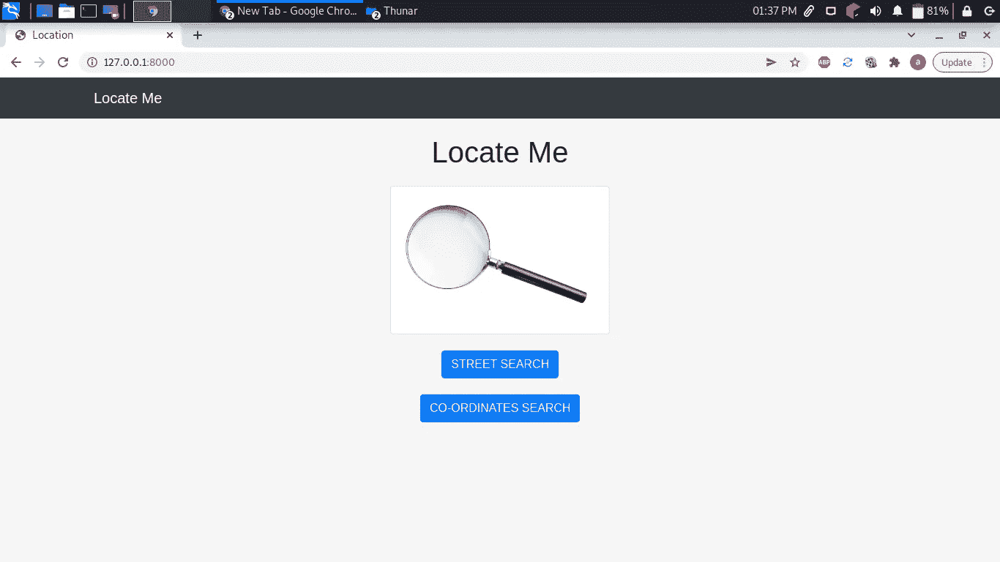
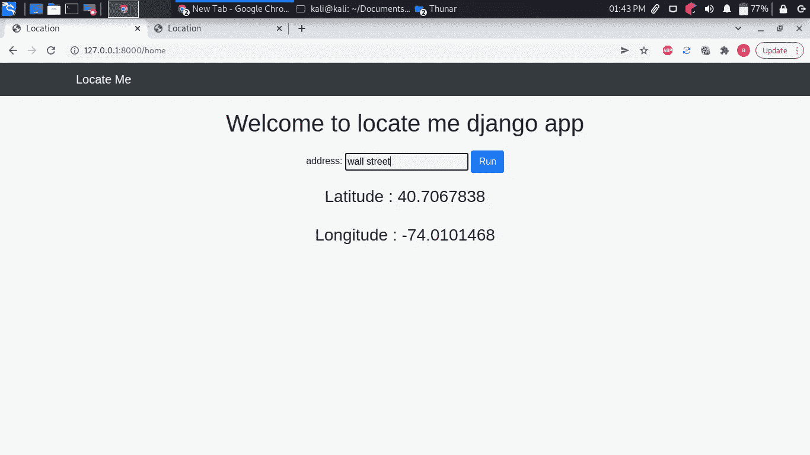
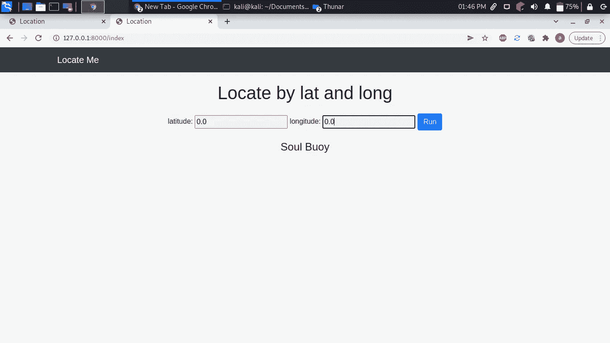

# Django 位置查找应用程序

> 原文：<https://blog.devgenius.io/django-location-lookup-app-a2608d11fab4?source=collection_archive---------4----------------------->

这是一个 django 应用程序，帮助您获取某个街道地址、城市或地球上任何位置的位置。

由 [Tamas Tuzes-Katai](https://unsplash.com/@tamas_tuzeskatai?utm_source=unsplash&utm_medium=referral&utm_content=creditCopyText) 在 [Unsplash](https://unsplash.com/s/photos/map?utm_source=unsplash&utm_medium=referral&utm_content=creditCopyText) 上拍摄的照片

以下是我们最终应用的几张截图。

登录页面

定位华尔街

我甚至好奇到去搜索`lat 0.0 long 0.0`看看我会发现什么。以下是我的发现。

灵魂 bouy

更多关于 soul bouy 你可以点击 [**这里**](https://en.wikipedia.org/wiki/Soul_Buoy)

现在我们开始吧。

**要求**

1.  姜戈
2.  地质公园

要安装这些软件包，请键入`pip3 install <package name>`

现在让我们开始跑`django-admin startproject django_location`。光盘放入文件夹`django_location .`现在运行`python3 manage.py startapp location`。现在让我们首先在项目中添加我们的应用程序`settings.py`

现在让我们为我们的应用程序创建路线。在项目中添加以下内容`urls.py`

现在让我们来看看我们的主应用程序。首先，让我们看看这个文件夹的树。

├──管理中心

├── apps.py

├── __init__。巴拉圭

├──移民

│ ├── __init__。巴拉圭

│ └── __pycache__

│ └── __init__。cpython-39.pyc

├──模型. py

├──__ 皮切奇 _ _

│ ├── admin.cpython-39.pyc

│ ├── __init__。cpython-39.pyc

│ ├──模特. cpython-39.pyc

│ ├── urls.cpython-39.pyc

│ ├──公用事业. cpython-39.pyc

│ └──观点. cpython-39.pyc

├──静电

│ ├──

│ │ ├── bootstrap.css

│ │ ├── bootstrap.css.map

│ │ ├── bootstrap-grid.css

│ │ ├── bootstrap-grid.css.map

│ │ ├── bootstrap-grid.min.css

││├──bootstrap-grid . min . CSS . map

│ │ ├── bootstrap.min.css

│ │ ├── bootstrap.min.css.map

│ │ ├── bootstrap-reboot.css

│ │ ├── bootstrap-reboot.css.map

│ │ ├── bootstrap-reboot.min.css

││├──bootstrap-reboot . min . CSS . map

│ │ └── style.css

│ ├──图片

││maglens.jpg└──

│ └── js

│ ├──自举. bundle.js

│ ├──自举. bundle.js.map

│ ├──自举. bundle.min.js

│ ├──自举. bundle.min.js.map

│ ├──自举. js

│ ├── bootstrap.js.map

│ ├──自举. min.js

│ ├── bootstrap.min.js.map

│ └── jquery.min.js

├──模板

│ └──位置

│base.html├──

│home.html├──

│index.html├──

│landing.html└──

├──测试. py

├──网址. py

├──公用事业公司. py

└──观点. py

现在让我们首先从`search by street name`功能开始。创建一个名为`utilities.py`的文件，插入以下内容。

这里，我们导入了 geopy 库，它有助于地理编码功能，例如将街道名称转换为精确的坐标，反之亦然。

我们还增加了一秒钟的时间延迟，以遵守 OpenStreet Nominatim 每秒最多一个请求的使用策略，因为这是一项免费服务。然后，我们创建了一个函数，它接受地址或街道名称，并返回特定地址的经度和纬度。

现在让我们为我们的`search by street function`创建一个视图

这里是`search by address`函数的模板。

接下来，我们移动到`search by co-ordinates`功能。

在`utilities.py` 内添加以下内容。

现在让我们为`search by co-ordinates`函数创建一个视图。

最后，这里是`search by co-ordinates` 函数的模板。

现在让我们为我们的应用程序创建一个登录页面。这里是`view`

现在让我们为我们的视图添加一个模板。

现在我们必须为我们的`location`应用程序创建路线。创建一个名为`urls.py`的文件，并添加以下内容:

现在运行`python3 manage.py runserver`来启动你的应用程序，确保你有互联网连接。在您的浏览器中键入下面的`http://127.0.0.1:8000`并按回车键。这是输出。

登录页面

现在，您可以在街道搜索中输入您的地址，并按如下所示进行搜索。

感谢阅读。这里是源代码 [**这里是**](https://github.com/bunnythecompiler/django_location)