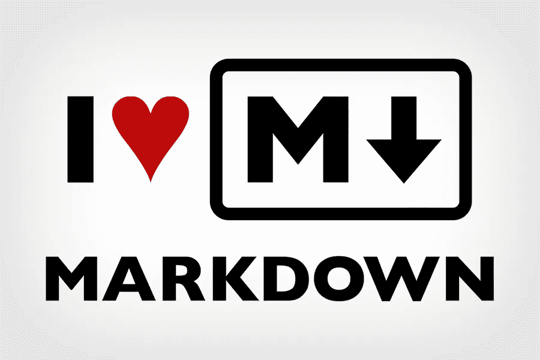
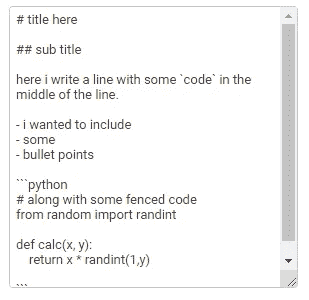
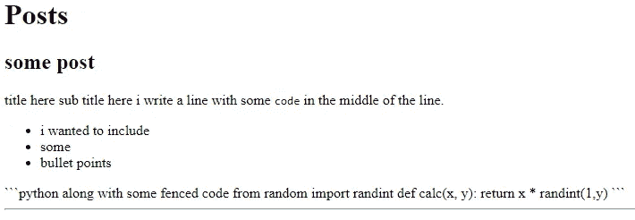
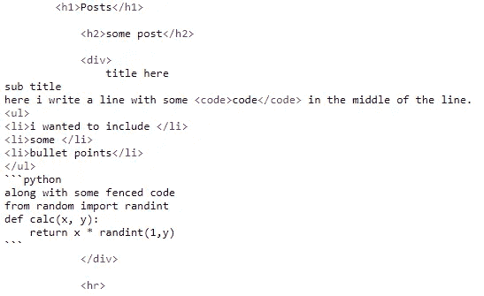
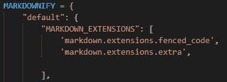
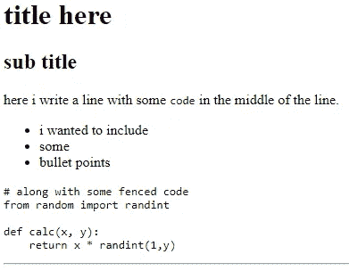
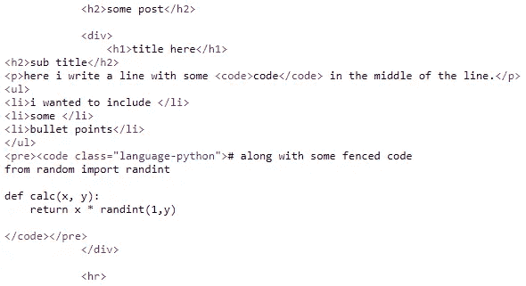
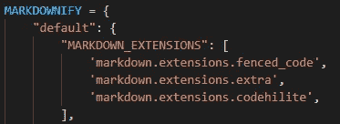
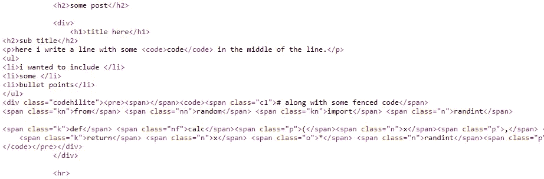
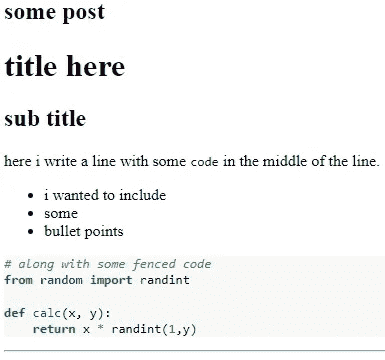

# Django & Markdown 第 1 部分(渲染)

> 原文：<https://blog.devgenius.io/django-markdown-part-1-rendering-it-b61cbcbc833e?source=collection_archive---------3----------------------->

Markdown 本质上是一种简单的方法，可以在你的网页中包含语法，而不需要输入冗长的带方括号的 html

从一开始就声明这一点很重要，我认为试图实现 Markdown 的人经常混淆安装 Markdown 编辑器和如何呈现 Markdown 之间的区别。

我不得不经常使用它来让它为我工作，我可以从许多 GitHub 提出的问题中看到，许多人都有同样的问题。具体来说，我想用围栏代码来渲染 Markdown，我也想要彩色语法！



我们开始吧！我将使用一个名为 [Django-markdownify](https://pypi.org/project/django-markdownify/) 的 Django 包，我还将演示如何添加一些额外的功能，如防护代码和彩色语法高亮显示。

# 第 1 部分—设置:安装 django-markdownfify

1.  假设您已经有了一个 Django 项目，让我们使用终端/CLI(命令行界面)来安装这个包。

`pip install django-markdownify`

2.现在，在您的 *settings.py* 文件中，在您的 INSTALLED_APPS 列表中包含“markdownify”。
稍后，您需要确保行``django.contrib.staticfiles``也包括在内。

```
INSTALLED_APPS = [
    'django.contrib.staticfiles', # <-- make sure this is there too
    ...
    'markdownify'
]
```

3.在您的 HTML 模板中包含加载 markdonify 功能的标签。

```
 <!-- this will load markdownify -->
<html>
  <head></head>
  <body>
    <h1>Posts</h1>
    
      <h2>{{post.title}}</h2>
      <div>
        {{post.body | markdownify}} <!-- note -->
      </div>
      <hr>
    
  </body>
</html>
```

在上面的例子中，在第一行，我演示了如何使用``加载 markdonify 标签，然后使用管道符号和函数`markdonify`来表示哪个 Django 注入的数据库字段需要使用 markdown 语法进行转换。

# 第 2 部分:测试结果



以下是我在 Django 帖子中输入的示例文本



这是当前的输出

有点效果了🤷‍♂️.但是标题实际上并没有起作用，我希望代码块也能起作用。看看下面生成的 HTML:



正确生成的 HTML 标签可以很好地生成项目符号甚至内联代码。

4.在你的 *settings.py* 文件中添加一些 Markdownify 的设置来正确处理隔离代码

本质上，上面的代码告诉 Markdownify 为哪个语法生成标签。我添加了一些默认标签中没有的标签，比如`<h#>`、`<span>`和`class`。

除了标记之外，我还添加了应该包含的扩展来检测隔离代码。



看看下面呈现的页面和 HTML 代码。



标题现在可以工作了，代码几乎可以正确显示了。有趣的是，Markdonify 正确地将代码突出显示为 Python。现在我们只想用一些颜色来显示语法。

# 第 3 部分——让它印刷得漂亮！

5.在 settings.py 文件的 markdownify 设置中，需要添加另一个名为 codehilite 的扩展名:



这在 Python-Markdown 页面[扩展— Python-Markdown 3.3.6 文档](https://python-markdown.github.io/extensions/)以及其他支持的扩展中有详细描述。这样做的目的是为已识别的隔离代码块生成带有颜色类的 HTML 代码。

正如你在下面的例子中看到的，我们现在有了一个 HTML 输出，带有一个类`codehilite`和 span 标签，用于不同的代码元素，比如关键字、整数等等。



我会给你额外的截图，结果几乎是一样的，尽管代码块的背景是灰色的。这里的 codehilite 文档[也指出，为了给语法着色，我们需要安装另一个名为 Pygments 的 Python 库。→](https://python-markdown.github.io/extensions/code_hilite/) [Pygments PyPI](https://pypi.org/project/Pygments/)

这个包产生了一个 CSS 文件，为产生的 codehilite 类着色语法。

6.在 CLI/终端中运行以下命令进行安装

```
pip install Pygments
```

7.然后运行下面的命令，用 codehilite 类的语法生成一个 CSS 文档，或者使用由 [GitHub 用户 Richleand](https://github.com/richleland/pygments-css) 生成的样式表之一。

```
pygmentize -S default -f html -a .codehilite > codehilite_styles.css
```

8.最后，您需要将 CSS 文档添加到根目录下的 templates 目录中。

```
+-- core
+-- post
+-- static
|   +-- css
|   |   +-- codehilite_styles.css *<-- place into css dir*
+-- manage.py
```

确保在 settings.py 文件中设置了静态文件目录。

```
STATIC_URL = '/static/'
STATICFILES_DIRS = [
   os.path.join(BASE_DIR, 'static/'),
]
```

9.实际上这是最后一步😂。您需要在模板中使用``标签，并使用 head 标签链接 CSS 文档。

```
 <!-- include the static tag --> 

<html><!-- include the head tag here to load CSS -->
<head>
   <link rel="stylesheet" href="">
</head>
<body>
    <h1>Posts</h1>
    
      <h2>{{post.title}}</h2>
      <div>
        {{post.body | markdownify}}
      </div>
      <hr>
    
  </body>
</html>
```

所有这些应该会导致…



正确格式化的减价、代码和语法着色。🎤⬇·哈比比斯·✌✌

别忘了那些掌声！

# 更多来自我！

我喜欢分享我学到的片段。如果你喜欢我的文章，考虑给我提供一些咖啡[https://ko-fi.com/bitfez](https://ko-fi.com/bitfez)