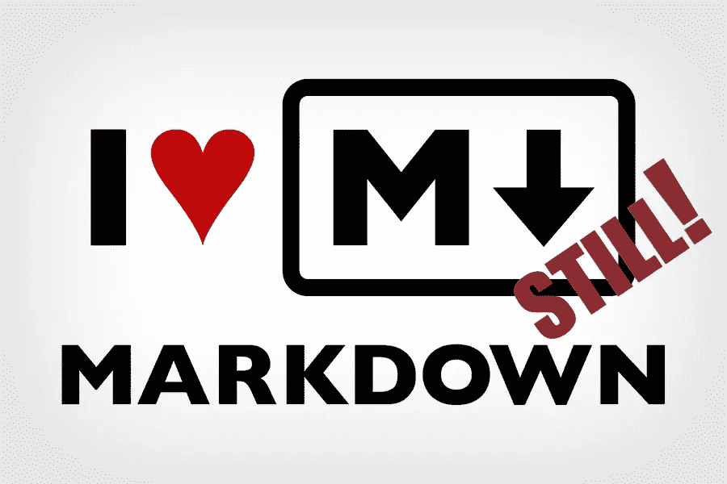
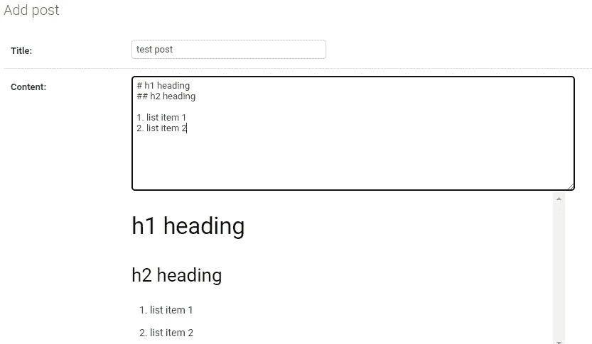
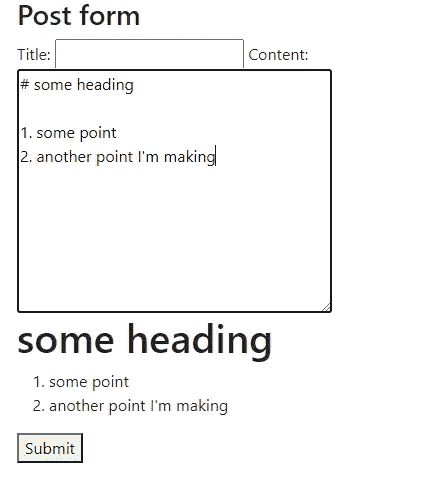
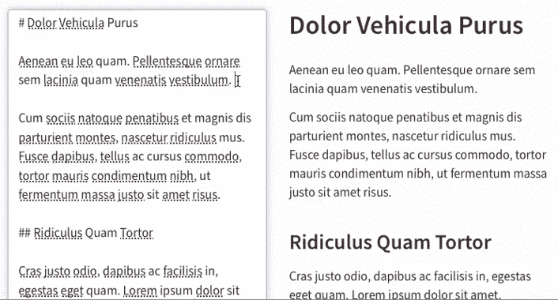
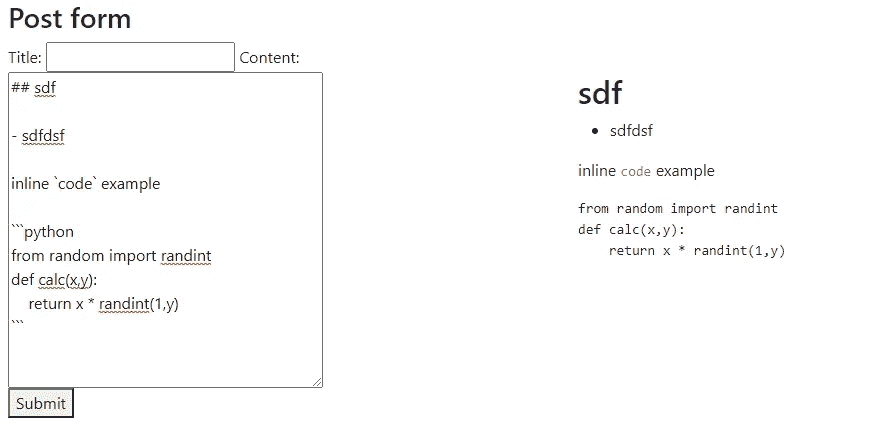

# Django & Markdown 第 2 部分(安装编辑器)

> 原文：<https://blog.devgenius.io/django-markdown-part-2-installing-an-editor-ff32aadc49d2?source=collection_archive---------5----------------------->

让我重复一下我在第一部分说过的话。人们经常混淆在他们的网站上渲染 markdown 和安装编辑器。如果你想知道如何在 Django 网站上显示 markdown，请查看我的另一个指南。

好吧，事后看来，我对顺序的选择肯定是错的。本指南应该是第 1 部分🤷‍♂️.我很快会把一个 YouTube 视频放在一起(我会把它粘贴在这里),它会把两个指南按照逻辑顺序结合起来。



这个指南有几个步骤(所以我假设你已经建立了一个 Django 网站)。由于我使用的是 Django 4.0，而且 Markdownx 还没有更新，所以其中的一些步骤可能很快就无关紧要了。

完整的例子可以在我的 GitHub repo 上找到[。](https://github.com/bitFez/markdown_in_forms.git)

# 第 1 部分—设置:安装 Django-Markdownx

1.  如果您已经安装了 Django，请使用 CLI / terminal 安装 Markdownx。在撰写本文时，Markdownx 的版本尚未更新，无法与 Django 4.0 一起使用。[在 PyPi 上。从 PyPi 安装之后，我对这个包做了一些修改，但幸运的是，在写这篇文章的时候，开发人员将一个建议的更新合并到了他们的 GitHub 库中。如果包已经被更新，使用它。如果没有，请使用下面的 CLI 命令直接从 GitHub 安装。变化很小(解决了 Django 4.0 中如何处理 URL 模式的问题)，我希望对未来的版本也适用🤲📿。](https://pypi.org/project/django-markdownx/)

```
pip install git+[https://github.com/neutronX/django-markdownx.git@master](https://github.com/neutronX/django-markdownx.git@master)
```

2.现在进入 Django 项目 settings.py 文件，将 Markdownx 应用程序添加到您的`INSTALLED_APPS`列表下。

```
INSTALLED_APPS = [    
    ...
    'markdownx', # <-- needed for adding markdown to forms
    ...
]
```

在同一个文件(settings.py)中，确保设置了静态文件目录。在使用 MarkdownX 上传图像以及下载 MarkdownX 资产文件时，您将需要它。

```
STATIC_URL = '/static/'
MEDIA_URL = '/media/'
STATICFILES_DIRS = [
    os.path.join(BASE_DIR, 'static/'),
]
STATIC_ROOT = os.path.join(BASE_DIR, 'staticfiles')
MEDIA_ROOT = os.path.join(BASE_DIR, 'static/media')
```

**3** 。确保您已经将 MarkdownX URL 模式添加到核心 url.ps 文件中。

```
urlpatterns = [     
    *...*    
    path('markdownx/', include('markdownx.urls')), 
]
urlpatterns += static(settings.STATIC_URL, document_root=settings.STATIC_ROOT)urlpatterns += static(settings.MEDIA_URL, document_root = settings.MEDIA_ROOT)
```

# 更新模型

**4** 。我有一个帖子的基本模型，我会做一个简单的改变。

```
**from** markdownx.models **import** MarkdownxFieldclass Post(models.Model):
    title = models.CharField(max_length=250)
 **content = models.TextField()**
    author = models.ForeignKey(User, on_delete=models.CASCADE)
```

更改为:

```
class Post(models.Model):
    title = models.CharField(max_length=250)
    **content = MarkdownxField()**
    author = models.ForeignKey(User, on_delete=models.CASCADE)
```

5.一旦您保存了这些内容，请确保进行迁移，以便反映数据库表中的更改，并收集静态数据以下载 MarkdownX 资产。

```
python manage.py makemigrations
python manage.py migrate
python manage.py collectstatic
```

**6** 。在 posts 应用程序中(嗯，对我来说它叫做 *posts* ，打开 admin.py 文件并为你的管理站点注册 MarkdownX。对于您来说，可能只是添加下面的第一行来导入 MarkdownX，然后使用 MarkdownX 包来注册模型，就像我在第 3 行所做的那样

```
**from** markdownx.admin **import** MarkdownxModelAdmin 
**from** .models **import** Post admin.site.register(Post, **MarkdownxModelAdmin**)
```

目前，MarkdownX 已经开始在网站的管理部分工作。



# 创建表单

**7** 。你可能已经有一张表格了。我采取的步骤是:

向我的帖子 views.py 文件添加视图。

```
def submit_post(request):
    form = PostForm(request.POST or None)
    context = {'form':form}
    if request.method == "POST":
        if form.is_valid():
            post = form.save(commit=False)
            post.author = request.user
            post.save() return redirect("posts:home") # should redirect to the homepage
    else:
        return render(request, "posts/partials/form.html", context)
    return render(request, 'posts/post_form.html', context)
```

在 post app urls.py 中添加 URL 模式

```
urlpatterns = [
  ..
  path('create_post/', views.submit_post, name='create_post'),
]
```

通过在 post app 目录中创建一个名为“forms.py”的文件来创建上面视图中引用的`PostForm`:

```
from django import forms
from .models import Postclass PostForm(forms.ModelForm):
  class Meta:
    model = Post
    fields = ['title','content']
```

最后，在“templates/posts”下的 apps 目录中为视图创建一个模板

```

<html>
  <body>
    <h3>Post form</h3> <form method="POST" action="">
      {{ form }}
      <button type='submit'>Submit</button>
    </form>
    {{ form.media }} </body>
</html>
```

这应该会产生一个在
正下方有预览区域的表单👇👇👇👇👇👇👇👇👇👇👇👇👇👇👇



## 创建并排表单和预览视图，如下例所示:



这最后一部分应该非常简单，但是当前版本的 Markdownx 似乎有一个小错误。到时候我会指出解决办法。
因此，您需要确保在项目的根目录中，您有一个 templates 文件夹，并且您已经注册了模板可以在您的根文件夹中的`TEMPLATES`下的 settings.py 文件中找到。(参见下面的**粗体**部分)

```
***TEMPLATES*** = [
  {'BACKEND': 'django.template.backends.django.DjangoTemplates',
  **'DIRS': [
     os.path.join(BASE_DIR, 'templates')
   ],**
  'APP_DIRS': True,
  'OPTIONS': {
    'context_processors': [
      'django.template.context_processors.debug',
      'django.template.context_processors.request',
      'django.contrib.auth.context_processors.auth',
      'django.contrib.messages.context_processors.messages',
     ],
    },
  },
]
```

8.在另一个名为 markdownx 的文件夹内的 templates 文件夹中添加一个名为“*widget.html*的新文件。

```
TEMPLATES
+-- markdownx
|   +-- widget.html
```

文档中的例子包括一个带有引导格式的小部件，但是我没有把它包括在我的指南中，所以我的例子省略了它。

```
<div class="markdownx row" style="display:flex;">
     <div class="column" style="flex: 50%;">
         
     </div>
     <div class="column" style="flex: 50%;">
         <div class="markdownx-preview"></div>
     </div>
 </div>
```

## 小修修补补

正如我所说的，在编写时有一个小错误，Markdownx 没有自动从根模板文件夹中获取上面创建的模板覆盖。[GitHub 的一位用户在这里列出了一个快速解决方案。希望你不需要这个零件。](https://github.com/neutronX/django-markdownx/issues/76#issuecomment-315538157)

9.再次进入核心 app *settings.py* 文件，在`INSTALLED_APPS`下添加`django.forms`为 app。

最后，在那下面，也加上下面的:`FORM_RENDERER='django.forms.renderers.TemplatesSetting'`像下面这样:

```
INSTALLED_APPS = [
  ...
  **'django.forms',**
  ....
]FORM_RENDERERFORM='django.forms.renderers.TemplatesSetting' 
```

# 最后的结果

维奥拉。希望对你来说应该是这样的。毫无疑问，你会做得更好。



让我再一次放下麦克风🎤 ⤵