# Django 模型关系

> 原文：<https://blog.devgenius.io/django-model-relationship-37da8f6f34e9?source=collection_archive---------2----------------------->

在本教程中，我们将学习 Django 中的 3 种模型关系。让我们用例子一个一个地来看。

# 设置环境

首先，我们来创建项目环境。运行下面代码片段中的命令。

```
#create project folder
mkdir django_model_relationshipcd django_model_relationship#setup virtual environment
python3 -m venv venvsource venv/bin/activate#install dependencies
pip3 install Django djangorestframework psycopg2-binary# create a Django project and application
django-admin startproject backend .
django-admin startapp app
```

# 一对一

在[上一篇教程](https://python.plainenglish.io/django-token-authentication-with-custom-user-model-2d780237bc4)中，我们学习了通过创建一个定制的`**User**`模型来扩展用户模型。在本教程中，我们不会修改`**User**`模型，而是创建一个`**UserProfile**`模型来存储额外的字段，并使用[****一对一关系****](https://docs.djangoproject.com/en/4.1/topics/db/examples/one_to_one/) ****s** 将它们链接起来。**

**在这个例子中，一个`**User**`只能与一个或者没有`**UserProfile**`对象相关联，但是一个`**UserProfile**`只能有一个`**User**`对象。定义一对多关系的关键字是[**one toone field**](https://docs.djangoproject.com/en/4.1/ref/models/fields/#django.db.models.OneToOneField)**。****

**导航到 models.py，并创建一个`**UserProfile**`模型。**

**我们在`**UserProfile**`中添加了 3 个额外的字段，分别是地址、出生日期和手机号码。随后，我们使用[**one toonefield**](https://docs.djangoproject.com/en/4.1/ref/models/fields/#django.db.models.OneToOneField)将其与`**User**`模型关联起来。Django 将在用户配置文件表中自动创建一个' **user_id** '字段，它将作为外键与用户记录绑定在一起。**

**运行下面的命令来更新数据库。**

```
python3 manage.py makemigrations
python3 manage.py migrate
```

**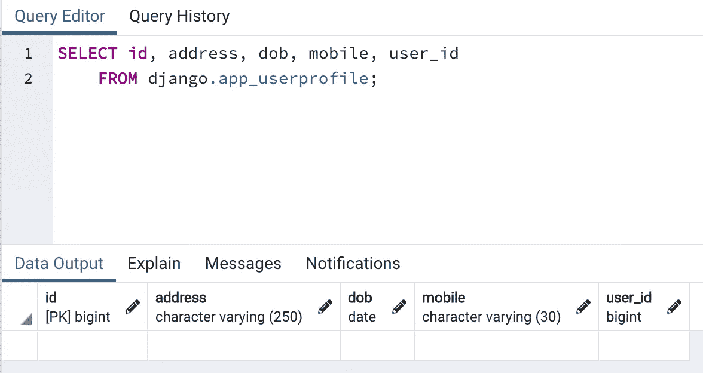**

**用户配置文件表。**

**在 app 文件夹中创建一个文件“serializers.py”。**

**接下来，导航到 views.py 创建一个`**UserViewSet**`来自动生成 CRUD API。**

```
class UserViewSet(viewsets.ModelViewSet):
    queryset = User.objects.all()
    serializer_class = UserSerializer
```

**在 **app** 文件夹中创建一个 urls.py。**

```
from django.urls import path, include
from rest_framework import routers
from app import viewsrouter = routers.SimpleRouter()
router.register(r'users', views.UserViewSet)urlpatterns = []
urlpatterns += router.urls
```

**接下来，将**URL**注册到主后端 URL 配置文件中。导航到**后端**文件夹下的 urls.py。**

```
from django.contrib import admin
from django.urls import re_path, includeurlpatterns = [
  re_path('admin/', admin.site.urls),
  re_path('**api/**', include('app.urls'))
]
```

**创建的每个 API 将使用前缀' **api/'** 进行路由。**

**让我们使用 Postman 测试插入 API。创建用户的端点将是[http://localhost:8000/API/users/](http://localhost:8000/api/users/)(POST)**

**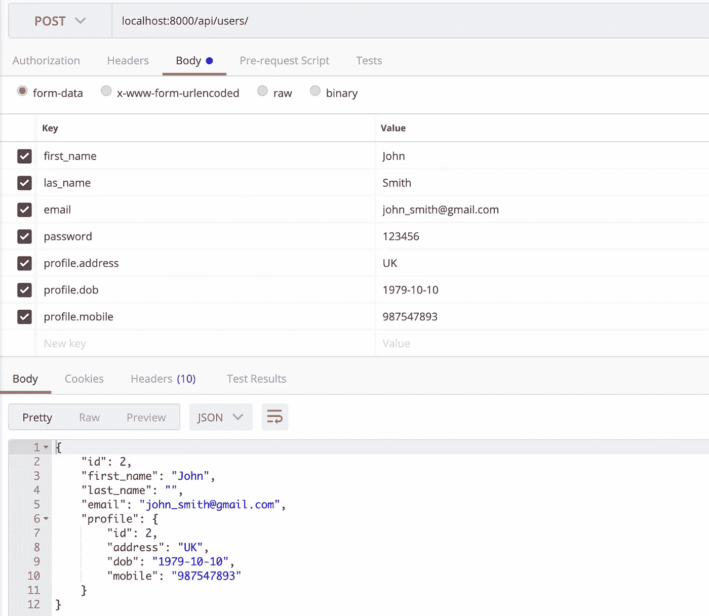**

**用户记录创建成功。**

**让我们尝试检索用户列表。检索用户列表的端点将是[http://localhost:8000/API/users/](http://localhost:8000/api/users/)(GET)**

**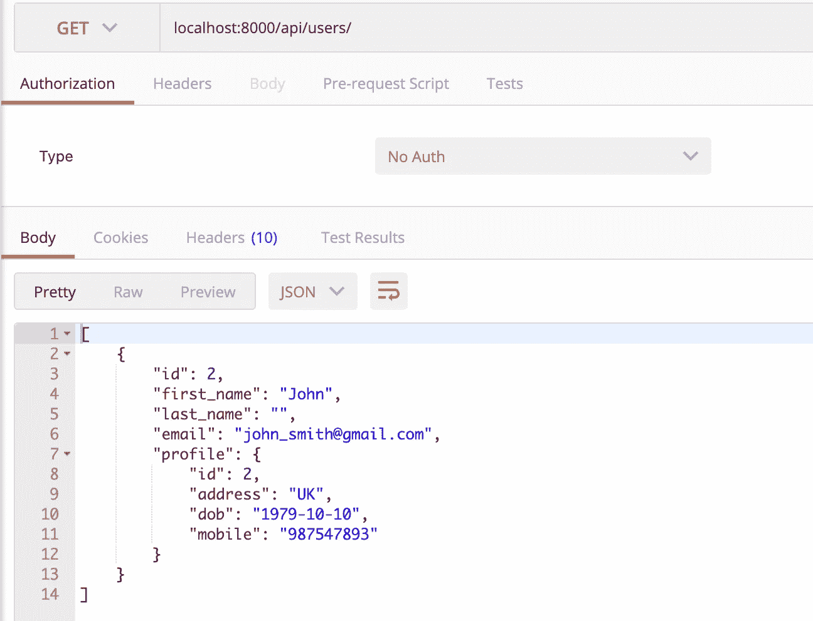**

# **一对多**

**在这个例子中，一个`**User**`可以与许多`**Account**`对象相关联，但是一个`**Account**`只能有一个`**User**`对象。定义一对多关系的关键字是[**foreign key**](https://docs.djangoproject.com/en/4.1/ref/models/fields/#django.db.models.ForeignKey)**。****

**导航到应用程序文件夹中的 models.py。创建一个`**Account**`类。**

```
class Account(models.Model):
  account_number = models.CharField(max_length=30)
  account_type = models.CharField(max_length=20)
  open_date = models.DateField()
  balance = models.DecimalField(default=0, decimal_places=2, max_digits=12)
  user = models.ForeignKey(User, related_name='accounts', on_delete=models.CASCADE)
```

**导航到应用程序文件夹中的 serializers.py。创建一个`**AccountSerializer**`类。**

**导航到应用程序文件夹中的 views.py。创建一个`**AccountViewSet**`类。**

```
class AccountViewSet(viewsets.ModelViewSet):
    queryset = Account.objects.all()
    serializer_class = AccountSerializer
```

**运行下面的命令来更新数据库。**

```
python3 manage.py makemigrations
python3 manage.py migrate
```

**让我们使用 Postman 测试插入 API。创建帐户的端点将是[http://localhost:8000/API/accounts/](http://localhost:8000/api/users/)(POST)**

**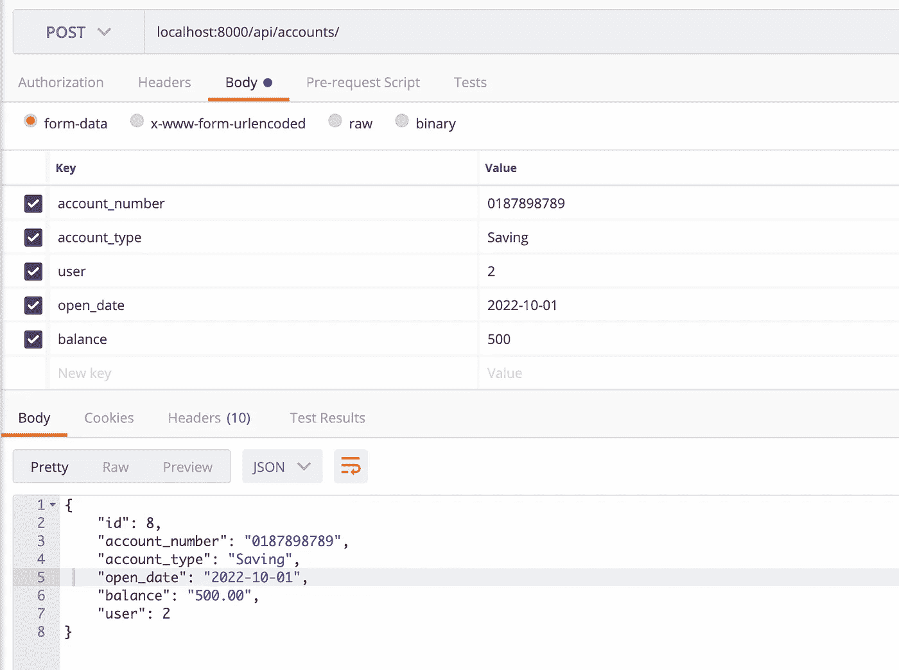**

**当访问**用户**时，我们可以检索账户对象。它将作为一个列表返回，因为我们在用户序列化程序中将 accounts 对象定义为 many **(many=True)** 。*参考上面*代码片段的第 18 行。**

**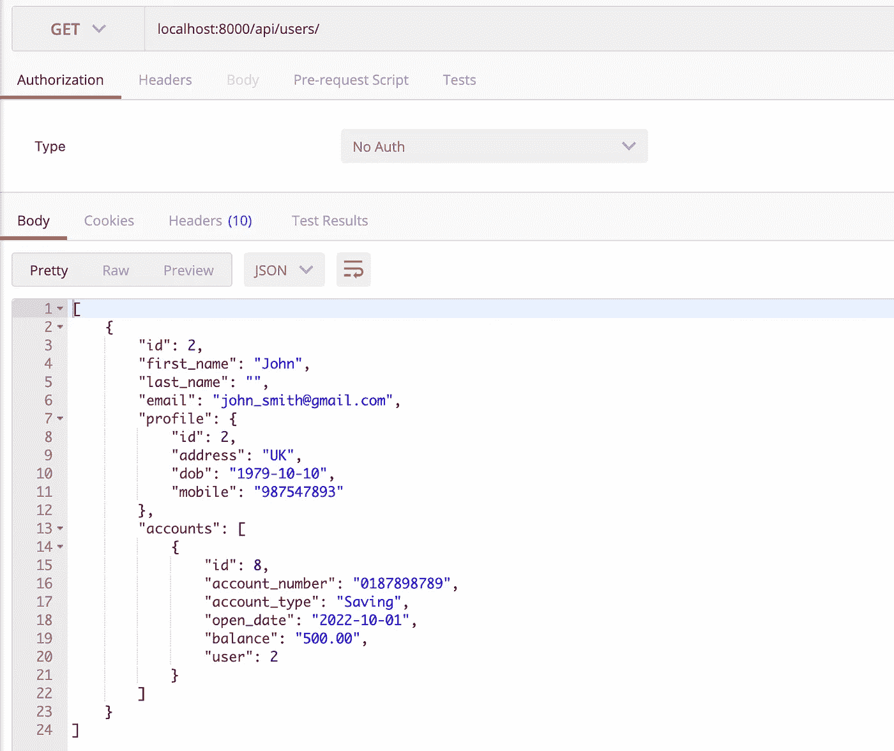**

# **多对多**

**在这个例子中，一个`**Product**`可以与多个`**Order**`对象相关，一个`**Order**`可以包含多个`**Product**`对象。定义一对多关系的关键字是[**ManyToManyField**](https://docs.djangoproject.com/en/4.1/ref/models/fields/#manytomanyfield)**。****

**导航到 app 文件夹中的 models.py 文件。添加以下代码片段来创建`**Product**`和`**Order**`**

```
class Product(models.Model):
    name = models.CharField(max_length=200)
    sku = models.CharField(max_length=20)
    price = models.DecimalField(default=0, decimal_places=2, max_digits=8)class Order(models.Model):
    order_date = models.DateField()
    status = models.CharField(max_length=20)
    products = models.ManyToManyField(Product, related_name="products")
```

**导航到 app 文件夹中的 serializers.py 文件。添加以下代码片段以创建`**ProductSerializer**`和`**OrderSerializer**`**

```
class ProductSerializer(serializers.ModelSerializer):
    class Meta:
        model = Product
        fields = ('id', 'name', 'price', 'sku')class OrderSerializer(serializers.ModelSerializer):
    # ***To return products object instead of id***  
    products = ProductSerializer(read_only=True, many=True) class Meta:
        model = Order
        fields = ('id', 'order_date', 'status', 'products')
```

**运行下面的命令来更新数据库。**

```
python3 manage.py makemigrations
python3 manage.py migrate
```

**在检查数据库时，我们发现创建了 3 个表。当使用 ManyToManyField 时，将再创建一个引用这两个表的表。我们称之为“直通”表。**

```
# app_product
SELECT id, name, sku, price FROM django.app_product;# app_order
SELECT id, order_date, status FROM django.app_order;# app_order_product
SELECT id, order_id, product_id FROM django.app_order_products;
```

**插入一些产品对象。创建产品的端点将是[http://localhost:8000/API/products/](http://localhost:8000/api/users/)(POST)**

**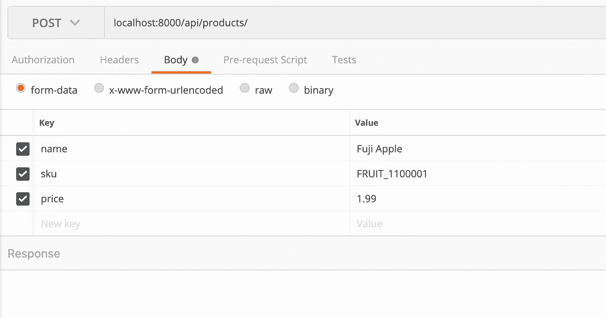**

**检索所有产品的端点将是[http://localhost:8000/API/products/](http://localhost:8000/api/users/)(GET)**

**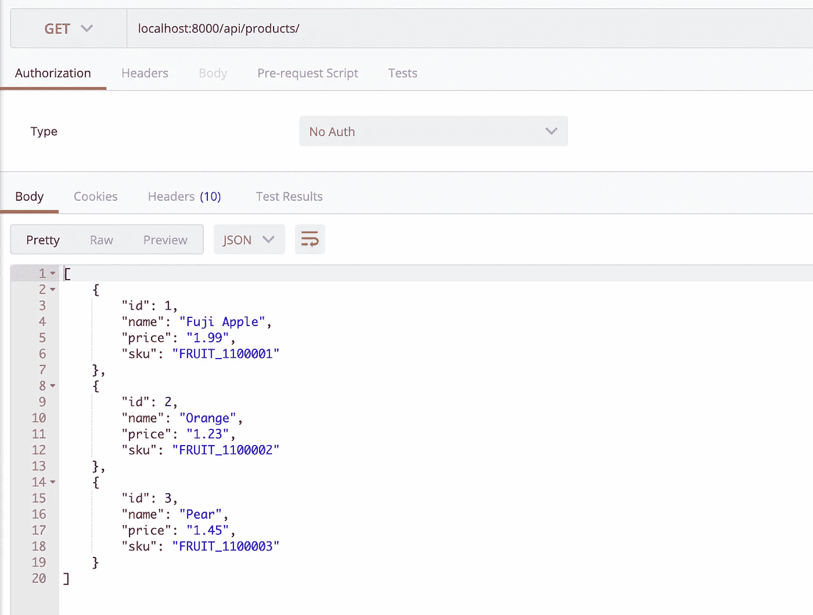**

**接下来，让我们创建一个订单对象。创建订单的端点将是[http://localhost:8000/API/orders/](http://localhost:8000/api/users/)(POST)**

**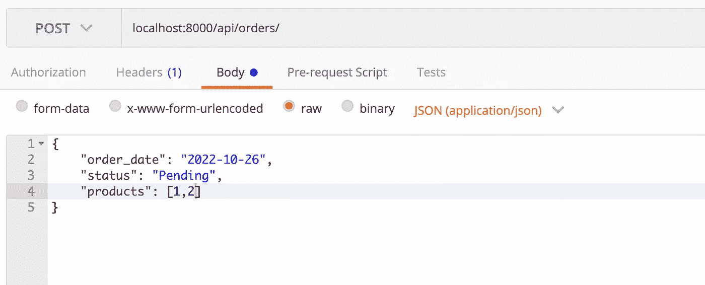**

**检索订单对象的端点将是[http://localhost:8000/API/orders/](http://localhost:8000/api/users/){ id }(GET)**

**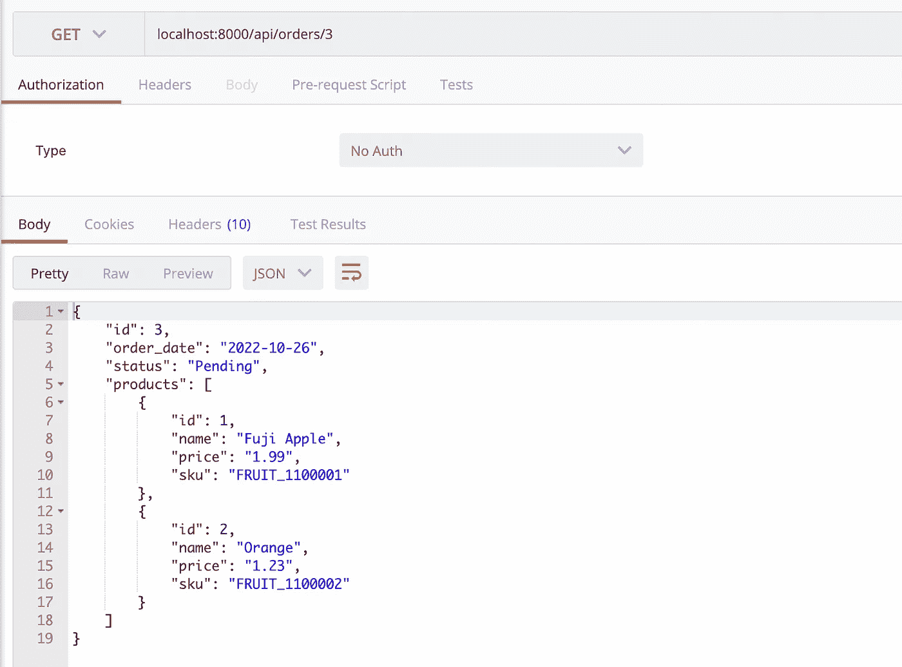**

# **额外的**

**在多对多关系中，有时我们可能需要额外的字段。例如，对于我们在订单中订购的每个产品，我们希望获取数量。在这种情况下，我们需要一个定制的模型和序列化程序来覆盖“直通”表。**

**在 models.py 中，我们创建了另一个模型`**Detail**` **。**在这个模型中，我们添加了两个外键来关联`**Product**`和`**Order**`，后跟额外的字段数量。**

```
class Product(models.Model):
    name = models.CharField(max_length=200)
    sku = models.CharField(max_length=20)
    price = models.DecimalField(default=0, decimal_places=2, max_digits=8)class Order(models.Model):
    order_date = models.DateField()
    status = models.CharField(max_length=20)
    products = models.ManyToManyField(Product, **through**="Detail")class Detail(models.Model):
    product = models.ForeignKey(Product, on_delete=models.CASCADE)
    order = models.ForeignKey(Order, on_delete=models.CASCADE)
    quantity = models.IntegerField(default=1)
```

**在 serializers.py 中**

```
class ProductSerializer(serializers.ModelSerializer):
    class Meta:
        model = Product
        fields = ('id', 'name', 'price', 'sku')class DetailSerializer(serializers.ModelSerializer):
    product = ProductSerializer(many=False)

    class Meta:
        model = Detail
        fields = ('id', 'product', 'quantity')class OrderSerializer(serializers.ModelSerializer): # ***here we use reverse relationship to extract the detail fields.***
    products = DetailSerializer(source="detail**_set**", read_only=True, many=True) class Meta:
        model = Order
        fields = ('id', 'order_date', 'status', 'products') # add transaction.atomic so that if error happened, it will rollback
    @transaction.atomic
    def create(self, validated_data):
        order = Order.objects.create(**validated_data)
        if "products" in self.initial_data:
            products = self.initial_data.get("products")
            for product in products:
                quantity = product.get("quantity")
                product = Product.objects.get(pk=id)
                Detail(order=order, product=product, quantity=quantity).save()
        order.save()
        return order
```

**再次重新测试 API 以创建订单，并检索订单以查看返回格式。**

**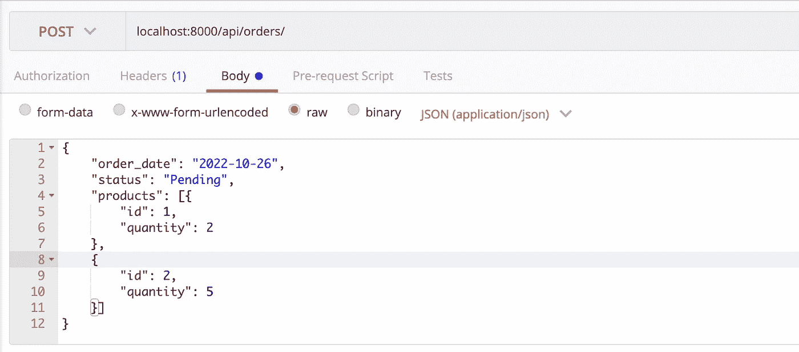****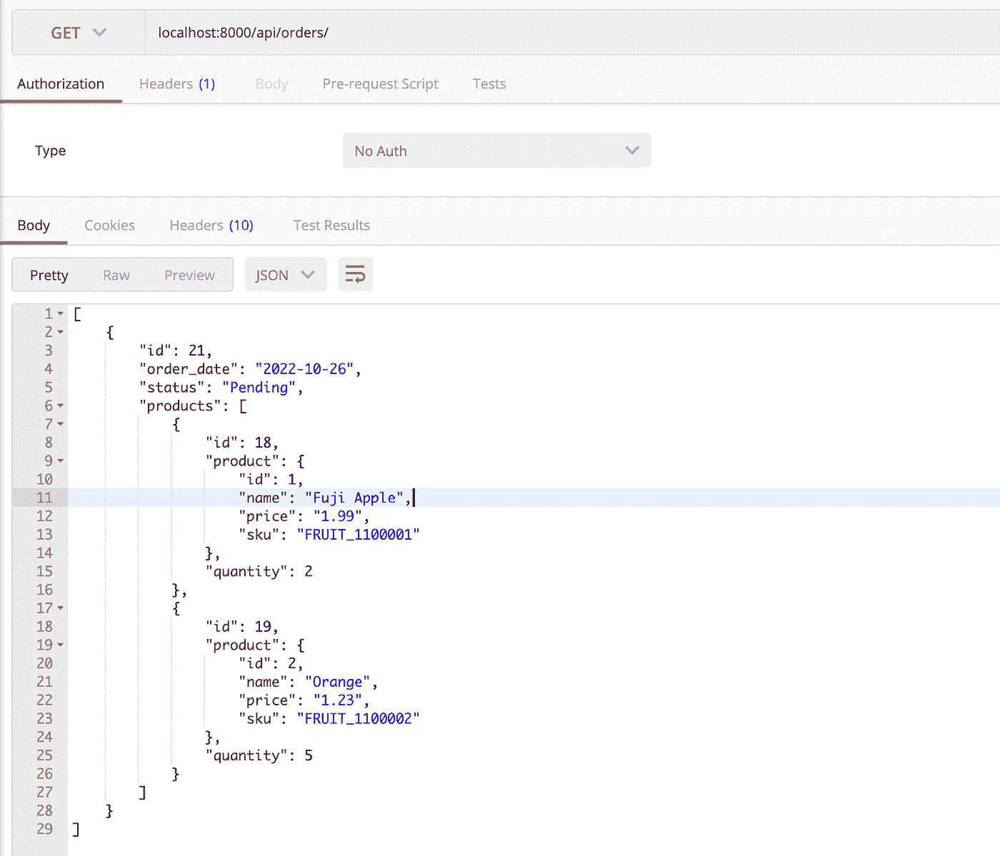**

**太棒了！你可以在这里下载完整的源代码。**

**[](https://python.plainenglish.io/django-token-authentication-with-custom-user-model-2d780237bc4) [## 使用自定义用户模型的 Django 令牌认证

### 学习 Django 认证系统，实现令牌认证，创建自定义用户，用户管理器等

python .平原英语. io](https://python.plainenglish.io/django-token-authentication-with-custom-user-model-2d780237bc4) [](https://python.plainenglish.io/build-rest-apis-using-django-a004436b1589) [## 使用 Django 构建 REST APIs

### Django 是一个强大的 Python web 框架，允许您快速构建 REST APIs。

python .平原英语. io](https://python.plainenglish.io/build-rest-apis-using-django-a004436b1589)**