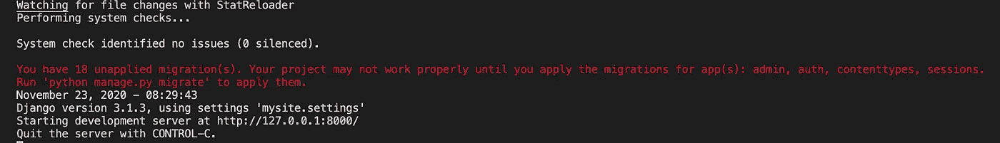
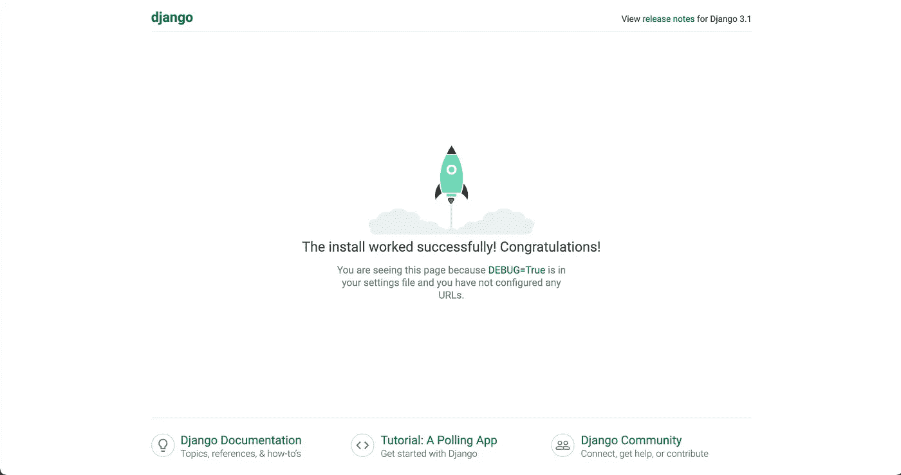
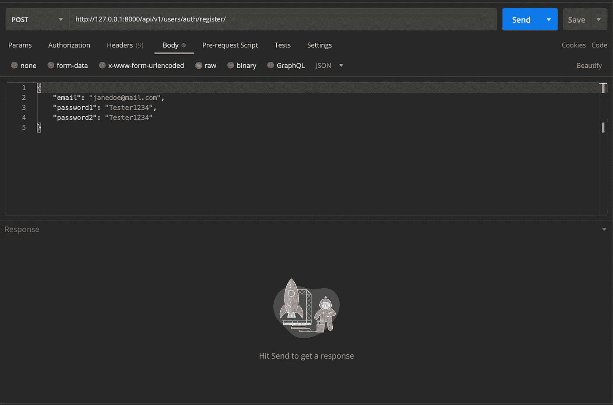
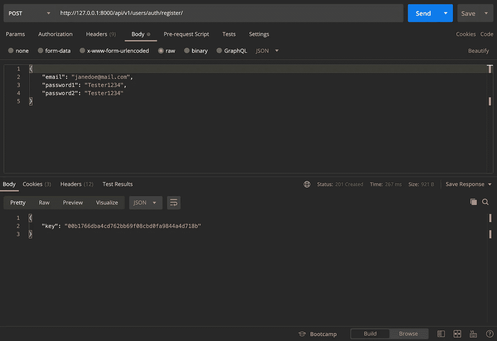
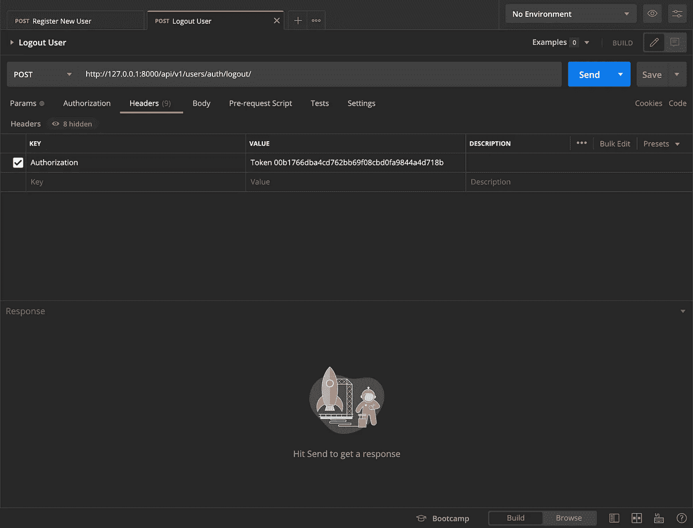
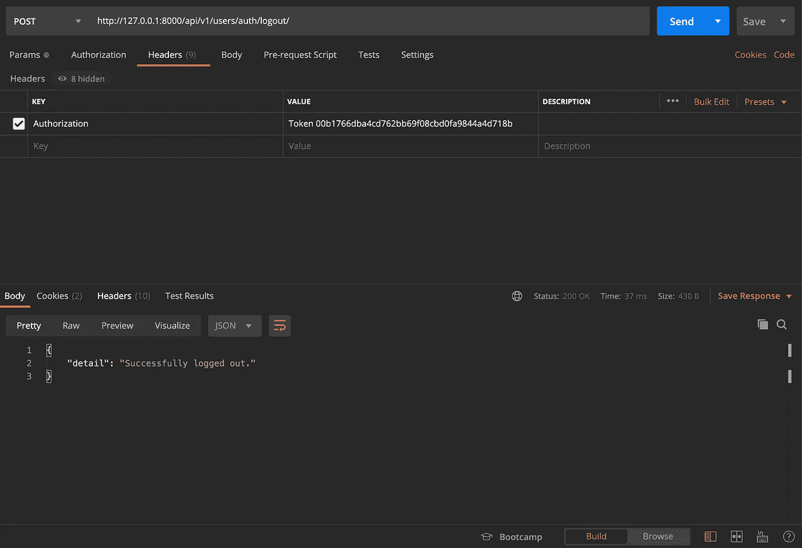

# Django + React 认证:第 1 部分

> 原文：<https://blog.devgenius.io/django-react-authentication-part-1-d351726b284d?source=collection_archive---------0----------------------->

使用 Django，Django Rest 框架，React，React 路由器 Dom 创建一个简单的认证系统。

[Django](https://www.djangoproject.com/) 是我最喜欢的 web 框架。当结合 [Django Rest 框架](https://www.django-rest-framework.org/) (DRF)时，它允许你使用 Python 创建强大和健壮的 RESTful API。应用程序中最常见的功能之一是用户身份验证。在这篇文章中，我将指导你使用 Django 和 DRF，以及一些其他的包来创建一个安全的和全功能的认证 API，它使用基于令牌的认证。API 完成后，我们将使用 postman 来测试它，并构建一个 React 前端来消费它。[这里的](https://github.com/tarricsookdeo/django-react-auth)是 GitHub repo 的链接，带有完整的代码供您参考。在这一部分，我们将创建 Django 后端 API。

# Django 后端 API

**设置虚拟环境并安装依赖关系:**

该项目将使用 pipenv 进行设置。关于 pipenv 的更多信息，你可以在这里查看我的深度文章。

在“终端”中转到您想要的项目位置，创建项目文件夹，然后 cd 到其中。我将称它为`django-react-auth`:

```
mkdir django-react-auth
cd django-react-auth
```

进入项目目录后，使用 pipenv 设置虚拟环境并激活它:

```
pipenv install --python 3.9
pipenv shell
```

*注意:在撰写本文时，Python 3.9 是 Python 的最新稳定版本。Django 3.1 将用于该项目。由于 async/await 语法的原因，Django 3.1 需要 Python 3.6+。你可以使用任何你喜欢的 Python 版本，只要是 Python 3.6 或更高版本。*

一旦建立了虚拟环境，您应该会在`django-react-auth`目录中看到一个`Pipfile`和`Pipfile.lock`。我们现在将安装所需的 pip 包。确保您的虚拟环境已激活，并在终端中运行以下内容:

```
pipenv install django djangorestframework django-rest-auth django-allauth django-cors-headers
```

**这些 pip 包是什么？**

Django:Django 框架是整个项目的支柱。

django-rest-framework: DRF 将为我们提供序列化数据所需的工具，并将我们的 django 应用程序转换成 RESTful API。

django-rest-auth:为我们提供用户认证所需的逻辑和端点。与从头开始编写所有内容相比，节省了大量时间。

django-allauth:允许我们进一步定制认证系统。还提供用户注册所需的端点。

django-cors-headers: Django 附带了很多安全特性。这个包将允许我们指定可以发出请求的域。否则，来自 React 前端的所有请求都将被拒绝。

**Django 项目和应用:**

现在我们已经设置好了，是时候在`django-react-auth`目录中创建 Django 项目了:

```
django-admin startproject mysite .
```

我将这个项目命名为`mysite`。请注意命令末尾的句点。这将在当前目录下创建项目，而不是创建一个全新的目录。项目文件结构现在应该是这样的。

```
- django-react-auth
-- mysite
--- __init__.py
--- asgi.py
--- settings.py
--- urls.py
--- wsgi.py
-- manage.py
-- Pipfile
-- Pipfile.lock
```

*注意:在现实世界的项目中，您可能会在* `*settings.py*` *文件中隐藏敏感信息，比如密钥和数据库凭证。为了简单起见，我们在这里不讨论这些。然而，在一个真实的项目中，请做好你的尽职调查，以防止安全噩梦。*

如果您在终端中使用以下命令运行 Django 开发服务器:

```
python manage.py runserver
```

您应该在终端中看到类似这样的内容:



如果您前往[http://127 . 0 . 0 . 1:8000](http://127.0.0.1:8000/)/您应该看到开发服务器正在运行:



请注意终端中的未应用迁移警告。重要的是**不要在创建我们的自定义用户模型之前**进行迁移，我们现在就要这样做。

**创建自定义用户模型:**

自定义用户模型将允许您在以后需要时扩展它。最好是在你开始你的项目时就这样做。Django 官方文档甚至建议创建一个定制的用户模型。我们将用简单的方法来实现这一点，通过扩展已经内置的用户模型。

首先创建自定义用户模型将存在的`users`应用，并将其添加到`settings.py`中的已安装应用列表中。

在终端中终止开发服务器，并运行以下命令创建应用程序:

```
python manage.py startapp users
```

您应该会在项目中看到一个新的`users`文件夹，其中有几个文件。将用户应用添加到`settings.py`中的`INSTALLED_APPS`列表。同时，让我们将通过 pip 安装的第三方应用程序添加到列表中:

```
# mysite/settings.py
...
INSTALLED_APPS = [
'django.contrib.admin',
'django.contrib.auth',
'django.contrib.contenttypes',
'django.contrib.sessions',
'django.contrib.messages',
'django.contrib.staticfiles', # 3rd Party Apps
'rest_framework', # new
'rest_framework.authtoken', # new
'rest_auth', # new
'django.contrib.sites', # new
'allauth', # new
'allauth.account', # new
'allauth.socialaccount', # new
'rest_auth.registration', # new
'corsheaders', # new# Local Apps
'users', # new
]
...
```

要创建定制用户模型，请进入`models.py`:

```
# users/models.pyfrom django.contrib.auth.models import AbstractUser
from django.db import modelsclass CustomUser(AbstractUser):
    # Any extra fields would go here
    def __str__(self):
        return self.email
```

我们这里没有任何额外的用户字段。但是，如果我们想添加生日和地址等字段，您可以在这里轻松完成。

每当您创建一个定制用户模型时，您都需要将 Django 指向它。返回到`settings.py`并将它添加到文件的底部:

```
# mysite/settings.py...AUTH_USER_MODEL = 'users.CustomUser'
```

如果我们要向自定义用户模型添加任何额外的字段，我们需要修改内置的表单来处理它们。为此，我们需要创建一个`forms.py`文件，并为用户模型扩展 Django 的内置表单类。

```
touch users/forms.py
```

添加以下代码:

```
# users/forms.pyfrom django import forms
from django.contrib.auth.forms import UserChangeForm,         UserCreationForm from .models import CustomUser 

class CustomUserCreationForm(UserCreationForm):    
    class Meta:        
        model = CustomUser        
        fields = ('email', ) class CustomUserChangeForm(UserChangeForm):    
    class Meta:        
        model = CustomUser        
        fields = UserChangeForm.Meta.fields
```

Django 最好的内置特性之一是管理界面。每当你创建一个新的应用程序，你可以注册它，这样你就可以通过管理界面与它互动。前往`admin.py`，放置以下代码:

```
# users/admin.pyfrom django.contrib import admin
from django.contrib.auth import get_user_model
from django.contrib.auth.admin import UserAdminfrom .forms import CustomUserChangeForm, CustomUserCreationForm
from .models import CustomUserclass CustomUserAdmin(UserAdmin):    
    add_form = CustomUserCreationForm
    form = CustomUserChangeForm
    model = CustomUser
    list_display = ['email']admin.site.register(CustomUser, CustomUserAdmin)
```

现在让我们来关注一下我们的序列化器。使用 DRF，我们将能够轻松地使用一个类序列化器，它会自动将字段序列化为 JSON，并在需要时返回 Python 对象。在用户内部创建一个`serializers.py`文件:

```
touch users/serializers.py
```

`serializers.py`内部:

```
# users/serializers.pyfrom rest_framework.serializers import ModelSerializerfrom .models import CustomUserclass UserSerializer(ModelSerializer):
    class Meta:
        model = CustomUser
        fields = ('email', 'last_login', 'date_joined', 'is_staff')
```

这就是 DRF 如何轻松地将基于 Django 模型的 Python 对象转换成 JSON，反之亦然。注意`fields`变量。这是您想要序列化的不同模型属性的元组。

现在让我们来关注将成为 API 端点的 URL。好消息是`django-rest-auth`和`django-allauth`已经为我们提供了所需的端点和逻辑。所以我们需要做的就是在 users 中的一个`urls.py`文件中指定它们。

```
touch users/urls.py
```

其中:

```
# users/urls.pyfrom django.urls import include, pathurlpatterns = [
path('auth/', include('rest_auth.urls')),    
path('auth/register/', include('rest_auth.registration.urls'))
]
```

我们需要将`users/urls.py`添加到`mysite`内的`urls.py`中:

```
# mysite/urls.pyfrom django.contrib import admin
from django.urls import include, pathurlpatterns = [
path('admin/', admin.site.urls),
path('api/v1/users/', include('users.urls')),
]
```

这里要做的最后一件事是给`settings.py`添加一些配置:

```
# mysite/settings.py# Specifies localhost port 3000 where the React
# server will be running is safe to receive requests
# from. All all of this.
CORS_ALLOWED_ORIGINS = [    
'http://localhost:3000'
]# Add the corsheaders middleware to the top of the
# middleware list. The middleware list will already
# exists and have other items in it.
MIDDLEWARE = [
'corsheaders.middleware.CorsMiddleware',
...
]# Django All Auth config. Add all of this.
EMAIL_BACKEND = 'django.core.mail.backends.console.EmailBackend'AUTHENTICATION_BACKENDS = (    "django.contrib.auth.backends.ModelBackend",    "allauth.account.auth_backends.AuthenticationBackend",
)SITE_ID = 1 
ACCOUNT_EMAIL_REQUIRED = True
ACCOUNT_USERNAME_REQUIRED = False
ACCOUNT_SESSION_REMEMBER = True
ACCOUNT_AUTHENTICATION_METHOD = 'email'
ACCOUNT_UNIQUE_EMAIL = True# Rest Framework config. Add all of this.
REST_FRAMEWORK = {    
'DATETIME_FORMAT': "%m/%d/%Y %I:%M%P",    'DEFAULT_AUTHENTICATION_CLASSES': [        'rest_framework.authentication.TokenAuthentication',    
],
}
```

就是这样！您已经在 Django 中创建了一个后端 API，它将允许用户使用基于令牌的认证系统进行注册、登录、重置密码等操作。您现在可以迁移更改了。

```
python manage.py makemigrations
python manage.py migrate
```

创建超级用户(管理员用户):

```
python manage.py createsuperuser
```

按照提示并填写信息，直到您创建了超级用户。

# **与邮递员一起测试**

[Postman](https://www.postman.com/) 是一个用来测试 API 的工具。它使用简单，而且是免费的。我们将向我们的 API 发出一些请求，看看它是否按预期工作。

**注册新用户**

请记住，要注册用户，我们需要一个唯一的电子邮件，一个密码和一个确认密码字段。该请求将如下所示:



如果成功，它将返回一个我们可以使用的身份验证令牌。否则，我们会得到一个错误。让我们点击发送:



你会看到我们得到了一个`key`。这是认证令牌，我们可以在后续请求中发送它。

**注销用户**

现在我们有了一个令牌，我们可以将它作为一个`Authorization`头与 post 请求一起发送到注销端点，如下所示:



发送请求，它将从服务器端删除令牌，并注销用户。



**结论:**

我们现在已经使用 Django 创建了一个认证系统 API！在下一部分中，我们将使用 React 与这个身份验证系统进行交互。敬请期待！

如果你喜欢这篇博文，并且觉得它很有用，可以考虑为它鼓掌，并在 Medium 上关注我。此外，考虑使用我的推荐链接在这里注册 Medium。只要你还是会员，我就能得到一点回扣。如果你愿意，你也可以在这里给我买杯咖啡。非常感谢！