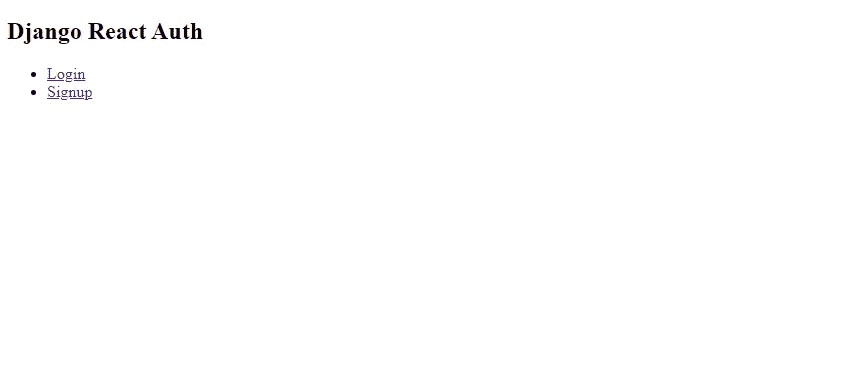

# Django + React 认证:第 2 部分

> 原文：<https://blog.devgenius.io/django-react-authentication-part-2-ea626688165e?source=collection_archive---------2----------------------->

## 使用 React 创建 Django API 的前端


文本编辑器中的代码

在上一篇文章中，我带领您使用 [Django](https://www.djangoproject.com/) 和 [Django Rest 框架](https://www.django-rest-framework.org/)创建了一个后端用户认证 API。那篇文章可以在[这里](https://medium.com/dev-genius/django-react-authentication-part-1-d351726b284d)找到。在本文中，我们将使用 [React](https://reactjs.org/) 创建一个简单的前端来使用这个 API。注意，我不会使用任何花哨的东西，比如 Redux 或上下文 API。相反，我将通过使用诸如`useState`和`useEffect`这样的 React 挂钩来保持简单。

**创建项目并清理:**

我喜欢用`create-react-app`来搭建我的 React 项目。我将命名这个项目客户。在终端中运行以下命令。注意，你需要在你的机器上安装`node`和`npm`，这样才能工作。

```
npx create-react-app client
```

一旦运行完成(可能需要一两分钟)，您应该有了 React 应用程序的框架。文件结构应该如下所示:

```
- public/
-- favicon.ico
-- index.html
-- logo192.png
-- logo512.png
-- manifest.json
-- robots.txt
- src/
-- App.css
-- App.js
-- App.test.js
-- index.css
-- index.js
-- logo.svg
-- reportWebVitals.js
-- setUpTests.js
- .gitignore
- package-lock.json
- package.json
- README.md
```

注意:我把 node-module 文件夹留在这里，但是它将出现在您的文件结构中。

可悲的是，`create-react-app`制造了很多我们不需要的文件。我倾向于通过删除这些文件来清理我的 React 项目。如果以后需要，我会把它们加回去。然而现在，它只是一大堆看起来杂乱的噪音。这是我留下的文件结构的样子。

```
- public/
-- index.html
- src/
-- App.js
-- index.js
- .gitignore
- package-lock.json
- package.json
- README.md
```

如果我们现在查看`public/index.html`的内部，我们会看到一些评论，以及对我们删除的内容的引用。我也清理了这个文件，如下所示:

清理由 create-react-app 生成的 index.html 文件

`src/App.js`和`src/index.js`也需要一些清理，因为我们删除了他们导入的一些东西，比如`App.css.`

这里是清理后的`index.js`:

清理由 create-react-app 生成的 index.js 文件

这是清理后的`App.js`:

清理由 create-react-app 生成的 App.js 文件

注意:我还把`App.js`转换成了箭头函数。

**NPM 套餐:**

对于这个项目，我们只需要 1 个 npm 包。`react-router-dom.`这将允许我们轻松地实现到应用程序的路由。

要安装它，请在终端中运行以下命令:

```
npm install react-router-dom
```

为了配置`react-router-dom`,我们需要对`App.js.`进行一些修改

添加 react-router-dom 后的 App.js

注意，我们添加了`react-router-dom.`的导入，我们还放置了导入到 App div 中的`Router`和`Switch`组件。

`Router` 是将`react-router-dom`中的组件放入其中所需的包装器。如果您试图在路由器之外使用库中的任何组件，它将抛出一个错误。

`Switch` 将允许我们在其中定义特定的路线，这将允许通过链接和重定向导航。

**项目布局:**

让我们考虑一下认证用户所涉及的不同页面。我们将需要一个最起码的`login`、`signup`和`logout` 页面。这就是我们将在这里包括的内容。当然，在一个真实的应用程序中，你会希望包含诸如忘记密码和修改密码的页面。我将在以后的文章中写这些。另外两个有用的页面是一个`landing page`和一个`dashboard`。

除了`dashboard` 之外的每个页面都将是公开的，而`dashboard` 将受到保护并需要认证。

下面是我喜欢在 react 项目中使用的文件结构。然而，你可以随意转换它，因为它与你如何构建组件的功能无关。

```
- public/
-- index.html
- src/
-- components/ 
--- layout/ 
---- Navbar.js
-- views/ 
--- auth/ 
---- Login.js 
---- Logout.js 
---- Signup.js 
--- app/ 
---- Dashbaord.js
-- App.js
-- index.js
- .gitignore
- package-lock.json
- package.json
- README.md
```

我们创建了一些新的目录和文件。我将解释每个工具的作用:

**组件:**在这里我们将放置不同的组件，这些组件将被组合起来创建页面。注意，我创建了一个`layout`目录。在这里，我喜欢放置会出现在大多数页面上的东西。如导航条和页脚。如果我们有与显示用户帐户信息相关的组件，我会创建另一个文件夹`components/account.`,这有助于我组织我的组件。

视图:这里是将向用户显示的完整页面。我在这里有两个文件夹，`auth`和`app.`在`auth` 文件夹中，我放置了所有用于用户认证的视图，如`login`、`signup`和`logout`。

**导航条:**

navbar 组件将是简单的，将出现在每一页。`src/components/layout/Navbar.js`内部

Navbar.js 组件

这里发生了一些事情。

首先，注意我们正在从`react-router-dom.`导入`Link`组件，链接组件被渲染为一个`<a>`标签。所以:

```
<Link to='/login'>Login</Link>
```

与以下内容相同:

```
<a href=”/login”>Login</a>
```

使用`Link` 的原因是因为它需要匹配我们将在`App.js`中设置的路线。稍后会有更多的介绍。

其次，注意我们使用了`useState`和`useEffect`钩子。

我们使用`useState` 来跟踪用户认证的状态。默认状态是未认证的，因此呈现了`login` 和`signup Links` 。如果用户通过了身份验证，那么将转而呈现`dashboard` 和`logout` `Links` 。这个逻辑由使用三元运算符的条件呈现来处理。你可以在 React 文档的这里阅读[。](https://reactjs.org/docs/conditional-rendering.html)

`useEffect` 钩子用于检查和改变用户的认证状态。它通过在本地存储中检查一个名为`token`的键来实现这一点。如果密钥存在，则用户已经通过了身份验证。

接下来，我们要将导航条导入到`App.js`中。

App.js 在导入并实现了 Navbar 组件之后

像这样简单的导入并使用`App.js`中的导航条。请注意，它位于路由器内部，但在交换机外部。开关将用于匹配放置在内部的路由。因为我们希望导航条出现在每一页上，所以它被放置在开关之外。但是，因为 navbar 中的 Link 组件来自`react-router-dom`，所以它必须放在路由器内部。

运行`npm start`,我们应该会在浏览器中看到类似这样的内容:



npm 启动后的导航栏组件示例

这再简单不过了。没有造型或任何花哨的东西。请注意，点击链接还不会导致任何地方。在下一部分，我们将创建`login` 和`signup` 页面。

**登录和注册页面:**

`Login` 和`signup` 将共享一些相同的功能。尽管在实践中最好不要重复自己，并且以一种可以在组件之间共享的方式编写方法，但我们在这里不会这样做，所以对正在发生的事情 100%清楚。

以下代码用于`views/auth/Login.js`:

views/auth/Login.js 中的 Login.js

这里发生了很多事情，但是让我们来分析一下。

我们在 4 个不同的状态上使用了`useState`。

第 4 行和第 5 行中设置的`email`和`password`状态用于形状控制。这些值会在用户键入时更新。您可以在第 59 行和第 68 行看到，输入的`onChange`属性被设置为通过使用它们的 setter 方法来更新`email` 和`password`。这些也是在登录请求期间累加的值。

`errors`状态用于在出现任何错误的情况下将任何错误推入。如果有错误，您可以从第 50 行看到它将被呈现。此外，如果登录请求有任何错误，您可以在第 42 行看到 errors 被设置为 true。

`loading`状态用于在请求登录页面和实际呈现页面之间建立缓冲。这是因为如果用户已经通过身份验证，您就不希望再次显示登录页面。相反，您会将它们重定向到`dashboard`。您可以在第 9 到 15 行的`useEffect` 钩子中看到这个逻辑。

JSX 相当简单。它呈现了一个简单的带有标签的登录表单，并输入了电子邮件和密码。

大部分逻辑在`onSubmit`方法中。第 18 行用于在提交表单时防止页面刷新。在第 20 到 23 行中，我们用表单中输入的电子邮件和密码的值创建了一个用户对象。使用这个用户对象，我们向 API 发出一个获取请求，如第 25 行到第 31 行所示。在第 32 到 37 行，我们检查请求是否成功。如果是，那么我们将本地存储中的`token`设置为 API 返回的值，然后将经过身份验证的用户重定向到仪表板。我们通过查看 API 是否返回名为 key 的身份验证令牌来检查请求是否成功。这在第 34 行中有明确的说明。第 38 到 43 行处理任何错误。如果请求中没有身份验证令牌，这意味着有些地方不对劲。因此，这将清除表单并将`errors`切换为 true 以显示给用户。

以下是`views/auth/Signup.js`的代码:

views/auth/Signup.js 中的注册视图代码

注册视图的逻辑与登录几乎相同。主要区别在于密码。这些字段被命名为`password1`和`password2.`，这是因为当用户注册该网站时，他们需要确认他们的密码。

注册成功后，用户将从请求中收到一个身份验证令牌。该令牌将用于对他们进行身份验证，而不是让他们登录。

现在让我们将登录和注册视图导入到`App.js`中，并为它们创建一些路线。

添加登录和注册后的 App.js

注意，我们导入了`Login`和`Signup.`记住，即使我们称它们为视图，它们仍然是 React 组件。视图的概念只是用来组织我们自己和项目。

另外，请注意`Switch`内部的 2 个新的`Route`组件。一个`Route`的`path`属性(prop)声明了该路径将被呈现的 url。在这种情况下，我们使用路线内的`component`道具来渲染视图。因此在路线`[http://localhost:3000/login](http://localhost:3000/login)`处将呈现`Login`视图。这里的`exact`关键字指定在特定的路线上只应该渲染这个视图。

**注销:**

只有在用户已经通过身份验证的情况下，才能访问注销视图。这个视图与登录和注册有很多相同的逻辑。基本上，这是一个表单，用户通过按一个按钮来确认他们想要注销。出于安全目的，注销是作为 post 请求完成的。

以下是`views/auth/Logout.js`的代码:

在 views/auth/Logout.js 中找到注销视图

接下来，我们需要为`App.js`添加一个注销路由:

**仪表盘:**

将所有这些放在一起的最后一个视图是仪表板。仪表板将成为受保护的视图。这意味着用户在访问它之前必须经过身份验证。在`react-router-dom`有一个比我在这里使用的更好的方法来处理这种情况。我建议仔细阅读。然而，为了简单起见。我将只使用简单的重定向和其他视图中使用的类似逻辑。

以下是`views/app/Dashboard.js`的代码:

注意第 8 行中的检查，查看用户是否通过了身份验证。此外，如果用户可以访问这个页面，那么它会显示他们的电子邮件。

**结论:**

这是一个关于使用 Django 和 React 的认证系统的简单概述。当然，还需要进行更多的检查。然而，这足以让你开始。

这里是 GitHub 上已完成项目回购的[链接](https://github.com/tarricsookdeo/django-react-auth)。

还有，这里是工作 app 的视频！

如果你喜欢这篇博文，并且觉得它很有用，可以考虑为它鼓掌，并在 Medium 上关注我。此外，考虑使用我的推荐链接在这里注册媒体。只要你还是会员，我就能得到一点回扣。如果你愿意，你也可以在这里给我买杯咖啡。非常感谢！