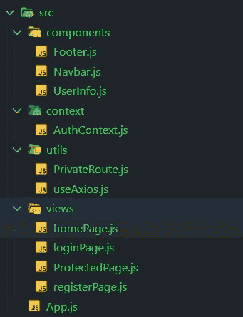
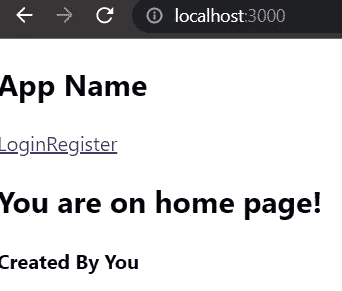
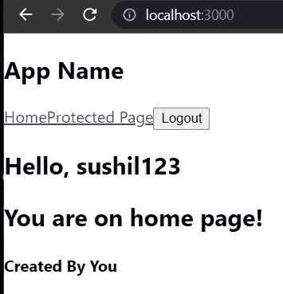

# Django Rest 框架+ React —认证工作流 2022(第 2 部分)

> 原文：<https://blog.devgenius.io/django-rest-framework-react-authentication-workflow-2022-part-2-d299b7fef875?source=collection_archive---------0----------------------->

## 在这篇博客中，我们将介绍认证工作流程的前端部分。我们将创建页面，组件，自定义挂钩，实用功能和路线与路线警卫。到本博客结束时，您将拥有一个面向未来全栈应用的成熟认证工作流。

> 通过第一部分，我们涵盖后端部分。

 [## Django Rest 框架+ React —认证工作流 2022(第 1 部分)

### 在这篇博客中，我们将介绍完整的认证工作流程。我们将从项目设置、git 设置、后端…

sushil-kamble.medium.com](https://sushil-kamble.medium.com/django-rest-framework-react-authentication-workflow-2022-part-1-a21f22b3f358) 

## 内容

–需求
–项目设置(前端)
–开始
–应用测试
–代码访问(跳到好的部分)
–参考

## 要求

*   确保您已经安装了 [node.js](https://nodejs.org/en/)
*   [纱](https://classic.yarnpkg.com/en/)推荐为包装经理。你可以简单地输入`npm install --global yarn`来安装纱线
*   任何 IDE， [VS 代码](https://code.visualstudio.com/download)推荐
*   [Git 版本控制](https://git-scm.com/downloads)(可选但推荐)

## 项目设置(前端)

1.  **将目录** `cd`改为前端目录
2.  **创建 React App**
    `yarn create react-app .`
    ***注意*** *:一定要在前面的命令中添加一个* `*.*` *，这样 React 项目就会搭建在当前目录下。*
3.  **安装包** `yarn add axios dayjs jwt-decode react-router-dom@5.2.0`
4.  **运行应用**
    `yarn start`

## 我们开始吧

> 我们必须将用户存储在前端&用户状态为空或已定义必须可以跨整个应用程序访问。所以，基本上我们需要一个商店。如果我们想到商店，Redux 就会出现在我们的脑海中，对！。让我们在没有 Redux 的情况下实现这一点。让我们使用 React 钩子`useContext`

*   在`src`中创建一个名为`context`的文件夹&在里面创建一个名为`AuthContext`的文件。

**我们来分解一下这段代码。**
我们基本上是在创建一个`AuthContext`，我们将能够把它导入到`src`文件夹中的任何文件中。我们将能够使用它访问`contextData`。
*我们基本会把整个 app 包裹在* `*AuthProvider*` *里面。*
`loginUser` —需要用户名和密码。如果用户在数据库中(凭证有效)，则用户登录。令牌(访问&刷新)存储在本地存储中，
`registerUser` —需要用户名、密码 1、密码 2。这个函数在数据库中注册用户。唯一的用户名，密码匹配检查在后端完成。如果注册请求成功，则用户被重定向到登录页面。
`logoutUser` —简单地注销用户&清除本地存储。
每当`authTokens`的&状态改变时。用户状态已更改(`useEffect`导致此更改)。`jwt_decode`只解码一个访问令牌。

> 如果你想看`jwt_decode`输出什么，去[https://jwt.io/](https://jwt.io/)粘贴你的访问&看解码输出，同样的事情会在这里完成。

**问题:**访问令牌寿命通常很短。因此，用户的令牌将在很短的时间内有效，然后它将过期，用户将无法访问应用程序的所有私有路由。

**方法:**为了解决这个问题，我们需要一种方法在请求被发送到服务器之前拦截它。我们拦截请求，查看令牌是否有效，如果无效，我们将通过刷新令牌请求新的令牌，我们将获得新的访问令牌，并将该令牌用于对私有路由的 API 请求，如果令牌有效，我们将使用相同的令牌向私有路由发送请求。

**实现:**我们可以使用`axios`库来解决这个问题。`axios`已经拿到了`interceptors`。`axios`基本上会拦截所有的请求。它将首先运行`interceptors`，然后向服务器发出实际请求。 ***所以我们在调用私有 API 的时候要用到*** `***axios***` ***。此外，如果我们获得新的访问令牌，我们必须更新应用程序的状态。所以我们可以使用 React 自定义钩子。***

*   在`src`文件夹内创建名为`utils`的文件夹&在名为`useAxios.js`的`utils` 内创建文件。

**我们来分解一下这段代码。**
我们正在从`useContext`访问`authTokens`、`setUser`、`setAuthTokens`。
我们需要他们获取和更改 React 应用程序的状态。
此外，我们正在创建一个`axios`实例，它具有认证头，确保它只用于私有路由。然后我们正在解码用户访问令牌。令牌有`exp`日期，告知它何时到期。在下一行，我们只是检查令牌是否有效。如果过期，获取新的访问令牌&更改应用程序的状态。

我们的应用程序将有 4 条路线
`/login`
`/register`
`/`
`/protected` ——私有路线

如果用户已经登录，他们应该只能访问私有路由，否则应该被重定向到登录页面。我们需要一个专用路由组件来实现这一点。

所以在`src`下的`utils`文件夹内的`PrivateRoute.js`中创建一个文件

这段代码所做的只是检查用户是否存在。如果用户在场，那么它会将所有的道具传递给子组件，并呈现该路线。否则，它将重定向到登录页面。

最困难的部分已经过去了，现在我们必须在应用程序中使用这一部分。我们必须创建路线(页面)和组件。

`FolderName_FileName.js` —此处使用的命名格式。
这里我说的是代码末尾下面提到的那一行。比如`views_registerPage.js`用 GitHub
托管的`view_regiterPage.js`，应该位于`views`文件夹，文件名应该是`registerPage.js`。你可以看看我的目录结构，以便清楚地了解。

下面是目录结构

目录结构(这不是整个目录结构，还有像 public 和 all 这样的文件夹，我们还没有触及)

就这些，如果你能走到这一步，恭喜你。

## 测试应用程序的时间到了

*   确保你的后端正在运行。
    麻烦？转到后端应用程序的根目录，激活你的虚拟 env 和`python manage.py runserver`
*   确保您的前端正在运行。
    麻烦？转到前端应用程序的根目录`yarn start`
*   转到 [http://localhost:3000/](http://localhost:3000/)

主页(用户未登录)

*   进入登录页面，输入超级用户的`username` & `password`
    如果忘记了，不用担心。进入注册页面&注册新用户。注册成功后，您将被重定向到登录页面。现在使用这些最近注册的凭证登录。
    成功登录后，您将被重定向到主页，在那里您将看到您的用户名。Navbar 也改了，旁边会看到一个注销按钮。

主页(用户已登录)

*   投影页面——没有登录，您无法访问[http://localhost:3000/protected](http://localhost:3000/protected)，您将被重定向到`/login`页面。
    当你访问一个受保护的页面时，你会得到`Congratulation <username>, your API just responded to GET request`这条消息。

## 代码访问

阅读存储库的`README.md`以了解运行项目的步骤。

 [## GitHub-sushil-kam ble/django-react-auth:未来全栈的认证模板…

### 未来全栈应用的认证模板-GitHub-sushil-kam ble/django-react-auth…

github.com](https://github.com/sushil-kamble/django-react-auth) 

## 参考

Dennis Ivy — [认证&刷新令牌实现](https://www.youtube.com/watch?v=xjMP0hspNLE&t=9s&ab_channel=DennisIvy)

谢谢&祝你黑客愉快…