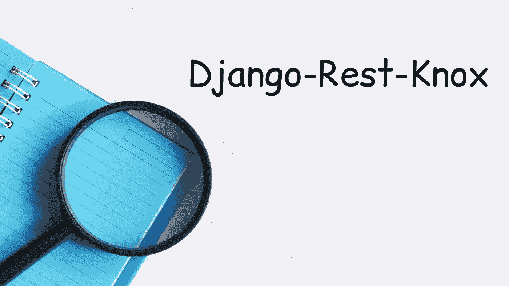
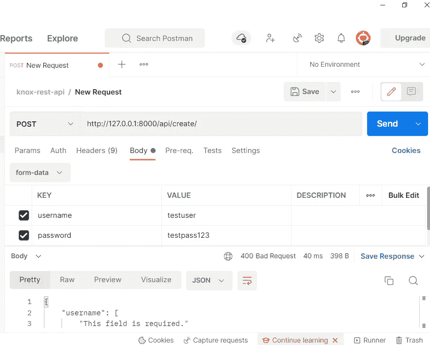
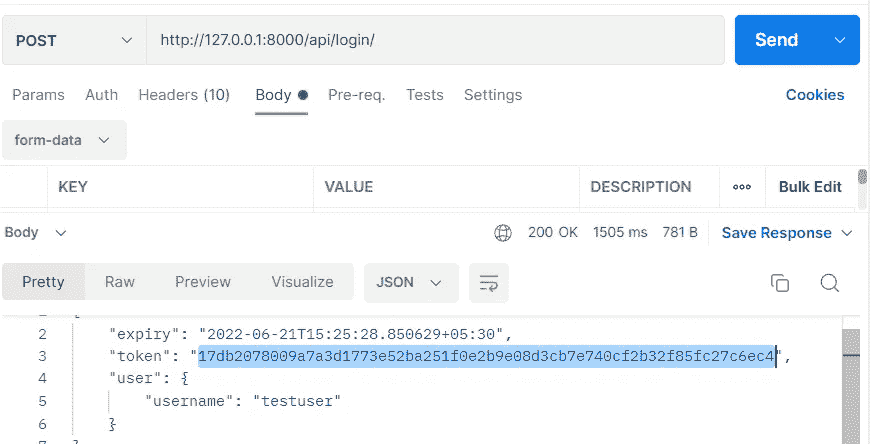
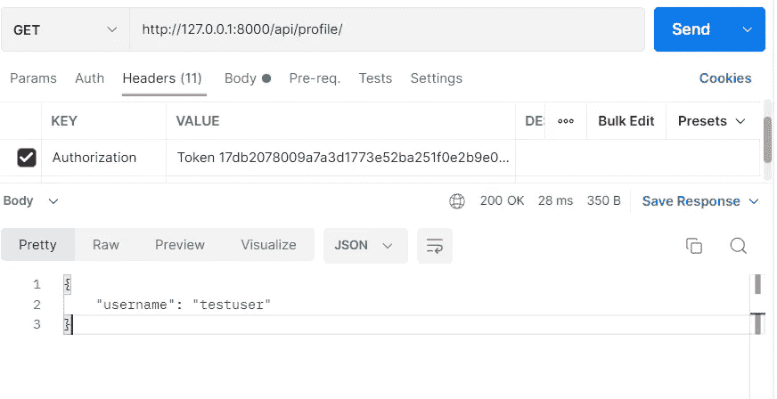
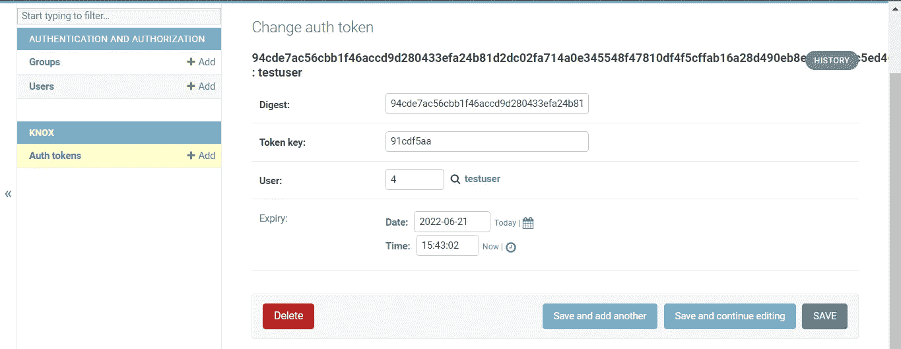

# Django Rest Knox 令牌认证

> 原文：<https://blog.devgenius.io/django-rest-knox-token-authentication-f134760a4a7b?source=collection_archive---------0----------------------->



大家好，本文将详细介绍如何使用名为“django-rest-knox”的第三方包作为生成 knox 令牌的认证模块。

Knox 认证是基于令牌的，与 DRF 内置的`TokenAuthentication`非常相似。但是，它克服了默认实现中存在的一些问题。

与 DRF 自带的默认`TokenAuthentication`一样，令牌在数据库中是不加密的。如果我们的数据库遭到破坏，或者攻击者窃取了包括令牌在内的所有数据库数据，他们将能够使用窃取的凭证(令牌)登录。

我推荐 Knox 的主要原因是令牌加密。Knox 令牌身份验证使用 SHA-512 来散列数据库中的令牌，这意味着令牌是加密的。Knox 依靠`cryptography`来提供对`OpenSSL`的绑定，以生成令牌。这要求 OpenSSL 构建库可用。

DRF 令牌跟踪其创建时间，但没有内置的令牌过期机制。Knox 令牌可以在应用程序设置中配置到期时间(默认为 10 小时。)

## 安装诺克斯

诺克斯应该和皮普一起安装

```
pip install django-rest-knox
```

## 设置诺克斯

*   将`rest_framework`和`knox`添加到你的`INSTALLED_APPS`中，如果你正在使用的话，移除`rest_framework.authtoken`。
*   将 knox 的 TokenAuthentication 作为 django-rest-framework 的默认身份验证类:

## 设置(`knox.settings)`

Knox 中的设置处理方式类似于 rest 框架设置。所有设置都在`'REST_KNOX'`设置中命名。

有了上面的设置，我们就拥有了对令牌的大部分控制权；如设置令牌长度、令牌到期(TTL 默认为 10 小时)、限制每个用户的令牌、令牌到期后自动刷新。在本例中，我将 TTL 设置为 45 分钟，因此令牌每 45 分钟到期一次。

## API 的实现

为我们的 *create_user* 请求创建一个*序列化器*,然后创建一个处理该请求的视图，然后将其连接到一个允许我们访问 API 的 URL

> ***Imp 点记住*** :如果 TokenAuthentication 是您在`REST_FRAMEWORK["DEFAULT_AUTHENTICATION_CLASSES"]`中唯一的默认身份验证类，请记住覆盖 Knox 的 LoginView，否则它将不起作用，因为 login 视图将需要一个身份验证令牌来生成新令牌。

由于我使用 TokenAuthentication 作为我唯一的身份验证类，因此我覆盖了 Knox 的登录视图:

写了一些意见的网址..

## 测试 API

我们在 urls.py 中有五个端点。通过 Postman 测试每个端点。您可以随意使用任何您想要的 API 测试工具。

1.  在“ [*创建一个测试用户 http://127 . 0 . 0 . 1:8000/API/create/*](http://127.0.0.1:8000/api/create/)*”*，在 Body 部分提供用户名和密码字段。



2.登录端点生成令牌(Knox 加密令牌):创建用户后，登录“[*http://127 . 0 . 0 . 1:8000/API/log in/*](http://127.0.0.1:8000/api/login/)”查看令牌。



3.生成令牌后，将令牌复制并粘贴到标题部分，以授权管理用户配置文件。[*http://127 . 0 . 0 . 1:8000/API/profile/*](http://127.0.0.1:8000/api/login/)



注销后，如果您使用以前的令牌重新登录，令牌将会失效，我们需要确保在令牌失效后将其删除。

在管理面板上:



***总结***:[Django-rest-Knox](https://github.com/James1345/django-rest-knox)库提供了模型和视图，以一种比内置 TokenAuthentication 方案更安全、更可扩展的方式处理基于令牌的身份验证——考虑到了单页面应用程序和移动客户端。

它提供了每个客户端的令牌，以及在提供其他身份验证(通常是基本身份验证)时生成令牌、删除令牌(提供服务器强制注销)和删除所有令牌(注销用户登录的所有客户端)的视图。

对于这个项目的源代码，你可以看看

[https://github.com/Rajesh25B/django-rest-knox](https://github.com/Rajesh25B/django-rest-knox)

很多东西都参考了:

 [## 证明

### Auth 需要可插拔。- Jacob Kaplan-Moss，“REST worst practices”身份验证是关联…

www.django-rest-framework.org](https://www.django-rest-framework.org/api-guide/authentication/)  [## 姜戈-雷斯特-诺克斯

### 没有人

james1345.github.io](https://james1345.github.io/django-rest-knox/)