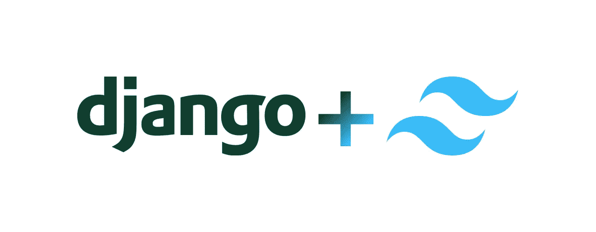

# Django +顺风设置

> 原文：<https://blog.devgenius.io/django-tailwind-setup-678e795d23a9?source=collection_archive---------3----------------------->



姜戈+顺风

下面是如何用 Tailwind CSS 设置 Django 项目的概要。我推荐在你的 Django 项目中使用 Tailwind，它很容易使用，而且你可以在网上找到许多免费的即插即用的 HTML 模板样本来帮助你立即投入运行。

# 先决条件

要开始我们的项目，请确保您安装了最新版本的 Python3。在 Windows/Linux/macOS 上，运行以下命令打印系统上安装的 Python 版本。

```
python --version
```

如果您有 3.8 或更高的版本，那么您可以遵循下面的步骤。否则，[看看我的关于如何安装 python3 的指南。](https://medium.com/@ingimareys93/how-to-install-python-3-6eae4d2d14f8)

# **虚拟环境**

为 python 项目创建虚拟环境是一个很好的实践，因为它在它们之间创建了分离。大多数项目使用库、包和其他依赖项，因此创建一个空间，当我们有不同项目的不兼容依赖项(即版本号)时，这些依赖项可以确保您的项目不会失败。

我将项目和环境文件夹保存在用户的个人文件夹中。您可以按照这个命令导航到 Mac 或 Linux。

```
cd ~
```

创建两个文件夹，一个用于您的项目，另一个用于您的 Python 虚拟环境。

```
mkdir py-env projects
```

现在，我们想要创建并启动我们的虚拟环境。在本指南中，我将把它称为 my_django_project，但请按照您的意愿命名。运行以下命令创建环境。

```
python3 -m venv py-env/my_django_project
```

然后运行以下命令启动环境:

```
source py-env/my_django_project/bin/activate
```

这激活了您的 python 环境，因此您可以开始安装创建 Django 项目所需的库和包。

# 安装和启动 Django

在运行以下命令时，请记住，如果您想另外运行另一个终端，您还必须激活该终端中的环境。

```
pip install --upgrade pippip install django django-admin
```

要启动您的第一个 Django 项目，请运行以下命令。

```
mkdir projects/my_django_projectcd projects/my_django_projectdjango-admin startproject my_django_project .
```

在您的终端上运行 **ls** 应该会显示 Django 应用程序的文件夹结构。并运行以下命令来运行本地主机上的默认 Django 服务器 [http://127.0.0.1:8000/](http://127.0.0.1:8000/)

```
python manage.py makemigrationspython manage.py migratepython manage.py runserver
```

如果 Django 应用程序运行，那么您已经成功地启动了您的第一个 Django 应用程序。

# 用 Django 安装顺风

Tailwind 是我们将用来创建电子商务应用程序的开源 CSS 框架。但是要这样做，你需要安装 NPM

*   参见我的指南如何安装 NPM。

Tailwind 是一个 CSS 框架，不像其他许多框架，它没有为你提供预定义的 CSS 类；相反，它是一个“实用”CSS 类的列表。换句话说，你可以使用混合类来达到你想要的效果。

首先，在我们的环境仍然活跃的情况下，安装这两个包，以便与运行 Javascript 的前端框架一起有效地工作。

```
pip install django-compressor django-browser-reload
```

Django-browser-reload 将作为帮助我们开发的工具。当发生更改时，它会自动刷新浏览器。Django compressor 将链接和内联的 JavaScript 或 CSS 压缩到一个缓存文件中，而 Django 的大多数静态组合器让您在 settings.py 中配置静态文件。它为我们自动化了一些步骤。

现在将下面一行添加到 my_django_project/settings.py 中的模板配置中。

这告诉 Django 店面模板在哪里(模板是静态 HTML 文件)。在同一文件中，我们还必须将我们的应用程序添加到 INSTALLED_APPS 配置中。

现在，我们还需要在 settings.py 中配置 Compressor。在 settings.py 中添加以下行

在项目的根目录下，运行下面的命令来创建一个静态文件夹结构，压缩程序将在其中施展它的魔法。

```
mkdir storefront/static/ storefront/static/src && touch storefront/static/src/input.css
```

现在，让我们通过添加以下代码行在 store from/views . py 中创建第一个视图函数。

由于本系列中最重要的指南将运行多个应用程序，我们将让店面处理其路由。为此，我们将在 storefront 文件夹中添加一个 urls.py，并运行以下命令。

```
touch storefront/urls.py
```

并将下面几行添加到 store from/URLs . py 中

我们还需要在 my_django_project 中配置 urls.py，并告诉它如何路由到我们的店面应用程序，这里我们添加了 django-browser-reload URL。用下面的代码替换 my_django_project/urls.py 中的代码。

现在，通过运行以下命令创建模板文件夹，这是一个基本和索引 HTML 文件:

```
mkdir storefront/templates && touch storefront/templates/_base.html storefront/templates/index.html
```

将以下 HTML 标记添加到基本模板中。

安装顺风。

Tailwind 是使用 NPM 安装的，所以我们需要在我们的根文件夹中使用任何我们可能安装的应用程序中的 Tailwind。运行下面一行来获取 NPM 包:

```
npm install -D tailwindcss postcss autoprefixer postcss-cli
```

现在用下面的命令初始化顺风框架:

```
npx tailwindcss init
```

现在，通过在 storefront/tailwind.config.js 的内容键中添加模板目录来包含模板

接下来，创建一个名为 **postcss.config.js** 的新文件

```
touch **postcss.config.js**
```

并将以下内容粘贴在那里:

现在，将以下构建脚本添加到 package.json 中，使其看起来像这样:

现在，我们可以使用 npm 运行构建和 npm 运行启动脚本，打开另一个终端并运行:

```
npm run start
```

之后，转到另一个终端并运行:

```
python manage.py runserver
```

现在你应该看到你的 Django + Tailwind 应用同时运行。