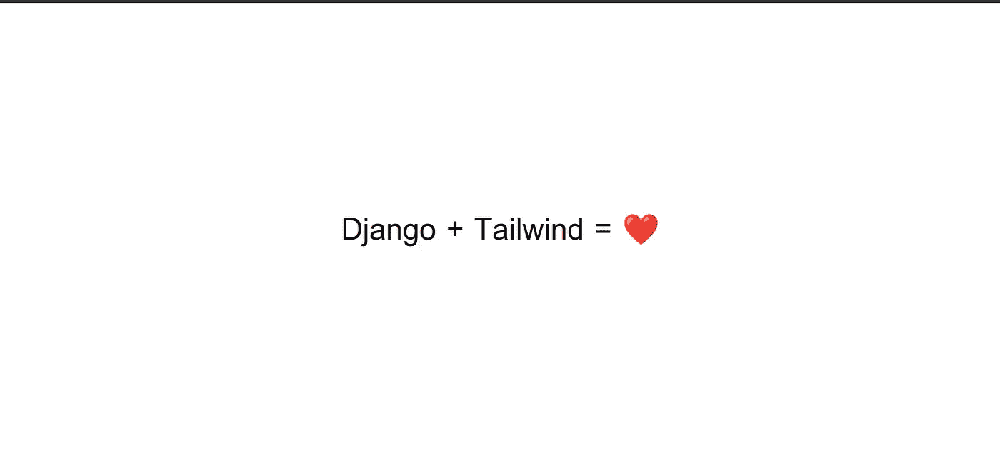
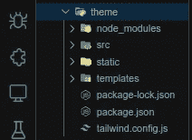
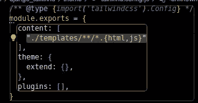
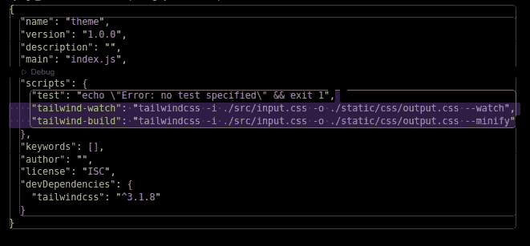
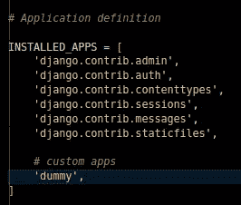
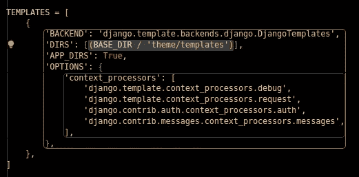
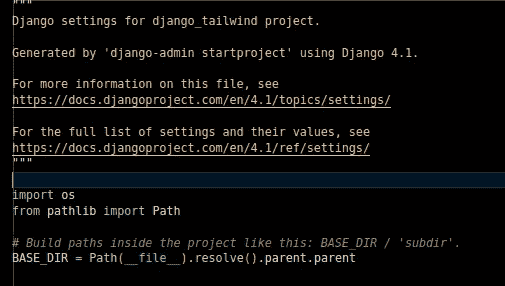
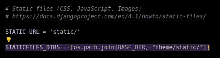
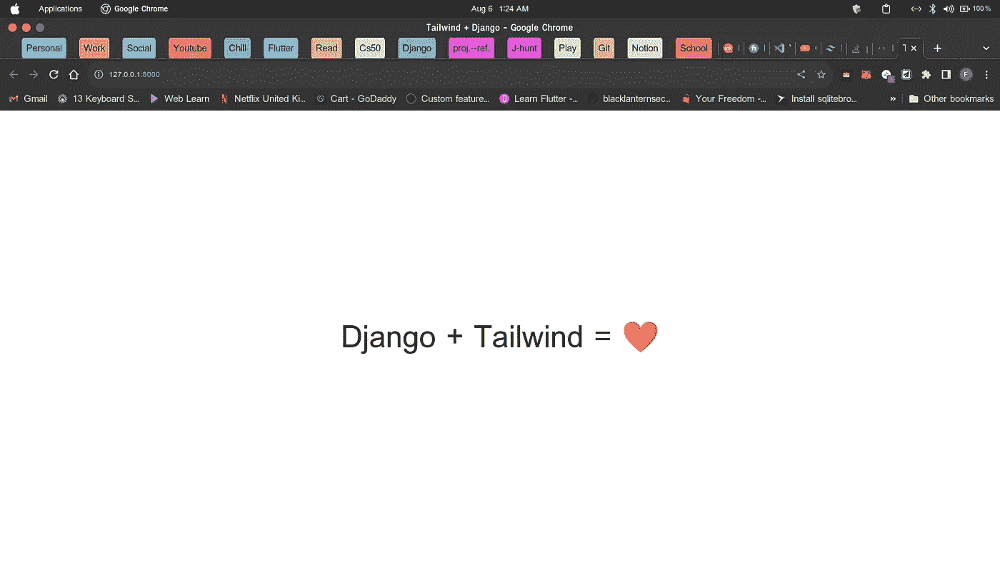

# Django +简化顺风

> 原文：<https://blog.devgenius.io/django-tailwind-simplified-8befa0a281d4?source=collection_archive---------1----------------------->

众所周知， **Django** 是一个强大的 web 框架，允许你处理后端和前端解决方案，今天我们将使用强大的 **Tailwind css** 框架来扩展 Django 的前端。我假设你对姜戈和顺风有些了解。



我们最后的结果

# 我们开始吧

首先在你想要的文件夹中创建一个新的 django 项目，为了这篇文章，我的项目名将是`django_tailwind`。

```
django-admin startproject django_tailwind
```

现在导航到您的项目目录并创建一个名为`theme`的文件夹(您可以随意命名)。

```
mkdir theme
```

为了正确查看我们的结果，我们将创建一个虚拟应用程序

```
python manage.py startapp dummy
```

现在，您的项目结构应该如下所示:

```
django_tailwind
 |_django_tailwind
 |_dummy
 |_theme
 |_manage.py
```

我们试图实现的是设计和逻辑的完全分离。我们将把所有 django 静态文件和模板添加到主题文件夹中。要做到这一点，让我们去的主题文件夹，并启动顺风

```
cd theme
# generate an npm project
npm init -y
# install tailwind
npm install -D tailwindcss
# initiate tailwind
npx tailwindcss init
```

接下来我们将在主题文件夹中创建**模板**、**静态**和 **src** 文件夹。

```
mkdir templates static src
```

在你的`src`文件夹中，创建一个名为`input.css`的 css 文件并添加到其中

```
[@tailwind](http://twitter.com/tailwind) base;
[@tailwind](http://twitter.com/tailwind) components;
[@tailwind](http://twitter.com/tailwind) utilities;
```

你的主题文件夹应该看起来像这样



在你的`tailwind.config.js`中添加这一行到`content: []`

```
"./templates/**/*.{html,js}"
```

你应该有这样的东西



在我们的`package.json`中，我们将添加以下 npm 脚本

```
...
"tailwind-watch": "tailwindcss -i ./src/input.css -o ./static/css/output.css --watch",
"tailwind-build": "tailwindcss -i ./src/input.css -o ./static/css/output.css --minify"
...
```

结果应该是



接下来，在您的模板文件夹中，我们将创建一个`base.html`文件，我将在`layouts`文件夹中创建我的文件。完成后，将下面的代码添加到基本模板中(您可以在以后根据需要修改它)。

```

<!DOCTYPE html>
<html lang="en"><head>
  <meta charset="UTF-8">
  <meta name="viewport" content="width=device-width, initial-scale=1.0">
  <meta http-equiv="X-UA-Compatible" content="ie=edge">
  <title>Tailwind + Django</title><link rel="stylesheet" href="">
 </head><body class="bg-grey-lightest font-serif leading-normal tracking-normal"><div class="container mx-auto ">
   <section class="flex items-center justify-center h-screen">
    <h1 class="text-5xl font-sans">Django + Tailwind = ❤️</h1>
   </section></div></body></html>
```

(注意调用样式表时我们用的``？这将是 tailwind 加载 css 文件，它将像普通的`stytles.css`一样用于项目中的所有 css 目的。

# 修改设置. py

在我们的`**settings.py**` 中，我们将做一些修改来确保 django 服务于静态文件。

首先，我们将把我们创建的`**dummy**`应用程序添加到已安装的应用程序中



接下来，我们应该确保 django 将从我们的主题文件夹中读取模板。我们将把`(BASE_dir/'theme/templates')`添加到`'DIRS': []`中，如下所示:



现在，使用 django mechanicsm 加载静态文件，我们将对它进行修改，以便从主题文件夹中加载静态文件。首先在顶部，像这样添加`import os`:



创建 static_dir 时导入操作系统以避免 PosixPath 错误

接下来我们创建一个`STATIC_DIRS`来从`theme`文件夹中读取静态文件

```
# add this
STATICFILES_DIRS = [os.path.join(BASE_DIR, "theme/static/")]
```

结果应该是这样的:



# 从“虚拟”应用程序设置视图

在您的虚拟应用程序中，转到`views.py`并添加以下内容(记住您的基本模板位于哪个目录):

```
# *Create your views here.*def index(request):
   return render(request, 'layouts/base.html')
```

接下来，在虚拟应用程序中创建一个`urls.py`，并添加:

```
from django.urls import path
from .views import indexurlpatterns = [
    path('', index, name='index'),
]
```

在项目主 url 文件(与 settings.py 位于同一目录)中，添加以下内容:

```
urlpatterns = [path('admin/', admin.site.urls),path('', include('dummy.urls')), # new]
```

这应该完成了配置。现在运行主题文件夹中的命令，将顺风 css ( `src/input.css`)加载到静态文件夹(`static/css/output.css`)中的 css 文件:

```
npm run tailwind-watch
```

要在浏览器中查看结果，请运行:

```
python manage.py runserver
```

附注:如果需要，进行迁移。

结果:



项目 git:[https://github.com/gr1nch3/django_tailwind.git](https://github.com/gr1nch3/django_tailwind.git)