# Django-Tests |用 Django 编写测试

> 原文：<https://blog.devgenius.io/django-tests-writing-tests-in-django-dd8d061e8334?source=collection_archive---------11----------------------->

克里斯·里德在 [Unsplash](https://unsplash.com?utm_source=medium&utm_medium=referral) 上拍摄的照片

为您的应用程序编写测试确实是一项重要的任务。这确实有助于开发人员验证他的代码。

这篇文章将主要关注“**在 Django** 中编写测试”，我们将为我们的“**博客克隆**”应用程序编写测试。因此，如果有人没有浏览过之前的博客，我强烈推荐阅读之前的文章。

让我们首先了解更多关于 django 测试的知识。

默认情况下，Django 使用`**unittest**`模块来编写测试。我们将在帖子中涉及的内容是:

*   为模型编写测试
*   为视图编写测试
*   为序列化程序编写测试

在这里，我们将对应用程序中编写的所有模块进行非常小的单元测试。

我们开始吧！！💥

因此，首先我们将为我们的`**models**`编写测试。为此，首先打开我们的`**app**`即`**blogs**`中的`***tests.py***`文件，并将下面的代码粘贴到其中。

让我们快速了解这个类。在这里，我们创建了一个名为`**BlogsTestModels**`的类，它将包含所有与我们的模型相关的单元测试。这个类继承了名为`**TestCase**`的 Django 测试类。

在这个类中，我们首先创建了一个`**setUp**`(名称必须相同)方法。在运行测试之前，这个`**setUp**`方法必须包含这个类的所有`**setUp**`指令。因此，这里我们使用这个方法创建我们的`***user***`，并给这个用户一些足够的权限(`***admin***`)。这意味着每当在这个类中运行一个测试时，这个`**setUp**`方法将触发并创建一个具有上述细节的`**admin**`用户。

现在，让我们来看另一种方法。这个方法名为`**test_blog_model**`

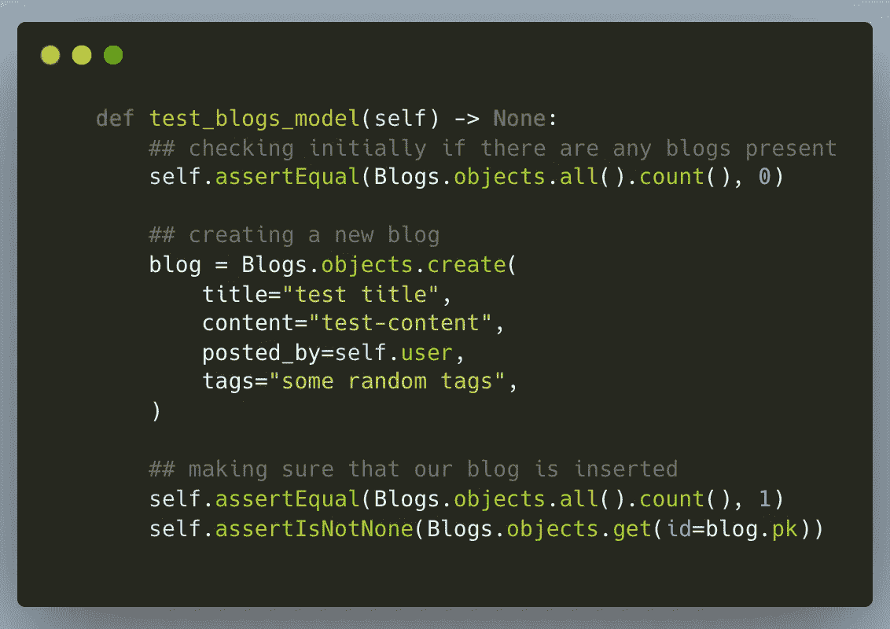

**测试 _ 博客 _ 模型** `method`

这里，在这个方法中，我们首先确认`**test database**`是否为空，并且在我们的`**Blog**`模型中是否没有数据。之后，我们为`**Blogs**`模型创建一个数据对象，然后确认它已成功插入数据库。

我们的，另一个方法名是`**test_likes_model**`

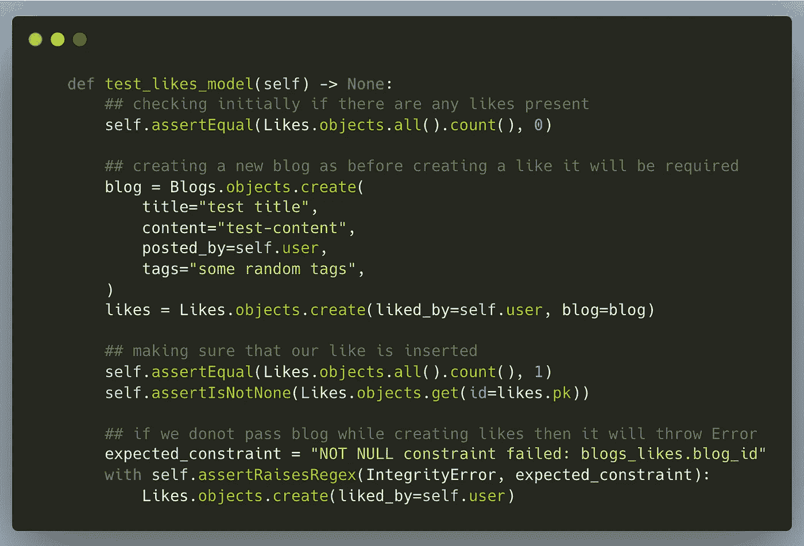

`**test_likes_model** method`

这里，就像以前的模型一样，我们首先在这里验证以前的数据不存在，然后为`**Blogs**`和`**Likes**`模型创建新的数据点。此外，我们还测试了这个模型的一个更重要的特性，那就是，如果我们不将博客引用传递给它，它将无法保存✔️

# 让我们先进行这些测试。

为了运行这些测试，请使用以下命令

`**python manage.py test blogs.tests**`

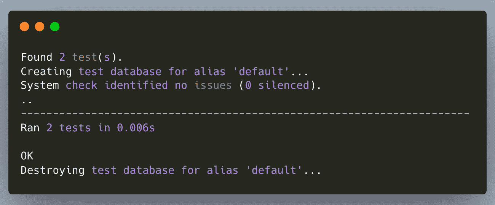

恭喜🎉，您的测试已成功通过。现在让我们也为其他模块创建测试。

让我们开始为`**serializers**`编写测试

这里，就像前面的测试类一样，我们创建了一个测试我们的`**serializers**`的类，并将其命名为`**BlogsTestSerializers**`。它也包含相同的方法是`**setUp**`，我们在其中创建一个管理员用户。让我们深入研究一下类方法。

先来看看我们的`**test_about_user_serializer**`方法。

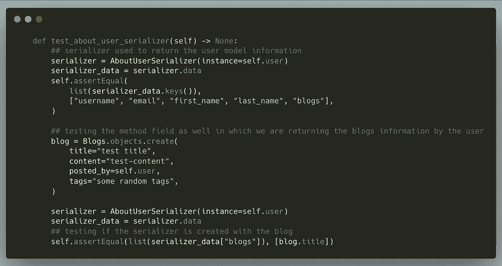

**test _ about _ user _ serializer**方法

首先，我们现在通过传递一个`**User**`对象来验证我们的`**AboutUserSerializer**` ，然后通过`**serializer**`检查所有返回的字段。然后，我们通过用户创建一个新的博客数据再次检查这一点，并通过解析`**serializer**`响应进行验证。

让我们看看我们的另一个测试方法是`**test_get_blog_serializer**` **。**

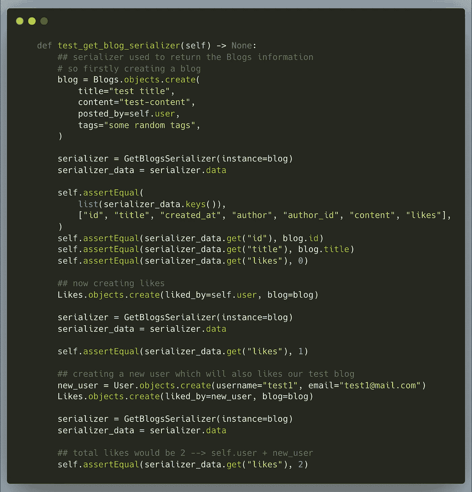

**test _ get _ blog _ serializer**方法

这次测试比我们之前的测试要长一点。在这里，我们首先创建一个博客，并用我们的`**GetBlogsSerializer serializer**`来验证。现在，我们创建与这个博客相关联的`**Likes**`，并使用我们的`**serializer**`来验证它。在我们的最后一个案例中，我们创建了一个新的`**user**` `(now for this test we have 2 different users)`，并使用我们的`**serializer**`简单地验证了我们之前创建的博客上的总赞数。

让我们看看我们的其他测试方法，即`**test_update_blogs_serializer**` **。**

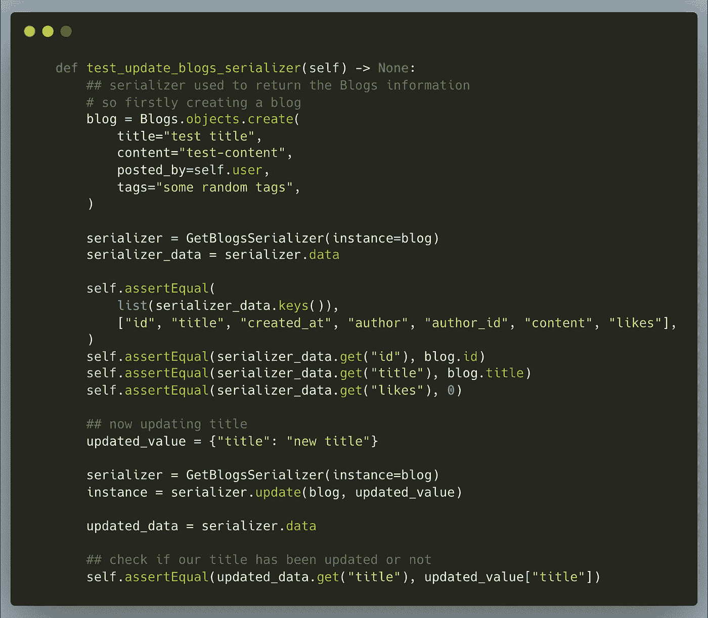

**测试 _ 更新 _ 博客 _ 序列化器**方法

在这里，我们首先创建一个博客数据点，并使用我们的`**serializer GetBlogsSerializer**`获取该博客数据点。现在，我们以我们博客的一些价值观为例；这里我们是`updating the title of the blog`并使用`**serializer.update**`方法调用更新并验证结果。

让我们看看对我们的串行化器的最后一个测试是`**test_like_serializer**`。

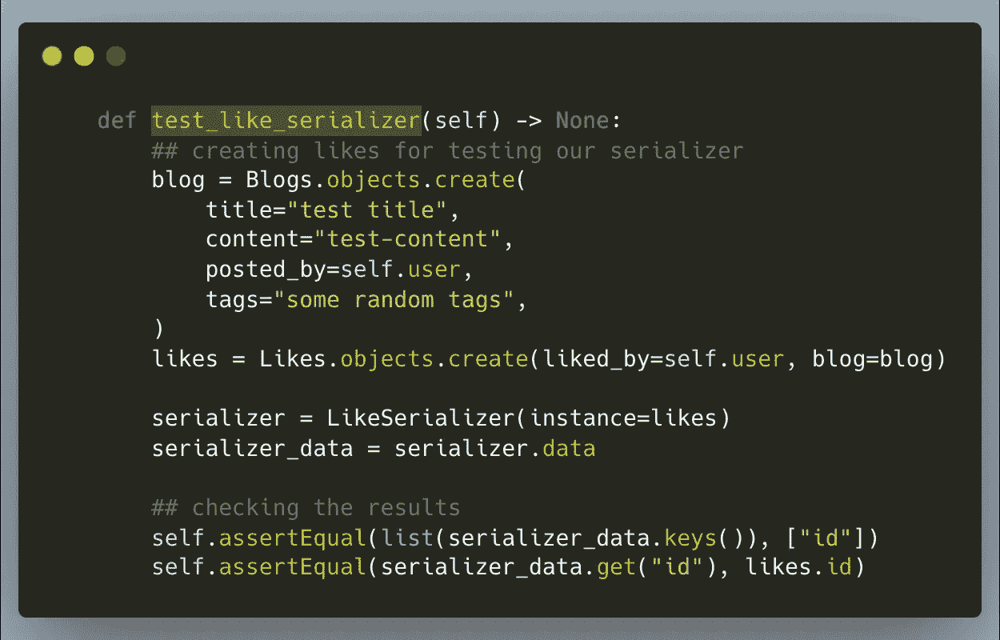

`**test_like_serializer** method`

这里，我们首先创建一个博客数据点，然后创建一个与我们的博客帖子相关联的 like。然后我们使用我们的`**LikeSerializer**`并验证结果。

让我们使用命令再次运行这些测试

`**python manage.py test blogs.tests**`

如果您正确地遵循了上述步骤，那么在运行测试时您将不会得到任何错误。

现在，最后让我们开始为我们的`**views**` **编写测试。**

这里，就像前面的测试类一样，我们创建了一个测试我们的`**views**`的类，并将其命名为`**BlogsTestViews**`。它还包含相同的方法`**setUp**`，我们在其中创建了一个管理员用户。同样，对于这个类，我们的`**setUp**`方法也将包含一个可以从`**django.tests**`导入的`**Client**`类的对象。让我们深入研究一下类方法。

让我们先来看看我们的`**test_get_user_information_view**`方法。

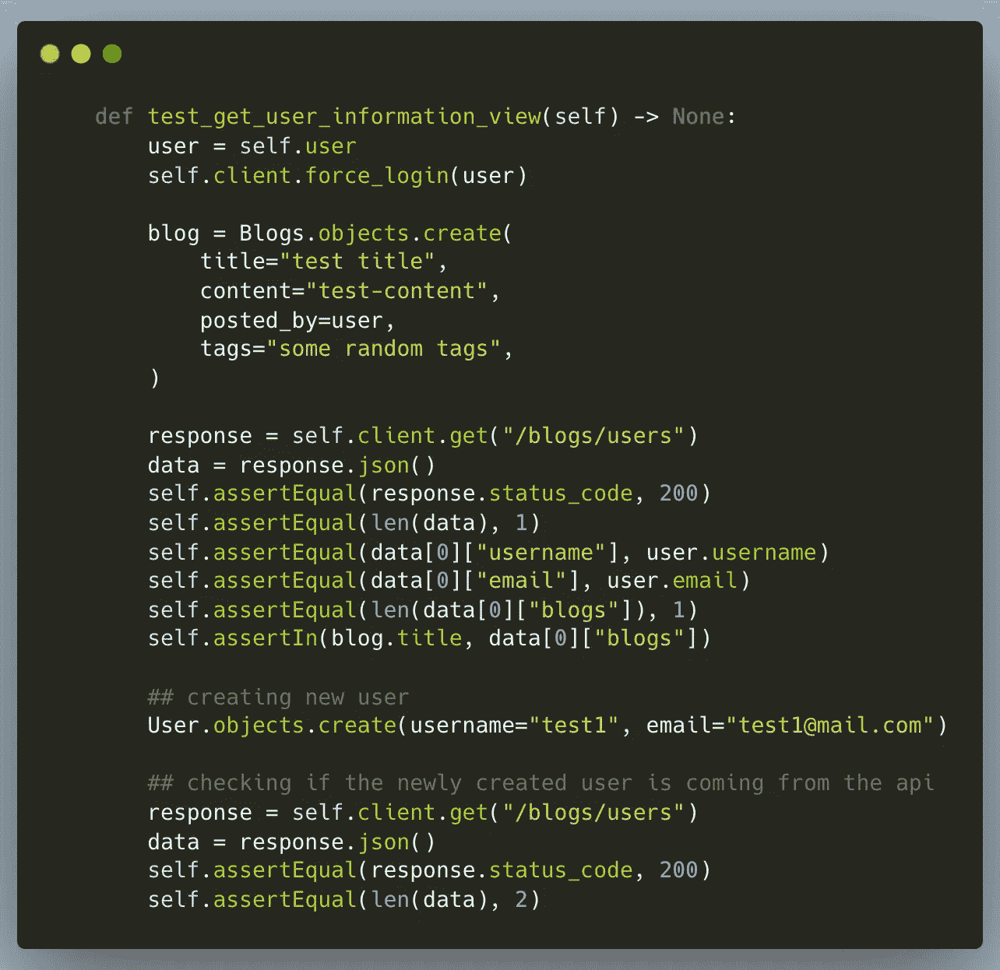

`**test_get_user_information_view** method`

在这里，我们首先`**authenticate**`我们的用户，因为`apis won’t work if the user is not authenticated`。接下来，我们创建了一个博客数据点，然后点击了对端点`**“/blogs/users”**`的`**GET**`请求。我们验证了从 API 得到的所有响应。现在，我们创建另一个用户并再次点击 api，我们现在获得在上一步中验证过的`**2**`用户的数据。

让我们看看我们的其他测试方法，即`**test_blog_list**` **。**

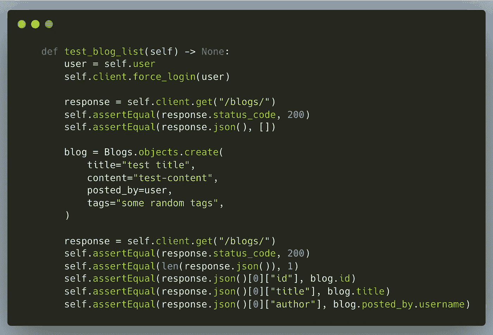

`**test_blog_list** method`

这里，我们再次首先验证我们的用户。用户登录后，我们做的第一件事是点击`**GET**`请求获取所有博客，因为我们没有写任何博客，它只是返回给我们一个`**[]**`。现在，我们创建一个博客数据点，并再次点击 api，我们得到的数据将在后面的步骤中进行验证。

让我们看看我们的其他测试方法是`**test_blog_update**` **。**

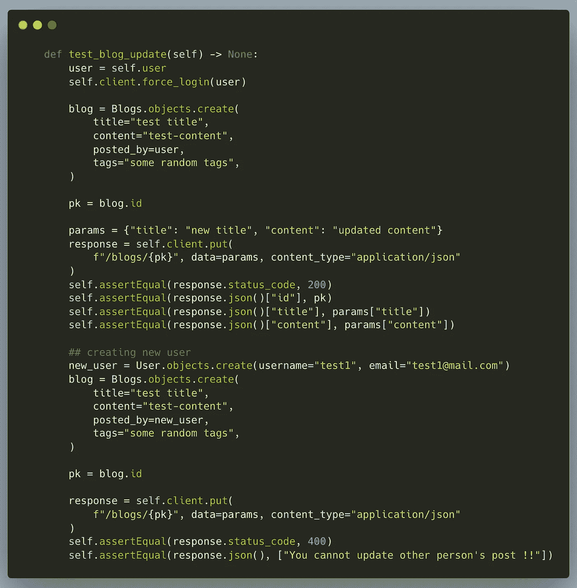

`**test_blog_update** method`

在这里，在认证用户之后，我们首先创建一个与用户相关的博客文章，然后使用 api `**“/blogs/{blogId}”**`的`**PUT**`方法创建`update the title and content for this blog`，我们稍后会验证这个方法。现在，我们测试了我们代码中的一个主要的重要逻辑`**“Not letting any other user to update some other person’s blog”**`，因此我们为这种情况编写了测试，我们也验证了这一点。

让我们看看我们的其他测试方法是`**test_likes_created**` **。**

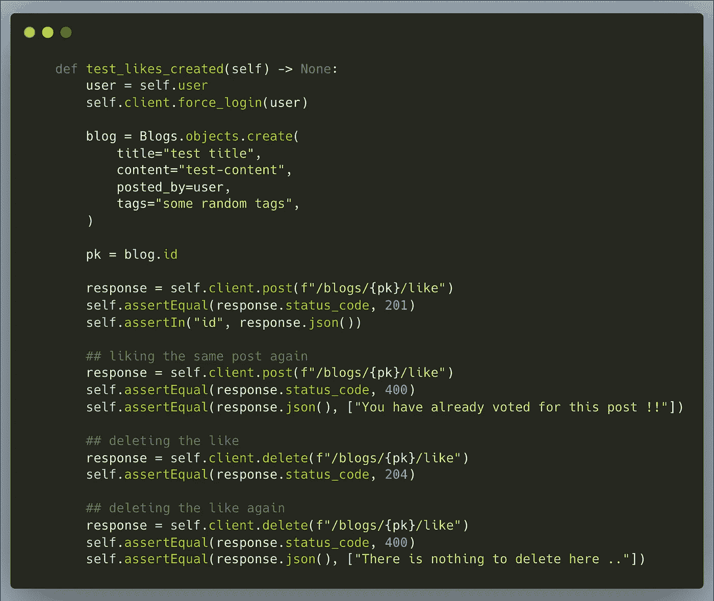

`**test_likes_created** method`

这里，在认证和创建博客文章之后的测试中，我们使用 api `**POST**`方法为使用`**“/blogs/{blogId}/like”**`的博客发送一个`like`。然后，我们检查`liking the same post again`的案例，稍后我们使用定制消息对其进行验证。

同样，我们验证一个类似的`**DELETE**`请求，这意味着`someone who had already liked the blog wants to unlike the blog`。最后我们还解决了`**deleting an already deleted like**`的一个棘手问题。所有的回答都得到了验证。

让我们看看最后的测试方法是`**test_blog_destroy**` **。**

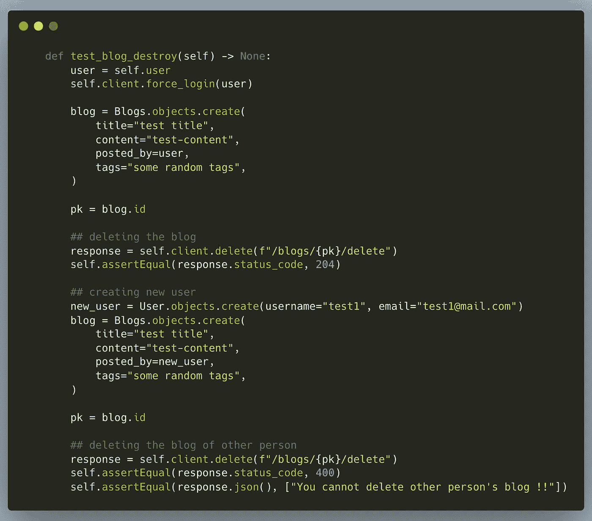

`**test_blog_destroy** method`

这里，在这个测试案例中，在认证用户之后。我们首先创建一个博客数据，然后使用我们的端点`**“/blogs/{blogId}/delete”**`删除这个博客，并通过 api 响应验证这一点。此外，我们还介绍了一个重要的测试用例`**“if the user can delete someone else’s blog or not”**`,我们在后面的测试中对其进行了测试，并通过自定义消息验证了结果。

现在，是时候运行我们所有的测试用例了，看看我们的任何一个用例是否失败。

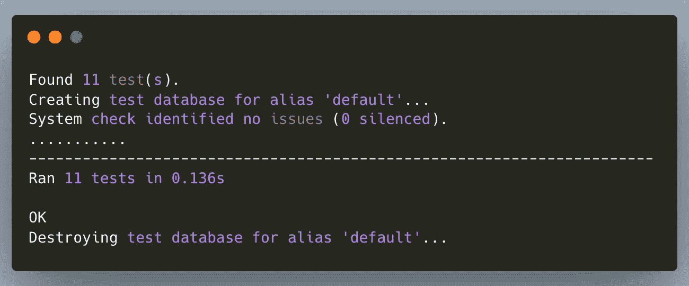

我们开始吧🎉 🎉。我们所有的测试案例都已经通过了✔️

**结论**

到目前为止，我们已经在 django-tests 中介绍了很多内容。我确信你在编写自己的测试时不会遇到太多问题。如果你想要完整的 tests.py 文件，我们在博文中部分讨论过，那么你可以在这里找到它。在用 django 编写测试时，如果有任何问题，请在评论中告诉我。