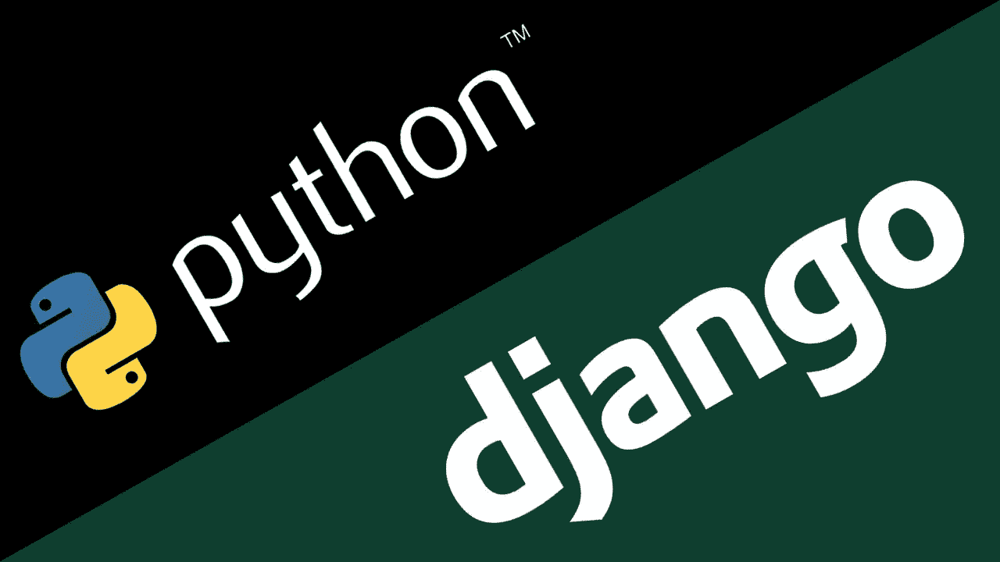
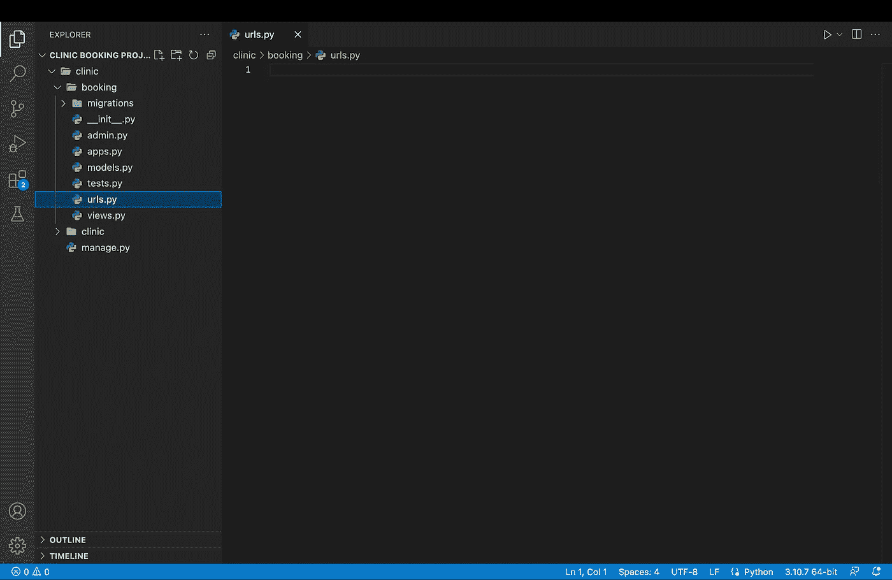

# Django 关于如何为诊所创建预约系统的教程

> 原文：<https://blog.devgenius.io/django-tutorial-on-how-to-create-a-booking-system-for-a-health-clinic-9b1920fc2b78?source=collection_archive---------0----------------------->

在本教程中，我们将使用 Django 和 Python 为诊所创建一个用户友好的预约系统。



> **要求:**

*   在你的电脑上安装 Django 和 Python
*   对 Django 框架有基本的了解
*   熟悉 Django 认证

> **本项目特点:**

*   用户和诊所工作人员的登录/注销/注册
*   用户的 CRUD 功能
*   两步预订流程
*   用户面板
*   员工小组

> 注意:整个项目被上传到一个公共的 GitHub 库中。

[](https://github.com/Johnkh2002/Clinic-Booking-Project.git) [## GitHub-johnkh 2002/诊所-预约-项目

### 此时您不能执行该操作。您已使用另一个标签页或窗口登录。您已在另一个选项卡中注销，或者…

github.com](https://github.com/Johnkh2002/Clinic-Booking-Project.git) 

# 第一步:创建 Django 项目和 Django 应用程序

*   创建一个名为“诊所”的 Django 项目

```
django-admin startproject clinic
```

*   创建一个名为“booking”的 Django 应用程序

```
python3 manage.py startapp booking
```

# 第二步:配置项目 *settings.py* 和 *urls.py* 文件

*   在 clinic/clinic/settings.py 文件中，在“已安装的应用程序”部分添加您的应用程序名称

```
INSTALLED_APPS = ['django.contrib.admin','django.contrib.auth','django.contrib.contenttypes','django.contrib.sessions','django.contrib.messages','django.contrib.staticfiles','booking', #Added Django app name]
```

*   接下来，我们必须在 clinic/clinic/urls.py 中配置 urls.py

```
from django.contrib import adminfrom django.urls import path, includeurlpatterns = [path('admin/', admin.site.urls),path('', include("booking.urls")), #Added]
```

> 注意:确保从 django.urls 导入“include”

# 第三步:在你的预订文件夹中创建一个 urls.py 文件

*   将 urls.py 文件添加到预订文件夹



urls.py 文件位置

# 第四步:在 booking/models.py 中创建一个预约模型

*   在 clinic/booking/models.py 中，我们必须创建一个名为 Appointment 的模型:

models.py 文件

如上所示，在每个约会中，我们收集 5 项数据:

> 1.预订此约会的用户
> 
> 2.诊所提供的选定服务
> 
> 3.约会的选定日期
> 
> 4.约会的选定时间
> 
> 5.用户订购此约会的时间

**不要忘记在 booking/admin.py 文件中添加您的预约模型**

```
from django.contrib import adminfrom .models import * admin.site.register(Appointment)
```

# 第五步:创建基于函数的视图

*   在 clinic/booking/views.py 中，我们将创建一些功能

例如，如果诊所在周一、周三和周六从下午 3 点到晚上 7:30 开放，那么这些将是预订应用程序的功能:

views.py 文件

我们有 12 个函数，我将解释这 12 个函数各自的功能。

1.  **index()** 函数只渲染模板(index.html)
2.  **booking()** 功能是两步预订流程的第一步。首先，它使用 **validWeekday()** 函数获得即将到来的 21 天中接下来的 21 天(星期一、星期三和星期六)，总共是 9 天。然后检查这 9 天中是否有任何一天已满。之后，它在模板中显示日期供用户选择。然后，当用户发布他选择的服务和预约日期时，它获取数据并将其存储在 Django 会话中，然后将用户带到预订过程的下一步。
3.  **bookinSubmit()** 功能是预订流程的第二步。它获取会话数据(服务和日期)，然后使用 **checkTime()** 函数检查所选日期的哪个时间没有被预订。之后，当用户选择他的时间，它得到存储在数据库中。

> 注意:这些 if 语句只是针对任何类型的注入，使用这么多 if 语句并不好！

4. **userPanel()** 函数显示用户的预约，并允许用户编辑其预约。

5. **userUpdate()** 函数从选择的约会中获取 id 参数以进行编辑(更新)，除了 **booking()** 函数之外，它还有一个“delta24”变量，用于确定选择的日期是否比用户使用 **datetime.today()** 函数的日期早 24 小时。

6. **userUpdateSubmit()** 函数就像 **bookingSubmit(** )函数一样保存或者在这种情况下**更新**约会数据。这个函数使用 **checkEditTime()** 函数而不是 **checkTime()** 函数来检查它的时间，并且第 154 行中的 if 语句也发生了变化。这些改变使得用户可以选择他自己选择的时间(他之前预订的时间),以防他只是想改变服务或约会的日期。

7. **staffPanel()** 函数在模板中显示未来 21 天的预订情况。

> 注意:在 staff 模板中使用如下所示的 Django 模板标记，或者在 views.py 中设置限制，以便只有 staff 成员可以访问 staff 页面。

```
<!-- Your HTML Code -->
```

8. **dayToWeekday()** 函数接受一个参数“x”(日)，并将其转换为一个字符串，这样 Django 模板就可以将它显示给用户。

9. **validWeekday()** 函数接受一个参数“days”(您要检查工作日的时间段)，并检查该时间段中的每一天是星期一、星期三还是星期六，然后返回有效日期的“工作日”列表。

10. **isWeekdayValid()** 函数接受一个参数“x ”,并检查来自 **validWeekday()** 的日期列表，看这些日期是否已满。然后返回“有效工作日”列表，这些工作日是星期一、星期三或星期六，并且没有被完全预订。

11. **checkTime()** 函数有两个参数“times”和“day ”,因此它可以检查用户可以预订当天的哪些时间。

12. **checkEditTime()** 函数与 **checkTime()** 完全一样，但是采用了一个附加参数“id”(用户试图编辑的约会的 id)，因此用户正在编辑的约会的时间将显示给用户。

# 第六步:在 urls.py 文件中添加 URL

*   在 booking/urls.py 文件(我们在第三步中创建的)中添加这些 URL:

urls.py 文件

# 您可以查看我的 Github 资源库中的模板

模板使用引导框架。如果您不熟悉引导检查:

[](https://getbootstrap.com/docs/5.2/getting-started/introduction/) [## Bootstrap 入门

### 从通过 CDN 包含 Bootstrap 的生产就绪 CSS 和 JavaScript 开始，无需任何构建步骤…

getbootstrap.com](https://getbootstrap.com/docs/5.2/getting-started/introduction/) 

*   此外，我还添加了一个会员应用程序，供用户登录/注销/注册，这是我使用这个 youtube 视频创建的:

> 我的 YouTube 视频解释了这个预订系统:

# **总结**

我们使用基于功能的视图，分六个步骤构建了一个 Django 预订项目。

记住还有其他方法来实现这个项目，这是其中之一。

您还可以为员工实现 CRUD 功能。