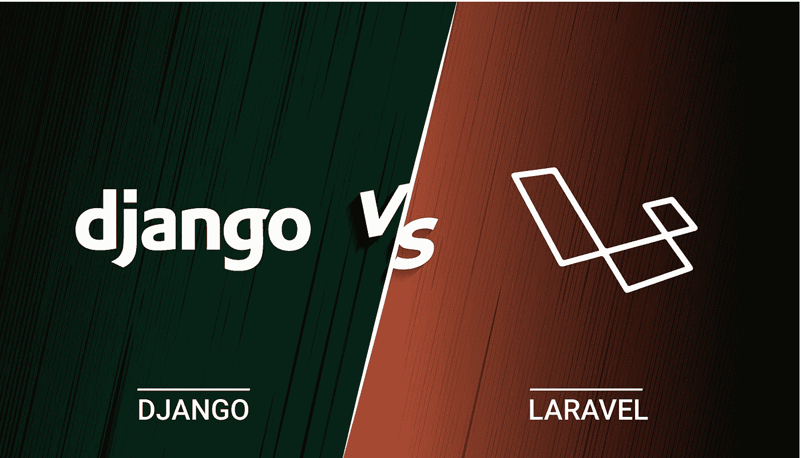
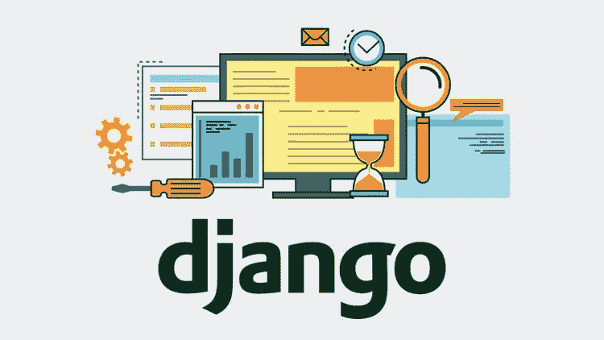
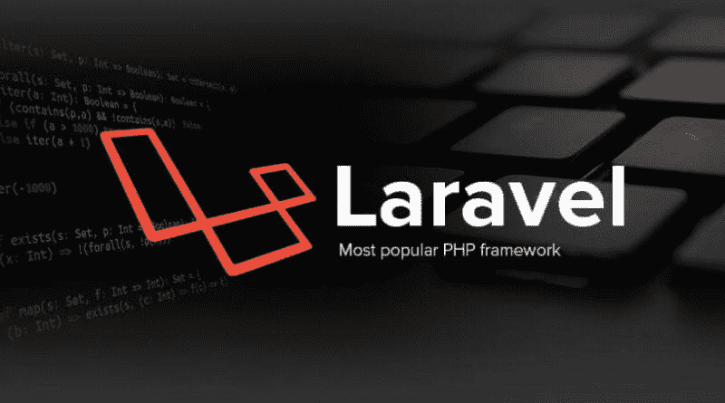
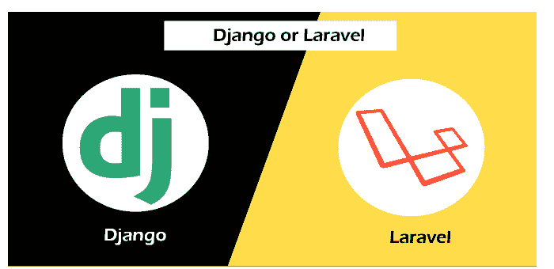
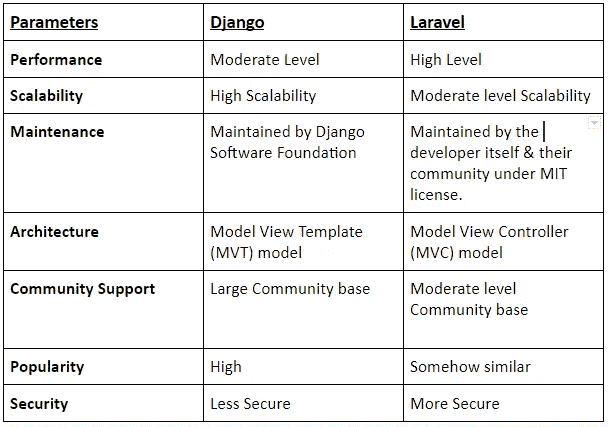

# Django vs Laravel:最好的网络开发框架之战

> 原文：<https://blog.devgenius.io/django-vs-laravel-a-great-battle-of-the-best-web-development-frameworks-292eec0055ec?source=collection_archive---------1----------------------->

图像来源:虚拟网

在 2021-22 年，为下一个 web 开发项目选择 apt 框架可能是一个棘手的决定。有这么多的选择，每一个都有自己的优点和缺点。但是哪一个是最好的选择呢？

好吧，现在，姜戈和拉沃尔都是世界上著名的最好的网络开发框架。但是，如果我谈论的是姜戈队对拉韦尔队的精彩比赛，要说出一个名字是相当困难的。

我们都知道，没有什么是不可能的，因为“不可能”的世界自我定义，如果打破了“我是可能的”。因此，在这里，我们也将让不可能的工作成为可能，建议你在拉韦勒对姜戈中选择一个名字。为此，我们比较了两种 web 框架。

所以让我们开始战斗，并知道在姜戈对拉韦勒的比赛中哪个最合适。

# 关于姜戈

图像来源:[codersdad](https://www.codersdaddy.com/)

Django 是一个用 Python 编程语言编写的免费开源 web 应用程序开发框架。它是由阿德里安·霍洛瓦蒂和西蒙·威廉森于 2003 年开发的。Django 是一个遵循模型-视图-架构控制器模式的高级 web 开发框架，这使得将业务逻辑与网页或视图完全分离成为可能。

此外，它有许多像快速开发这样的特性，而且它通过设计是安全的，这使得它非常适合于企业级项目或产品来帮助制作快速原型，并且易于测试。如果您正在寻找 **Python 软件开发**，姜戈将是您的最佳选择。

- Django 配有 **59.5K GitHub 星**和 **25.4K GitHub 叉**。

- **2353 组织**据报道**在其技术堆栈中使用 Django** ，即 **Instagram、Pinterest 和 Udemy** 。

# 关于拉威尔

图像来源:技术:受技术启发

Laravel 是一个免费的开源 PHP 网络框架。它最初是由泰勒·奥特韦尔制作的，从概念上来说，它是 Ruby on Rails 的 Laravel 版本，这使得 MVC 开发变得很容易。它受欢迎的主要原因是它提供了现成的功能，如身份验证系统、路由系统、模板引擎等。

Laravel 还以其高质量的内置文档和简单的路由结构而闻名，这使得它比其他框架更容易学习。此外，要使用 Laravel 构建一流的项目，您还可以与顶级且经验丰富的 **Laravel 开发公司** (ValueCoders)取得联系。

-带 **66.5K** GitHub 星形和 **21.4K** GitHub 叉形的拉刀

- **3152** 企业在他们的科技栈中使用 **Laravel** ，即 **Kmong、** **Bitpanda、**和 **9GAG** 。

# Django 和 Laravel 的相似之处

Django vs. Laravel 都有能力使用各种各样的框架进行模板化，这使得定制更加容易。它们是开源软件，背后有庞大的社区支持，因此可以很容易地用于每个 web 应用程序开发项目。它们都易于安装、使用，并提供完整的文档，这对初学者来说更容易。

Laravel 和 Django 跨平台开发框架可以在 Windows、Linux、Unix 等各种操作系统上使用。，以及其他 web 服务器，如 NGINX 或 Apache。

# Django 和 Laravel 之间的差异

Laravel 主要专注于使用 MVC 架构创建 web 应用程序，而 Django 是一个全栈框架，包含许多构建复杂网站的工具。因此，这可以说是这两个框架的一个优势，因为你将在一个框架中获得所有的功能，但唯一的缺点是你需要学习所有的功能。

Django 有一个单一的框架，但是在 Laravel 中，你会得到许多框架，这意味着初学者要花更多的时间去理解其他功能的代码，而不是专注于一个。此外，Laravel 还提供了各种有用的库和包，而在 Django 中却找不到这么多。在 Laravel 中，提供了多种身份验证方法来对用户进行身份验证，这与 Django 不同，Django 有自己的内置身份验证系统，不能轻松定制或根本不能定制。

Laravel 遵循模型视图控制器(MVC)架构，但另一方面，Django 实现了模型模板视图(MTV)架构。所以可以说 Laravel 对开发者来说是好的，因为他们很容易理解代码，但是在 Django 中，你不会发现这样的问题，因为它使用 MTV 架构，因此一旦你知道了 Django 的所有特性，开发就变得容易了。

# Django vs Laravel:哪个最好？

图片来源:Javatpoint

在这里，我对各种参数进行了比较，这将有助于你比较这些 web 框架，并相应地[雇佣印度的 PHP 开发人员](https://www.codersdaddy.com/hire-developer-engineer-programmer/php-web)或 django 开发人员。此外，通过比较这些因素，您将能够找到并选择最适合您的 web 应用程序开发的因素。

*   **性能**

Django 是一个非常受欢迎和最著名的 web 框架，但有时它会落后于其他框架，比如 Laravel。众所周知，任何 web 应用程序或网站的性能都是第一位的，只有用户满意度才是最重要的。因此，在 Django 和 Laravel 之间进行了许多基准测试和比较，结果显示 Django 在性能上落后于 Laravel。

明显的赢家:**拉勒维尔**

*   **维修**

Django 是一个非常稳定的框架，已经被许多公司用于生产就绪的应用程序。此外，与 Laravel 相比，它的社区支持是巨大的。如果您希望您的 web 应用程序在所有最新的更新中都没有 bug，那么 Django 将是最好的选择，因为每当有新的 Python 版本时，它都会自动更新。

明显的赢家:**姜戈**

*   **可扩展性**

Django 的可伸缩性比 Laravel 好得多，因为它使用传统的 MVC 模式，这使得伸缩成为一个简单的过程。然而，要使用 Laravel 实现这种轻松，您将需要大量定制代码和额外的编程技能。

明显的赢家:**姜戈**

*   **数据库支持**

Django 比 Laravel 支持更多的数据库，并且有大量的社区支持来帮助解决各种数据库相关的问题。如果您希望您的 web 应用程序完美且没有错误，Django 总是这个特性的最佳选择。然而，您仍然可以在 Laravel 中使用任何最流行的工具，但是您需要进行自己的定制。

明显的赢家:**姜戈**

*   **社区支持**

Django 在所有其他框架中拥有最活跃的社区支持，像 Django 受益于 Google 的丰富资源，并提供了大量的教程和文档，使初学者更容易开始使用这个框架。

相反，Laravel 有非常小但活跃的社区支持。因此，如果您选择 Laravel 框架，您将很难找到一些信息或文档，尽管互联网上有一些教程展示了如何在使用 Django 的 web 应用程序开发过程中使用 Laravel 框架。

明显的赢家:**姜戈**

*   **数据库迁移**

两个最著名和最受欢迎的框架，如 Django vs Laravel，这两个 web 开发框架都提供了数据库迁移的工具来执行各种活动，如在现有的数据库中添加新的字段或表。区别在于 Django 框架自动处理这项任务，而 Laravel 默认不支持，所以您需要运行一个定制的命令行工具来手动执行任何更改。

明显的赢家:**姜戈**

*   **人气**

Django 比 Laravel 更受欢迎，但这并不意味着你找不到任何 Laravel 开发者。有许多专家和有经验的 Django 开发人员也非常了解 Laravel 框架。所以这个因素不会影响你在幼虫和姜戈中选择一个的决定；相反，我们建议您选择符合您要求的产品。

明显的赢家:**姜戈**

*   **安全**

Laravel framework 附带了一个开箱即用的安全层，可以提高 web 应用程序的整体性能，并提供针对大多数常见攻击的全面保护。由于是其核心的一部分，这个特性使得 Laravel 比 Django 更安全。但是也有一些第三方包可以保护 Django 的应用程序。

明显的赢家:**拉勒维尔**

*   **代码**

Django 是一个成熟的框架，而 Laravel 只是 MVC 结构。这意味着您需要使用第三方包或编写代码来执行 Django 中的各种任务，而这项任务可以在 Laravel 中的一些内置命令的帮助下执行，这比 Djangos 代码管理过程更容易。

明显的赢家:**拉勒维尔**

*   **操作**

Django 框架更加灵活，它提供了广泛的内置命令来执行各种活动。Django ORM(对象关系映射)将数据库中的数据转换为对象，这使得程序员更容易对这些对象执行一些操作，而无需像在 Laravel 中那样手动编写任何代码。

明显的赢家:**姜戈**

*   **API**

Laravel 提供完整的 RESTful API 支持，因此您可以创建自己的 API，并在 web 框架之上构建应用程序。但是万一如果使用 Django，那么要添加这个特性，就需要手动编写一些代码或者购买第三方的包，这些包的成本会比使用 Laravel 内置特性来创建 API 要高。

明显的赢家:**拉勒维尔**

# Laravel vs Django:两种 Web 开发框架的比较表

下面提到的对比表会给你展示拉勒韦尔 vs Django 的整体对比。此外，看到表格，你将最终能够决定是**雇佣 Laravel 开发者**还是**雇佣 Python 开发者** (Django)进行 web 开发。

我们都知道“每枚硬币都有两面”这句话，即使在 Django 诉 Laravel 一案中也是如此。因此，如果你想让你的 web 应用程序或 Python 应用程序开发过程在可伸缩性、性能、对许多数据库的支持等方面没有错误。，那就选 Django。

如果你想用 Vue.js，Angular 等新技术制作你的 web 应用。Laravel 是您的最佳选择，即使它在性能和数据库支持方面落后于 Django。

# 包扎

Django 和 Laravel 都是优秀的 web 开发框架，但是他们有不同的长处。你可以使用任何一个框架来创建一个成功的网站或应用程序。如果您不确定哪一个最适合您的需求，我们建议您根据对您最重要的因素进行比较。

再者，如果你在 Django vs Laravel 中选了一个，那么别忘了 [**雇佣** **Python 开发者**](https://www.valuecoders.com/hire-developers/hire-python-developers?utm_source=Ang_N12&utm_medium=medium&utm_id=laravelvsdjango) 或者从最好的 Python 中雇佣 [**Laravel 开发者**](https://www.valuecoders.com/hire-developers/hire-laravel-developers) 或者 [**Laravel 开发公司**](https://www.valuecoders.com/top-laravel-development-services-company-india?utm_source=Ang_N12&utm_medium=medium&utm_id=laravelvsdjango) **(估值师)**。通过这样做，您将能够有效地利用所选框架的所有特性和功能，最终帮助您为您的业务需求构建一个有影响力的 web 应用程序。