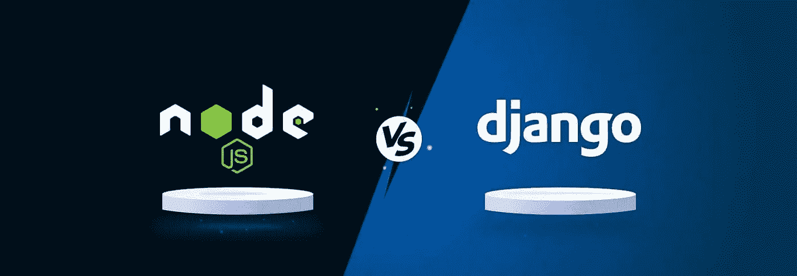
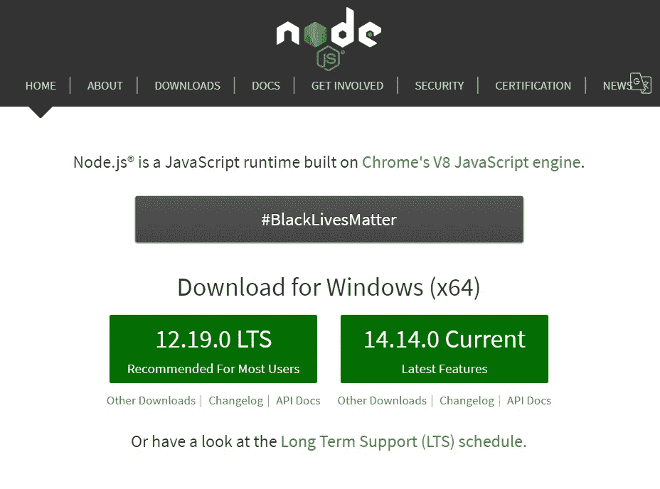
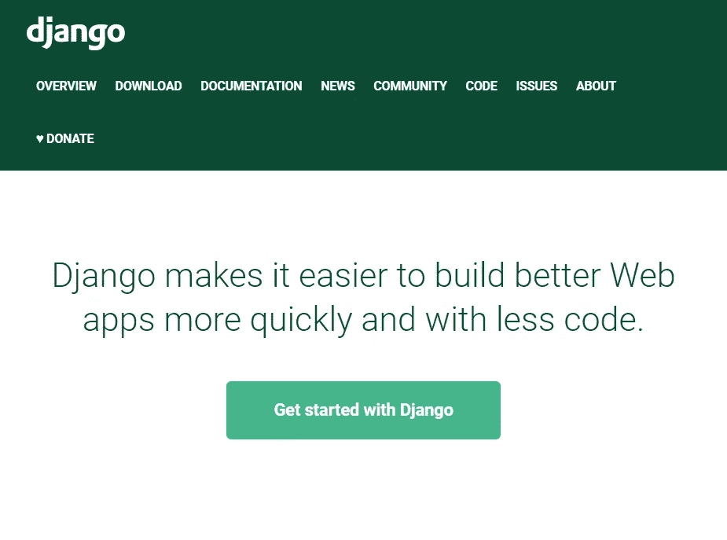
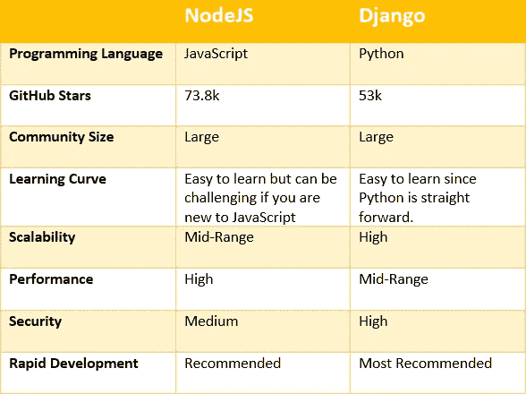

# Django vs Node.js:哪个更适合 Web 开发？

> 原文：<https://blog.devgenius.io/django-vs-node-js-which-one-is-better-for-web-development-58b4c66c6dee?source=collection_archive---------0----------------------->

接下来该学什么？如果你是一个开发者，这个问题应该一直在你的脑海里。每天都有新技术推出，现有技术也在不断改进。既然这些技术我们都学不会，那么决定下一步该学什么真的很重要。

在这篇文章中，我将讨论基于两种不同编程语言的两个后端开发框架，让您了解 2021 年应该学习什么。

Django 和 Node 的主要区别。js 是 Django 是一个鼓励快速开发的高级 Python web 框架，方便 web 开发者及时快捷地开发应用。节点。另一方面，js 基于 JavaScript，用于客户端 web 应用程序。

# 节点. js

NodeJS 是一个 JavaScript 运行时环境框架，可用于跨平台开发。由于 JavaScript 是当前上下文中最流行的语言之一，这种流行也使 NodeJS 成为最常用的后端框架之一。除此之外，NodeJS 带来了许多吸引开发者的重要特性。

*   NodeJS 从不等待 API 返回数据，因为它是异步的。NodeJS 将继续下一个 API 请求，而不等待上一个请求的响应，NodeJS 的事件通知机制负责将响应正确地传递给服务器。因此，NodeJS 被称为**异步**和**事件驱动。**
*   快速代码执行。
*   没有缓冲。
*   虽然 NodeJS 是单线程的，但是高可伸缩性使它能够处理大量的请求。

NodeJS 被世界上一些著名的公司使用，包括易贝，通用电气，GoDaddy，微软，PayPal，优步，维基百科。如果您正在构建 I/O 绑定的应用程序、数据流应用程序、数据密集型实时应用程序(DIRT)、基于 JSON APIs 的应用程序或单页面应用程序，Node JS 是一个完美的匹配。

## 优势

*   基于大家都很熟悉的 JavaScript。
*   轻松的学习曲线和大社区。
*   包含一个优秀的包管理器。
*   图书馆支持。
*   快速轻松地处理并发请求。
*   简单且可扩展。
*   公认的。

## 不足之处

*   一些开发人员可能很难处理异步请求。
*   嵌套回调。

# 姜戈

Django 是一个用 Python 编写的开源、高级 web 应用程序框架。Django 于 2005 年推出，其使用 Python 进行 web 开发的想法是一场巨大的革命。Django 遵循模型-模板-视图架构，这个框架的主要焦点是为复杂网站的开发提供一个简单的方法。Instagram、Mozilla、Bitbucket 是一些使用 Django 作为框架的领先公司。

## 优势

*   快速发展。Django 的主要意图之一是减少应用程序的开发时间。
*   Django 有助于避免许多常见的安全漏洞，如 SQL 注入、跨站脚本、跨站请求伪造等。
*   可扩展性。
*   支持大量的库和帮助模块。
*   您不必太担心用户认证和内容管理，因为 Django 会为您处理它们。

## 不足之处

*   与 JavaScript 相比，许多开发人员不具备 Python 方面的专业知识。
*   虽然 Django 是可伸缩的，但是小规模的应用程序可能会有问题。
*   整体框架。
*   Django 不能同时处理多个请求。

# NodeJs vs Django

正如您所看到的，这两个框架在开发人员中非常受欢迎，大多数时候他们倾向于根据自己喜欢的语言来选择框架。例如，如果你擅长 JavaScript，你肯定会选择 NodeJS。但是在选择框架时，我们还应该考虑其他方面。

如果你是一个开发新手，不了解 JavaScript、Python 或 PHP，那么 Django 或 Python 将是一个不错的选择。因为 Python 的语法非常直接和简单，所以你很容易理解它。所以，当谈到学习曲线时，我会把 Django 排在第一位，而 NodeJS 排在第二位。

安全性是我们在任何项目中都需要解决的另一个衡量标准，所有这些框架都提供了内置特性，使开发人员的工作变得更加轻松。在这两者中，姜戈也是第一名。

如果我们谈论可伸缩性和性能，Django 可以被认为是可伸缩性方面最好的框架，而 NodeJS 提供了最好的性能。

所有这些框架都有很大的社区和很好的文档可以开始使用，并且已经很好地建立了。因此，不要犹豫，为您的项目选择它们。

# 结论

Django 和 Node.js 都是优秀而强大的技术，有很多潜在的用例。要选择最适合您的，请确定项目的优先级，并…

*   选择 Django 进行快速、可扩展的 MVP 开发、具有多种功能的复杂应用程序和严密的安全性。选择 Django，如果你在金融科技行业。
*   选择 Node.js 创建 API、需要很高带宽的服务以及创建微服务。
*   对于电子商务项目，考虑使用开源电子商务平台，你可以在这里和这里阅读我们的详细指南。