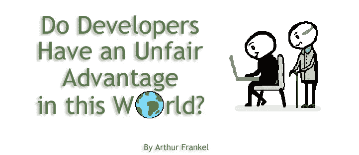

# 开发者在这个世界上有不公平的优势吗？

> 原文：<https://blog.devgenius.io/do-developers-have-an-unfair-advantage-in-this-world-8e7065147819?source=collection_archive---------4----------------------->

除非你在过去的几个月里一直生活在岩石下，否则我肯定你已经以某种身份参与了获取新冠肺炎疫苗的活动，无论是为你自己还是为你认识的人。我的母亲和我的岳父已经 80 多岁了，从疫情开始，我和我的妻子就一直为他们担心。当新冠肺炎疫苗被批准使用时，我们和世界其他国家当然都松了一口气。不幸的是，我们在美国和世界各地的其他人都目睹了一个非常缓慢、令人沮丧、有时甚至不存在的疫苗供应和分发过程。在美国，疫苗分发基本上被控制在州一级，形成了似乎无穷无尽的资格标准、分发和实施方法。我不认为我是唯一一个觉得我需要对自己和家人的健康负责的人，包括非常积极主动地预约疫苗接种。最近，这个探索占据了我大量的时间和精力。

许多疫苗接种预约是通过在线预约系统提供的。虽然这在理论上是有效的，但我质疑这种方法对于有资格接种疫苗的第一级人群，即 65 岁及以上的人的有效性和逻辑性。一般来说，这些人并不是最懂技术的，这个年龄段的许多人有时在最简单的网上购物方面都需要帮助(想想帮助你的父母或祖父母进行网上购物，进行网上银行交易，甚至在社交媒体上发帖)。

这让我进退两难。作为开发人员，我们知道系统是如何构建的，特别是如何在基于 web 和移动的系统中实现排队机制。凭借我们在浏览器中访问公共可用代码的知识和其他因素，例如使用多个 IP 地址来增加成功的机会，有时只是在网站上更快地回答问题和提交所需信息，我们应该利用我们的才能来帮助家人和朋友获得疫苗接种预约吗？我们使用额外的开发工具和代码对我们有利吗，即使是出于重要的公共健康原因？这公平吗？这合乎道德吗？

回到我母亲和我岳父的疫苗探索，他们都住在不同的地方，以下是我所做的。我母亲的成人社区宣布，他们将在 1 月初提供疫苗。他们会通过电子邮件安排预约，并根据你的回复顺序，那些回复快的人将首先获得预约；基本上，先到先得，直到预约满了，供应耗尽。现在，我知道该社区很可能能够为所有 65 岁及以上的自愿成员接种疫苗，但鉴于我想确保她尽快接种疫苗，以防供应耗尽，我进行了干预，并在她的允许下，接管了我母亲的电子邮件帐户。现在，不管我是不是开发人员，在这种情况下，能够快速处理电子邮件是至关重要的。我耐心地等待着，看着她的电子邮件，然后突然我等待的电子邮件来了，我立即回复，让她在队列中靠前。我一定是第一个做出反应的人，因为她是她所在社区第一批接种疫苗的人。这是在欺骗系统吗？

现在，我的岳父。作为朝鲜战争的退伍军人，他在美国退伍军人事务部的疫苗接种名单上，但他们没有给他打电话。然而，在他家附近的一个县，一个与退伍军人管理局无关的当地公共卫生部门宣布，它将很快向 65 岁以上的人提供疫苗。它的网站上写着“现在没有疫苗，但经常回来检查。”作为一名开发人员，我立即想到“我可以建立一些程序，每分钟检查网站，检查变化并通知我。”在我开始进一步思考之前，网站碰巧在我手动刷新时发生了变化，我正要去为我的岳父安排一次疫苗预约。碰巧的是，他当地的退伍军人诊所为他安排了一个更直接的预约。

在另一个案例中，我了解到我的一个 65 岁以上的老邻居搬到了另一个州，在预约疫苗接种时遇到了麻烦。我主动提供帮助。我的邻居不是傻瓜。他是一名退休的火箭科学家，但我知道作为一名开发人员，我有一个优势，那就是了解他正在使用的预约安排系统。一家地区超市药房宣布，他们将很快安排疫苗预约，并要求所有有资格和兴趣的人在某个特定的早晨 6 点查看网站。作为一名开发人员，我知道在那个特定的日子之前检查网站，并通过谷歌 Chrome Inspector 查看我能看到的任何代码。我试图在脑子里列出所有能给我朋友带来优势的方法。这些包括前一天晚上点击页面和执行自动刷新。也许该网站正在使用队列中的第一个，但队列在早上 6 点之前就开始了？我还考虑了会话 id、多标签和多浏览器。我考虑了不同的浏览器(Chrome、Safari 等。).我考虑了多个 IP 地址、多种设备、无线网络和虚拟专用网。所有这些都在我的脑海中闪过，我研究了我能看到的代码，我决定要有最多的机会，就要(显然)有最多的人尝试他，但也要有尽可能多的设备，每个设备都有不同的 IP 地址。在某一天，清晨的开始时间到了(对我来说太早了！)，经过两天的努力，我们终于帮他约到了时间。

"*我们使用额外的开发工具和代码对我们有利吗，即使是出于重要的公共健康原因？*

有了这些经历后，我继续为其他年长的家庭成员寻找约会，并继续思考我应该在多大程度上把事情掌握在自己手中。作为一名开发人员，我脑子里有太多的想法来提高预约的成功率。有了丰富的工具箱，任何有适当技能的人都可以做以下事情:以自动方式检查网站更新，因为许多网站显示类似的信息，即当疫苗可用时，网站将显示不同的内容；考虑使用 Selenium 脚本来帮助运行一系列步骤的全自动化，这肯定比人手更快，并且还可以检查特定的最终结果；使用任意数量的云函数(例如 Lambda)来帮助这些过程，肯定会带来优势。但是在这种情况下，什么是合乎道德的呢？

科学告诉我们，随着越来越多的人接种疫苗，我们就越接近群体免疫；也就是说，任何接种疫苗的人都是在帮助我们所有人。尽管有这样的想法，我上面描述的情况还是让我做了很多思考。虽然我帮助的每个人都符合资格标准，但我是否给了我的家人和朋友不公平的优势？很可能是我的帮助让他们在自己能得到一个约会(甚至根本得不到)之前就得到一个约会。我读到过许多其他精通技术的开发人员做类似的事情来帮助他们认识的人获得约会。当然，有这么多的人没有软件开发人员在他们身边帮助处理这种事情，这让我们回到了最初的问题:这公平吗？当我继续努力解决这个问题时，我很想知道你的想法。

点击这里订阅更多类似的精彩文章。