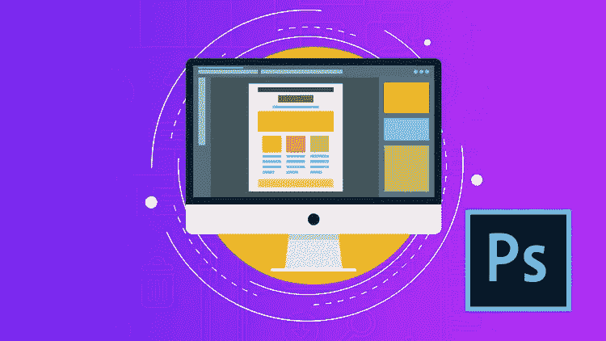

# 网页开发人员需要学习 Photoshop 吗？

> 原文：<https://blog.devgenius.io/do-web-developers-need-to-learn-photoshop-f9c71d86d868?source=collection_archive---------9----------------------->

网页设计中的 Photoshop

今天，我将回答一个简单的问题，我认为每个 web 开发人员特别是前端专家都问过自己这个问题。问题很简单:

“Web 开发人员(尤其是前端开发人员)是否需要掌握扎实的 photoshop 知识，才能制作出吸引用户注意力、让用户体验更好的出色 ui？”。

这个问题的简短答案是，掌握 photoshop 的知识并不是必需的或重要的，你仍然可以做出奇妙而复杂的用户界面，而不必了解任何 Photoshop 或任何其他图形设计工具，如 Illustrator 或任何类似的东西，甚至任何网页设计软件。

但是，事实上，在真正开始建设网站之前知道如何设计网站会让你的工作越来越容易，因为它让你越来越了解你的用户界面，它允许你预览你的用户界面，并修复任何看起来奇怪的东西，这将节省你大量的时间和精力。当然，知道如何做一个网站 UI 设计会影响你的工作质量，特别是如果你愿意用一些疯狂的东西来制作复杂的 UI，以增强用户体验。

此外，我建议你学习一个专门为 web 开发人员设计 ui 的软件，如 Sketch、Figma 或 Adobe XD，我目前正在使用 Figma，它是一个很好的工具，可以满足我作为 web 开发人员的所有需求，而且它很容易使用和学习。

此外，重要的是要提到，对于 web 开发人员来说，拥有一些不错的图形设计技能是一种软技能，我们应该知道，作为一个 web 开发人员，你所拥有的任何软技能，如了解一些 SEO 或一些 Wordpress，都将使你与其他开发人员区分开来，并使你在与其他开发人员的竞争中获胜。

最后，希望这篇短文赢得您的赞赏，感谢您的关注。