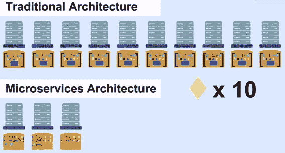

# 你了解微服务吗？

> 原文：<https://blog.devgenius.io/do-you-know-about-microservices-9744e838d2f4?source=collection_archive---------13----------------------->

## 微服务入门

*   [什么是微服务架构？](https://medium.com/p/9744e838d2f4#062d)
*   [我们为什么要使用微服务？](https://medium.com/p/9744e838d2f4#081f)
*   [微服务有哪些弊端？](https://medium.com/p/9744e838d2f4#7a17)
*   [未来会怎样？](https://medium.com/p/9744e838d2f4#8612)

## 什么是微服务架构？

> **“把那些因同一原因而变化的东西集合在一起，把那些因不同原因而变化的东西分开。”**
> 
> **——罗伯特·马丁的单一责任原则—**

微服务架构是一种设计软件的特定方法，在这种方法中，我们将单个应用程序视为松散耦合的服务的集合。它遵循与单一责任原则相同的方法。

在传统架构中，它将所有功能构建到单个应用程序中，单个数据库添加新功能会引入紧密耦合的依赖关系。因为应用程序是作为单个包来管理的。但是，当一些应用程序被分解成许多可以一起工作的小部分时，它们更容易构建和维护。因为有时不能理解完整的系统，因为它们很复杂。在这种情况下，我们使用微服务。

在微服务架构中，每个功能都是独立内置的，并且独立于所有其他功能。HTTP REST 或消息总线用于允许这些服务彼此异步通信。

微服务似乎正以越来越快的速度在行业中获得牵引力。这种类型的服务在建筑中越来越受欢迎。因为微服务架构是独立自主运行的小服务的集合，所以在更改单个服务时，没有必要修改基础架构的其余部分。这种类型的服务使我们能够拥有更灵活、适应性更强的 IT 基础设施。许多人认为它们是 IT 架构的未来，是商业公司数字化转型的基本组成部分。

微服务架构的特征是:

*   每个服务运行其流程
*   每个服务都有一个单独的数据库层
*   每个服务可以有一个独立的代码库
*   每个服务都可以单独测试
*   每个军种都可以选择最好的技术
*   每个服务可以实现独立的安全机制
*   不要共享库或 SDK

> 微服务之所以重要，仅仅是因为它们以简化系统复杂性的方式增加了独特的价值。通过将您的系统或应用程序分解成许多更小的部分，您展示了减少重复、增加内聚力和降低部分之间耦合的方法，从而使您的整个系统部分更容易理解、更具可伸缩性和更容易更改。

**——《微服务》的作者卢卡斯·克劳斯——**

## 我们为什么使用微服务？

以下是使用微服务的一些优势。

*   传统架构创建了大型整体式包，部署起来很困难。配置可能很难管理。但是在微服务中，微服务是小型的、隔离的、打包的、彼此独立部署的。这使得配置更容易管理。所以我们可以经常部署它。
*   如果应用程序变得流行，它会增加计算和存储容量的负载。传统架构通常通过增加硬件来扩展应用。如果搜索功能负载高达 10 倍，那么它会将服务器提升 10 倍。但是在微服务中，只增加需要节省资源的服务实例。搜索功能的 10 个实例跨多台服务器进行负载平衡。

*   微服务架构提供更强的弹性。因为每个功能都是独立设计的，以便在其他服务失败时处理事件。
*   最少的工作团队、可扩展性、模块化功能、独立模块以及开发人员独立开发和部署服务的自由是我们通过使用微服务架构获得的一些其他优势。

## 微服务有哪些弊端？

虽然使用微服务架构有更多的优势，但也有一些缺点。

*   有时，新手用户会努力确定每个微服务的大小、微服务之间的最佳边界和连接点，以及集成服务的正确框架。
*   微服务架构永远不是最好的解决方案。有时它可能比要求的要复杂得多。
*   微服务使用它们的 CPU 在它们的环境中运行，它们处理 API 调用，不仅如此，在使用微服务架构时需要更多的劳动力。因为这些原因，微服务比较贵。
*   由于微服务会通过不同的环境存在于不同的运行机器上，具有不同的 API 调用，因此具有较大的安全风险。
*   高内存使用率、管理大量服务的复杂性以及复杂的测试是微服务架构的一些其他缺点。

## 未来会怎样？

**M** 微服务的采用如此广泛，以至于 86%的开发人员预计它将成为未来五年的默认应用架构。多微服务、无服务器架构、功能即服务、多云环境是微服务未来的一些预测。

连接多个微服务的集成层在微服务的未来会更加重要。微软之前已经尝试过通过连接各种 API 和服务来构建应用的想法。用于快速构建和部署微服务的更好的工具将消除大量初始投资的需要。跨多个云环境使用微服务，利用其独特的功能，是未来时代令人兴奋的发展之一。

微服务的未来包括快速减少开发人员和运营人员之间的摩擦，以及从任何地方和任何人一起构建微服务的能力。

## 最后…

微服务作为一种在各行各业开发应用程序的首选方法，正迅速受到欢迎。预测未来的增长，一些品牌如亚马逊、可口可乐、网飞、Spotify 和沃尔玛决定使用微服务来处理复杂性。创新型公司会利用微服务和颠覆性技术，尽可能缩短和精简产品周期。

然而，设计不佳的微服务方法可能会导致“微服务蔓延”，即微服务的数量在没有集中控制和纪律的情况下呈指数级增长，从而导致复杂、难以管理的 IT 环境，并降低而不是增加重用。

即便如此，仍有许多新的发展值得期待。让我们看看微服务如何在未来继续大有作为。

*快乐学习！*