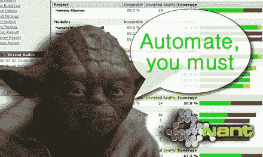

# 你知道处理数据的黄金法则吗？

> 原文：<https://blog.devgenius.io/do-you-know-the-golden-rules-while-working-with-data-110385bc9b25?source=collection_archive---------5----------------------->

# 有了这些，你会成为一个伟大的专业人士


遵守规则将帮助你成为一名优秀的数据专家(图片由 [LoggaWiggler](https://pixabay.com/users/loggawiggler-15/) 在 [Pixabay](https://pixabay.com/) 上拍摄)

数据是一种资产，可以在任何需要的时候被捕获、存储、分析和检索。然而，拥有数据并不足以对企业如此有用，相反，我们如何使用数据才是最重要的。

> 处理数据并不像“仅仅”从一个来源接收信息并将其存储在指定的位置那么简单。相反，它需要熟练的操作，只提取你需要的，而不是更多，以及尽可能好的方式，同时非常有效。

作为一名数据工程师，我总是努力遵守一些规则。一些规则是我自己的数据大师给我的:[“数据先生 Myagi”](https://www.linkedin.com/in/guillermo-franco-garcia/)([洗入，洗出，丹尼尔-桑](https://www.imdb.com/title/tt0087538/))🥋)，还有一些是我自己作曲的。

以下五条黄金法则(参见[剑桥词典定义](https://dictionary.cambridge.org/dictionary/english/golden-rule)中的“黄金法则”定义)将帮助您高效处理数据:

*   自动化重复性任务；
*   永远以数据为“防御性驱动力”；
*   如果解决方案是“讨厌的”,那么就是错误的；
*   做额外的努力，从一开始就正确发展；
*   数据源并不总是正确的。

# 1.自动化重复性任务

处理数据时最重要的原则之一是尽可能自动化流程。这将使你工作更有效率，犯更少的错误，并有可能省钱。



自动化重复的任务，成为“数据绝地”(图片来自[Flickr](https://www.flickr.com/photos/danandkir/)的 [Dan Pupek](https://www.flickr.com/photos/danandkir/)

自动化可以包括许多事情，包括将数据从一个系统集成到另一个系统，或者使用软件来取代某些手动任务。您不能自动化所有的事情，但是您应该能够识别自动化将会带来好处的领域。

同样，你可以在你的个人生活中实现流程自动化。一个简单的例子是通过直接借记交易(银行在每月的同一天提取该账单的金额)设定每月定期付款(例如水费)。

# 2.始终将数据作为“防御性驱动因素”

我曾经听说过“防御性司机”的最佳定义:

> 防御性驾驶不是遵守交通规则，而是假设其他司机不会遵守这些规则。

这就是我希望你们做的，假设数据和/或使用数据的用户有一天会出错，来处理数据。

如果你要和数据打交道，你需要考虑未来，以及未来会发生什么。拥有数据是好事，但前提是你不仅能在今天，而且能在未来利用它做出明智的决策。因此，你需要知道未来几年你可能会有什么期望。

为了更清楚起见，我将举几个例子:

1.  如果我们基于日期执行 SQL 查询，下面的方法是错误的，因为它会在一月份失败，结果为 0，当然，没有月份 0。

```
SELECT MONTH(current_date) — 1 AS previous_monthFROM table
```

2.如果你在编程代码中使用硬编码，它迟早会失败，因为用户可以改变他写信息的方式。在这个例子中，用户可以用法语写城市“Lisbonne”，它将失败。

```
If City_Name == ‘Lisboa’ OR City_Name == ‘Lisbon’:Country=’Portugal’
```

# 3.如果解决方案“令人讨厌”,那么它就是错误的

对于您的 ETL 管道、机器学习模型或可视化结构，您可以有不止一个解决方案，但我可以向您保证，其中一个将是错误的解决方案:“令人讨厌的”解决方案(根据定义，[糟糕或非常令人不快的](https://dictionary.cambridge.org/dictionary/english/nasty#:~:text=bad%20or%20very%20unpleasant%3A)解决方案)。

当您开发代码或流程时，您应该:

*   尽量保持简单(你知道接吻原理吗？—见定义[维基百科](https://en.wikipedia.org/wiki/KISS_principle)；
*   避免冗余。例如，输入一个过滤器，然后稍后将其移除；
*   保证每个功能或子流程只执行一项任务；
*   不要创建多个嵌套代码或查询。超过三个嵌套查询意味着有问题；
*   记录您的代码。

这条黄金法则考虑了内部质量代码，下表显示了代码必须具备的一些属性，以保证良好的内部质量。


内部质量代码特性及其定义(改编自[良好代码](https://wiki.c2.com/?GoodCode)信息)

有了这个建议，我向你保证它将会有一个“漂亮的”可读的代码，并且允许将来需要的改变，因为内部质量代码将会影响外部质量代码。

黄金法则很简单:

> 如果代码是“丑陋的”,那么它就是错误的。🙂

# 4.做额外的努力，从一开始就正确发展

这是一条几乎不可能遵守的规则，但它非常重要，因为它会节省你很多时间。

开发流程时，您可以遵循两种方法:

1)编写所有代码/过程，只给出结果，然后，最终，得到建议的确切结果，纠正一些错误并编写文档，或者

2)从一开始就开发一切。

我是数字 2 的忠实粉丝，原因有几个:

*   如果您在开发过程中纠正错误并编写文档，您将对每个子流程有一个“全新的想法”,这对您来说会更容易；
*   如果你在每个子流程上花更多的时间，你会更多地思考它，让你“思考未来”，并成为一个数据“防御性司机”。(参见黄金法则 2。)
*   从头开始开发一切将帮助你得到一个更清晰的代码(参见黄金法则 3)。);

当然，这是一个很难遵循的黄金法则，因为这意味着在每个子流程上都要付出额外的努力，但我向你保证这是值得的。

# 5.数据源并不总是正确的

虽然你应该信任数据，但你也不应该过于信任它。例如，如果您正在处理调查数据，并且发现了一些有趣的统计数据，您应该小心不要从中得出太多的结论。您需要了解数据的来源，如果可能的话，尝试复制结果，以便您知道它们是准确的。

有三个主要原因可以解释为什么您应该小心地信任这些数据:

*   数据可能是错误的:数据可能是错误的，原因有很多。可能是收集不正确，样本量太小，或者数据输入不正确；
*   数据可能有偏差:即使数据收集和输入正确，仍然可能有偏差。例如，如果您使用在线调查，访问该网站的人可能与您的客户群中的其他人不同；
*   数据可能会过时:数据也可能会过时。例如，如果您正在查看去年的销售数据，该数据可能不适用于今年。

当然，不可能总是“在数据源质量之上”,但是如果你正在做一个过程、一个分析、一个模型或者可视化，你必须对数据有一个批判性的观点。

# 摘要

数据对企业来说是一项重要的资产，但如何处理数据才是最重要的。

文章中提到的这五条黄金法则将帮助你高效地工作，成为一名更好的数据专家。请记住:

1.  如果你有重复性的任务，那么它们应该是自动化的；
2.  在处理数据时，你必须是一个“棋手”，总是在思考下一步棋；
3.  混乱的解决方案总是错误的，会影响你的进程；
4.  作出额外的努力，从一开始就适当地发展；
5.  不要总是相信数据源的质量。

你认为这些黄金法则是可以遵循的，并且会改进你的工作吗？

你有个人数据指导原则吗？

你喜欢这篇文章吗？关注我更多关于[介质](https://medium.com/@lgsoliveira)的文章。