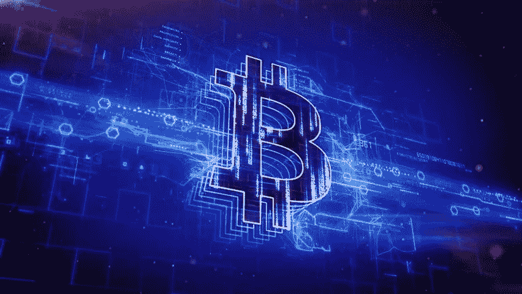
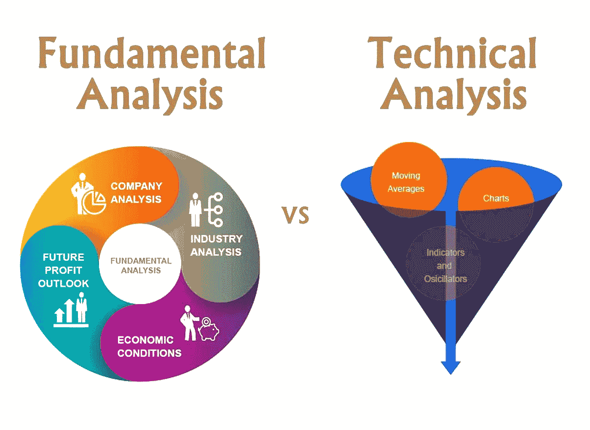

# 投资加密货币需要编程知识吗

> 原文：<https://blog.devgenius.io/do-you-need-programming-knowledge-to-invest-in-cryptocurrency-8ea7ceecfbe8?source=collection_archive---------1----------------------->

***其实不是。***

从一个月前开始投资开始，我就没用过编程。在这里，我将概述我是如何投资加密货币的。

## 1-看他们的基本面

加密货币的世界有很多种硬币，很容易丢失。但是，如果你看看任何加密货币的基本面，你可以决定哪些硬币将是最佳选择。

***如何看自己的基本面***

因为加密货币的基本面对大多数投资者来说并不明显，所以在决定投资之前需要一些额外的知识。让我们看看分析基本面的先决条件。

**区块链知识**

在区块链进行长期投资的第一点在于什么是区块链。它们的应用是什么？如果你知道什么是区块链，它会对你的加密投资决策有用。

**观察每枚硬币的生态系统**

了解了区块链之后，你应该对每个硬币的生态系统进行研究。如果找到了一个强大的经济生态系统，那么你就可以对一个特定的令牌进行长期投资。

**在交易所开立加密投资账户**

有很多加密交易所，做你的研究，找到一个好的加密交易所，你的投资将是安全的。但是，购买时他们的佣金可以高达 2%。买你想要的硬币也很简单。你只要开个账户，买你感兴趣的硬币。购买完成后，硬币将被转移到您的帐户，这就是您的起点。

**看每日动向**

为此，你可以开设一个 tradingview 账户来跟踪任何加密货币的走势，以决定何时买入何时卖出你的硬币。但是，如果你做长期投资，你可以在硬币面临贬值时继续持有。当你遇到真正伤害大多数投资者的调整和重大陷阱时，买入更多的长期投资。

**听从你的直觉**

从进化的角度来说，一个物种的生命通常是通过听从自己的直觉而得以拯救的。在投资中，直觉来自研究。如果你确信从长远来看这项投资是值得的，那么就没有理由卖掉他们的股份。

## 2-要做的其他事情

**修正时买入**

当一项资产的价值由于最近的发展而减少 10%或更多时，就会发生调整。这是金融市场中的普遍现象，而且发生了无数次。在这种情况下，最好多买一些这种硬币，以实现长期收益的最大化。如果价值大幅缩水，这是一个迹象，表明投资比以前更多的钱，对一项良好的长期资产进行了强劲的买入。因此，你可以赚更多的钱，因为越来越多的人对修正和重大下跌感到恐慌。

**控制自己的情绪**

这是投资和生活方方面面的基本法则。这是你在很多时候可以打破的最重要的规则，比如重大事故、下跌和修正。更重要的是，你的决策会在很多场合受到考验。防止这种情况发生的最好方法是研究基本面，然后购买硬币而不用担心会发生什么。

**查看一定次数的流量以确定重大碰撞**

确定崩溃的最佳方法包括容量分析。如果你查看 5 年的数据来判断是否有可能出现重大下跌，它可以告诉你很多东西。按百分比计算的成交量峰值可以帮助你判断大崩盘的风险。无论你是在大跌前持有还是卖出所有的硬币，你仍然可以通过冷静的头脑和良好的策略获利。当你的长期投资因为各种原因发生重大崩盘时，买入更多的长期投资以实现回报最大化是件好事。

*根据你的说法，有人需要在投资前了解这个项目吗？如果你投资了什么，请在下面的评论区分享你的经历。*