# Docker——理解和构建 Docker 图像的初学者指南

> 原文：<https://blog.devgenius.io/docker-a-beginners-guide-to-understanding-and-building-docker-images-41c9f53013a6?source=collection_archive---------6----------------------->

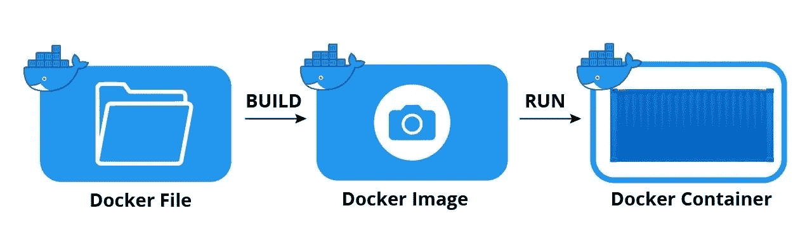

图像创建和管理

Docker 是一个开发人员可以运行、开发和部署基于容器的应用程序的平台。我们在 docker world 中有图像和容器。一个**映像**是一个可执行的包，包括运行一个应用程序所需的一切——代码、运行时、库、环境变量和配置文件。一个**容器**是镜像的运行实例，这意味着你可以从一个镜像中创建尽可能多的容器。

这篇文章是关于图像的。

一旦你安装了 docker，你可以用下面的命令检查版本信息，以确保你安装正确。

```
docker --version
docker info
```

# 议程

*   ***从哪里开始***
*   ***从 docker hub*** 拉取图像
*   ***清单图片***
*   ***图像历史***
*   ***检查图像***
*   ***创建图像***
*   ***Dockerfile***
*   ***移除图像***
*   ***共享图片***
*   ***推送图片***

## 从哪里开始

一旦你在你的机器上安装了 docker，你要做的第一件事就是创建一个映像或者从 docker hub 中提取一个映像，这样你就可以在其中运行容器了。

## 从 docker hub 提取图像

使用 docker pull 命令，如果本地系统中没有映像，您可以从 docker hub 中提取映像。来拉 ubuntu 吧。

```
docker pull ubuntu
docker pull ubuntu:<tag>
```

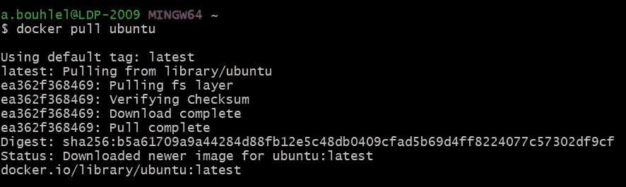

码头工人拉动

如果你在第一次拉的时候看上面的图像，它实际上从 docker hub 下载了构建图像所需的所有层。但是，从第二次开始，它实际上从本地系统中提取。

默认情况下，它将获取最新的标签。您可以指定想要提取的标签。让我们用另一个标签来提取图像。

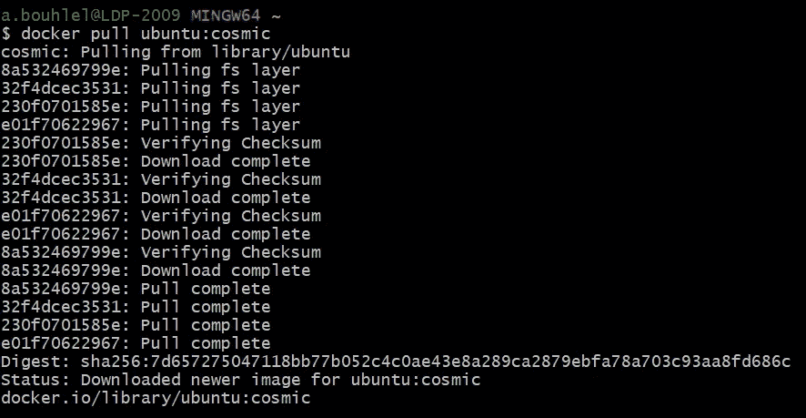

docker pull ubuntu:宇宙

## 列出图像

有两种方法可以查看系统中的图像数量。 ***docker images*** 会给出关于图像的所有细节，标签，图像 id，大小，以及创建日期等。

```
docker images
```

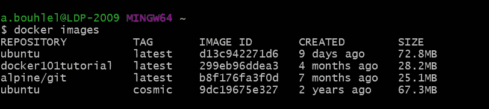

docker 图像

另一种方法是使用 ***docker info。*** 但是，你只能看到一些图像

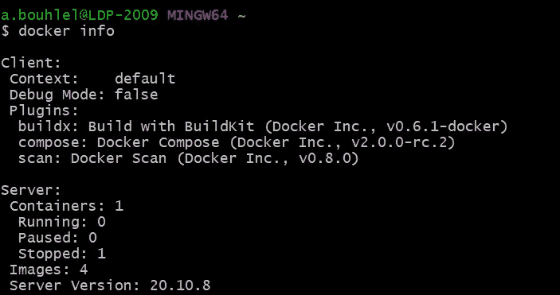

码头信息

我们实际上可以只列出带有-q 标志的图像 id。

```
// list only ids
docker images -q// no truncate outout
docker images --no-trunc// usage of format
docker images --format "{{.ID}}: {{.Repository}}"
```

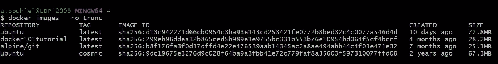

docker 图像-无中继 c

# 图像历史

使用以下命令查找映像历史。

```
docker history <image>
docker history <image>:<tag>
```

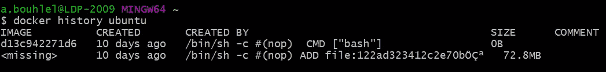

docker 历史 ubuntu

# 检查图像

您可以使用以下命令检查图像。你实际上可以看到很多关于图像的信息，比如图像 id 的最长版本、标签、创建日期、实例化命令等..

```
docker inspect <image>:<tag>
```

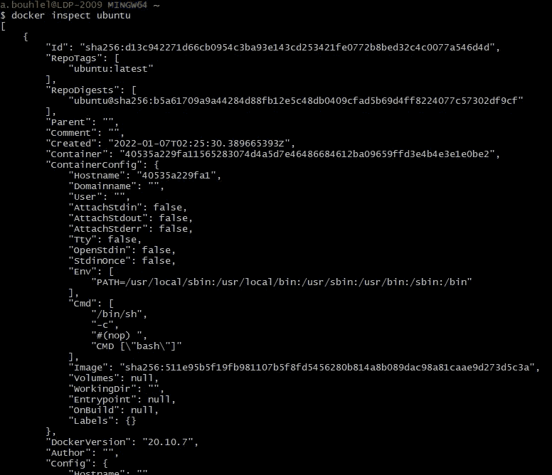

您可以使用竖线(|)或 format 选项来获取特定设置

```
docker inspect ubuntu | grep Id
```

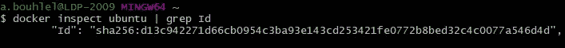

```
docker inspect ubuntu --format "{{json .Config}}"
```

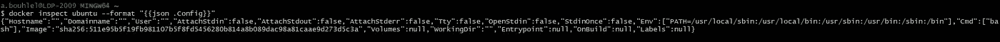

## 创建图像

我们可以从 docker hub 中提取图像，并在 Dockerfile 的帮助下自动创建 docker 图像。

## Dockerfile 文件

Dockerfile 可用于自动创建 Docker 容器映像。这里是详细的 Dockerfile 文章。

[](https://ahmedbhl.medium.com/docker-a-beginners-guide-to-understanding-dockerfile-with-a-sample-project-f1a54eeedb0f) [## docker——用一个示例项目理解 Dockerfile 的初学者指南

### 理解 Dockerfile 文件的逐步指南

ahmedbhl.medium.com](https://ahmedbhl.medium.com/docker-a-beginners-guide-to-understanding-dockerfile-with-a-sample-project-f1a54eeedb0f) 

# 共享图像

我们可以像 Github 一样共享和推送对 docker hub 的修改，或者我们可以创建自己的私有注册表。有时，我们希望共享图像，而不发布到任何存储库。这是它的链接。

[](https://ahmedbhl.medium.com/how-to-share-docker-images-without-docker-hub-or-any-registry-2d747cfb07c6) [## 如何在没有 docker hub 或任何注册表的情况下共享 Docker 图像

### 在某些情况下，你不能将你的图片发布到 docker hub 或任何私人注册中心。这个故事给了你…

ahmedbhl.medium.com](https://ahmedbhl.medium.com/how-to-share-docker-images-without-docker-hub-or-any-registry-2d747cfb07c6) 

# 推送图像

我们可以将图像推送到 docker hub 或任何私有存储库。让我们看看将图像推送到 docker hub 的例子。习惯上用 docker hub 用户名***<docker serid>/<repo-name>推送 docker 镜像。***

```
// docker login
docker login// build an image with ***<dockeruserid>/<repo-name>*** docker build -t asebhl/sampledocker -f Dockerfile3 .// list images
docker images// docker push
docker push asebhl/sampledocker
```

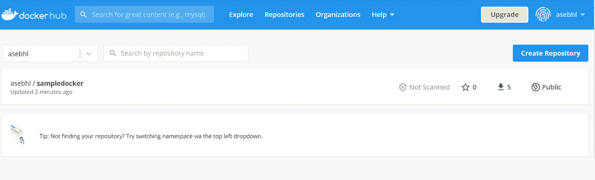

**Docker hub 账户**

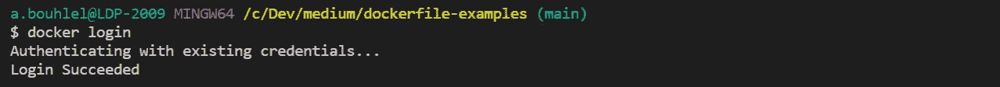

**docker 登录**

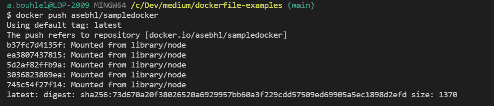

**码头工人推动**

# 结论

这对于创建和管理图像来说已经足够了。

***感谢您的阅读，如果您发现这很有用，请为它鼓掌，并帮助其他人找到它。更多有趣的故事请关注我:)***