# docker——用一个示例项目理解 Dockerfile 的初学者指南

> 原文：<https://blog.devgenius.io/docker-a-beginners-guide-to-understanding-dockerfile-with-a-sample-project-f1a54eeedb0f?source=collection_archive---------3----------------------->

理解 Dockerfile 文件的逐步指南

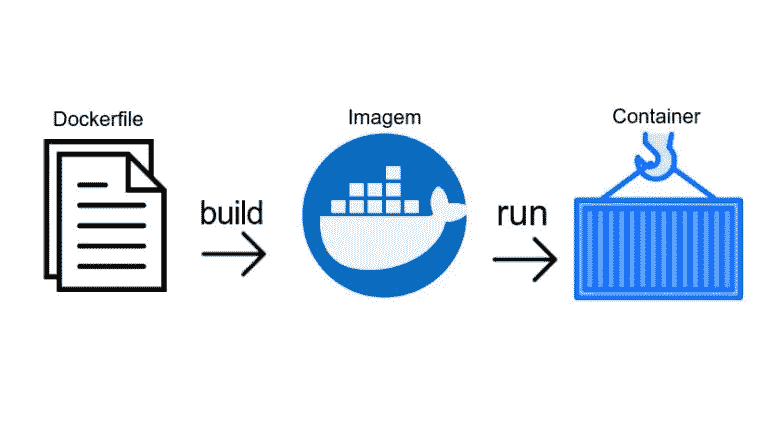

**通过 Dockerfile 自动创建 Docker 图像**

Dockerfile 用于自动创建 Docker 映像。Docker 通过读取 docker 文件中的指令来构建映像。

我们将通过构建一个示例项目来理解 Dockerfile 指令，为所有示例复制下面的 repo。

```
git clone [https://github.com/ahmedbhl/dockerfile-examples](https://github.com/ahmedbhl/dockerfile-examples)
```

这里是我们可以在**docker 文件**中使用的所有命令。

*   **评论**
*   **来自**
*   **CMD**
*   **入口点**
*   **工作方向**
*   **环境**
*   **复制**
*   **标签**
*   **跑**
*   **增加**
*   **。dockerignore**
*   **ARG**
*   **揭露**
*   **用户**
*   **卷**

# 评论

dockerfile 文件中的注释以 **#** 开头，您可以将这些注释放在任何地方。

```
# from base image node
```

# 从

这是 Dockerfile 文件中的第一个命令。没有这个，我们就无法建立形象。我们可以用这个命令来构建图像。当我们仅使用 **FROM，**构建时，无论何时实例化映像，我们实际上都在获取基础映像 CMD。

DockerFile 文件

```
// build the image
docker build -t first-dockerfile -f Dockerfile1 .// list image
docker images// run the image
docker run -it -d first-dockerfile// use exec for interaction
docker exec -it f1edbfca3eac bash
```

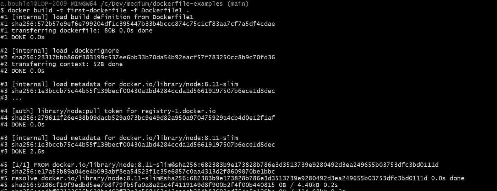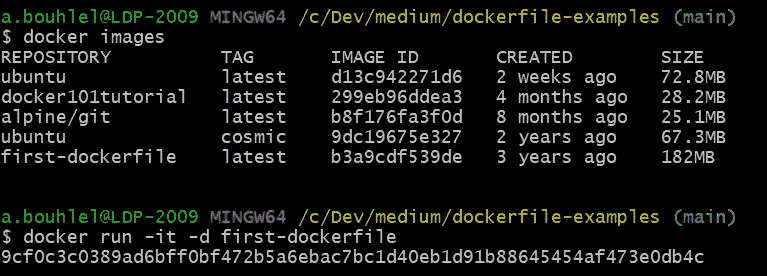

**用 FROM 命令构建 Docker 映像**

# 煤矿管理局

**CMD** 命令用于在镜像实例化时给出默认命令，它在构建阶段不执行。每个 docker 文件应该只有一个 CMD，您可以列出多个，但将执行最后一个。

**多个命令，但最后一个命令被执行**

```
// build the image
docker build -t dockerfile2 -f Dockerfile2 .// list image
docker images// run the image
docker run -it -d dockerfile2// use exec for interaction
docker exec -it <conatiner id> bash
```

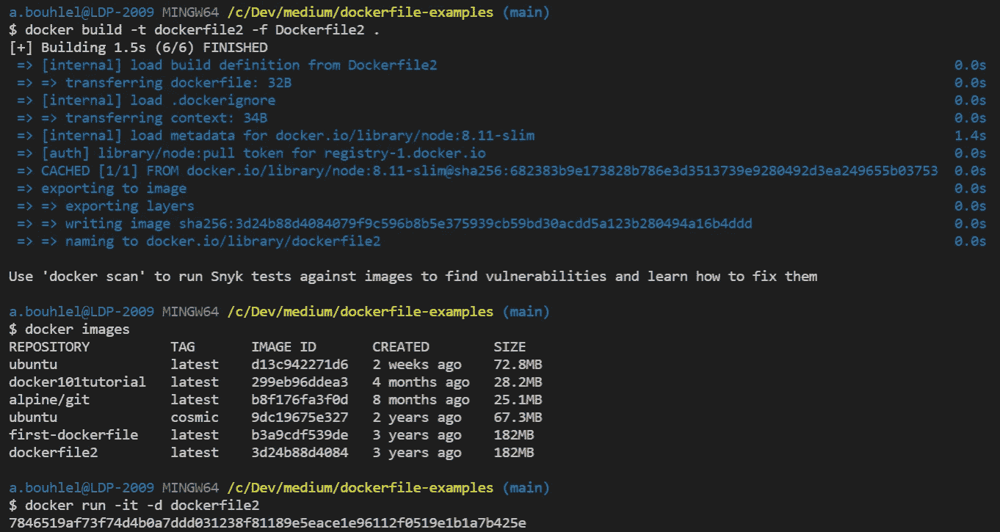

**构建映像并运行它**

如果您注意到了，最后一个命令是在我们运行容器时执行的。这里有几点需要注意。

*   如果我们在 ENTRYPOINT 中指定可执行文件，我们可以使用 CMD 向它传递默认参数(查看 ENTRYPOINT 部分)
*   如果没有，我们可以在 CMD 中指定可执行参数和默认参数。
*   我们可以在运行容器时覆盖 CMD 中给出的默认命令

# 入口点

ENTRYPOINT 用作容器的可执行文件。让我们看看下面的例子

我们将 ENTRYPOINT 用于可执行命令，并使用 CMD 命令将一些默认命令传递给可执行文件。

**带有入口点的 Dockerfile 示例**

```
// build the image
docker build -t dockerfile3 -f Dockerfile3 .// run the container
docker run -it dockerfile3
```

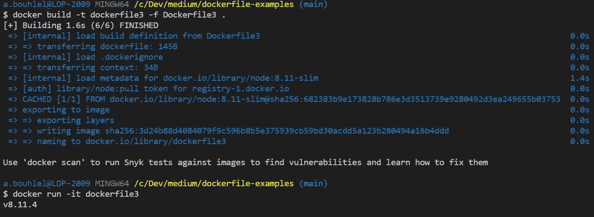

# 工作方向

**工作目录**设置所有连续命令的工作目录。我们可以有多个 **WORKDIR** 命令，并将附加一个相对路径。考虑下面的例子，我们有两个 **WORKDIR** 命令导致 **/usr/node/app**

**工作目录的 Dockerfile】**

```
// build the image
docker build -t dockerfile4 -f Dockerfile4 .// run the container
docker run -it dockerfile4// open in another terminal and do exec
docker exec -it <container id> bash// see the current working directory
pwd
```

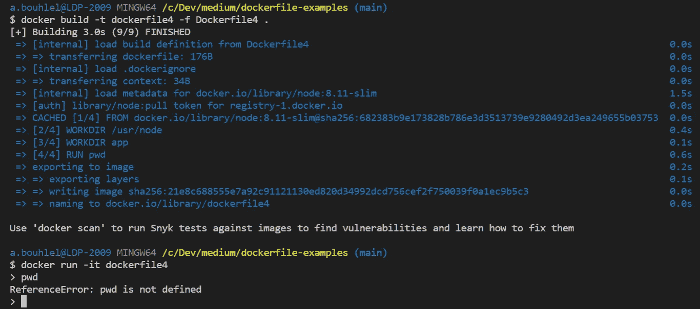

**在一个终端构建并运行镜像**

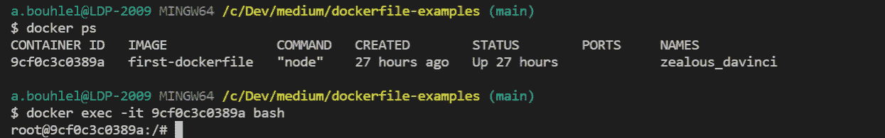

**exec 在另一个终端**

# 包封/包围（动词 envelop 的简写）

ENV 为构建阶段的后续指令设置环境变量。考虑下面的例子，我们定义了环境变量 workdirectory，并在后面的$中使用了它。有两种形式:单值和多值

```
// form1
ENV param value// form2
ENV param1=value1,param2=value2
```

**环境示例**

```
// build the image
docker build -t dockerfile5 -f Dockerfile5 .// run the container
docker run -it dockerfile5// open in another terminal and do exec
docker exec -it <container id> bash// see the current working directory
pwd
```

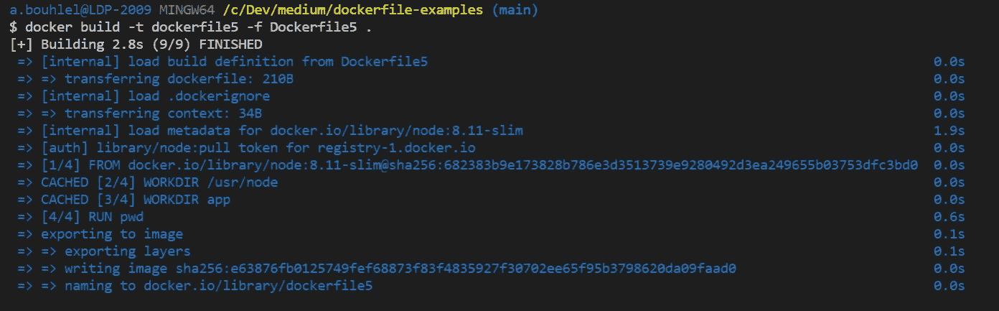

**环境在行动**

# 复制

拷贝用于将文件或目录从源主机文件系统拷贝到容器文件系统中的目标。考虑这个例子，我们将 package.json 从我们的系统复制到容器文件系统。我们可以用运行命令 ls -l 来验证这一点。

**带有复制命令的 Dockerfile】**

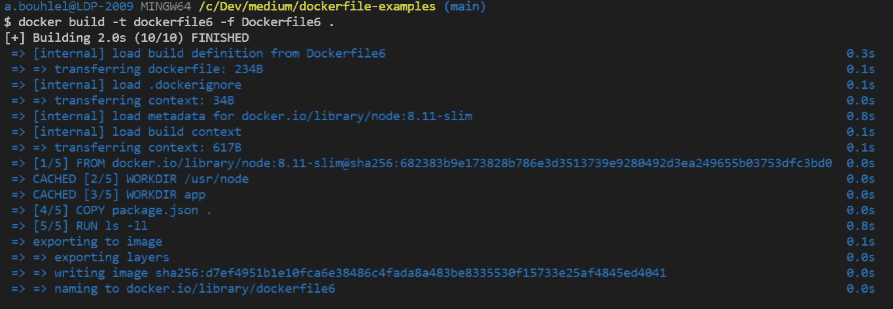

**运行 ls -l 命令列表 package.json**

# 标签

标签用于向图像添加一些元数据。如果我们使用与基础图像相同的标签并且应用最新的标签值。

**Dockerfile 标签示例**

```
// build the image
docker build -t dockerfile7 -f Dockerfile7 .// inspect the image
docker image inspect dockerfile7
```

# 奔跑

RUN 在现有映像之上的新层中执行指令，并提交这些层，结果层将用于 docker 文件中的下一条指令。考虑这个例子，我们一次运行 npm install 和 ls -l 以避免任何额外的层。

```
// build the image
docker build -t dockerfile8 -f Dockerfile8 .
```

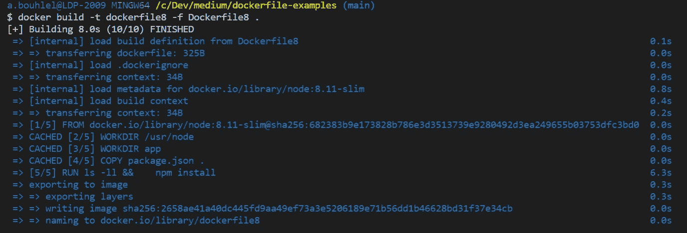

**npm install 获取 package.json 并创建 package-lock.json**

# 注意缺陷障碍 (Attention Deficit Disorder)

ADD 用于将 URL 中的文件或目录和远程文件从源主机文件系统添加到容器文件系统中的目标。考虑这个例子，我们将 index.js 从我们的系统添加到容器文件系统。我们可以用运行命令 ls -l 来验证这一点。

**带有添加命令的 Dockerfile】**

```
// build the image
docker build -t dockerfile9 -f Dockerfile9 .
```

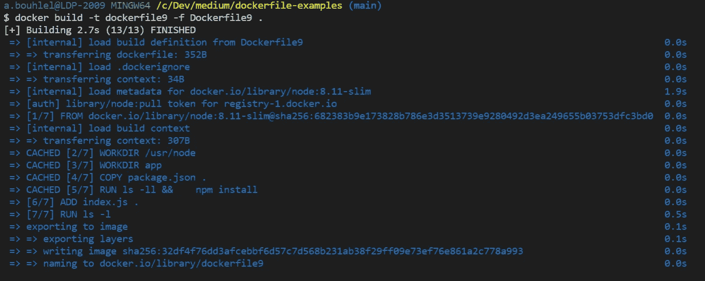

我们可以在容器文件系统中看到 index.js 和其他文件

# 。dockerignore

每当我们在根级别构建映像时，整个上下文都会被发送到 Docker 守护进程。有时，我们不需要将所有内容发送到 Docker 守护进程，这些文件或目录应该添加到此。dockerignore 文件。

例如，我们在上下文中有 node_modules，我们已经将它添加到。dockerignore 文件。

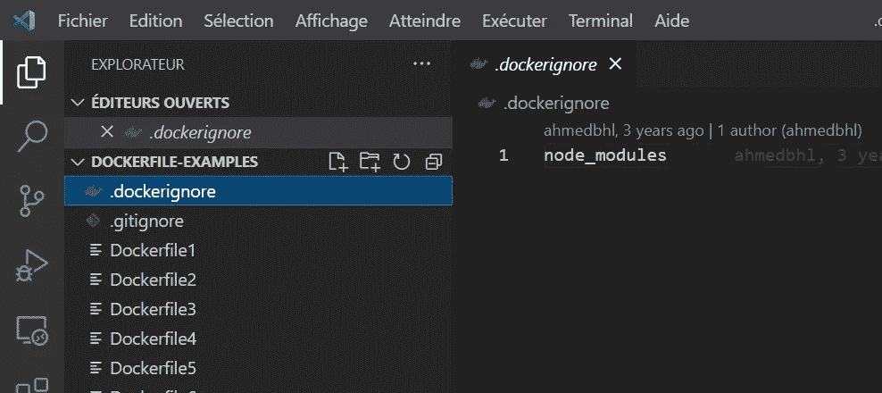

**node_modules 不应被发送到 Docker 守护进程**

# 银

ARG 用于将一些参数传递给连续的指令，这是唯一可以在 FROM 之前使用的命令，而不是注释。我们可以在下面的文件中看到 ARG 的用法，也可以用 build 命令传递它。

**ARG 示例 Dockerfile**

```
// build command
docker build -t dockerfile10 -f Dockerfile10 .// build-arg usage
docker build -t dockerfile10 --build-arg NODE_VERSION=8.11.4  -f Dockerfile10 .
```

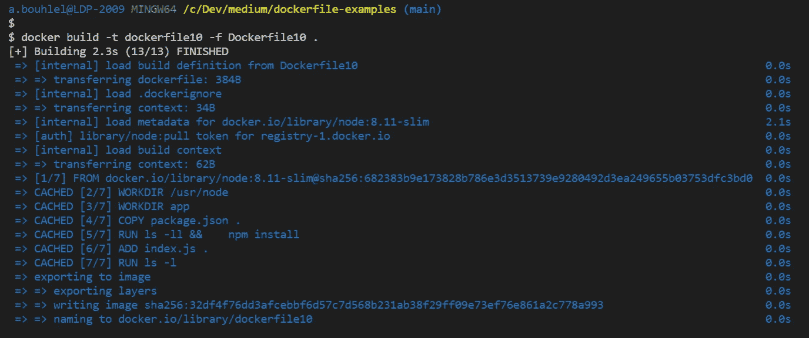

**Dockerfile 正在通过取 ARG** 来构建

# 揭露

EXPOSE 用作端口的文档。这只是构建映像的人和运行容器的人之间的交流。除了记录之外，它没有任何其他用途。

例如，我们在 **index.js** 文件中使用了端口 **3070** 。因此，我们通过使用 Dockerfile 文件中的 **EXPOSE** 指令让人们知道谁在运行容器。

# 用户

用户说明设置运行映像时使用的用户名和可选用户组，以及 docker 文件中该映像之后的任何说明

**docker file 中用户的用法**

# 卷

卷用于创建具有指定名称的装载点。下面是 Dockerfile 和运行指令的例子。

**docker 文件中的卷使用量**

```
// build command
docker build -t dockerfile13 -f Dockerfile13 .
```

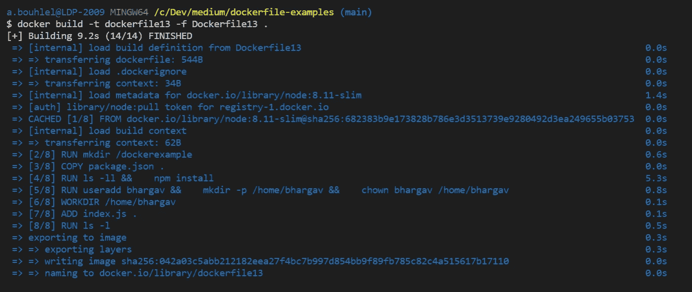

**卷目录在容器文件系统中列出**

# 结论

我们用 Dockerfile 一步一步地构建项目，看了大部分说明。如果您需要更多信息，请查看 Docker 文档。

***感谢您的阅读，如果您发现这很有用，请为它鼓掌，并帮助其他人找到它。更多有趣的故事请关注我:)***