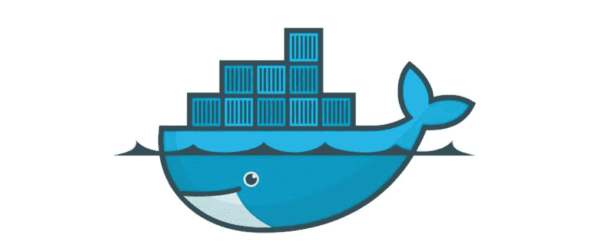
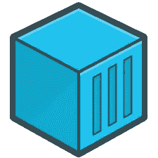
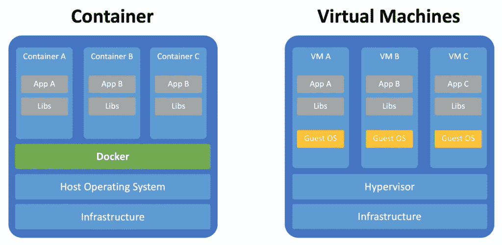
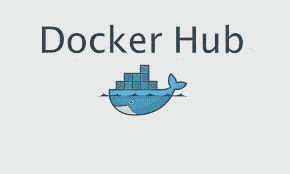

# Docker:初学者入门

> 原文：<https://blog.devgenius.io/docker-a-beginners-introduction-556d2583da36?source=collection_archive---------7----------------------->



在这个时代，公司比以往任何时候都更加依赖软件来保持竞争力。此外，软件开发领域最大的创新之一是**容器**的发明。

容器的引入极大地改变了软件构建和运输的方式。由于 docker 的惊人功能，采用容器化的公司和团队使其开发人员无忧。

今天，我们将讨论 Docker 的基本原理。

# 码头集装箱

让我们从以下几个问题开始:

*   我们为什么需要 Docker？
*   Docker 能为我们做什么？



这些问题最好用一个不使用 Docker 的开发人员面临的场景来解释:

假设一个团队希望建立一个包含各种技术的全栈应用程序，比如使用 Flask 的 web 服务器、Postgres 之类的数据库、Redis 之类的消息传递系统以及 Ansible 之类的编排工具。

在开发这样一个项目时，可能会出现一些问题:

**底层操作系统的兼容性问题**:开发者必须确保不同的服务与他们使用的操作系统版本兼容。

**依赖项和应用服务之间的兼容性问题**:可能一个服务需要一个版本的库，而另一个服务需要另一个版本。每次依赖关系改变时，开发人员都必须检查这些不同组件和底层基础设施之间的兼容性。

这种兼容性矩阵问题通常被称为“来自地狱的矩阵”。

为新开发人员建立一个环境是困难的:每当一个新开发人员加入团队，他将不得不遵循一大套指令并运行数百个命令来最终建立他们的环境。这当然是耗时且低效的。

鉴于前面的困难，我们需要一些东西来帮助我们解决这些兼容性问题，允许我们独立地修改或更改应用程序的组件，甚至根据需要修改底层操作系统。

这时 Docker 就开始发挥作用了。

有了 Docker，开发人员就能够在容器中运行应用程序组件，并拥有自己的库和依赖项，从而解决了之前的所有问题。

对于许多开发人员来说，要运行一个应用程序的实例，必须构建一个 docker 配置，以后所有开发人员都可以使用一个简单的 Docker run 命令来运行该配置，而不考虑底层的操作系统。唯一的要求就是让 Docker 安装开发者的机器。

# 什么是容器？

容器是完全隔离的环境。它们可以拥有自己的进程或服务、自己的网络接口、自己的虚拟机挂载，只是它们都共享相同的操作系统内核。我们稍后将讨论这一点的含义。

设置这些容器环境很难，因为它们需要低级的计算机操作系统知识。这就是 Docker 提供了一个具有几个强大功能的高级工具的地方，让像我们这样的最终用户真的很容易。

# Docker 是如何工作的？

要了解 Docker 的工作原理，我们必须了解一些基本的操作系统概念。

如果你看看像 Ubuntu，Fedora，CentOS 等操作系统。它们都由两部分组成:

1.  一个操作系统内核。
2.  一套软件。

操作系统内核负责与底层硬件交互。

OS 内核，在本例中是 Linux，保持不变。是它上面的软件让这些操作系统与众不同。

因此，你有一个所有操作系统共享的通用 Linux 内核和一些自定义软件来区分不同的操作系统。

先前我们提到 Docker 容器共享底层内核。这意味着什么？

这意味着任何使用相同内核的操作系统都可以运行相同风格的 docker，而不管操作系统中使用的是什么软件。

如果底层操作系统是 Ubuntu，Docker 可以运行基于另一个发行版的容器，如 Debian、Fedora、SUSE 或 CentOS。

Docker 不在主机上运行单独的内核。提醒一下，docker 共享计算机的内核。

你可能会问:那这难道不是一个缺点吗？不能在操作系统上运行另一个内核？答案是**没有**。Docker 并不意味着在同一个硬件上虚拟化和运行不同的操作系统和内核。Docker 的主要目的是将应用程序容器化，并运送和运行它们。

# 虚拟机和容器之间的区别

在 Docker(容器)的情况下，架构是用以下层结构构建的:

在底部，我们有底层的硬件基础设施，然后是操作系统和安装在操作系统上的 Docker。Docker 随后可以单独管理与库和依赖项一起运行的容器。

在虚拟机的情况下:我们在底层硬件上有操作系统，然后是管理程序(这可以是任何类型)，在这之上是虚拟机。虚拟机的每个实例都有一个操作系统。最后，在操作系统之上是应用程序。可以想象，由于有多个虚拟操作系统和内核在运行，这种额外的开销会导致更多的资源使用。



虚拟机还会消耗更多的磁盘空间，因为每个虚拟机都很“重”，通常以千兆字节为单位，而 Docker 容器是轻量级的，通常以兆字节为单位。

这使得 Docker 容器可以在几秒钟内更快地启动，而虚拟机可能需要几分钟才能启动。

还需要注意的是，Docker 的隔离性较低，因为更多的资源在容器(如内核)之间共享，而虚拟机彼此之间完全隔离。

因为 VMs 不依赖底层操作系统或内核。您可以拥有不同类型的操作系统，例如基于 Linux 或基于 Windows 的相同虚拟机管理程序。这在单个 Docker 主机上是不可能的。

# 关于 Docker 和 Docker 存储库的更多信息



到目前为止，已经有很多应用程序的容器化版本。因此，大多数组织将他们的产品打包，并在一个名为 Docker Hub 或 Docker store 的公共 Docker 注册表中提供。

例如，您可以找到最常见的操作系统、数据库以及其他服务和工具的映像。一旦您确定了您需要的映像，并且在您的主机上安装了 Docker。启动应用程序堆栈就像运行以下程序一样简单:

```
docker run [image name]
```

如果您需要运行一个应用程序/服务的多个实例，只需根据需要添加尽可能多的实例，并在前端配置某种负载平衡器。

如果其中一个实例希望失败，只需销毁该实例并启动一个新实例。

正如你所看到的，一旦你精通 Docker，你就可以轻松地扩展一个非常强大的应用程序。

# 图像与容器

映像是一个包或模板，就像虚拟机模板一样。它用于创建一个或多个容器。容器是独立运行的映像实例，它们有自己的环境和一组进程。

如果我们从编程的角度考虑图像和容器:你可以认为图像是一个类定义，而容器是该类的一个实例。

正如我们之前看到的，许多产品已经被“归档”。万一你找不到你要找的东西，你可以自己创建一个图像，并把它推送到 Docker Hub 库，让公众可以使用。

有了 Docker，建立基础设施所涉及的大部分工作现在以 Docker 文件的形式掌握在开发人员手中。开发人员以前为设置基础设施而构建的指南现在可以很容易地放入 docker 文件中，为应用程序创建映像。

这个映像现在可以在任何容器平台上运行，并且保证在任何地方都能以相同的方式运行。因此，运营团队现在可以简单地使用映像来部署应用程序。因为当开发人员构建映像时，它已经在工作，并且操作人员没有修改它，所以当部署到生产中时，它继续以相同的方式工作。

*原载于*[*https://luispreciado . blog*](https://luispreciado.blog/posts/kubernetes/core-concepts/docker)*。*