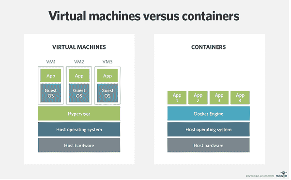
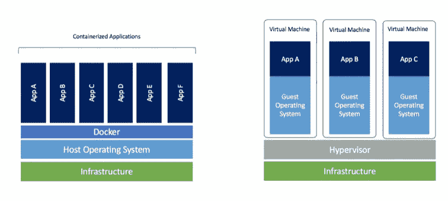

# 码头工人…简单的基础知识…！

> 原文：<https://blog.devgenius.io/docker-basics-in-a-simple-way-e47709e4e848?source=collection_archive---------9----------------------->

码头工人…..码头工人…到处都是…！

是啊…..让我们开始吧…！

# 本博客将涵盖的 Docker 主题:

> Docker 是什么？
> 
> 为什么应该使用 Docker？
> 
> 虚拟机与 Docker 容器
> 
> 容器 vs 图像 vs Docker 文件 Vs Docker 群体 Vs Docker 撰写&更多..
> 
> 使用 DockerFile 构建图像
> 
> 管理 Docker 图像
> 
> 管理 Docker 容器

> ***1-Docker 是什么？***

## *各种定义:*

> Docker 是最受欢迎的容器化平台。Docker 也是一种打包、运输和在“容器”中运行应用程序的工具。

> Docker 是一个容器管理服务。Docker 的关键词是开发、运送和随处运行。Docker 的整个理念是让开发者轻松开发应用程序，将它们装入容器中，然后部署到任何地方。

> Docker 是一个平台，它以容器的形式将应用程序及其所有依赖项打包在一起。这种容器化保证了应用程序可以在任何环境下工作。
> 
> 每一个应用程序都运行在不同的容器上，并且有自己的依赖项和库。
> 
> 这确保了每个应用程序都独立于其他应用程序，让开发人员确信他们可以构建不会相互干扰的应用程序。
> 
> 因此，开发人员可以构建一个安装了不同应用程序的容器，并将其交给 QA 团队。那么 QA 团队只需要运行容器来复制开发人员的环境。

> Docker 是一个平台，它使用 OS 级虚拟化来交付称为容器的软件包中的软件，容器是完全隔离的环境。它们可以有自己的进程或服务或网络接口、卷装载，就像虚拟机(VM)一样。它们与虚拟机的区别仅在于一个方面，它们“共享”操作系统内核。Docker 图像是静态的(固定的)模板，容器是图像的运行版本。

# **Docker 的组成:-**

Docker 有以下组件

*   **Docker for Mac**—它允许用户在 Mac OS 上运行 Docker 容器。
*   **Docker for Linux**—它允许用户在 Linux 操作系统上运行 Docker 容器。
*   **Docker for Windows**—它允许用户在 Windows 操作系统上运行 Docker 容器。
*   **Docker 引擎**—用于构建 Docker 映像和创建 Docker 容器。
*   **Docker Hub**—这是用于托管各种 Docker 图像的注册表。
*   **Docker Compose**——用于定义使用多个 Docker 容器的应用程序。

> 为什么要使用 Docker？

# **Docker 受欢迎/受益的主要原因有:**

> 易用性
> 
> 更快的系统扩展
> 
> 更好的软件交付
> 
> 灵活性
> 
> 软件定义的网络
> 
> 微服务架构的兴起

# **是的，使用 Docker。我用这个答案做一些假设:**

*   您开发分布式软件的目的是从您的基础设施中挤出最后一个周期的处理能力和 RAM 字节。
*   您正在为高负载和高性能设计您的软件，即使您还没有高负载或需要最佳性能。
*   您希望实现高部署速度并获得同样的好处。如果你渴望软件交付中的 DevOps 实践，容器是工具箱中的一个关键工具。
*   你要么想要容器的好处，要么需要它们，或者两者兼而有之。如果您已经运行高负载、分布式、单片或微服务应用程序，那么您需要容器。如果您渴望有一天运行这些高负载、高性能的应用程序，现在是开始使用容器的时候了。

> *3 台虚拟机与码头集装箱*

> **VMs 是房子，集装箱是公寓！**

# **虚拟机**

> 虚拟机是一种软件计算机，其作用类似于带有操作系统和应用程序的物理计算机。
> 
> 换句话说，就是计算机中的计算机。
> 
> 有一个主机操作系统，在此之上还有一个虚拟机管理程序。
> 
> 虚拟机管理程序是创建和运行虚拟机的软件、固件或硬件。

## **虚拟机的优势:**

> 同一台机器上可以同时存在多个操作系统。
> 
> 灵活的
> 
> 非常成熟

## **虚拟机的缺点:**

> 效率不高
> 
> 难以快速部署

# **集装箱:**

> 容器是一种将应用程序包装成独立“盒子”的方式。
> 
> 对于其容器中的应用程序，它不知道存在于其盒子之外的任何其他应用程序或进程。
> 
> 应用程序成功运行所依赖的一切也存在于这个容器中。
> 
> 无论盒子移动到哪里，应用程序总是会感到满意，因为它捆绑了运行所需的一切。
> 
> 容器虚拟化操作系统，而不是像虚拟机一样虚拟化底层计算机。
> 
> 它们位于物理服务器及其主机操作系统(通常是 Linux 或 Windows)之上。
> 
> 每个容器共享主机操作系统内核，通常还共享二进制文件和库。
> 
> 共享组件是只读的。
> 
> 共享操作系统资源(如库)大大减少了复制操作系统代码的需求，这意味着一台服务器可以在安装一个操作系统的情况下运行多个工作负载。
> 
> 因此容器特别轻——它们只有兆字节大小，启动只需几秒钟。
> 
> 这是一种新的可视化形式。
> 
> 与虚拟机不同，容器与主机操作系统共享相同的资源。
> 
> 容器位于物理服务器及其主机操作系统之上。
> 
> 每个容器共享主机操作系统内核，通常还共享二进制文件和库。
> 
> 容器是应用程序的独立主机，这些应用程序使用单一的、精简版本的操作系统来运行
> 
> 当您最优先考虑的是在最少数量的服务器上运行最多数量的应用程序时，容器是更好的选择。

**图-1:虚拟机与 Docker 容器**

**图-2:虚拟机 vs Docker 容器**

> *4-容器 vs 图像 vs Docker 文件 Vs Docker 群 Vs Docker 撰写&更多…*

**一些码头工人行话**

我们解释了 Docker 是什么以及为什么它很棒，但是你肯定听说过 Dockerfiles、Docker images、Docker containers 等等。让我们弄清楚那些东西是什么意思。

## **Dockerfile** :

> Dockerfile 是一个文本文档，它包含用户可以在命令行上调用的所有命令来组合一个图像。(或)
> 
> Dockerfile 是一个简单的文本文件，包含如何构建图像的说明。
> 
> 因此，Docker 可以通过读取 Docker 文件中的指令来自动构建映像。
> 
> 您可以使用 docker build 创建一个自动化的构建来连续执行几个命令行指令。
> 
> Dockerfile 由一系列[action] [target]命令组成，每个命令创建一个新层。

## **Docker 图像:**

> 通俗地说，Docker 图像可以比作用于创建 Docker 容器的模板。因此，这些只读模板是容器的构造块。您可以使用 docker 运行来运行映像并创建一个容器。
> 
> Docker 图像存储在 Docker 注册表中。它可以是用户的本地存储库，也可以是 Docker Hub 这样的公共存储库，它允许多个用户协作构建应用程序。

## **码头集装箱:**

> **容器==运行图像**
> 
> 它是 Docker 映像的运行实例，因为它们包含运行应用程序所需的整个包。
> 
> 因此，这些基本上是从 Docker 图像创建的现成应用程序，这是 Docker 的最终用途。
> 
> **我们可以打个比方说:图片:类&容器:实例**

## **Docker 撰写:**

> 这是一个 YAML 文件，包含有关设置应用程序的服务、网络和卷的详细信息。
> 
> 因此，您可以使用 Docker Compose 创建单独的容器，托管它们，并让它们相互通信。
> 
> 每个容器将暴露一个用于与其他容器通信的端口。

## 码头工人蜂拥而至

> 这是一种创建和维护 Docker 引擎集群的技术。
> 
> Docker 引擎可以托管在不同的节点上，这些位于远程位置的节点在以群模式连接时形成一个集群。

> Docker Hub 是 Docker 提供的托管存储库服务，用于查找容器映像并与您的团队共享。主要特性包括:私有存储库:推和拉容器映像

> 一个 **Docker 存储库**是您可以存储特定 Docker 映像的一个或多个版本的地方。一个图像可以有一个或多个版本(标签)。…还值得指出的是，Docker Hub 和其他第三方存储库托管服务被称为“注册中心”。注册中心存储了一组储存库。

> 一个 **Docker** **Registry** 是一个存储和内容交付系统，保存命名的 Docker 图像，有不同的标记版本。示例:带有标签 2.0 和 2.1 的图像分发/注册表。用户通过使用 docker push 和 pull 命令与注册表进行交互。

> 您通过 Docker 文件构建的 docker 映像可以被推送到各种注册中心，如果我们想让它们公开，可以推送到 **DockerHub** ，或者像**AWS Elastic Container Registry**、 **Azure Container Registry** 或 **GCP Container Registry** 这样的注册中心，如果我们想让它们保持私有。

> *5-使用 DockerFile 构建图像*

例如:Docker 文件

*   Docker 图像由层组成。每一层都给最终的 Docker 图像添加了一些东西。每一层实际上都是一个独立的 Docker 图像。
*   因此，您的 Docker 图像由一个或多个底层 Docker 图像组成，您可以在其上添加自己的层。
*   当您通过 Docker 文件指定您自己的 Docker 映像时，您通常从一个 **Docker 基础映像**开始。

> 这是另一个 Docker 图像，您希望在其上构建自己的 Docker 图像。
> 
> 您正在使用的 Docker 基础映像本身可能由多个层组成，并且本身可以基于另一个基础映像等。直到您开始创建最基本的 Docker 映像——未应用任何特殊设置的原始 Linux 容器映像。

## **备注:**

> 第一行“#这是一个样本图像”是一个注释。您可以借助#命令向 Docker 文件添加注释

## **来自:**

> 指定必须下载的图像
> 
> 它告诉 docker，你希望你的图片基于哪个基础图片。在我们的例子中，我们从 ubuntu 映像创建一个映像。

## **维护者:**

> 拥有图像的所有者的元数据

## **运行:**

> 指定要执行的命令
> 
> 在我们的例子中，我们首先更新我们的 ubuntu 系统，然后在我们的 Ubuntu 映像上安装 nginx 服务器。

## **指令指令:**

> CMD 命令指定当 Docker 容器启动时要执行的命令行命令，该容器基于从该 Docker 文件构建的 Docker 映像。
> 
> 最后一个命令用于向用户显示消息。

## **添加:**

> Dockerfile ADD 指令的工作方式与 COPY 指令相同，但有一些细微的区别:
> 
> ADD 指令可以将 TAR 文件从 Docker 主机复制和提取到 Docker 映像。
> 
> ADD 指令可以通过 HTTP 下载文件，并将它们复制到 Docker 映像中。

## **环境:**

> Dockerfile ENV 命令可以在 Docker 映像中设置一个环境变量。这个环境变量可用于在 Docker 映像中使用 CMD 命令启动的应用程序。这里有一个例子:
> 
> **ENV MY_VAR 123**
> 
> 此示例将环境变量 MY_VAR 设置为值 123。

## **工作负责人:**

> WORKDIR 指令指定 Docker 映像中的工作目录。工作目录将对 WORKDIR 指令之后的所有命令有效。这里有一个例子:
> 
> **工作目录/java/JDK/bin**

## **入口点:**

> 指定将首先执行的命令
> 
> 入口点是 Docker 容器启动时执行的应用程序或命令。
> 
> 这样，ENTRYPOINT 的工作方式类似于 CMD，不同之处在于，使用 ENTRYPOINT 时，当 ENTRYPOINT 执行的应用程序结束时，Docker 容器会关闭。
> 
> 因此，ENTRYPOINT 使您的 Docker 映像本身成为一个可执行的命令，可以在完成时自动启动和关闭。

## **曝光:**

> 指定公开容器的端口
> 
> Dockerfile EXPOSE 指令将 Docker 容器中的网络端口向外界开放。例如，如果您的 Docker 容器运行一个 web 服务器，那么该 web 服务器可能需要打开端口 80，以便任何客户端能够连接到它。以下是使用 EXPOSE 命令打开网络端口的示例:
> 
> **曝光 8080**

## **复制:**

> Dockerfile COPY 命令将一个或多个文件从 Docker 主机(从 Docker 文件构建 Docker 映像的计算机)复制到 Docker 映像中。
> 
> COPY 命令可以将文件或目录从 Docker 主机复制到 Docker 映像。以下是 Dockerfile 文件复制示例:
> 
> **复制/myapp/target/myapp . jar/myapp/myapp . jar**
> 
> 此示例将一个文件从/myapp/target/myapp.jar 处的 Docker 主机复制到/myapp/myapp.jar 处的 Docker 映像。第一个参数是 Docker 主机路径(复制源位置)，第二个参数是 Docker 映像路径(复制目标位置)。

# **从 Dockerfile 文件构建图像:**

> 码头工人建造
> 
> 确保您位于 Dockerfile 所在的目录中
> 
> docker build — tag <docker-image-name>: <version-1.0>。</version-1.0></docker-image-name>

# **将 Docker 图像推送到 Docker 存储库:**

> docker 登录
> 
> docker 标签 <username>/app <dockerhub-username>/app:v1</dockerhub-username></username>
> 
> docker 推送注册表-主机:5000/应用:v1

在本例中，注册表位于名为 registry-host 的主机上，并侦听端口 5000

> *6-管理 Docker 图像*

## **运行 Docker 图像:**

> **docker 运行 hello-world**
> 
> Docker 命令是特定的，它告诉操作系统上的 Docker 程序需要做一些事情。
> 
> run 命令用于说明我们想要创建一个图像的实例，然后这个实例被称为容器。
> 
> 最后，“hello-world”代表制造容器的图像。
> 
> **sudo docker run-it Ubuntu/bin/bash**
> 
> 这里，ubuntu 是我们希望从 Docker Hub 下载并安装在我们的 Ubuntu 机器上的映像的名称。
> 
> **──它**用来表示我们要以交互模式运行。
> 
> /bin/bash 用于在 ubuntu 启动并运行后运行 bash shell。

## **显示码头工人图像:**

> 要查看系统上的 Docker 映像列表，可以发出以下命令。
> 
> docker 图像
> 
> **sudo docker 图片**

*   **从上面的输出，您可以看到服务器有三个映像:centos、new centos 和 Jenkins。每个图像都有以下属性:**

> 标签——用于对图像进行逻辑标签。
> 
> 图像 ID——用于唯一标识图像。
> 
> 创建——自映像创建以来的天数。
> 
> **虚拟尺寸**—图像的尺寸。

## **移除 Docker 图像:**

> 可以通过 docker rmi 命令删除系统上的 Docker 映像。让我们更详细地看看这个命令。
> 
> 码头工人 rmi
> 
> docker rmi ImageID
> 
> **sudo docker RMI 7a 86 F8 ffcb 25**

## **docker 图片-q:**

> 该命令用于仅返回图像的图像 id。
> 
> sudo docker 图片-q

> *7-管理码头集装箱*

## **运行集装箱**

> 容器的运行由 Docker run 命令管理。要以交互模式运行容器，首先启动 Docker 容器。
> 
> **码头工人运行**:
> 
> docker 运行图像
> 
> image——这是用于运行容器的图像的名称。
> 
> **docker 运行 hello-world**
> 
> **docker run–it Ubuntu bash**

## **集装箱清单:**

> **docker ps**
> 
> **docker ps -a** :
> 
> 该命令用于列出系统中的所有容器
> 
> **──一个**——它告诉 docker ps 命令列出系统上的所有容器。

## **码头工人历史:**

> 使用这个命令，您可以看到通过容器对图像运行的所有命令。
> 
> docker 历史图像 ID
> 
> ImageID——这是您想要查看对其运行的所有命令的映像 ID。
> 
> **sudo docker 历史 ubuntu**

## **docker top:**

> 使用这个命令，您可以看到容器中的顶级进程。
> 
> 码头顶部集装箱
> 
> Container ID——这是您想要查看其顶级进程的容器 ID。
> 
> **sudo docker top 9 f 215 ed 0 b 0d 3**

## **docker 开始:**

> 启动一个或多个停止的容器
> 
> docker 启动我的容器

## **停靠站:**

> 该命令用于停止正在运行的容器。
> 
> 码头停止集装箱
> 
> Container ID——这是需要停止的容器 ID。
> 
> **sudo docker stop 9 f 215 ed 0 b 0d 3**

## **docker rm:**

> 该命令用于删除容器。
> 
> 码头集装箱箱
> 
> Container ID——这是需要删除的容器 ID。
> 
> sudo docker rm 9f215ed0b0d3

## **docker 附件:**

> 该命令用于附加到正在运行的容器。
> 
> 码头附件集装箱
> 
> Container ID——这是您需要附加的容器 ID。
> 
> **sudo docker attach 07 b 0 b 6 f 434 Fe**

## 码头工人杀人

> 该命令用于终止正在运行的容器中的进程。
> 
> 码头工人杀死集装箱
> 
> Container ID——这是您需要终止容器中的进程的容器 ID。
> 
> **sudo docker kill 07 b 0 b 6 f 434 Fe**

## **运行:**

> 创建一个新的图像容器，并执行该容器。
> 
> 您可以创建同一个映像的 N 个克隆。
> 
> 命令是:docker 运行 IMAGE_ID，而不是 docker 运行 CONTAINER_ID

## **开始:**

> 启动先前停止的容器。
> 
> 例如，如果您使用 docker stop CONTAINER_ID 命令停止了一个数据库，那么您可以使用 docker start CONTAINER_ID 命令重新启动同一个容器，并且数据和设置将是相同的。

# Docker 视频供参考:

> 初学者码头工人

[https://www.youtube.com/watch?v=zJ6WbK9zFpI&t = 1273s](https://www.youtube.com/watch?v=zJ6WbK9zFpI&t=1273s)

> Docker 和 Kubernetes 教程

【https://www.youtube.com/watch?v=bhBSlnQcq2k】t = 4687s

> Docker 端到端实现

[https://www.youtube.com/playlist?list = plzotaelrmxvnktpy 0 u _ MX 9n 26 w 8n 0 hibs](https://www.youtube.com/playlist?list=PLZoTAELRMXVNKtpy0U_Mx9N26w8n0hIbs)

> 码头工人全程课程

[https://www.youtube.com/watch?v=RSIstPUiEjY&list = pl 9 oovrp 1 hqohukuqguiwlqoj-LD 25 kxi 5&index = 21](https://www.youtube.com/watch?v=RSIstPUiEjY&list=PL9ooVrP1hQOHUKuqGuiWLQoJ-LD25KxI5&index=21)

# 参考书目

> 码头工人深度潜水:零到码头工人
> 
> 奈杰尔·波尔顿

> 与 Docker 和 Jenkins 一起连续交货
> 
> 拉斐尔·莱斯科

> 数据科学码头工人
> 
> 约书亚·库克

> Google Drive:

> [https://drive . Google . com/drive/folders/1lK _ pqi 3 sddsyeu _ oxkB _ _ x 14 JSR ne 4 BF](https://drive.google.com/drive/folders/1lK_Pqi3sdDSYEu_oxkB__X14JSrNe4Bf)

> Github 回购:

> [https://github.com/anzhihe/Free-Docker-Books](https://github.com/anzhihe/Free-Docker-Books)

# 谢谢你…！！！！