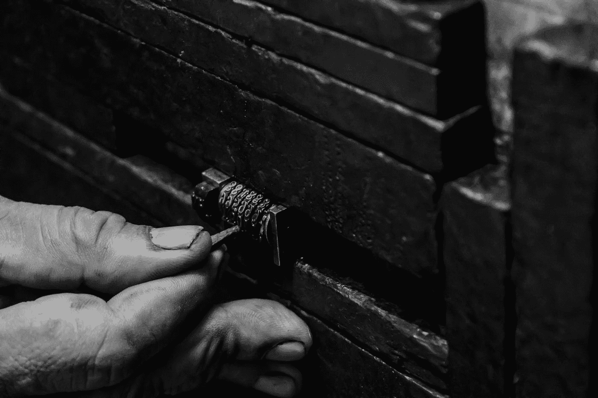

# 码头集装箱安全

> 原文：<https://blog.devgenius.io/docker-container-security-97543efc8703?source=collection_archive---------15----------------------->



[Ariel](https://unsplash.com/@arielbesagar?utm_source=medium&utm_medium=referral) 在 [Unsplash](https://unsplash.com?utm_source=medium&utm_medium=referral) 上拍摄的照片

在构建 Docker 映像时，如何使用敏感信息？

安全，安全，安全…不要在 Dockerfile 中存储秘密。

让我告诉你为什么。

# 假定

> 让我们假设我们将在构建 Docker 映像时将敏感信息放入文件中，并将在构建结束时删除该文件。因此，图像上可能不会存储任何敏感信息。

确实如此——最终图像上没有敏感信息。但是，这些信息是可以检索的。

> ***点击关注再也不要错过我的另一篇文章。***

让我们看看如何检索 Docker 容器上存储的任何数据

*   创建 Dockerfile 文件

```
FROM alpine
RUN echo “top-secret- sensitive-info” > / sensitive.txt
RUN rm /sensitive.txt
```

*   创建一个名为“ *sensitive* ”的图像

```
docker build -t sensitive .
```

*   检查图像是否已创建

```
docker images | grep sensitive
```

*   运行此命令以验证 sensitive.txt 文件是否存在于映像中

```
docker run --rm -it sensitive:latest  ls /sensitive.txt
```

输出:

```
ls: sensitive.txt: No such file or directory
```

> ***点击关注再也不要错过我的另一篇文章。***

到目前为止一切顺利。

这里有一个小技巧，将展示如何检索在 docker 映像构建期间使用的数据

```
*Docker Save* is used for image saving for Sharing purposes.
```

*   奔跑

```
docker save sensitive > sensitive.tar
```

*   让我们检查输出 tar 文件

```
mkdir inspect  && tar -xvf sensitive.tar -C inspect
```

*   输出

```
tree ./inspect./inspect├── 8792aa27a60beb94c658afc7fb54a4f1c427afe01b65cec0f2261c193ec3f495│   ├── VERSION
│   ├── json
│   └── layer.tar
├── 92a2836ccb2847305b9de282c813b1c68c689cb0636fec109f28fe8f50450849.json
├── a9b7d74c25fd61b40f8054523fea8d72e8823e62c6b8b9897b2535aec8c8bcfc
│   ├── VERSION
│   ├── json
│   └── layer.tar
├── dee1ed989fb3c3c2232feda1f0155e4bedb1e867a9243a84252b69ffc248b863
│   ├── VERSION
│   ├── json
│   └── layer.tar
├── manifest.json
└── repositories
```

*   让我们检查 docker 图像历史

```
cat 92a2836ccb2847305b9de282c813b1c68c689cb0636fec109f28fe8f50450849.json | jq ‘.history’
```

输出

```
[{"created": "2022-04-05T00:19:59.790636867Z","created_by": "/bin/sh -c #(nop) ADD file:5d673d25da3a14ce1f6cf66e4c7fd4f4b85a3759a9d93efb3fd9ff852b5b56e4 in / "},{"created": "2022-04-05T00:19:59.912662499Z","created_by": "/bin/sh -c #(nop)  CMD [\"/bin/sh\"]","empty_layer": true},{"created": "2022-04-28T16:36:52.83339Z","created_by": "RUN /bin/sh -c echo \" top-secret- sensitive-info \" > / sensitive.txt # buildkit","comment": "buildkit.dockerfile.v0"},{"created": "2022-04-28T16:36:53.2796236Z","created_by": "RUN /bin/sh -c rm /password.txt # buildkit","comment": "buildkit.dockerfile.v0"}]
```

所以我们在这里:作为纯文本，您可以看到在这个映像构建期间写入的数据。

另一种选择:您可以打印出 *sensitive.txt* 的内容

*   解压缩 Docker 图像层文件

```
tar -xvf dee1ed989fb3c3c2232feda1f0155e4bedb1e867a9243a84252b69ffc248b863/layer.tar
```

输出:

```
x etc/
x sensitive.txt
```

*   *sensitive.txt* 的打印输出内容

```
> cat sensitive.txt
top-secret- sensitive-info
```

因此，几个并不复杂的步骤向我们展示了如何检索 Dockerfile 中使用的所有内容。

> ***点击关注，千万不要错过另一篇关于窍门和技巧、生活经验等的文章！***

# 漏洞修复

Docker 中的多阶段构建通常用于减少输出图像大小的最佳实践环境中。

这是真的——多阶段构建的使用将减少图像的大小。多阶段构建还有另一个实际效果，它有助于防止我们之前展示的漏洞。

*   创建 Dockerfile 文件

```
FROM alpine as first
RUN mkdir -p /sens-demo
RUN echo "top-secret" > /sens-demo/sensitive.txt
RUN rm /sens-demo/sensitive.txt
RUN echo "not a secret" > /sens-demo/public.txt
FROM alpine
COPY --from=first /sens-demo ./
```

*   构建图像

```
docker build -f Dockerfile -t layers  .
```

*   运行容器和打印输出目录和文件

```
docker run --rm -it layers:latest  ls -la
```

->找不到敏感的. txt 文件

下一步-让我们检查图像

*   将图像保存为 tar

```
docker save layers> layers.tar
```

*   让我们检查输出 tar 文件

```
mkdir layers_inspect && tar -xvf layers.tar -C layers_inspect
cd ./layers_inspect
tree .
```

输出

```
├── 60ff038954ee0fbe0fcbb9a21513ddb881f414e8974ae4eb6b896f3a7a0c0046.json
├── 6e351c54860df6ca38e3d1cb49f253806ec2e42a5aa75a37daa2423a8daad330
│   ├── VERSION
│   ├── json
│   └── layer.tar
├── 8792aa27a60beb94c658afc7fb54a4f1c427afe01b65cec0f2261c193ec3f495
│   ├── VERSION
│   ├── json
│   └── layer.tar
├── manifest.json
└── repositories
```

*   让我们检查 docker 图像历史

```
cat 60ff038954ee0fbe0fcbb9a21513ddb881f414e8974ae4eb6b896f3a7a0c0046.json | jq ‘.history’
```

输出

```
[{"created": "2022-04-05T00:19:59.790636867Z","created_by": "/bin/sh -c #(nop) ADD file:5d673d25da3a14ce1f6cf66e4c7fd4f4b85a3759a9d93efb3fd9ff852b5b56e4 in / "},{"created": "2022-04-05T00:19:59.912662499Z","created_by": "/bin/sh -c #(nop)  CMD [\"/bin/sh\"]","empty_layer": true},{"created": "2022-04-30T12:08:39.2627571Z","created_by": "COPY /sens-demo ./ # buildkit","comment": "buildkit.dockerfile.v0"}]
```

现在你可以看到，虽然使用多阶段 docker 映像构建漏洞并没有引入。

记住这个例子，下次构建 Docker 映像时需要使用敏感数据时，使用多阶段构建。

> ***一定要点击关注，千万不要错过另一篇关于窍门和技巧、人生经验等的文章！***

编码快乐！！！