# 码头集装箱和 AWS ECR

> 原文：<https://blog.devgenius.io/docker-containers-aws-ecr-1fe5d2e98dfe?source=collection_archive---------5----------------------->


图片来源:istock images

Docker 是云计算的未来，因为它的容器！可扩展性、可用性(集群)/在单个环境中运行多个容器、经济实惠&它的简单性将使任何应用程序操作系统梦想成真！让我们直接进入项目，看看 Docker“whally”是如何工作的(呵呵 jokey 玩笑)！

您的团队需要您快速部署自定义映像，并在文件中编写快速脚本来完成任务。你将会做一个你以前可能没有做过的任务，所以如果你不知道怎么做的话，一定要研究一下。

## 目标:

1.  使用 Nginx 创建您自己的映像，并添加一个文件来告诉您容器的部署日期
2.  在端口 8080 打开的情况下部署容器
3.  将容器数据保存到 AWS 弹性容器注册表(ECR)

## 先决条件:

*   具有运行状态 EC2 实例的 AWS 自由层帐户(必须安装 Docker)。我用的操作系统是 Linux/Ubuntu
*   安装 Docker 并注册一个 Docker Hub 帐户
*   端口 8080 (EC2 安全组)

# 使用 Nginx 创建您自己的映像，并添加一个文件来告诉您容器的部署日期

## 第一步。

*   我们需要从创建一个文件夹开始，并将目录更改到我们正在创建的文件夹中。

```
**$ mkdir <name of directory>
$ cd <name of directory>**
```

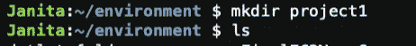

## 第二步。拉 Nginix

对于我用 Nginx 提取的 Docker 图像。

```
#to get the latest ngnix or you could enter the latest name such as nginx:1.23 or whatever the latest file is called
**$docker pull nginx:latest** #gives you the information on the latest pull you requested
**$docker images**
```

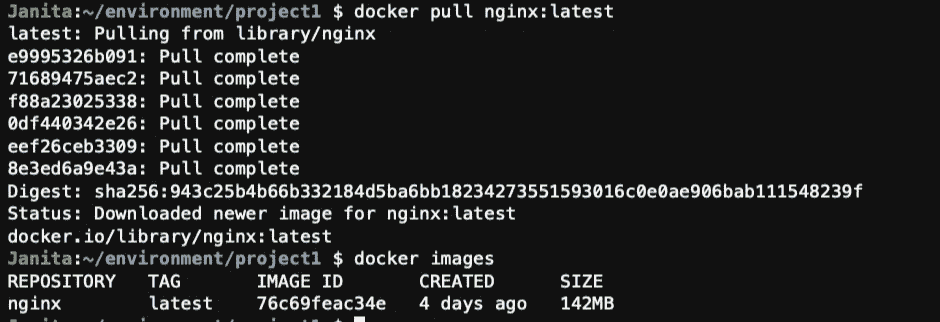

## 第二步。创建 html 文件

为了创建一个 VIM 文件，我使用了下面的命令。然后，我们的编辑屏幕出现在 VIM 中。为 html 输入以下内容。

```
#creates our index file
**$touch index.html**#allows you to edit the file **
$vim index.html**
```

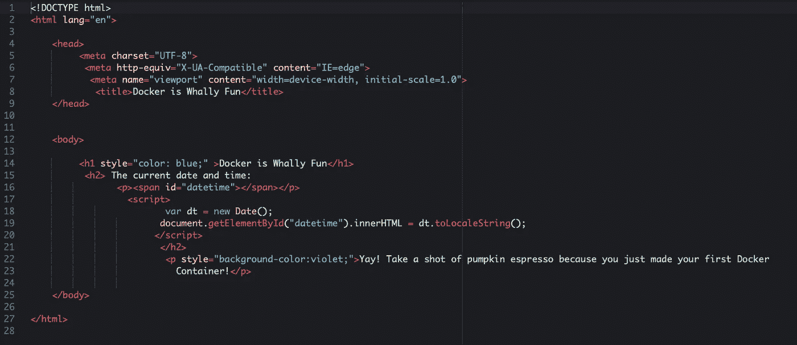

使用 Docker 的可爱之处在于它可以使用 ***Dockerfile 自动为您构建一个图像。***

## **第一步。创建一个 Dockerfile &在 VIM 编辑器**中编辑它

```
#creates our index file
**$touch Dockerfile**#allows you to edit the file **
$vim Dockerfile**
```

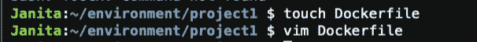

## 第二步。现在在 VIM 编辑器中编辑 Dockerfile 文件

```
**FROM nginix
COPY index.html /usr/share/nginix/html**#hit ESC on your keyboard then :wq to save and exit the VIM editor 
```

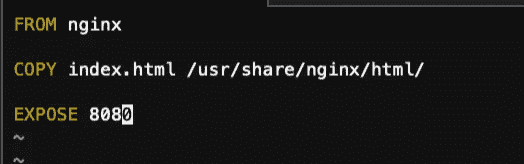

*   这里需要理解的一件重要事情是。下一步将需要 build 命令中的这个“映像名”。否则，如果拼写错误或者没有输入正确的“文件图像”,您将会遇到错误。

将构建上下文发送到 docker 守护程序 3.584kB 步骤 1/2:从 nginix 拉取访问被拒绝对于 nginix，存储库不存在或可能需要“Docker 登录”:被拒绝:请求的资源访问被拒绝

FROM =

复制 index.html/usr/share "这是"上面的图像名称"/html/

所以…

来自 **nginx**

复制 index.html/usr/share/**nginx**/html/

## 第三步。建立我们的形象

```
docker build -t nginx
```

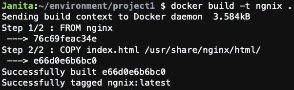

# 在端口 8080 打开的情况下部署容器

```
docker run -d --name firstdocker_container -p 8080:80 nginx
```

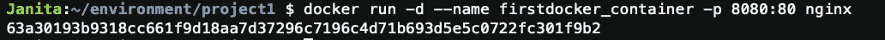

该命令将生成容器 ID

如果你跑…

```
docker ps
```

它将很好地解释 docker run 命令为我们做了什么。

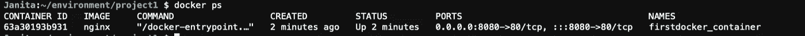

*   在 Cloud9 的右上角，在 Share> applications 下获取你的 IP 地址。输入到你的搜索栏> IP 地址:8080，看看你的 html 页面是否显示！

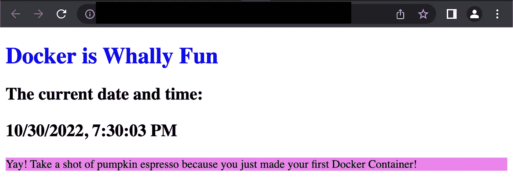

呜哇呜！

# 将容器数据保存到 AWS 弹性容器注册表(ECR)

## 第一步。

您可以在命令行中这样做，或者直接进入 AWS 弹性容器注册中心(ECR)并创建存储库。我已经陷得太深了…所以我不得不坚持做下去。

*   从命令行输入以下命令在 AWS 中创建存储库

```
**$ aws ecr create-repository --repository-name [name here]--region [region here]**
```

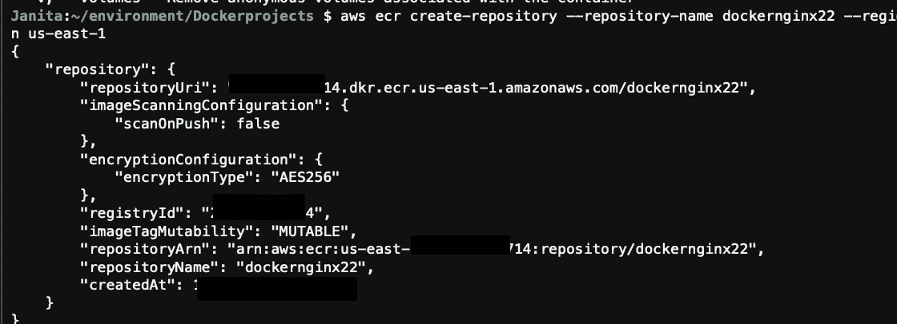

*   您需要使用这个命令获得一个登录名和令牌。

```
#displays the token
**$ aws ecr get-login-password --region us-east-1**
```

*   之后，我可以在 AWS ECR 中查看我的存储库。单击查看推送命令，并按照以下步骤完成我们的最后一项任务！

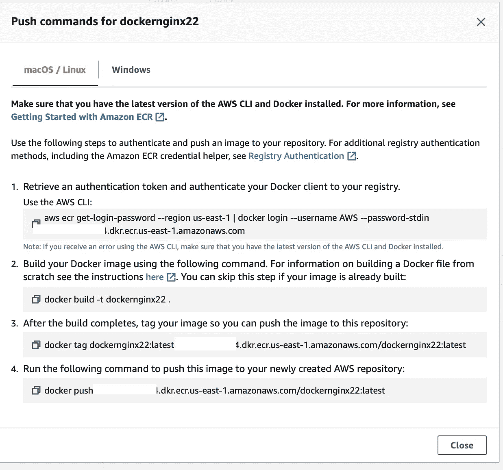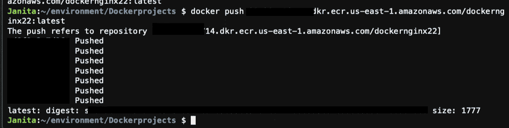

耶！我们已成功将容器保存到 ECR！

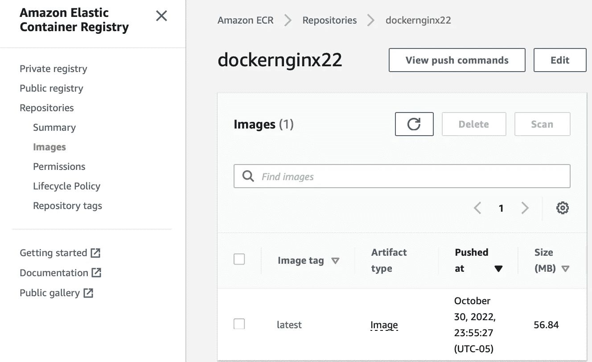

在 AWS ECR 中，您还可以查看已创建的图像！

别忘了删除你的资源！[https://www . geeks forgeeks . org/remove-all-containers-and-images-in-docker/](https://www.geeksforgeeks.org/remove-all-containers-and-images-in-docker/)

```
docker stop $(docker ps -aq)
docker rmi $(docker images -q)
docker rm $(docker ps -aq)
```

# 我们连线吧！


我的 Linkedin 个人资料:【https://www.linkedin.com/in/janita-williamson-186a1a85 


我的 GitHub 用户名:https://github.com/MrsTorres/python-.git[MrsTorres](https://github.com/MrsTorres/python-.git)


一个视觉日记，记录了我从医疗保健到科技世界的咖啡之旅！@caffeinatedtechie