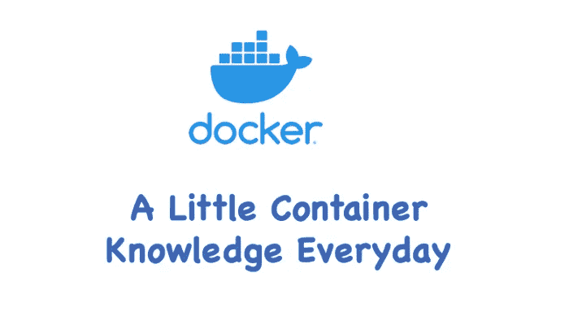
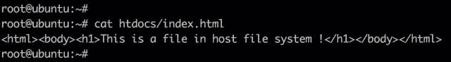
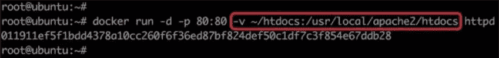
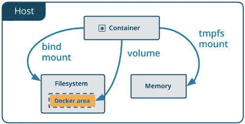
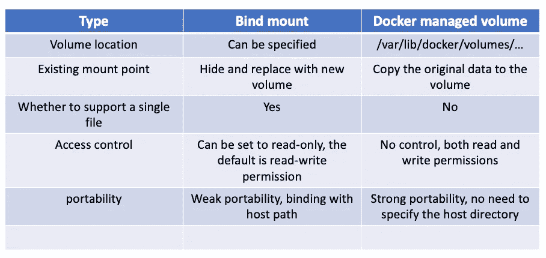

# Docker —数据量

> 原文：<https://blog.devgenius.io/docker-data-volume-af83671e25af?source=collection_archive---------7----------------------->

## 每天一点集装箱知识！



存储驱动和数据卷是容器存储数据的两种方式。我上一篇文章讲了“ [Docker —存储驱动](https://medium.com/geekculture/docker-storage-driver-667c57169379)”，今天这一篇就讲讲数据量。

# 容器数据量

数据卷是保存 Docker 容器生成和使用的数据的首选机制。数据卷本质上是 Docker 主机文件系统中的目录或文件，可以直接挂载到容器的文件系统中。数据卷具有以下特征:

1.  数据卷是目录或文件，而不是未格式化的磁盘(块设备)。
2.  容器可以读写卷中的数据。
3.  即使使用卷数据的容器已被销毁，卷数据也可以持久保存。

好了，现在我们有了一个可以用来存储数据的数据层(图像层和容器层)和卷。如何选择何时使用？考虑以下场景:

1.  数据库实例`vs`数据库数据
2.  Web 应用程序`vs`应用程序日志
3.  数据分析软件`vs`输入/输出数据
4.  Apache 服务器`vs`静态 HTML 文件

相信大家都会做出以下选择:

1.  应用程序部分可以放在数据层。因为这部分内容是无状态的，所以应该是镜像的一部分。
2.  数据部分可以放置在数据卷中。这是需要持久化的数据，应该与图像分开保存。

还有一个大家可能关心的问题:音量的容量如何设置？

因为卷实际上是 docker 主机文件系统的一部分，所以卷的容量取决于文件系统当前未使用的空间，并且当前没有办法设置卷的容量。

## 绑定装载与 Docker 管理的卷

在具体使用中，docker 提供了两种类型的卷:绑定挂载和 docker 管理的卷。

## 绑定安装

绑定装载是将主机上的现有目录或文件装载到容器。例如:

例如，docker 主机上有一个目录$HOME/htdocs:



通过`-v`将其安装到 httpd 容器:



`/usr/local/apache2/htdocs`是 httpd 服务器存储静态文件的地方。由于该控制器已经存在于容器中，因此原始数据将被隐藏并替换为`~/htdocs`中的数据，该数据由于位于主机上而具有持久性。

此外，还可以在绑定挂载时指定数据的读写权限。默认值为可读和可写，也可以指定为只读:

```
$ docker run -d -p 80:80 -v ~/htdocs:/usr/local/apache2/htdocts:ro httpd 
```

`ro`代表只读权限，一旦设置了绑定挂载数据就不能在容器中修改。只有主机有权修改数据，提高了安全性。

除了绑定挂载目录之外，您还可以指定一个单独的文件:

```
$ docker run -d -p 80:80 -v ~/htdocs/index.html:/usr/local/apache2/htdocts/new_index.html:ro httpd
```

挂载点有许多应用场景。例如，我们可以将源代码目录挂载到容器中，并在主机中修改代码，以查看应用程序的实时效果。另一个例子是将 mysql 容器的数据放在 bind mount 中，以便主机可以轻松地备份和迁移数据。

## docker 管理卷

与绑定装载相比，托管卷有几个优势:

*   卷比绑定装载更容易备份或迁移。
*   您可以使用 Docker CLI 命令或 Docker API 来管理卷。
*   卷在 Linux 和 Windows 容器上都可以工作。
*   可以在多个容器之间更安全地共享卷。
*   卷驱动程序允许您将卷存储在远程主机或云提供商上，以加密卷的内容或添加其他功能。
*   新卷的内容可以由容器预先填充。
*   Docker 桌面上的卷比 Mac 和 Windows 主机上的绑定装载具有更高的性能。

此外，卷通常是比在容器的可写层中保存数据更好的选择，因为卷不会增加使用它的容器的大小，并且卷的内容存在于给定容器的生命周期之外。



图片来自 docker.com

docker 管理的卷和 bind 挂载最大的区别是不需要指定挂载源，只需要指定挂载点。还是以 httpd 容器为例:

```
 $ docker run -d -p 80:80 -v /usr/local/apache2/htdocs httpd
```

为此，我们告诉 docker 我们需要一个数据卷，并将其挂载到/usr/local/apache2/htdocs。那么这个数据量到底在哪里呢？

这个答案可以在容器的配置信息中找到，执行命令:`docker inspect`。

```
$ docker inspect dafbfa86b404......
"Mounts": [
{
  "Name": "fe43eaa90cfc3773ef535ec9e0a094d0ab0477ceb74ddebd57d3620ab50e85b1",
  "Source": "**/var/lib/docker/volumes/fe43eaa90cfc3773ef535ec9e0a094d0ab0477ceb74ddebd57d3620ab50e85b1/_data**",
  "Destination": "/usr/local/apache2/htdocs",
  "Driver": "local",
  "Mode": "",
  "RW": true,
  "Propagation": ""
}],
......
```

我们只对上面输出中突出显示的数据量部分感兴趣。“源”是主机上卷的控制器，在我们的例子中，路径是"**/var/lib/docker/volumes/f 4a 0a 1018968 f 47960 EFE 760829 E3 c 5738 c 702533d 29911 b 01 df 9 f 18 babf 3340/_ data "**。

让我们来看一下这条路径:

```
$ # ls -l /var/lib/docker/volumes/fe43eaa90cfc3773ef535ec9e0a094d0ab0477ceb74ddebd57d3620ab50e85b1/_data
total 4
-rw-r--r-- 1 504 ftp 45 Jun 11  2007 index.html
```

从上面的输出中，您可以看到该卷的内容与容器的原始`/usr/local/apache2/htdocs`完全相同。此时，我们可以直接操作数据，因为`/usr/local/apache2/htdocs`不再是容器数据层。例如:

```
$ curl [http://127.0.0.1](http://127.0.0.1)
<html><body><h1>It works!</h1></body></html>$ echo "New index file" > /var/lib/docker/volumes/fe43eaa90cfc3773ef535ec9e0a094d0ab0477ceb74ddebd57d3620ab50e85b1/_data/index.html$ curl [http://127.0.0.1](http://127.0.0.1)
New index file
```

让我们简单回顾一下 docker 管理卷的创建过程:

1.  当容器启动时，只需告诉 docker“我需要一个卷来存储数据，帮我把它挂载到目录`/abc`”。
2.  docker 在`/var/lib/docker/volumes`中生成一个随机目录作为挂载源。
3.  如果`/abc`已经存在，将数据复制到挂载源，
4.  将卷安装到`/abc`

除了查看体积，我们还可以使用命令:`docker volume ls`和`docker volume inspect`。

```
$ docker volume ls
DRIVER    VOLUME NAME
local     3fa47c2ae7a292a922b2233dc348f36fca679e601d65268d893e393d47a61537
local     cd4fbf9aa8ef44c57717f361c85b1b62a1707898e3a19a79d5f073fe84f303e4
local     fe43eaa90cfc3773ef535ec9e0a094d0ab0477ceb74ddebd57d3620ab50e85b1$ docker volume inspect fe43eaa90cfc3773ef535ec9e0a094d0ab0477ceb74ddebd57d3620ab50e85b1
[
    {
        "CreatedAt": "2022-02-21T14:24:44Z",
        "Driver": "local",
        "Labels": null,
        "Mountpoint": "/var/lib/docker/volumes/fe43eaa90cfc3773ef535ec9e0a094d0ab0477ceb74ddebd57d3620ab50e85b1/_data",
        "Name": "fe43eaa90cfc3773ef535ec9e0a094d0ab0477ceb74ddebd57d3620ab50e85b1",
        "Options": null,
        "Scope": "local"
    }
]
```

# 结论

我们已经学习了两种数据量的原理和基本用法:`bind mount`和`docker managed volume`，我整理了一个表格，以便快速比较:

