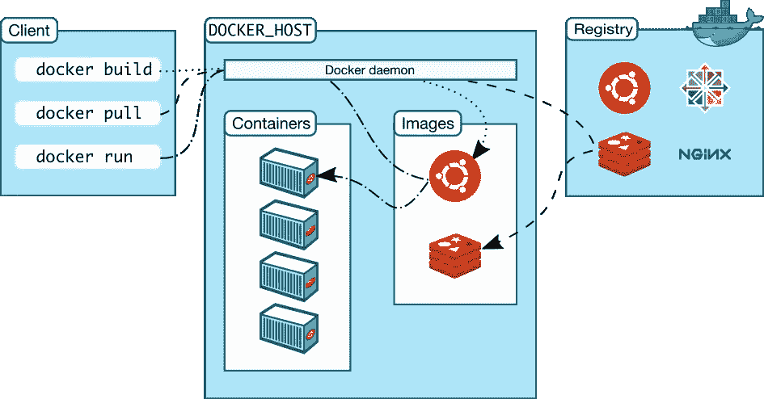
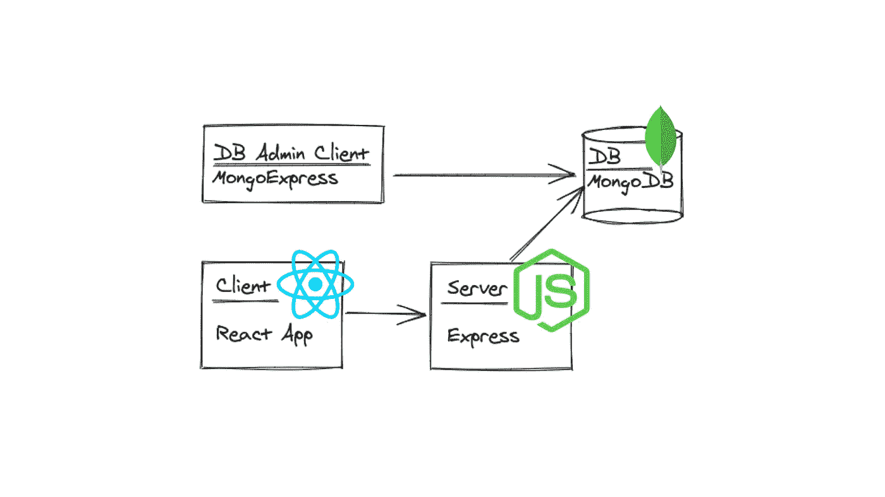
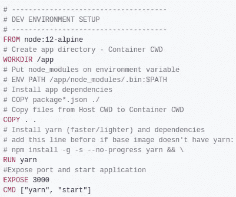
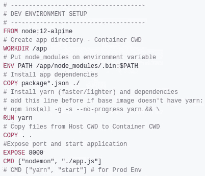

# Docker:开发和生产环境

> 原文：<https://blog.devgenius.io/docker-development-and-production-environments-6f78e3e745ca?source=collection_archive---------11----------------------->

没有膨胀，unsplash 图像，有趣的 gif。这篇简洁的文章讲述了如何使用 Docker 来建立开发和生产环境。



Docker 架构(图片来自[官方文件](https://docs.docker.com/get-started/overview/)

在本帖中，我们将尝试解释所有基本的 Docker 概念，使用以下结构设置 MERN 堆栈应用程序:



带有数据库管理客户端的 MERN (Mongo Express React Node)架构

# 基本 Docker 概念

*   **Docker** :将有依赖关系的应用打包到一个虚拟容器中。
*   **活动主机**:安装了 Docker 且 Docker 守护进程运行在支持版本上的计算机。
*   客户端:Docker 守护进程的主要用户界面，可以在独立的系统上运行，并通过套接字或 RESTful APIs 进行通信。
*   **容器**:保存应用程序实例或实例组运行所需的一切(操作系统、依赖关系等)。
*   **Docker 守护进程**:在主机上构建、运行和管理容器。
*   **Image** :用于创建容器的模板，该模板包含应用实例或实例组的安装及其软件、依赖项和启动容器时要运行的进程。
*   **Docker registries** :供用户上传或下载的图片库。公共 Docker 注册中心被称为 Docker Hub。

# 客户端:将 React 应用程序归档



Dockerfile(用于开发)

> 第一行“FROM …”告诉 Docker 使用来自 Docker Hub 的某个图像(例如 node:12-alpine)作为创建该容器的起点。

在 React 应用程序的根目录下创建一个 docker 文件，如上图所示。您的 fullstack 应用程序应该有一个类似如下的文件夹树:

```
root/
|/client/
  | Dockerfile
  | Dockerfile.prod
|/server/
  | Dockerfile
  | Dockerfile.prod
|docker-compose.yml
```

如果您想将 React 应用作为独立应用进行测试，请运行以下命令:

```
# Builds Image, -t tags it as 'react-app', Dockerfile is in .
docker build -t react-app .
# Runs Container from Image 'react-app'
docker run -it --rm -p 3000:3000 react-app
```

去 [http://localhost:3000/](http://localhost:3000/) 查看你的 app。

```
# Other interesting commands
**docker images** # lists images available on your machine
**docker ps** # lists docker containers running
```

# 服务器:停靠 Express 服务器



Dockerfile 文件

构建和运行上面的 docker 文件将 Express 服务器作为一个独立的容器运行。

…现在，最精彩的部分是:

# 对接全栈 MERN 应用

介绍[**docker-撰写**](https://docs.docker.com/compose/) **。**

docker-compose.yml

Docker-Compose 在一个更加用户友好的界面中为您提供了 Docker 的全部功能。通过配置这个 YML 文件，您可以避免过长的命令行指令。设置好该文件后，运行以下命令:

```
# This will start all services described in the yml file.
docker-compose up
# Run docker-compose down or press ctrl+c to stop the containers.
# The following options can be interesting
docker-compose up [service] # starts just the services described
docker-compose build [service] # rebuilds the images of the services
```

1.  **前端** : 从位于‘client’文件夹中的 Dockerfile 构建镜像，并在端口 3000 上运行。
2.  **后端**:与快递服务器相同
3.  **Mongo&Mongo-Express**:Docker Hub 给你大量服务的免费图片。其中 2 个是 MongoDB 和 MongoExpress。您不再需要在本地开发机器上安装数据库。20 行代码足以设置您的数据库和管理客户机。🤯

对我来说，docker-compose 是 docker 隐藏的瑰宝💎。

# 生产环境呢？

我不会在这里得到太多的细节，因为赌注相当高。本节的目标是指出在将该设置转化为生产时您应该做出的更改和应该关注的问题。

1.  **前端**:我使用了[创建-反应-应用](https://github.com/facebook/create-react-app)，所以代替**纱线开始**，我应该使用**纱线构建**，在这里详细描述了[的多种方式。](https://create-react-app.dev/docs/deployment/)
2.  **后端**:很多可能性...一个想法是用 NGINX 创建一个 web 服务器来服务后端和前端。也许 [Docker Hub 的 NGINX](https://hub.docker.com/_/nginx) ？。
3.  **数据库**:是否应该在容器中运行生产数据库是一个有点两极分化的话题。鉴于这一点以及我不是专业的数据库经理或容器专家的事实，我不知道。

# 资源

1.  [正式备案文件](https://docs.docker.com/)
2.  [克里斯·诺林的 5 部 Docker 系列](https://dev.to/softchris/5-part-docker-series-beginner-to-master-3m1b?wt.mc_id=personal-blog-chnoring) *(* 🔥*比 docs 好)*
3.  [迈克尔·赫尔曼斯的 Dockerize a React App 文章](https://mherman.org/blog/dockerizing-a-react-app/) *(* 🔥*另一种方法)*