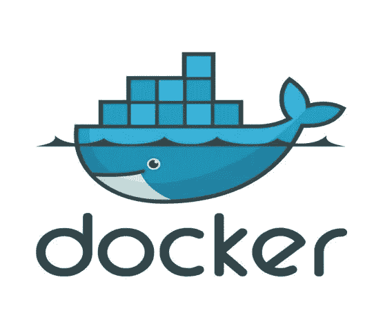
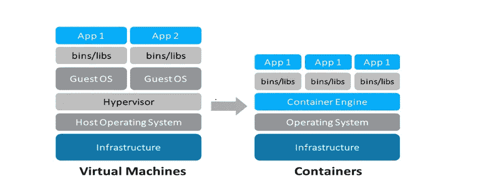
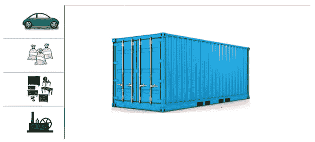
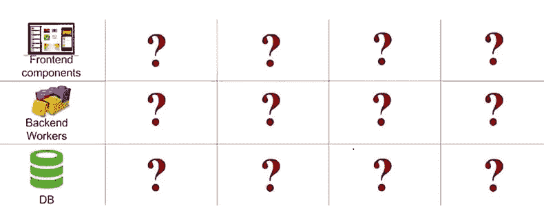
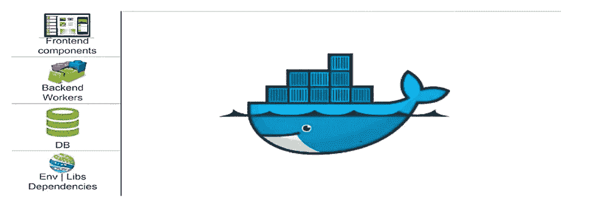
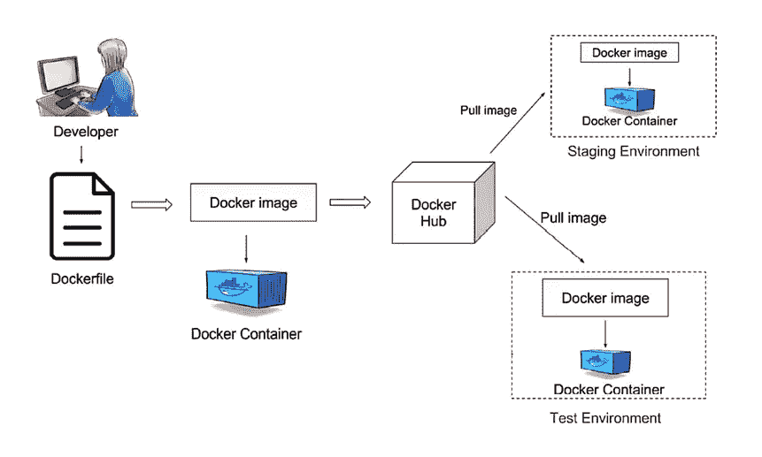

# Docker 深入浅出的解释！！

> 原文：<https://blog.devgenius.io/docker-explained-in-simple-terms-178748e28e99?source=collection_archive---------2----------------------->

Docker 技术的解释不能直接从容器开始。在本文中，我们将从头开始理解 Docker，同时学习这个过程中引入的任何新术语。

**先决条件:**

假设您需要构建一个应用程序。为了让公众可以访问这个应用程序，您需要一个托管它的地方。今天，我们有三种选择:

a)公共网络托管服务:

这些网站如 GoDaddy、1&1 等，可以帮助你托管申请

b)利用云计算模式:

像 Oracle(使用 Oracle 云基础设施)和 Amazon(使用 AWS)这样的公司可以通过自己的数据中心(服务器集合)托管您的应用程序。你可能想知道这个选项与公共网站托管公司有什么不同。答案是“虚拟化”。这意味着硬件资源可以通过软件功能(底层硬件的逻辑分离)进一步分解，您可以只为您使用的服务付费。这是一个具有优化性能的经济实惠的选项。

c)码头工人

Docker 技术为您提供了第三种选择，即所谓的“容器化”概念。让我们通过与虚拟化进行比较来理解这个术语。这两者都有助于您在与底层硬件隔离的环境中部署应用程序。主要的区别是隔离的程度。

*   虚拟化支持通过虚拟机管理程序从底层硬件创建虚拟机(VM)。您可以将虚拟机管理程序视为创建和管理虚拟机的虚拟机监视器。但是，每个虚拟机都包含操作系统(OS)层(作为用户，您必须对其进行管理)。这使得虚拟机重量级(想象一个大小为 1 GB 的虚拟机来部署一个大小为 300 MB 的应用程序)
*   集装箱化用集装箱缓解了这个问题。容器是一个包，它包含应用程序所需的所有部分，如库和依赖项。不是为每个应用程序托管每个操作系统，而是在操作系统和应用程序之间添加另一个称为“容器引擎”的层。这允许所有容器共享操作系统。由于容器不需要嵌入完整的操作系统，它们是非常轻量级的，通常大约 5-100 MB。

**什么是 Docker？**

至此，我们已经到了可以定义 Docker 的地步。技术概念通常可以用类比来理解，

考虑航运业的一个经典问题:

我们有不同形状和特点的产品。一些是易碎的，一些是坚硬的，并且没有标准化的方法来包装这些物品。我们该怎么办？

这就是容器可以帮助的地方！

不管是什么物品，我们都可以把它包装在这个集装箱里，从源头运输到目的地，不做任何改动。现在将同样的场景映射到软件行业。每个应用程序在前端、后端和数据库组件上都有所不同。

我们需要一种标准化的方法来打包应用程序及其依赖项，并将其部署在任何环境中。码头工人和他的集装箱正是这样做的。Docker 是一个工具，旨在通过使用容器来简化应用程序的创建、部署和运行。

**码头工人工作流程:**

1.  每一个 Docker 容器都是从一无所知的纯普通 Linux 机器开始的。然后，我们告诉容器它需要知道的一切——为了运行应用程序，它需要下载和安装的所有依赖项。这个过程是用 done 文件完成的。Dockerfile 是一个用易于理解的语法编写的文本文件，其中包括构建 Docker *映像*的指令(稍后会详细介绍)。Dockerfile 指定了作为容器基础的操作系统，以及语言、环境变量、文件位置、网络端口和它需要的其他组件——当然，还有一旦我们运行了容器，它实际上会做什么。
2.  然后，我们由此构建一个 Docker 图像。您可以在任何需要的时候从同一个映像运行容器。
3.  Docker 图像被上传到 Docker Hub(或任何其他储存库，以立即存储 Docker 图像)。
4.  可以从 Docker hub 中提取图像，并且可以在任何环境(测试环境、生产环境)中部署由它构建的相应容器。

在你感到困惑之前，以下是 Docker 图像和 Docker 容器之间的区别:

Docker **镜像**是可执行包，包含运行应用程序所需的一切——代码、运行时库、环境变量和配置文件。

Docker **containers** 是一个映像的运行时实例——映像在执行时在内存中变成的样子(也就是说，一个带有状态或用户进程的映像)。

**为什么是 Docker？**

1.  Docker 消除了当开发人员在他们的本地机器上为一个项目工作几天(或几周)时不可避免的混乱，一旦部署到新的生命周期，应用程序就不会运行。很可能是因为运行应用程序需要安装大量的依赖项。我们本质上是“运输”开发人员的应用程序(在一个容器中),并将其部署到任何环境中，没有任何部署上的麻烦。
2.  Docker 使得共享和运行复杂的开发环境变得更加容易
3.  使用 Docker 的一个潜在好处是简单和快速的配置

**参考资料和更多资源:**

1.  [https://it next . io/docker-101-fundamentals-the-docker file-b 33 b 59d 0 f 14 b](https://itnext.io/docker-101-fundamentals-the-dockerfile-b33b59d0f14b)
2.  [https://blog . use journal . com/what-is-docker-in-simple-English-a24e 8136 b90b](https://blog.usejournal.com/what-is-docker-in-simple-english-a24e8136b90b)
3.  [https://www . quora . com/What-is-Docker-Please-explain-it-simple-terms](https://www.quora.com/What-is-Docker-Please-explain-it-in-simple-terms)
4.  Dockerfile 文档:[https://docs.docker.com/engine/reference/builder/](https://docs.docker.com/engine/reference/builder/)
5.  码头工人运行参考:[https://docs.docker.com/engine/reference/run/](https://docs.docker.com/engine/reference/run/)