# 面向开发人员和安全专业人员的 Docker

> 原文：<https://blog.devgenius.io/docker-for-devs-and-security-professionals-67fd14a75078?source=collection_archive---------11----------------------->


卢卡·布拉沃在 [Unsplash](https://unsplash.com?utm_source=medium&utm_medium=referral) 上的照片

Docker 和它使之成为可能的容器已经彻底改变了软件行业，在几年内，它们作为一种工具和平台的受欢迎程度飙升，Docker 容器已经成为一种非常受欢迎的技术。在这篇博文中，我将带您了解 docker 的基本组件、架构和基本命令。

**1。DOCKER 是什么？**

Docker 是一个基于容器的开源项目，用于将应用程序自动部署为可移植的、自给自足的容器，可以在任何类型的服务器上的任何地方运行。

Docker 技术使用 Linux 内核和内核的特性，如 Cgroups 和 namespaces，来隔离进程，以便它们可以独立运行。

这种独立性正是 containers 的目的所在——能够独立运行多个流程和应用，以更好地利用您的基础设施，同时保持独立系统的安全性。

**2。什么是 DOCKER 容器？**

Docker 容器映像是一个轻量级的、独立的、可执行的软件包，包括运行应用程序所需的一切:代码、运行时、系统工具、系统库和设置。

容器映像在运行时成为容器，对于 Docker 容器，映像在 Docker 引擎上运行时成为容器。

容器将软件从它的环境中隔离出来，并确保它统一地工作，尽管存在差异，例如在开发和阶段之间。

**3。为什么使用容器？**

容器提供了一种逻辑打包机制，应用程序可以从运行环境中抽象出来。这种分离使得基于容器的应用程序可以轻松、一致地部署，无论目标环境是私有数据中心、公共云，甚至是开发人员的个人笔记本电脑。这使得开发人员能够创建可预测的环境，这些环境与应用程序的其余部分相隔离，并且可以在任何地方运行。

从操作的角度来看，除了可移植性之外，容器还可以对资源进行更细粒度的控制，从而提高基础设施的效率，从而更好地利用计算资源。

**4。码头工人的历史**

这种新的容器化方法的有趣之处在于它并不新鲜。自从 Unix 早期使用 chroot 命令以来，容器的概念就一直存在。

集装箱远非新品；谷歌多年来一直在使用他们自己的容器技术。其他 Linux 容器技术包括 Solaris Zones、BSD Jails 和 LXC，这些技术已经存在很多年了。

1979 年:Unix V7 —引入了 chroot 系统调用，将进程及其子进程的根目录更改到文件系统中的新位置。这一进步是进程隔离的开始。

2000 年:FreeBSD Jails——FreeBSD Jails 允许管理员将一个 FreeBSD 计算机系统划分成几个独立的较小系统——称为“Jails”

2001 年:Linux VServer —引入了一种 jail 机制，可以对计算机系统上的容器资源(文件系统、网络地址、内存)的 Linux_VS 历史进行分区。

2004: Solaris 容器—由区域提供的系统资源控制和边界分隔

2005 年:开放 VZ(Open Virtuozzo)——操作系统级虚拟化技术

2006 年:流程容器——流程容器(由 Google 于 2006 年推出)旨在限制、统计和隔离一组流程的资源使用。

2008 年:LXC- LXC (Linux 容器)是第一个使用 cgroups 和 Linux 名称空间的最完整的 Linux 容器管理器实现。

2011 年:Warden — Warden 可以隔离任何操作系统上的环境，作为守护程序运行，并为容器管理提供 API。

2013 年:LMCTFY——让我为你包容它(LMC tfy)于 2013 年启动，作为谷歌容器栈的开源版本，提供 Linux 应用程序容器。

*   2013 年:Docker——当 Docker 在 2013 年出现时，容器大受欢迎。

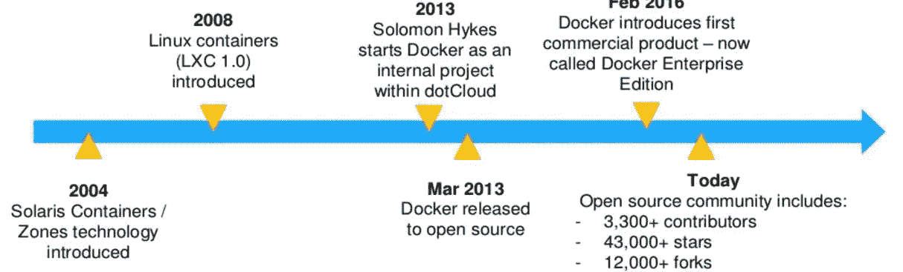

**5。容器与虚拟机**

虚拟机和容器在几个方面有所不同，但主要区别是容器提供了一种虚拟化操作系统的方法，以便多个工作负载可以在单个操作系统实例上运行。通过虚拟机，硬件被虚拟化以运行多个操作系统实例。容器的速度、灵活性和可移植性使它们成为另一种帮助简化软件开发的工具。

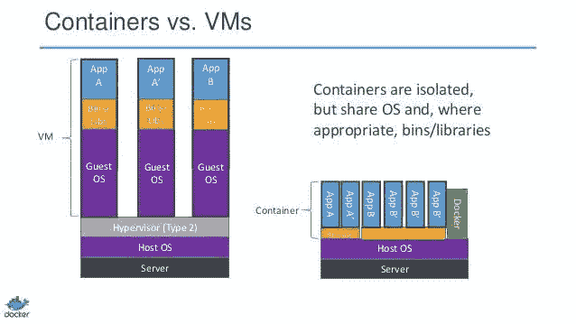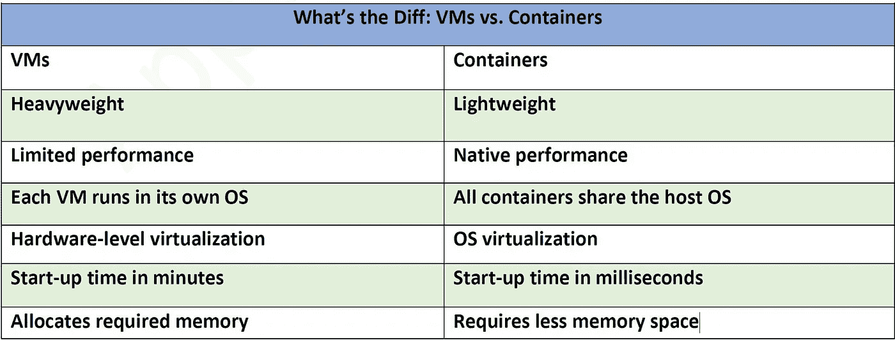

**6。DOCKER 架构**

Docker 使用客户机-服务器架构。Docker Engine 是一个客户端-服务器应用程序，具有以下主要组件:

服务器是一种长期运行的程序，称为守护进程(dockerd 命令)。

一个 REST API，它指定了程序可以用来与守护进程对话并指示它做什么的接口。

命令行界面(CLI)客户端(docker 命令)。

Docker 客户机与 Docker 守护进程对话，后者负责构建、运行和分发 Docker 容器。Docker 客户机和守护进程可以在同一个系统上运行，或者您可以将 Docker 客户机连接到远程 Docker 守护进程。Docker 客户机和守护进程使用 REST API 通过 UNIX 套接字或网络接口进行通信。

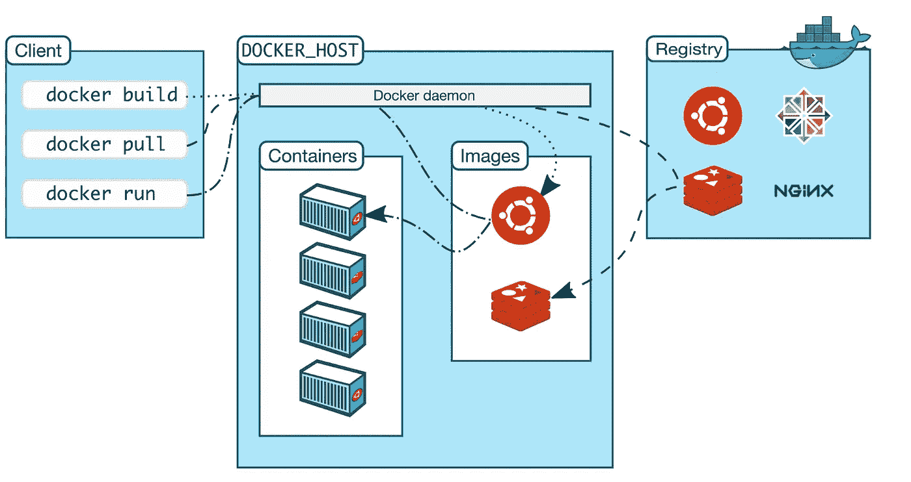

**7。码头术语**

在深入研究 Docker 之前，您应该熟悉一些术语和定义

*   **容器映像**包含创建容器所需的所有依赖项和信息的包。
*   **容器**一个 Docker 图像的实例。容器代表单个应用程序、流程或服务的运行时。
*   **Dockerfile** 一个包含如何构建 Docker 映像的说明的文本文件。
*   **存储库**相关 Docker 图像的集合，用一个标记来表示图像版本。
*   **Registry** 提供对存储库访问的服务。
*   Docker Hub 一个公共注册中心，用于上传图片和使用图片。
*   **Docker Trusted Registry(DTR)**一种 Docker 注册表服务(来自 Docker)，您可以在内部安装，以便驻留在组织的数据中心和网络中。
*   **使用元数据编写一个命令行工具和 YAML 文件格式，用于定义和运行多容器应用程序。**

**8。对接命令**

每个 Docker 命令都有一个基本结构

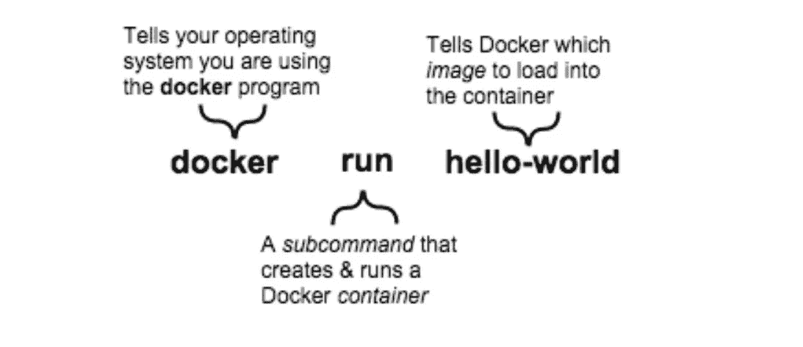

8.1 docker 搜索

用于在 Docker Hub 中搜索图像

*   以下示例显示名称包含“hello-world”的图像，并使用不同的搜索过滤器来调整搜索命令的输出

```
docker search hello-world
docker search --filter stars=10 hello-world
docker search --filter stars=10 --filter is-official=true hello-world
```

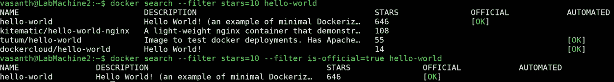

8.2 码头工人拉动

用于从 Docker Hub 提取图像。以下示例从 docker hub 中提取“hello-world”、ubuntu 和 alpine 图像

```
docker pull hello-world
docker pull ubuntu
docker pull alpine:3.6
```

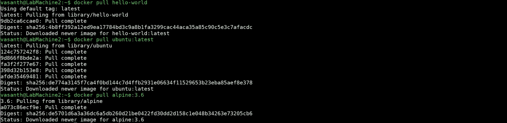

8.3 docker 图像

用于列出 docker 图像。以下示例列出了 docker 图像。

```
docker images
docker image ls
```

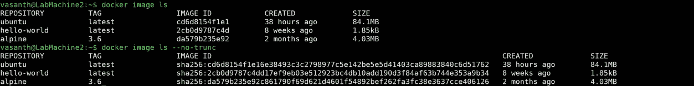

8.4 码头运行

用于根据图像旋转 docker 容器。以下示例基于“Ubuntu:latest”docker 映像构建了一个名为“firstcontainer”的新容器。然后——它指示 Docker 分配一个连接到容器的 stdin 的伪 TTY；在容器中创建交互式 bash shell。

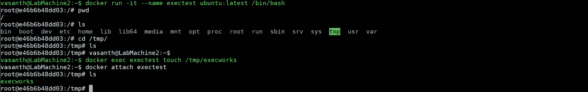

8.5 docker exec

用于在正在运行的容器中运行命令下面的示例旋转一个容器，并使用转义序列在不退出 shell 的情况下分离 tty，并在分离的容器上执行一个命令，以在该正在运行的容器中创建一个文件。

```
docker run -it --name exectest ubuntu:latest /bin/bash
docker exec -e VAR=1 exectest bash
docker exec -w /root exectest pwd
docker exec exectest cat /etc/passwd
```

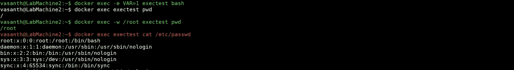

8.6 docker 卷

用于创建、列出、删除和检查卷。以下示例显示了如何创建一个新卷，并将其挂载到新容器中的某个位置。

```
docker volume create hello
docker run -it --rm –name volumetest -v hello:/world alpine ash
docker run -it --rm --name volumetest -v $PWD:/tmp alpine /bin/ash
```

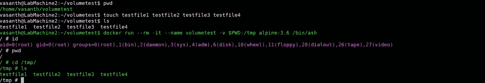

8.6 docker 网络

用于创建、连接、断开、列出和管理网络

*   以下示例显示了如何创建新网络并将其附加到容器

```
docker network create \
--driver=bridge \
--subnet=172.28.0.0/16 \
--ip-range=172.28.5.0/24 \
--gateway=172.28.5.254 \
Mynetworkdocker run --rm -it --name NetworkTest --network Mynetwork alpine /bin/ash
```

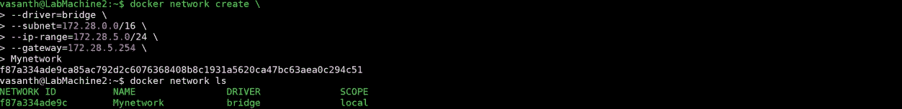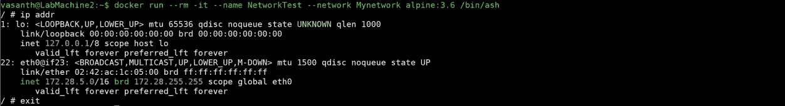

8.7 码头注册

注册中心是一个存储和内容交付系统，包含命名的 Docker 映像，有不同的标记版本。

*   下面的例子显示了如何启动一个注册表容器，从我们的本地注册表推和拉图像。

```
docker run -d -p 5000:5000 --name registry registry:latest
docker image tag alpine:3.6 localhost:5000/myfirstimage
docker push localhost:5000/myfirstimage
docker pull localhost:5000/myfirstimage
```

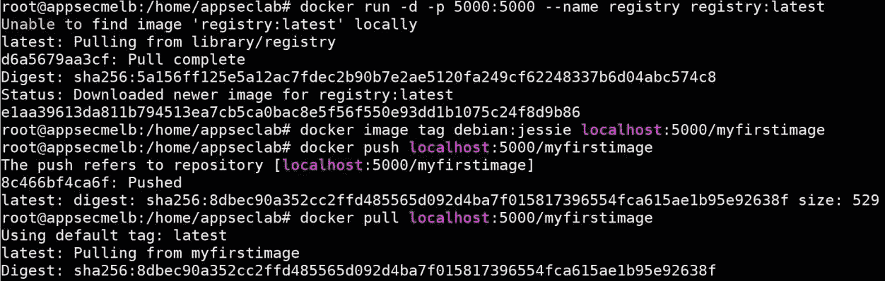

8.8 码头建造

用于从 docker 文件构建映像什么是 docker 文件？

Dockerfile 是一个文本文档，它包含用户可以在命令行上调用的所有命令来组合一个图像。Dockerfile 本质上是带有构建指令的模板，用于构建映像。

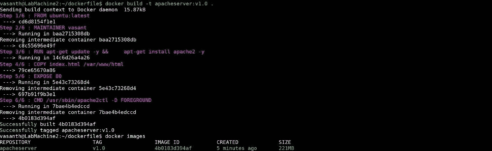

下面的例子显示了如何从我们刚刚建立的图像旋转一个容器。我们旋转容器，将端口 8080 映射到容器上的端口 80

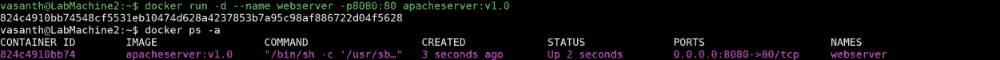

8.9 docker-撰写

Compose 是一个定义和运行多容器 Docker 应用程序的工具。使用 Compose，您可以使用 YAML 文件来配置应用程序的服务。然后，只需一个命令，您就可以从您的配置中创建并启动所有服务。

*   以下示例显示了我们如何使用 docker-compose.yml 文件中定义的启动服务(映像、网络、卷和网络),并验证这些服务是否启动并运行。

```
docker-compose up -d
docker ps -a
docker-compose down -d
```

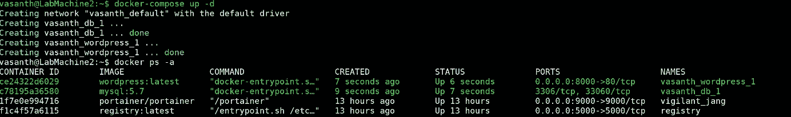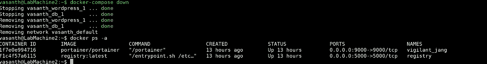

**9。干燥**

Dry 是一个管理 Docker 容器和图像的终端应用程序。它旨在当需要在现有容器和映像上重复执行命令时，作为官方 Docker CLI 的替代，并作为从终端监控 Docker 容器的工具。

```
**Installation**
curl -sSf https://moncho.github.io/dry/dryup.sh | sudo sh
sudo chmod 755 /usr/local/bin/dry
dry
```

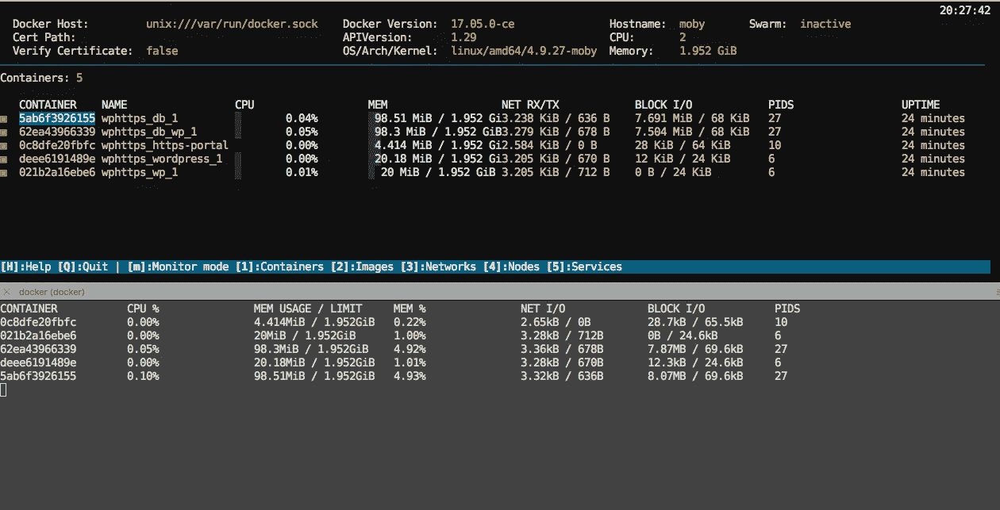

**10。搬运工**

Portainer 是 Docker 的开源轻量级简单管理解决方案。它允许您通过 Portainer web 用户界面轻松管理您的 Docker 主机和 Docker Swarm 集群。

*   下面的例子显示了我们如何拉动和旋转集装箱

```
docker volume create portainer_data
docker run -d -p 9000:9000 -v /var/run/docker.sock:/var/run/docker.sock -v portainer_data portainer/portainer
```

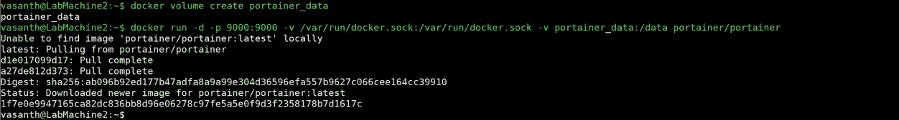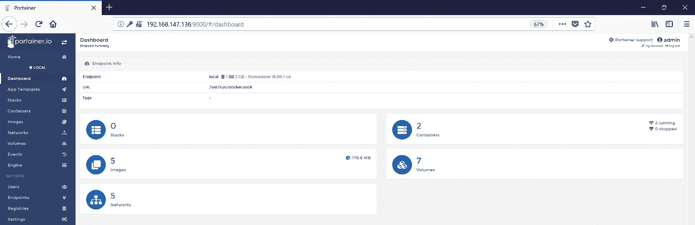

作为这篇博文的继续，在第 2 系列中，我将讨论如何使用开源工具扫描和保护您的容器免受攻击，这些工具也可以集成到 CICD 管道中。