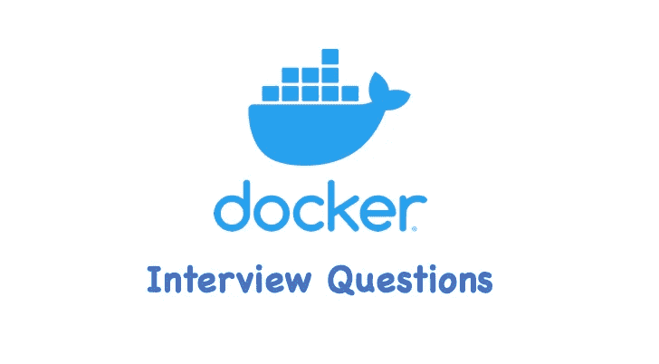

# Docker 基本面试问题——你能回答几个？

> 原文：<https://blog.devgenius.io/docker-interview-questions-how-many-can-you-answer-173437bb8d35?source=collection_archive---------1----------------------->

## 有趣的基础码头工人面试问题



我收集的 Docker 有趣的面试问题，希望对你有帮助:)

# 什么是 Docker

Docker 是一个开源应用容器引擎，基于`Go`编程语言开发，在 Apache2.0 协议下开源。它允许企业创建、测试和部署各种应用程序和软件包到称为容器的单元中，使得为单个主机上的任何应用程序创建轻量级、可移植的自给自足的容器变得容易。

# Docker 常见用例？

*   web 应用程序的自动化打包和发布。
*   自动化测试和持续集成，发布。
*   在基于服务的环境中部署和调整数据库或其他后台应用程序。
*   从头开始编译或扩展现有的 OpenShift 或 Cloud Foundry 平台，构建自己的 PaaS 环境。

# Docker 有什么优势？

Docker 使您能够将应用程序从基础设施中分离出来，这样您就可以快速交付软件。通过利用 Docker 快速交付、测试和部署代码的方法，您可以大大减少编写代码和在生产中运行代码之间的延迟。

*   **灵活**:即使是最复杂的应用程序也有可能被容器化。
*   **轻量级**:容器利用并共享主机内核。
*   **不可变**:容器图像不可变。
*   **可移植**:可以本地构建，部署到云端，在任何地方运行。
*   **可伸缩**:容器副本可以按需添加和分发。
*   **可堆叠**:服务可以垂直即时堆叠。

# Docker 和 VM 有什么区别？

通过添加虚拟机管理程序层，虚拟机将虚拟硬件(如网卡、内存和 CPU)虚拟化，然后在其上构建虚拟机。每个虚拟机都有自己的系统内核。

Docker 容器则通过隔离(namesapce)的方式将文件系统、进程、设备、网络等资源隔离，进而控制权限、CPU 资源等。通过(cgroup)，这样容器就不会互相影响。

容器消耗的资源更少。在同一个主机下，可以创建的容器数量多于虚拟机数量。
但是，虚拟机的安全性比容器稍好，docker 容器与主机共享内核和文件系统等资源，更容易受到其他容器对主机的影响。

# 解释 Docker 的三个核心特性？

*   **镜像** : Docker 的镜像是创建容器的基础，类似于虚拟机的快照，可以理解为 Docker 容器引擎的只读模板。
*   **容器**:从映像创建的运行实例，可以启动、停止和删除。创建的每个容器都是相互隔离和不可见的，以确保平台的安全性。
*   **注册表**:docker 注册表是不同 Docker 图像的集合，这些图像具有相同的名称，但是具有不同的标签。标签就像 Docker 映像的一个版本，例如 v1、v2、v2.1 等。

# 如何修改 Docker 的存放位置？

默认情况下，Docker 的存放位置为:`/var/lib/docker`，要更新默认存放位置，需要停止 Docker 进程:

```
$ systemctl stop docker
```

将`/etc/docker/daemon.json`配置文件更新为以下内容:

```
{
  "data-root": "/new/docker/storage/location"
}
```

然后重新启动守护程序:

```
$ systemctl daemon-reload
$ systemctl start docker
```

# 常用的 Docker 命令有哪些？

*   码头工人拉动
*   码头推送
*   码头信息
*   码头工人检查
*   码头停车
*   docker 启动/重启
*   码头工人 rmi
*   码头工人室

# 如何创建 Nginx 容器？

使用`docker run`命令:

```
$ docker run -d --name my-nginx -p 8080:80 nginx:latest
1d24755e09ffdacc017f6a1d703bc098d24e56f3dc2cabe069b2551c2074ccd7
```

# 如何进入运行容器？

你可以使用`docker exec`命令，例如:

```
$ docker exec -it my-nginx bash
```

# 运行 Docker 容器的流程是什么？

*   检查指定的图像是否存在于本地。当镜像不存在时，将从公共注册表下载；
*   使用映像创建并启动容器；
*   给容器分配一个文件系统，在只读图像层外安装一个读写层；
*   从主机配置网桥(默认模式)；
*   将地址池中的 IP 地址分配给容器；
*   执行用户指定的应用程序，执行后容器终止。

# Docker 网络模式有哪些？

*   **主机**:如果你对一个容器使用`host`网络模式，那么这个容器的网络栈不会与 Docker 主机隔离(容器共享主机的网络命名空间)，并且这个容器不会获得它自己分配的 IP 地址。
*   **桥**:它使用软件桥，允许连接到相同桥网络的容器进行通信，同时提供与未连接到该桥网络的容器的隔离。
*   **容器**:该模式指定新创建的容器与现有容器共享一个网络名称空间，而不是与主机共享。
*   **none** :在 none 模式下，docker 容器拥有自己的网络名称空间，但不对 Docker 容器进行任何网络配置。也就是说这个 Docker 容器没有网卡、ip、路由等信息。在这种网络模式下，容器只有 lo 环回网络，没有其他网卡。这种类型的网络没有办法连接，但是封闭的网络可以保证容器的安全性。

# Docker 的数据量是多少？

数据卷是容器使用的特殊目录，位于容器内。主机的目录可以挂载到数据卷上，数据卷的修改操作马上就能看到，更新的数据不会影响镜像，实现了数据在主机和容器之间的迁移。数据卷的使用类似于 Linux 下目录的挂载操作。

如果需要在容器之间共享一些数据，最简单的方法是使用数据卷容器。数据卷容器是一种普通的容器，它提供数据卷供其他容器装载和使用。

# CMD 和 EntryPoint 有什么区别？

它们都指定了在容器开始运行时执行的程序，区别如下:

*   **当`docker run`命令中有指定的参数时，Docker 守护程序会忽略 CMD** 命令。例如:

```
$ docker run my-image echo Hello 
```

将替换 Dockerfile 中的`CMD`行

*   **ENTRYPOINT** 指令不会被忽略，而是作为命令行参数追加，将其视为命令的参数。例如:

```
# Dockerfile
From ubuntu:20.04ENTRYPOINT
["echo", "Hello From ENTRYPOINT"]$ docker build . -t my-ubuntu
$ docker run my-ubuntu
Hello From ENTRYPOINT
```

如果使用以下参数运行:

```
$ docker run my-ubuntu echo hello Again
Hello From ENTRYPOINT echo hello Again
```

# 添加和复制有什么区别？

*   **ADD** :从< src >复制新的文件、目录或远程 URL，并将其添加到< dest >的镜像文件系统中。它还可以做本地`tar`提取。
*   **COPY** :从< src >中复制新的文件或目录，并添加到容器的文件系统中，路径为< dest >。

一般首选`COPY`，因为它比`ADD`更透明。因为图像大小很重要，所以强烈建议不要使用`ADD`从远程 URL 获取包，而应该使用`curl`或`wget`。