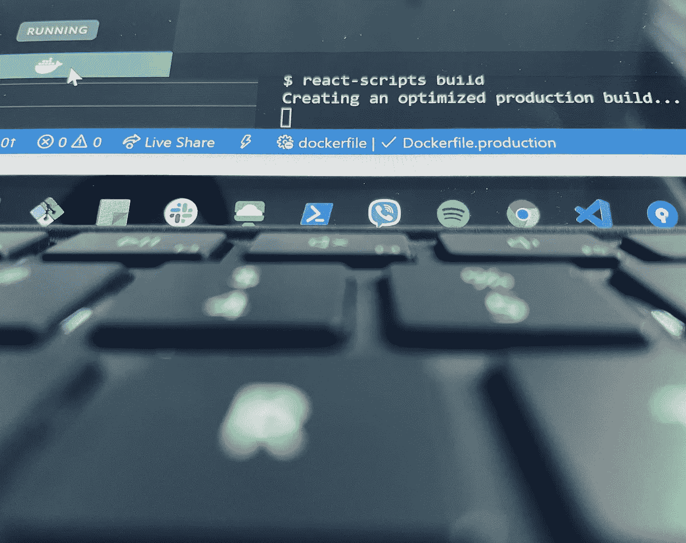
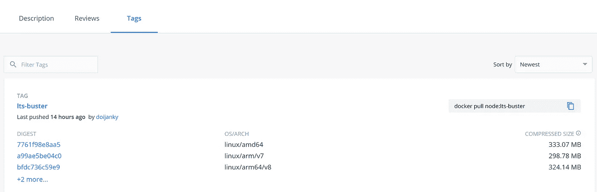
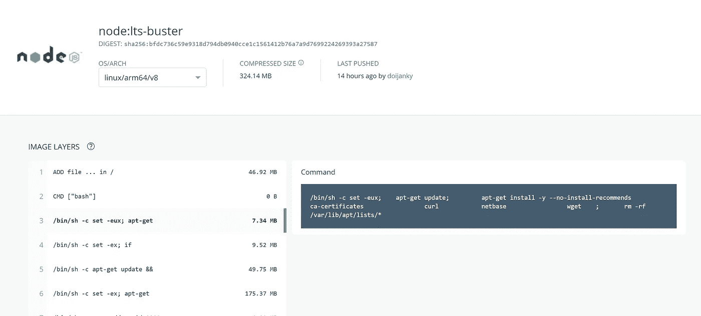

# [Docker]快速提示:充分利用容器的 4 个简单步骤

> 原文：<https://blog.devgenius.io/docker-quick-tips-dcc5d9a97256?source=collection_archive---------6----------------------->

在任何地方运行您的项目，并随时进行优化

每个人都同意集装箱是未来的发展方向。从开发环境**到生产**。从小团队到大团队的协作和跨团队更顺畅的工作流程。即插即用系统的不同组件，交换版本，扩展…这样的例子不胜枚举。

希望下面的技巧可以帮助您解决问题，或者想出改善开发环境的好方法。例如，一些安全的公司网络不允许您的构建工具从公共网络获取映像，在其他情况下，您可能需要调整映像的初始化，安装插件，或者修改环境变量可能不可用的默认配置。此外，本文旨在为您提供一些基本的技巧，可能有助于您提高性能、解决部署问题，甚至减小图像的大小。

假设对不同的操作系统发行版有一些基本的了解，对 docker 上的基本网络设置有一个概念。如果没有，你可以遵循官方图片和博客上的简单指南，这最终会让你对幕后发生的事情有一个更好的了解。

# 1.从简单开始，收集信息。

首先从**的小变化**开始，不要破坏你当前的开发&部署过程。一个通用的网上搜索:“ *<工程构件>码头工*”，会带你走多远。除非你正在开始一个新项目，那么你所需要的，就是挑选一个对你来说更有意义的完整指南，并开始在它的基础上进行构建。

将会有大量的博客或官方帖子讲述如何将项目的一个组件(例如，节点服务器、测试套件、数据库)容器化，回顾它们，尽可能多地理解它们，并记住在它变得对你来说太难应付之前后退一步。

关注*官方* *图片*和官方*最佳实践*，经常检查日期，并快速查看源代码(如果提供的话)。请记住，有些图像只是其他图像的包装。你更喜欢*接近源代码，*这将有助于你以后保持所有的东西都是最新版本。

## 你会发现有用的东西:

*   [docker-desktop](https://www.docker.com/products/docker-desktop)
*   我发现这是定制脚本的一个很好的替代品，你最终可能会创建这些脚本来构建、旋转和推送图像。使用 docker-compose 文件，您可以描述每个容器将如何运行。例如，设置不会在映像中固定的*环境变量*，或者向其传递*参数*，卷挂载、网络配置等等。
*   [Dockerfile](https://docs.docker.com/engine/reference/builder/#usage)
    在你开始玩它之前，先对: [CMD vs ENTRYPOINT](https://www.google.com/search?sxsrf=ALeKk03-RkcEIeXRlUedNFxFkaU1aX07sw%3A1615033407929&ei=P3RDYIufOI-dgQb9zqj4CQ&q=dockerfile+CMD+vs+ENTRYPOINT&oq=dockerfile+CMD+vs+ENTRYPOINT&gs_lcp=Cgdnd3Mtd2l6EAMyAggAMgYIABAHEB4yBggAEAUQHjIECAAQHjoHCAAQRxCwAzoICAAQCBAHEB46CAgAEA0QBRAeOgQIABANOgYIABANEB46CAgAEAgQDRAeOggIABAHEAUQHlCnJ1iSL2CwMWgBcAJ4AIABuwKIAcQIkgEIMTAuMS4wLjGYAQCgAQGqAQdnd3Mtd2l6yAEIwAEB&sclient=gws-wiz&ved=0ahUKEwjLutGk1JvvAhWPTsAKHX0nCp8Q4dUDCA0&uact=5) 有个基本的了解。
    还要确保你了解图层是如何工作的，以及如何保持最终图像的最小尺寸。不需要尝试达到完美的设置，只是让一些东西开始运行。

> 每当你注意到一项任务让你“走得太远”并且开始变得不那么容易理解…确保你**放弃它**，阅读替代的博客资源。*部署世界是巨大的，如果你正在阅读这篇文章，很可能你不是运营部的主要角色。
> 把黑魔法留给他们，保证不踩到他们的脚趾；)*

# 2.Dockerfile 文件、层和步骤

您可能已经猜到，理解 Dockerfile 很重要，它创建可以缓存和重用的层的方式。最重要的是，[多阶段构建](https://docs.docker.com/develop/develop-images/multistage-build/)将帮助你为你的图像定义和重用一系列层。

> 始终考虑构建和运行项目所采取的手动步骤，注意模式，并尝试分别迁移/构建每组步骤。类似于你如何构建软件，拆分功能和重用代码。如果你需要复制粘贴太多东西，当然有更好的方法。

解释这一部分的最好方法是举例。这是一个**节点服务**伴随着一个**反应 CRA** 。Dockerfile 文件应该描述构建，分阶段安装每个项目的依赖项，构建客户端包，运行测试，最后为应用程序提供服务。

NodeJS 和 ReactJS 应用程序的多阶段 docker 文件示例

## 分析

在上面的例子中:

1.  每个阶段的 L **层**将成为**缓存友好的**。我们试图保持内容预期改变的层，不同于更静态的层(例如，源代码复制与 npm 模块安装)
2.  阶段也是如此。我们拆分了**步骤**，我们期望某些部分**是缓存友好的**。例如，如果我们只更新源代码，每个项目的 node_modules 安装更有可能保持不变。另一方面，如果我们只更新 npm_module 的*(非中断)更改，源代码阶段将来自缓存。把它想成*帮手，临时工，形象。**
3.  *本例中的阶段 5 是一个*占位符*，用于与 webclient 项目保持一致。如果你用传送钳的话，会放在那里。*
4.  *最后的**阶段**是我们需要*部署*的图像。安装 npm_modules 所需的所有先前的层没有作为最终映像的**大小**添加。换句话说，我们创建一个虚拟环境，提供所有工具来构建我们的源代码，测试它，然后我们在一个较小的图像库中复制最终结果。*
5.  ***考验，** *第四阶段。在自动化设置的某些阶段，你可能会发现把东西放在一个地方很有用。我发现在我建立自动化过程的中途，运行我的小测试套件真的很方便。一旦我们有了想要测试的图像层。我们在单独的**阶段**使用它作为基础，并运行测试。如果测试失败，映像构建也将被丢弃。**

# *3.想想资源*

*首先你需要理解 Dockerfile 文件的层次，以及。dockerignore*

*   *“build”文件夹(流程输出)应该在。为了避免在映像中复制不必要的数据，这些数据将在构建过程中被替换或者不会被使用。
    同样，生成的报表、单据等文件。有一段时间，您会回过头来开始最小化创建和部署映像所花费的**时间**，以及它们的**大小***

## *边注*

*我们用定义和源代码定义**阶段**，以便**构建测试**和**运行**项目。
有些情况下，在迁移过程中，您可能很难找到最适合您项目的基础映像。您可以定义映像来从您的环境中复制现成的项目。这在某些情况下可能行得通，但是要确保你理解不同操作系统及其运行环境之间的差异，以及这给你的项目的可移植性带来的潜在风险。*

# *3.图像*

*有许多公共注册中心有您可以使用的图像。有些需要你**登录**(例如 [dockerhub](https://hub.docker.com/) 中的一些图片)或者你可能需要使用**私人注册**。记住，你的自动化工具也需要访问它。*

> *您可能会发现有时只需**包装另一个注册表中的现有图像**，并将其上传到您的注册表中会很有用。确保，在这种情况下，保持在更新版本的顶部，也许开始“观察”他们的 github repo 的新版本，并在内部控制你的包装图像的版本。*

## *选择并查看图像*

**

*Dockerhub 屏幕:识别官方图像*

*在 dokerhub 中，需要寻找以下主要关键部分:*

*   *已验证的图像或发布者
    如果图像或发布者已通过**验证**，您将在右侧看到徽章。否则，请确保您检查了将显示为“image by *X* 的配置文件”*
*   *描述
    通常，相关的 Github main Readme.md 会显示为**描述**来给你一些关于如何使用图像的信息，以及它真正的作用。*
*   *有时人们可以评论和评价一张图片的质量，但是你也可以了解它有多活跃，或者有多受欢迎。*
*   *标签
    发布的不仅仅是图像包含的内容，还有正在使用的**图层和基础图像**。请务必快速浏览，并可能注意到您将要使用的版本的**尺寸**。*

**

*图像标签部分和图层大小*

*   *图像层**描述**
    在这里，您可以完整地了解构建步骤，每个命令如何影响您的图像大小，但更重要的是，您可以查看初始化脚本和可能被覆盖的默认配置。*

**

*图像层回顾:构建过程中运行的命令*

# *4.清理本地并测试*

*“docker”命令可以用参数触发，以便在运行或构建失败后进行清理。继续学习这个部分会变得非常复杂。*

*你可以运行“docker system prune -a”来清理 docker 服务下的所有内容。当你还在学习的时候，你会觉得有太多的东西被缓存，你可能不会使用，或者你看到随机的容器和图像被放在一边，这就很方便了。*

# *外卖食品*

*你不必成为一个专家来理解 T2 docker 上的官方文档。但是在采取这一步骤之前，您需要了解什么最适合您，什么是过度杀伤，以及如何以敏捷的方式制定一个好的攻击计划。将你的工作流程向一个更好的设置过渡，在不久的将来，你肯定会对此心存感激。
感谢您的阅读，*

*享受乐趣*