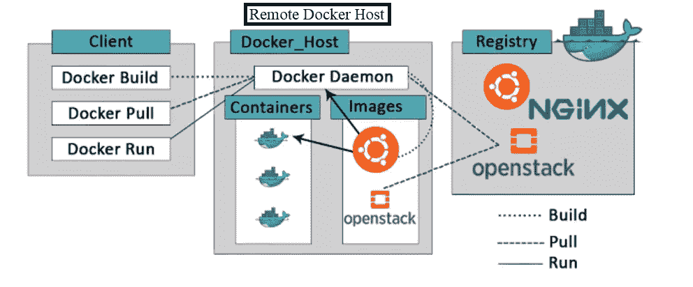
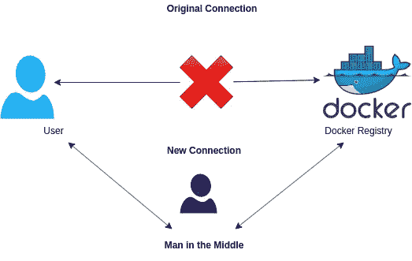
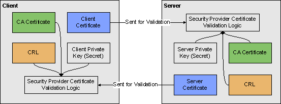

# Docker 安全性:使用 TLS 保护 Docker 守护进程

> 原文：<https://blog.devgenius.io/docker-security-securing-docker-daemon-using-tls-5234b4782047?source=collection_archive---------3----------------------->


Docker 守护进程生成并管理 Docker 对象，如图像、容器、网络和卷，并监听 Docker API 请求。所以保护 docker 守护进程是我们的首要任务。

在本文中，我们将在 Docker 客户端和守护进程之间实现 **TLS 加密。**

默认情况下，Docker 客户机和守护进程之间的通信使用非联网的 Unix 域套接字在本地进行。但是这种通信可以通过使用 TCP 套接字远程进行。看下图:



默认情况下，通过 TCP 的通信是不加密的，这意味着这是一种不安全的通信方式。这使得 Docker 守护进程容易受到网络攻击，如 MITM，中间人攻击。MITM 攻击是指某些第三方在服务器和客户端不知情的情况下进行干扰，截取消息并发送不同的消息。以下是 MITM 攻击的样子:



我们可以通过为 Docker 守护进程和客户端之间的远程连接实现 TLS 加密来避免 MITM 的风险。使用 TLS 加密的过程分为两部分，首先我们需要为远程客户端和服务器生成 TLS 证书。一旦我们生成了 TLS 证书，我们将配置 Docker 守护程序，以便加密到位。为此，我们将更新 Docker 守护程序的配置。

先简单说一下什么是 TLS。TLS 代表传输层安全性，用于加密应用层协议，如 HTTP、FTP、SMTP 等。TLS 结合使用不对称和对称加密，因此可以更安全地传输数据。但是我们不会深究这些细节，因为这不是本文的目的。下面你可以看到 TLS 的工作原理:



如您所见，我们需要一个 CA，以及客户机和服务器的公钥和私钥。所以让我们开始为 Docker 守护进程实现 TLS 吧。

首先为我们的主机生成 CA(认证机构)和私钥。为此，我们需要执行以下命令:

```
openssl genrsa -aes256 -out ca-key.pem 4096
openssl req -new -x509 -days 365 -key ca-key.pem -sha256 -out ca.pem
```

您将被要求输入密码，请确保选择一个您可以记住的强密码。还会要求您提供通用名称，提供 Docker 守护进程主机的 DNS 名称或您机器的主机名。

一旦您建立了我们的 CA 和 CA 私钥，我们就可以创建我们的服务器私钥。

```
openssl genrsa -out server-key.pem 4096
```

这将为我们的服务器生成一个私钥。接下来，我们需要创建一个企业社会责任。CSR 在您计划安装证书的同一台服务器上生成。CSR 包含证书颁发机构(CA)将用来创建您的证书的信息，如通用名称、组织、国家。使用以下命令创建 CSR:

```
openssl req -subj "/CN=$HOST" -sha256 -new -key server-key.pem -out server.csr
```

将`$HOST`替换为我们之前使用的“通用名称”。

由于 TLS 连接也可以使用 IP 进行，因此我们也需要配置我们的 IP，为此输入以下命令，用您的 IP 地址替换 IP_address，用“公共名称”替换`$HOST`。

```
echo subjectAltName = DNS:$HOST,IP: IP_adress >> extfile.cnf
```

为了确保密钥仅用于身份验证，我们将设置密钥仅用于服务器身份验证。

```
echo extendedKeyUsage = serverAuth >> extfile.cnf 
```

一旦我们有了 CA 和服务器密钥，就让我们生成客户端证书:

```
openssl x509 -req -days 365 -sha256 -in server.csr -CA ca.pem -CAkey ca-key.pem \
  -CAcreateserial -out server-cert.pem -extfile extfile.cnf
```

现在让我们为客户端创建证书。我们将重复之前使用的步骤:

```
openssl genrsa -out key.pem 4096

$ openssl req -subj '/CN=client' -new -key key.pem -out client.csr
```

并将其使用权限设置为仅用于验证:

```
echo extendedKeyUsage = clientAuth > extfile-client.cnf 
```

一旦我们有了 CA 和客户端密钥，就让我们生成客户端证书:

```
openssl x509 -req -days 365 -sha256 -in client.csr -CA ca.pem -CAkey ca-key.pem \
  -CAcreateserial -out cert.pem -extfile extfile-client.cnf
```

之后，我们不再需要 CSR，因此我们可以安全地删除它们:

```
rm -v client.csr server.csr extfile.cnf extfile-client.cnf 
```

我们的证书和私钥非常重要和有价值，为了防止它们被意外覆盖，我们需要取消它们的写权限，使它们成为只读:

```
chmod -v 0400 ca-key.pem key.pem server-key.pemchmod -v 0444 ca.pem server-cert.pem cert.pem 
```

瞧，现在你的 docker 守护进程将只接受拥有你的 CA 提供的证书的连接请求。

现在将您的 CA 证书、服务器证书和客户机证书复制到您的客户机上，这样您的客户机就可以通过正确的身份验证访问 docker 守护进程。获得证书后，运行命令并验证 TLS 连接。

```
docker --tlsverify \
    --tlscacert=ca.pem \
    --tlscert=cert.pem \
    --tlskey=key.pem \
    -H=$HOST:2376 version
```

确保用 docker 守护进程主机的 DNS 替换`$HOST`。瞧，从现在开始，你的 docker 将只接受带有 TLS 认证证书的通信请求。

伙计们，现在就到这里吧。愿原力与你同在。