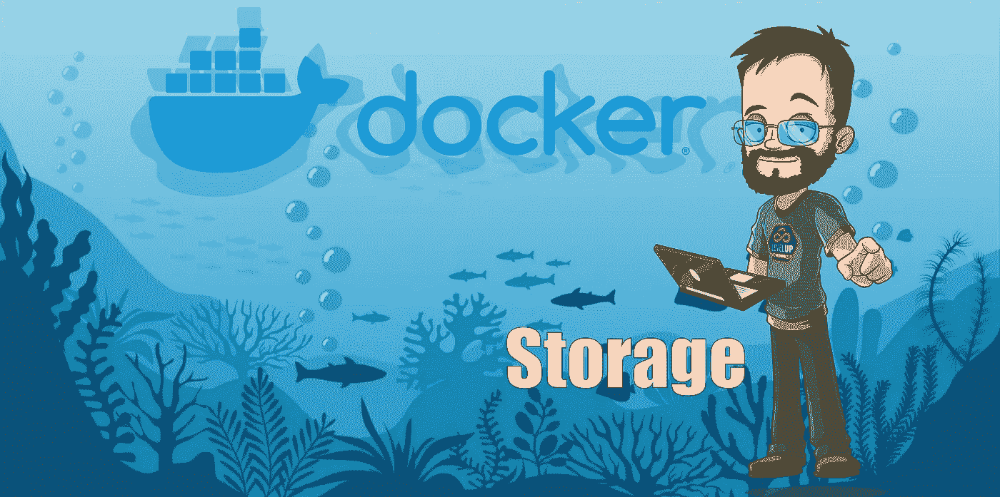
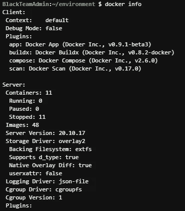
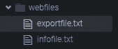
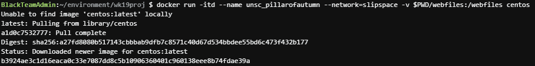
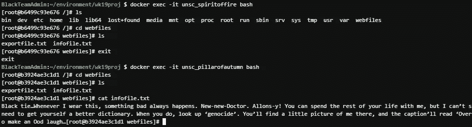
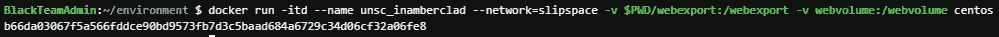
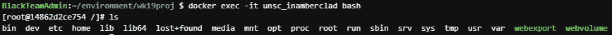
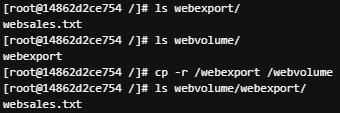
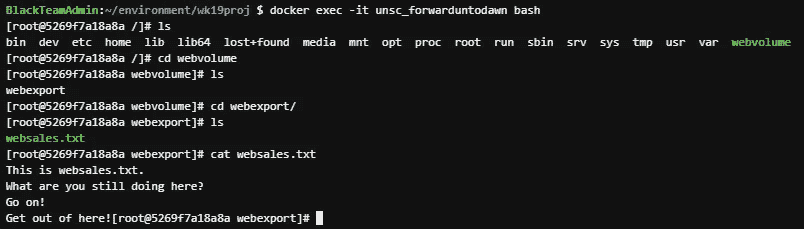

# Docker 储物解决方案

> 原文：<https://blog.devgenius.io/docker-storage-solutions-8fe71d7607f8?source=collection_archive---------7----------------------->

# 介绍

使用 Docker 时，有几种不同的方法来管理数据。该项目将涵盖两个基本选项。

第一种方法是直接将本地目录挂载到容器。虽然这对于快速方便地访问容器中的数据非常有用，但是它的可移植性不是很好，这也是 Docker 容器背后的主要原因。第二种方法更加便携，可以被多个容器使用。但是，它没有为容器上的数据创建一个“直接”访问点。

我们将讨论这两种方法，我希望能展示每种方法的优缺点。

# 设置

现在，在我们开始之前，我们需要一些东西:

*   EC2 实例或安装了 Docker 的其他工作空间
*   终端访问
*   两杯面粉，3 汤匙…哦，对不起，食谱错了！

# 让我们从挂载点开始！

## 验证 Docker 安装

首先，我们应该验证 Docker 已经安装并正在运行。这就像输入`docker info`一样简单。

如您所见，我准备好了，并准备进入下一步:

为了进行测试，我们将创建一个新目录，并将几个文件放入其中

又快又简单！这只是我们验证我们已经正确安装了目录的一种方式。

## 启动几个容器…

现在，我们将使用以下命令运行 Docker 容器:

`docker run -itd --name unsc_pillarofautumn --network=slipspace -v $PWD/webfiles:/webfiles centos`

让我们来分解一下:

*   `docker run`这是我们基地启动集装箱的命令。
*   `-itd`-I、-t 和-d 标志的组合，意味着我们希望将容器从主机上分离，并开始一个交互式会话。
*   `--name`这不是必须的，但有助于使事情变得简单。
*   `--network`这实际上创建/引用了一个新的网络，容器将在该网络上进行通信。
*   `-v`“音量”标志。(*即使它是一个“卷”，通过传递一个本地目录，而不是一个名称，这也被称为一个挂载点。)*我们将此标志与以下选项一起使用:
*   这是我们的本地主机目录。
*   `/webfiles`这是它在容器中的安装位置。如果不存在，就会被创建。
*   `centos`这只是`docker run`将用来构建容器的图像。

然后，我们将运行另一个具有相同选项的容器，只是名称不同。网络是由第一个命令创建的，但是当用于运行第二个容器时，它充当对已经建立的网络的引用。

## 验证两个容器都可以访问数据

对于这一步，我们将使用`docker exec`跳转到容器内部，查看我们已经挂载的文件。

正如我们所看到的，两个容器都可以看到本地目录中的文件。

成功！所以用这个方法，本地目录和容器里面的目录是链接的。任一端的任何变化都会传播到另一端。超级方便，但是不太便携。如果在任何其他环境中执行这个`run`命令，它将会失败，因为目录不太可能是相同的。现在我们已经看到了如何使用挂载点，让我们实际创建一个命名卷，并展示如何使用它！

# 码头命名卷

对于这一部分，我们将创建一个命名卷。Docker 将命名卷视为外部硬盘驱动器，但是多个容器可以使用和访问该卷。

## 创建卷

这很简单。可以使用该命令的可选标志和选项来创建非常特定类型的卷，但现在我们只运行普通卷:

`docker volume create webvolume`这里的“webvolume”只是我们为它选择的名称。

## 加载一些数据

现在，我们的卷是空的，所以让我们修复它！我们将继续旋转另一个容器，这一次显示您可以装载多个卷和装载点:

跳到容器中，我们可以看到两个卷都已装载。一种是单独的卷，另一种是直接挂载到本地目录。

进入容器后，让我们将数据从本地驱动器(webexport)复制到卷(webvolume)中。

## 用新容器验证…

为了确认该卷是包含数据的卷，我们将把它附加到一个全新的容器:

`docker run -itd --name unsc_forwarduntodawn --network=slipspace -v webvolume:/webvolume centos`

登录进去，我们就有了！！

# 结论

因此，今天我们通过两种不同的方式来使用 Docker 与数据进行交互。我希望这是有用的，并易于遵循！一如既往，我欢迎反馈，并希望下次见到你！