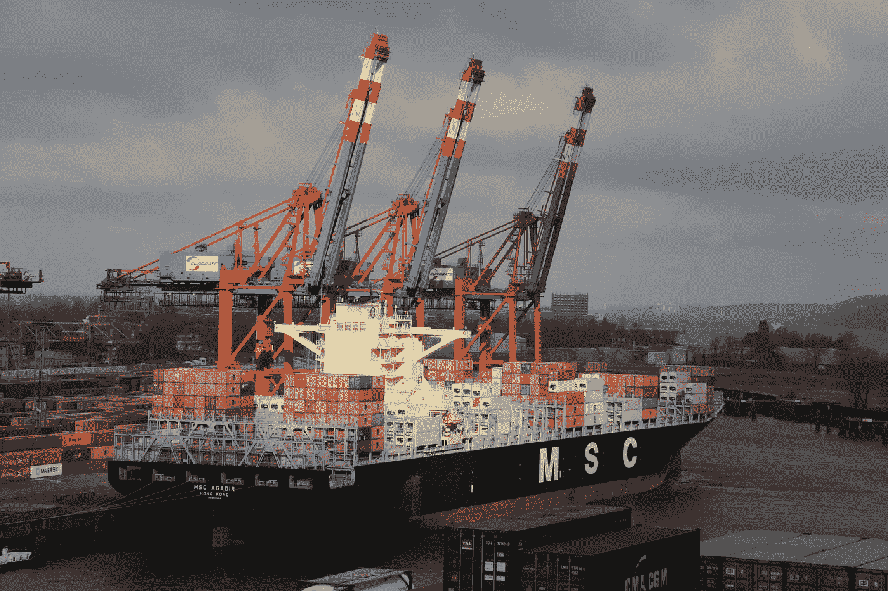
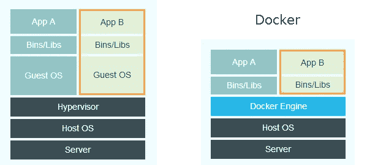
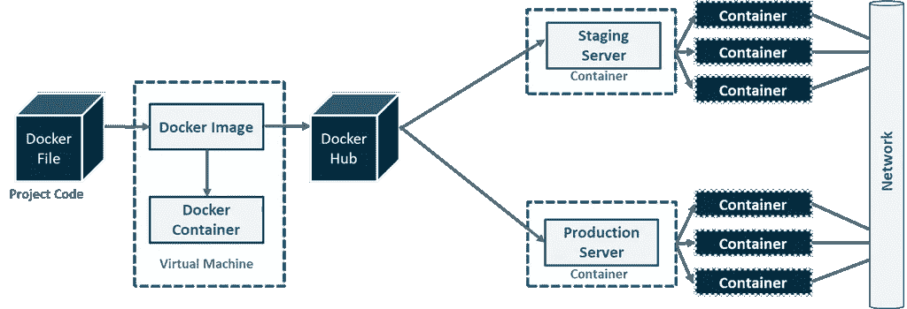

# docker——每个开发人员必须学习的最受欢迎的平台

> 原文：<https://blog.devgenius.io/docker-the-most-loved-platform-every-developer-must-learn-6e5bb702c97b?source=collection_archive---------4----------------------->

## 实际上，根据 Stack Overflow 调查，它是第二大最受开发者喜爱的平台。

在 [Unsplash](https://unsplash.com/s/photos/ship-with-containers?utm_source=unsplash&utm_medium=referral&utm_content=creditCopyText) 上由 [Bernd Dittrich](https://unsplash.com/@hdbernd?utm_source=unsplash&utm_medium=referral&utm_content=creditCopyText) 拍摄的照片

您有没有想过，在一个已经有虚拟机应用程序的时代，我们为什么要转向基于容器的应用程序？docker 是如何让开发的任务变得更简单的？*一些顶级科技公司，如谷歌、亚马逊网络服务(AWS)、英特尔、特斯拉和瞻博网络，都有自己的定制版本的容器引擎。*他们严重依赖 it 来构建、运行、管理和分发他们的应用程序。在尝试判断有用性之前，您应该在入门时了解围绕 Docker 生态系统的最重要的元素和工具。我们来看看什么是 Docker，了解一下它的概念。

# Docker 是什么鬼东西？

Docker 是虚拟机(VM)的轻量级替代方案，旨在通过使用容器来简化应用程序的创建、部署和运行。维基百科对 Docker 的定义是，

> *“一个开源项目，通过在 Linux 上提供一个额外的抽象层和****【OS-level virtual ization】****的自动化，在**容器* *中自动部署软件应用程序。”*

在任何主机操作系统上，我们都有一个 docker 引擎来运行其上的多个容器。这些 docker 容器上运行着一个应用程序，该应用程序又配备了运行该应用程序所需的所有二进制文件和库。

# 但是为什么是 Docker？

在 Docker 出现之前，行业面临的挑战是，在一台机器上开发的应用程序只能在开发环境中运行，而不能在测试或生产环境中运行。这是因为开发和生产之间的计算环境不同。这是 dockerization 使我们的任务更容易的时候。

Docker 在整个软件开发生命周期(SDLC)中提供了一致的环境，从而在整个生命周期中提供了更好的生产力。

# 集装箱化与虚拟化

虚拟化(左)和停靠化(右)的图示比较。*图片来源:谷歌*

在虚拟化中，每个应用程序都在虚拟机上运行，该虚拟机在主机操作系统上导入一个来宾操作系统。这样，我们可以在同一台机器上运行不同的应用程序。现在您可能想知道虚拟化的问题是什么？一个主要缺点是在同一主机系统上运行许多虚拟机会降低系统的性能。在该主机操作系统上运行的客户操作系统有其自己的一组内核库和依赖项，这些内核库和依赖项会占用大量资源，如硬盘处理器和 RAM，并且在启动实时应用程序时会花费很多时间。

集装箱运输就这样被引进了。这里不需要来宾操作系统，相反，应用程序将利用主机操作系统。因此，每个容器都将共享主机操作系统，并且每个容器中都有自己的应用程序和库。容器将根据它们的需求使用 RAM 和磁盘空间，从而大大提高系统的性能。

# Docker 网络的图示概述

Docker 概述。*图片来源——谷歌*

# Dockerfile 文件

Dockerfile 是一个文本文件(没有任何。txt 扩展名)，用于构建包含所有项目代码的 docker 映像。这个文件包含定制 docker 映像的命令和参数。Docker 可以通过读取 docker 文件中的指令来自动构建映像。

## Dockerfile 中使用的命令

*   **FROM →** *定义一个用于启动构建过程的基础映像*。
*   **维护者→** *该图像维护者的姓名和邮箱。*
*   **复制 *→*** *将文件或目录复制到镜像中。*
*   **添加*→******与 COPY 相同，其中包含两个自变量 source 和 destination path。***
*   ****运行 *→*** *将命令作为参数运行，形成镜像，比如 apt-get install。***
*   ****CMD *→*** *容器初始化时运行的默认命令。可以用命令行参数覆盖。***
*   ****ENV →** *在容器中设置一个环境变量。***
*   ****暴露 *→*** *从容器中暴露端口。必须通过运行命令使用-P 或-p 向主机显式公开。***
*   ****卷 *→*** *指定一个目录，用于存储与容器相关的文件内容。***
*   ****入口点 *→*** *用于覆盖 cmd 命令。当容器运行时，这个命令是为构建的映像执行的第一个命令。***
*   ****用户***→为运行、CMD 和进入点设置用户。***
*   ****WORKDIR *→*** *设置运行、CMD、入口点、添加和复制的工作目录。***

# **Docker 图像**

**映像是一个蓝图，可以从它开始任意数量的全新容器。它只读取用于创建容器的模板( *Dockerfile* )。它包含特定应用程序的所有依赖项和要求。**

# **码头集装箱**

**假设您希望运行一个与系统中的其他东西隔离的命令。它应该只访问允许它访问的资源(存储、CPU、内存)，并且不知道机器上还有其他东西。在容器中运行的进程认为它是唯一的，并且只看到了映像中描述的内容的准系统 Linux 发行版。**

***这听起来很像虚拟机，对吗？是的。只有容器启动更快，资源开销更少。**这是一个 Docker 映像的运行时实例。它包含运行应用程序所需的一切。**一个或多个图像可以用来构建一个容器。运行容器的机器不应该太关心里面有什么，dockerized 应用程序不关心它是在 Kubernetes 集群上还是在单个服务器上，反正它将能够运行。一个容器可以同时运行多个进程。但是我更愿意把它限制在一个，我还没有看到任何这样做的事情。你可以将许多服务打包到一个容器中(比如说 [*Nginx*](https://www.nginx.com/) )，并让它们一起运行。***

# *Docker 卷*

*图像永远不会改变，只是你创造了新的，但仅此而已。另一方面，默认情况下，容器不会留下任何东西。如果您没有将容器保存为图像，对容器所做的任何更改都会在删除后立即丢失。因此，容器本质上是短暂的。*

*但是数据持久化真的没有用吗？没错。这就是 docker 卷的用武之地。当启动 Docker 容器时，您可以指定某些目录是本地目录(主机)或卷的挂载点。写入主机装载目录的数据很容易理解(因为您知道它在哪里)，卷用于保存持久数据或共享数据，但是在使用它们时，您不必了解主机的任何信息。您可以创建一个卷，Docker 确保它在那里，并保存在主机系统的某个地方。*

# *码头枢纽*

*[Docker Hub](https://hub.docker.com/) 是 Docker 提供的一项服务，用于查找容器图像并与您的团队共享。它也称为容器注册表。*

*它提供了以下主要功能:*

*   ***存储库:**推和拉容器图像。*
*   ***团队&组织:**管理对容器映像私有存储库的访问。*
*   ***官方图片:**拉取使用 Docker 提供的优质集装箱图片。*
*   ***发布者图像:**拉取并使用外部供应商提供的高质量容器图像。认证映像还包括支持和保证与 Docker Enterprise 的兼容性。*
*   ***构建:**从 GitHub 和 Bitbucket 自动构建容器映像，并推送到 Docker Hub。*
*   ***Webhooks:** 在成功推送存储库后触发动作，将 Docker Hub 与其他服务集成。*

# ***被迷住了吗？让我们安装 Docker***

*为了安装 Docker，你可以去他们的官网。*

* [## 安装 Docker 引擎

### Docker Engine 可在多种 Linux 平台、macOS 和 Windows 10 上通过 Docker Desktop 获得，并作为…

docs.docker.com](https://docs.docker.com/engine/install/) 

你也可以使用 docker 的官方平台，在那里你可以尝试下面的命令来开始使用 docker。

 [## 和 Docker 一起玩

### 通过活动、在线资源和 Docker 程序与其他 Docker 用户联系。

www.docker.com](https://www.docker.com/play-with-docker) 

# 使用 Docker 的命令

现在你已经安装了 Docker 或者登录到了操场，试试下面的命令，看看会发生什么。*你可以阅读大量的博客，但你只能在实践中学习，除非你是* [*斯蒂芬·斯奇特过目不忘*](https://getyarn.io/yarn-clip/c4c5ea76-f603-41e3-aa28-abf56829f1a3) *。*

与图像交互的命令:

*   **docker 图像** : *显示所有图像。*
*   **docker 导入:** *从 tarball 创建图像。*
*   **docker build:** *从 Dockerfile 创建一个图像。*
*   **docker 提交:** *从容器中创建一个图像。*
*   **docker rmi:** *删除图像。*
*   **docker 历史:** *列出一个图像的变化。*

与容器交互的命令:

*   **docker -v** : *显示 docker* 当前安装的版本
*   **docker–help**:*列出了 docker* 中可用的命令
*   **docker pull** : *将图像拉至 docker hub 库*
*   **docker run -it -d** : *从图像中创建一个容器*
*   **docker ps** : *列出正在运行的容器*
*   **docker ps -a** : *显示所有运行和退出的容器*
*   **docker exec -it bash** : *访问正在运行的容器(用于检查日志)*
*   **停靠站** : *停止运行中的容器*
*   **docker kill** : *通过立即停止执行来杀死容器*
*   **docker 登录** : *登录 docker hub 库*
*   **docker 推送** : *将图像推送到 docker hub 库*
*   **docker images** : *列出本地存储库中的所有图像*
*   **docker 构建** : *从指定的 docker 文件*构建图像
*   **docker 导出** : *将容器的文件系统导出为 tar 存档*
*   **docker 导入** : *从 tarball 导入内容以创建文件系统映像*
*   **码头集装箱** : *对集装箱*进行各种操作
*   **docker 容器日志** : *指定容器的日志*
*   **码头集装箱** **杀死** : *杀死集装箱*
*   **码头集装箱 rm** : *删除停止的集装箱*
*   **docker 容器**开始 : *开始一个容器*

# 等等，有缺点？

具有不同操作系统要求的应用程序不能一起托管在同一个 Docker 主机上。例如，假设我们有 4 个不同的应用程序，其中 3 个应用程序需要基于 Linux 的操作系统，另一个应用程序需要基于 Windows 的操作系统。在这种情况下，需要基于 Linux 的操作系统的 3 个应用程序可以托管在单个 Docker 主机上，而需要基于 Windows 的操作系统的应用程序需要托管在不同的 Docker 主机上。

# 这是一个总结！

希望您对 Docker 及其有用性有所了解。既然现在 Docker 已经被用的无处不在，那可就有点吃不消了。[根据 2020 年堆栈溢出调查，Docker 是第二大最受开发者喜爱的平台](https://insights.stackoverflow.com/survey/2020#most-loved-dreaded-and-wanted)。希望你能明白为什么 Docker 如此重要，为什么每个开发人员都必须学习它。当然，这篇文章不会让你成为 *Docker Jedi* ，你可以在他们的官方文档中了解更多。

 [## 码头文件

### Docker 文档的主页

docs.docker.com](https://docs.docker.com/) 

如果你喜欢读这篇文章，你可能也会发现下面的文章值得你花时间去读。

 [## 每个开发人员都必须知道的关于 Spring Boot 的特性

### 该框架通常被称为“类固醇上的弹簧”，的确如此。

blog.devgenius.io](/features-that-every-developer-must-know-about-spring-boot-c1c0d7f1c0a8)  [## 每个软件开发人员都必须知道的设计模式

### 这些久经考验的解决方案提高了编程效率。

python .平原英语. io](https://python.plainenglish.io/design-patterns-that-every-software-developer-must-know-ac71f575e68)  [## 每个开发人员都必须具备的 Java 8 特性的综合说明

### Java SE 15 于 2020 年 9 月发布，附带一系列特性，但 Java 8 特性仍然是最…

medium.com](https://medium.com/swlh/comprehensive-notes-for-java-8-features-every-developer-must-have-c08efc8ba39)*