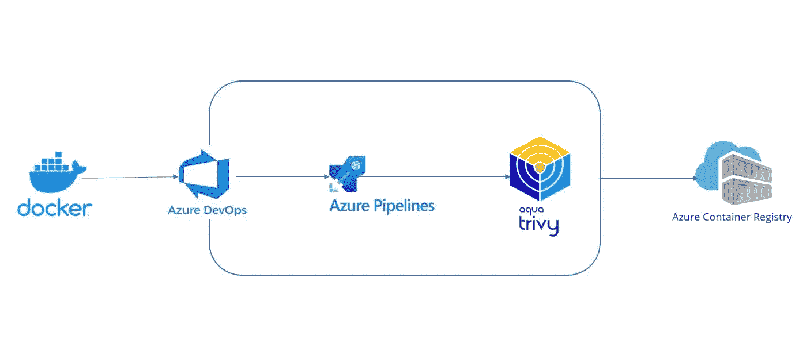
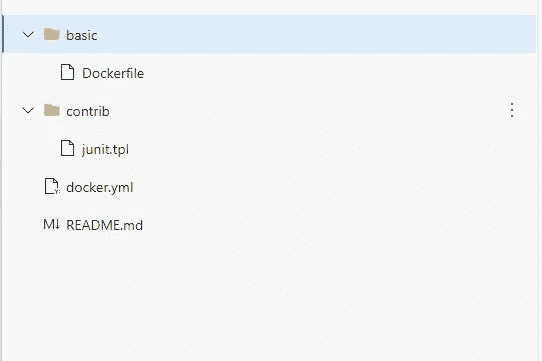
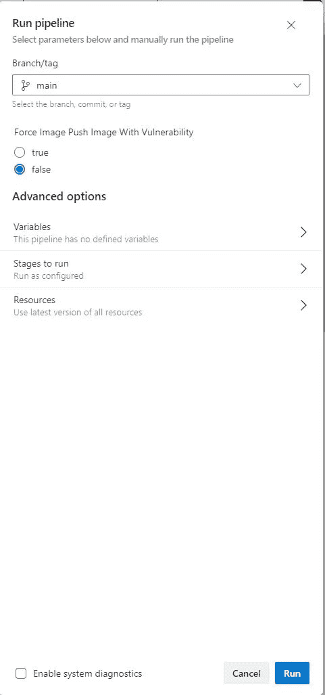
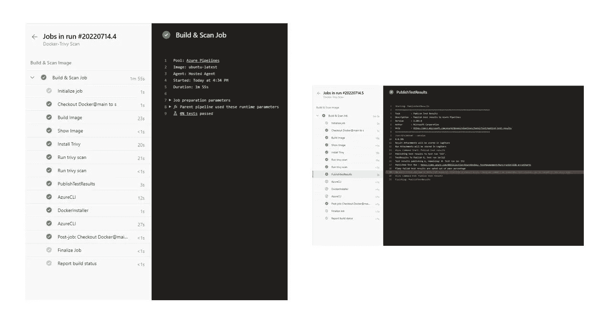
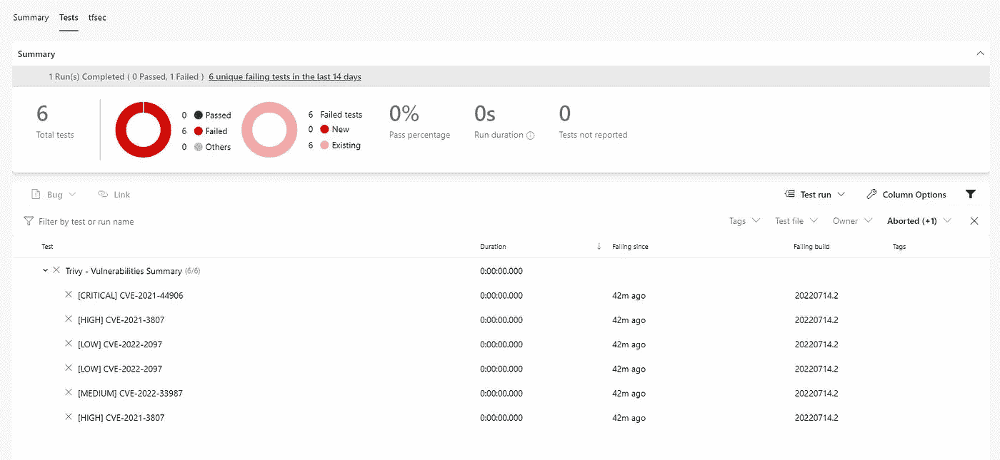
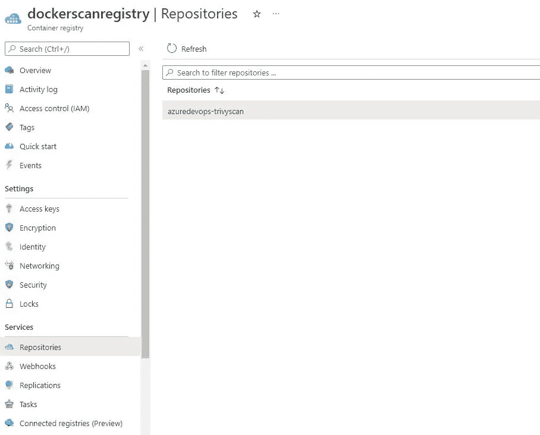

# 使用 Trivy 和 Azure DevOps 进行 Docker 漏洞评估

> 原文：<https://blog.devgenius.io/docker-vulnerability-assessment-with-trivy-and-azure-devops-60c95a2d05c5?source=collection_archive---------1----------------------->



流动

在本文中，我将解释如何在 docker 容器的 Azure DevOps 管道中实现 DevSecOps 流程。

作为实施的一部分，我们将执行以下活动

*   创建一个示例 Dockerfile 文件
*   建立 docker 形象
*   使用 trivy 在图像上执行扫描
*   将图像推送到 Azure 容器注册表

## **关于繁琐的简要:**

Trivy ( `tri`读作 trigger，`vy`读作 envy)是一款全面的安全扫描器。它是可靠的，快速的，非常容易使用，并且它在你需要它的任何地方工作。

Trivy 有不同的*扫描器*来寻找不同的安全问题，以及不同的*目标*来发现这些问题。

目标:

*   容器图像
*   文件系统
*   Git 存储库(远程)
*   Kubernetes 集群或资源

扫描仪:

*   正在使用的操作系统包和软件依赖项(SBOM)
*   已知漏洞(CVE)
*   IaC 错误配置
*   敏感信息和秘密

**先决条件:**

1.  你有一个 Azure DevOps 项目
2.  您拥有有效的 Azure 订阅
3.  您已经在本地计算机中配置了 Azure CLI

**安装 Azure CLI:** 按照[安装 Azure CLI](https://docs.microsoft.com/en-us/cli/azure/install-azure-cli) 中提供的说明来设置您的 Azure CLI 环境。

# 步骤:

1.  为 Azure 容器注册表创建资源组

```
az group create --name dockerscan --location eastus
```

2.创建 Azure 容器注册表

```
az acr create --resource-group dockerscan --name dockerscanregistry --sku Basic
```

3.创建用于在 ACR 中执行推送操作的服务主体

```
az ad sp create-for-rbac --name dockerscanuser --role Reader --scopes subscriptions/mysubscriptionid/resourceGroups/dockerscan
```

4.为创建的服务主体启用 acrpush 角色

```
az role assignment create --assignee "serviceprincipalid" --scope /subscriptions/subscriptionid/resourceGroups/dockerscan/providers/Microsoft.ContainerRegistry/registries/dockerscanregistry --role acrpush
```

5.使用上面创建的服务主体凭据创建 Azure 资源管理器服务连接。遵循官方文档创建服务连接[链接](https://docs.microsoft.com/en-us/azure/devops/pipelines/library/service-endpoints?view=azure-devops&tabs=yaml)

6.按照下面的结构在 Azure Repo 中创建一个样本 docker 文件和模板



样本文档

```
# syntax=docker/dockerfile:1
FROM node:12-alpine
RUN apk add --no-cache python2 g++ make
WORKDIR /app
COPY . .
RUN yarn install --production
CMD ["node", "src/index.js"]
EXPOSE 3000
```

模板文件 contrib\junit.tpl

```
<?xml version="1.0" ?>
<testsuites>
{{- range . -}}
{{- $failures := len .Vulnerabilities }}
    <testsuite tests="{{ $failures }}" failures="{{ $failures }}" name="{{  .Target }}" errors="0" skipped="0" time="">
    {{- if not (eq .Type "") }}
        <properties>
            <property name="type" value="{{ .Type }}"></property>
        </properties>
        {{- end -}}
        {{ range .Vulnerabilities }}
        <testcase classname="{{ .PkgName }}-{{ .InstalledVersion }}" name="[{{ .Vulnerability.Severity }}] {{ .VulnerabilityID }}" time="">
            <failure message="{{ escapeXML .Title }}" type="description">{{ escapeXML .Description }}</failure>
        </testcase>
    {{- end }}
    </testsuite>
{{- $failures := len .Misconfigurations }}
    <testsuite tests="{{ $failures }}" failures="{{ $failures }}" name="{{  .Target }}" errors="0" skipped="0" time="">
    {{- if not (eq .Type "") }}
        <properties>
            <property name="type" value="{{ .Type }}"></property>
        </properties>
        {{- end -}}
        {{ range .Misconfigurations }}
        <testcase classname="{{ .Type }}" name="[{{ .Severity }}] {{ .ID }}" time="">
            <failure message="{{ escapeXML .Title }}" type="description">{{ escapeXML .Description }}</failure>
        </testcase>
    {{- end }}
    </testsuite>
{{- end }}
</testsuites>
```

7.创建 Azure DevOps 管道 yaml 配置

> 变量

```
variables:
  registry: dockerscanregistry.azurecr.io
  tag: $(Build.BuildId)
  imageName: azuredevops-trivyscan
```

> 因素

```
parameters:
  - name: ForceImagePushImageWithVulnerability
    values:
      - true
      - false
    default: false
    displayName: Force Image Push Image With Vulnerability
```

> **步骤**

构建 Docker 映像

```
- task: CmdLine@2
    displayName: Build Image
    inputs:
      script: 'docker build -t "$(registry)/$(imageName):$(tag)" $(System.DefaultWorkingDirectory)/basic'
```

安装三脚架

```
- task: CmdLine@2
    displayName: Install Trivy
    inputs:
      script: |
        sudo apt-get install wget apt-transport-https gnupg lsb-release
        wget -qO - [https://aquasecurity.github.io/trivy-repo/deb/public.key](https://aquasecurity.github.io/trivy-repo/deb/public.key) | sudo apt-key add -
        echo deb [https://aquasecurity.github.io/trivy-repo/deb](https://aquasecurity.github.io/trivy-repo/deb) $(lsb_release -sc) main | sudo tee -a /etc/apt/sources.list.d/trivy.list
        sudo apt-get update
        sudo apt-get install trivy
```

运行普通扫描

```
- task: CmdLine@2
    displayName: "Run trivy scan"
    inputs:
      script: |
          trivy image --format template --template "[@contrib/junit](http://twitter.com/contrib/junit).tpl" -o test.xml $(registry)/$(imageName):$(tag)
```

发布扫描结果

```
- ${{ if eq(parameters.ForceImagePushImageWithVulnerability, 'false') }}:
    - task: PublishTestResults@2
      inputs:
        testResultsFormat: 'JUnit'
        testResultsFiles: '**/test.xml'
        mergeTestResults: true
        failTaskOnFailedTests: true
        testRunTitle: 'Trivy - Vulnerabilities Summary'
  - ${{ if eq(parameters.ForceImagePushImageWithVulnerability, 'true') }}:
    - task: PublishTestResults@2
      inputs:
        testResultsFormat: 'JUnit'
        testResultsFiles: '**/test.xml'
        mergeTestResults: true
        failTaskOnFailedTests: false
        testRunTitle: 'Trivy - Vulnerabilities Summary'
```

> 引入了参数 forceimagepushimagewithflubility，以便在由于扫描失败而需要推送具有已知问题的映像的情况下提供选项。

ACR 登录和 Docker 推送图像

```
- task: AzureCLI@2
    condition: succeeded()
    inputs:
      azureSubscription: 'connection-contributor'
      scriptType: 'bash'
      scriptLocation: 'inlineScript'
      inlineScript: 'az acr login --name dockerscanregistry'
  - task: DockerInstaller@0
    condition: succeeded()
    inputs:
      dockerVersion: '17.09.0-ce'
  - task: AzureCLI@2
    condition: succeeded()
    inputs:
      azureSubscription: 'connection-contributor'
      scriptType: 'bash'
      scriptLocation: 'inlineScript'
      inlineScript: 'docker push $(registry)/$(imageName):$(tag)'
```

## 完整的管道 yaml 配置

```
trigger: none

pool:
  vmImage: 'ubuntu-latest'
variables:
  registry: 'dockerscanregistry.azurecr.io'
  tag: '$(Build.BuildId)'
  imageName: 'azuredevops-trivyscan'
parameters:
  - name: ForceImagePushImageWithVulnerability
    values:
      - true
      - false
    default: false
    displayName: Force Image Push Image With Vulnerabilitysteps:
  - task: CmdLine@2
    displayName: Build Image
    inputs:
      script: 'docker build -t "$(registry)/$(imageName):$(tag)" $(System.DefaultWorkingDirectory)/basic'
  - task: CmdLine@2
    displayName: Show Image
    inputs:
      script: 'docker image ls'
  - task: CmdLine@2
    displayName: Install Trivy
    inputs:
      script: |
        sudo apt-get install wget apt-transport-https gnupg lsb-release
        wget -qO - [https://aquasecurity.github.io/trivy-repo/deb/public.key](https://aquasecurity.github.io/trivy-repo/deb/public.key) | sudo apt-key add -
        echo deb [https://aquasecurity.github.io/trivy-repo/deb](https://aquasecurity.github.io/trivy-repo/deb) $(lsb_release -sc) main | sudo tee -a /etc/apt/sources.list.d/trivy.list
        sudo apt-get update
        sudo apt-get install trivy
  - task: CmdLine@2
    displayName: "Run trivy scan"
    inputs:
      script: |
          trivy image --format template --template "[@contrib/junit](http://twitter.com/contrib/junit).tpl" -o test.xml $(registry)/$(imageName):$(tag)
  - ${{ if eq(parameters.ForceImagePushImageWithVulnerability, 'false') }}:
    - task: PublishTestResults@2
      inputs:
        testResultsFormat: 'JUnit'
        testResultsFiles: '**/test.xml'
        mergeTestResults: true
        failTaskOnFailedTests: true
        testRunTitle: 'Trivy - Vulnerabilities Summary'
  - ${{ if eq(parameters.ForceImagePushImageWithVulnerability, 'true') }}:
    - task: PublishTestResults@2
      inputs:
        testResultsFormat: 'JUnit'
        testResultsFiles: '**/test.xml'
        mergeTestResults: true
        failTaskOnFailedTests: false
        testRunTitle: 'Trivy - Vulnerabilities Summary'
  - task: AzureCLI@2
    condition: succeeded()
    inputs:
      azureSubscription: 'connection-contributor'
      scriptType: 'bash'
      scriptLocation: 'inlineScript'
      inlineScript: 'az acr login --name dockerscanregistry'
  - task: DockerInstaller@0
    condition: succeeded()
    inputs:
      dockerVersion: '17.09.0-ce'
  - task: AzureCLI@2
    condition: succeeded()
    inputs:
      azureSubscription: 'connection-contributor'
      scriptType: 'bash'
      scriptLocation: 'inlineScript'
      inlineScript: 'docker push $(registry)/$(imageName):$(tag)'
```

**流水线执行**



流水线执行

**管道执行样本**



**样本扫描报告**



**Azure 容器注册表中的容器**



**其他资源:**

[](https://github.com/aquasecurity/trivy) [## GitHub - aquasecurity/trivy:扫描容器图像、文件系统和 Git 中的漏洞…

### 扫描容器映像、文件系统和 Git 存储库中的漏洞，以及配置…

github.com](https://github.com/aquasecurity/trivy) [](https://github.com/aquasecurity/trivy/tree/main/contrib) [## 在主水道的贡献

### 扫描容器映像、文件系统和 Git 存储库中的漏洞，以及配置…

github.com](https://github.com/aquasecurity/trivy/tree/main/contrib) [](https://docs.microsoft.com/en-us/azure/container-registry/) [## Azure 容器注册文档

### 了解 Azure 托管 Docker 容器图像和相关工件的私有注册服务。Azure 容器…

docs.microsoft.com](https://docs.microsoft.com/en-us/azure/container-registry/) [](https://docs.docker.com/get-started/02_our_app/) [## 示例应用程序

### 预计阅读时间:5 分钟在本教程的剩余部分，我们将使用一个简单的待办事项列表管理器…

docs.docker.com](https://docs.docker.com/get-started/02_our_app/) 

我希望你喜欢阅读这篇文章，随时添加你的评论、想法或反馈，不要忘记在 linkedin 上联系。