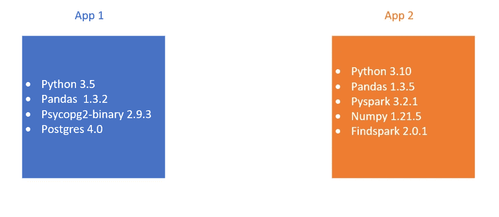
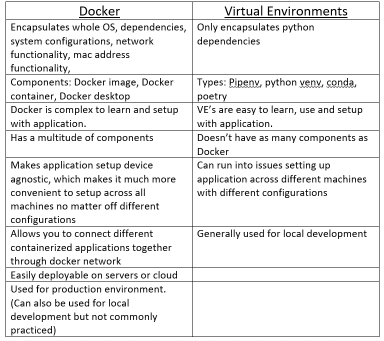

# Docker:是什么，怎么设置！

> 原文：<https://blog.devgenius.io/docker-what-is-it-and-how-to-set-it-up-1fa3f0e824e?source=collection_archive---------11----------------------->

正在寻找一种方法来避免与团队一起进行项目的繁琐设置过程？别再找了，这就是为什么我们有 docker！

[图片](https://unsplash.com/photos/tjX_sniNzgQ)作者[弗兰克·麦凯纳](https://unsplash.com/@frankiefoto)

## **目录:**

*   什么是 Docker，为什么它有用
*   运行 Docker 需要什么
*   Docker 有哪些组件
*   如何在你的机器上设置 Docker
*   Docker 与虚拟环境
*   结论

## **Docker 是什么，为什么有用:**

Docker 于 2011 年推出，由 Solomon Hykes、Kamel Founadi 和 Sebastien Pahl 创建。通常情况下，当你开发一个应用程序时，它在你创建它的机器上运行良好，但是假设你有一个团队，你的团队成员试图在他们的机器上使用你的应用程序，却在尝试启动时遇到如此多的错误。这可能是因为他们的机器可能与你的设置方式不同。它们可能缺少特定的文件、安装包、软件/包版本不匹配、不同的配置设置等。这就是 Docker 的用武之地。

Docker 允许您在一个隔离的虚拟化容器中轻松打包操作系统、整个应用程序、其依赖项、系统配置以及应用程序所需的一切。一旦你开始在你的每个项目中使用 docker，你几乎马上就会注意到它的便利。假设你有两个不相关的项目，每个项目都有不同的需求。这些要求将设定这些应用程序需要使用的软件包/软件的范围。如果您默认运行 Python 3.10，并且您的一个项目需要 Python 3.5，因为一个特定的包需要它，您会怎么做？你把它装箱！将你的每一个项目分别容器化允许你安装不同版本的 Python，并且可以同时一起工作。下面是一个直观的例子。

作者图片

如果我们想在没有 Docker 的情况下处理这些项目，那么我们必须在我们的机器上下载并安装多个版本的 Python，并不断地在每个项目的不同 Python 版本之间切换。这将降低效率，因为我们将被限制在一次一个项目上工作，因为我们必须在 python 版本之间切换。

## **运行 Docker 需要什么:**

**视窗:**

*   下载 [Docker 桌面软件](https://www.docker.com/products/docker-desktop/)。
*   支持的 Windows 版本:Windows 11 64 位:家庭版或专业版，Windows 10 64 位:家庭版或专业版。
*   wsl 2(Linux 2 的 Windows 子系统)。
*   带[二级地址转换(SLAT)](https://en.wikipedia.org/wiki/Second_Level_Address_Translation) 的 64 位处理器。
*   4GB 系统内存。
*   必须在 BIOS 设置中启用 BIOS 级硬件虚拟化支持。有关更多信息，请参见[虚拟化](https://docs.docker.com/desktop/troubleshoot/topics/#virtualization)。

**Linux:**

*   KVM 虚拟化支持。
*   **QEMU 必须是 5.2 版或更新版本**。
*   systemd 初始化系统。
*   Gnome 或 KDE 桌面环境。
*   至少 4 GB 内存。
*   启用在用户名称空间中配置 ID 映射，参见[文件共享](https://docs.docker.com/desktop/faqs/linuxfaqs/#how-do-i-enable-file-sharing)。
*   64 位内核和 CPU 支持虚拟化。
*   支持的发行版:Ubuntu、Debian 和 Fedora。

**Mac:**

*   支持 macOS 版本 10.15 或更新版本、大苏尔或蒙特雷。
*   至少 4 GB 内存。
*   不得安装 4.3.30 版之前受支持的 VirtualBox，因为它与桌面不兼容。

**Docker 组件有哪些:**

*   **Docker 客户端:**
    —这是第一个组件。
    —允许用户与 docker 通信。
    —基于客户端-服务器架构。
    —允许用户同时连接到单个或多个容器。
*   **Docker Image:**
    —通过使用元数据配置容器来构建它们。
    —用作容器的只读二进制模板。
    —驻留在应用程序/项目的 docker 文件中。
    — Docker 图像可以与您的团队共享，以便他们在处理同一项目时可以生成相同的容器，反之亦然。这极大地减少了设置时间。
    — Docker 图像可以公开或秘密地存储在在线注册表中。如果你希望只有少数人有访问权的话。
*   **Docker 守护进程:**
    —在后台运行，管理 Docker 网络、存储、卷、容器和映像。
    —当容器在输入`docker run`命令后启动时，客户端发送 API 调用并将其返回给守护进程。
*   **Docker Networking:**
    ——帮助建立不同集装箱之间的连接。
    —有 5 种主要类型的网络驱动:
    **———无:**该驱动禁用网络系统，防止容器相互连接。
    **— — Bridge:** 是容器使用相同 docker 主机相互连接的默认网络驱动程序。
    **— —主机:**指客户端中运行 docker 容器的服务器。
    **— — Overlay:** 当容器在不同的 Docker 主机上运行时，允许不同的群服务相互交互。
    **— — Macvlan:** 给你的容器一个 mac 地址，让它看起来像一个物理硬件驱动。然后使用此 mac 地址在容器之间路由流量。
*   **Docker 注册表:**
    —是一个可以存储 Docker 图像的注册表。
    — Docker Hub 作为默认存储位置。它既可以公开存储，也可以秘密存储。
*   **Docker 容器:**
    —作为图像的实例。
    —可以通过 Docker API 创建、启动、移动或删除它们。
    —就容器所需的磁盘空间而言是轻量级的。
    —可以连接到一个或多个网络或其他容器。
    —易失性存储，意思是一旦容器被删除，里面的东西就没了。

**如何在您的机器上设置 Docker:**

— [对于使用 WSL2 的 Windows](https://www.youtube.com/watch?v=5RQbdMn04Oc)

— [对于采用 M1 芯片的 Mac 电脑](https://www.youtube.com/watch?v=N6e8NUNHFWo)

— [对于 Ubuntu](https://www.youtube.com/watch?v=EL1Ex04iUcA)

**Docker 与虚拟环境:**

作者图片

**结论:**

Docker 有助于简化许多开发过程，尤其是与团队一起工作时的初始步骤。能够容器化整个应用程序允许我们灵活地在任何地方托管它。现在，如果人们有不同操作系统和设置的计算机，他们可以只使用 Docker 来设置应用程序，而不需要解决软件包版本或系统配置的问题。许多人甚至将他们的应用程序容器化，以方便安装在云服务上。如果它符合您的要求，绝对是一个值得挑选的工具。希望你喜欢了解 Docker 及其漂亮的用例，请留下掌声、评论和快乐编码！

相关内容:
[——如果你想了解虚拟环境](https://thedatascape.medium.com/ve-series-types-of-virtual-environments-4c7bb96c48d5)