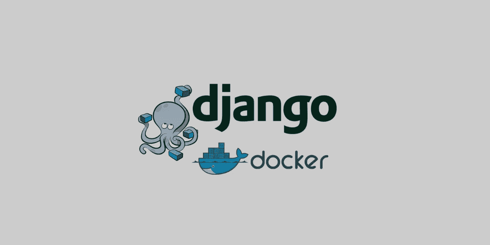

# Dockerize Django 应用程序

> 原文：<https://blog.devgenius.io/dockerize-django-application-b74712d0d7f2?source=collection_archive---------14----------------------->



图片来源:[https://bit.ly/3R3JL2E](https://bit.ly/3R3JL2E)

如果你是 docker 的新手，想知道如何将你的 django 应用程序进行 docker 化，那么你就进入了正确的页面。这篇博客文章将完全集中在 dockerizing django 应用上。

在这里，我将对我以前的博客克隆应用程序进行归档。如果你还没有阅读，那么我会建议你在继续阅读之前先阅读。如果你有自己的项目，那也没关系。

那么，我们开始吧。

## 系统上的 Docker 安装

如果你的系统中已经安装了 docker，那么你可以跳过这一部分。你可以根据你的系统(windows/ubuntu/macOS)使用[这个](https://docs.docker.com/engine/install/)链接下载并安装 docker。如果你仍然面临任何关于 docker 安装的问题，请在评论中告诉我。

## 让我们开始做一个文档吧

在创建`**Dockerfile**`之前，我们将首先创建一个包含运行项目所需的所有模块的`requirements.txt`文件。要创建一个`requirements.txt`，只需使用下面的命令

```
pip freeze > requirements.txt
```

这将创建一个文件`requirements.txt`,并将虚拟 env 的所有预装模块粘贴到其中。

现在，让我们在项目基础目录中创建一个`**Dockerfile**`，并开始编写它。

现在，我们来了解一下这个`dockerfile`。这里，首先我们从 docker hub 注册表中拉出一个`*python3.7 image*`。之后，我们安装一些工具，如`curl`、`git`和`vim`。我们将当前项目添加到`src/`路径中的 docker 中。现在，我们更新了现有的`pip`版本，然后在`requirements.txt`文件中安装所有的模块

## **运行这个 Dockerfile**

我们首先将使用最近创建的`**Dockerfile**`为 django 代码创建一个本地 docker 映像。使用下面的命令创建一个 docker 镜像，使用你创建的`**Dockerfile**`

```
docker build -t blogs-docker:latest .
```

在这里，`**docker build**`是建立形象的命令`**“-t”**`表示标签的意思是`what name you have given to this image`，最后是`**“.”**`。这个`**“.”**`表明我们正在建立一个名为`**Dockerfile**`的文件。

一旦你击中这个命令，码头工人将开始建立你的形象，你会看到必要的步骤，如哪个步骤目前正在执行。

成功完成此步骤后，您可以使用以下命令验证 docker 映像

```
docker images
```

使用此命令，您将看到系统中所有预先存在的码头工人图像，以及您新创建的图像`**“blogs-docker”**`🎉 🎉。

## 让我们创建一个合成文件

现在，我们将创建一个`docker-compose`文件。此撰写文件用于创建`docker containers`以运行上面创建的`image`。本`docker-compose`文件为`**yml**`文件。让我们创建我们的`**docker-compose.yml**`文件。

这里，我们首先在`services`部分`**blog**`中定义了我们的码头集装箱的名称。然后我们指定我们上面刚刚构建的`django app`的图像。我们还将在`docker-container`上运行服务器所需的`port`与`host machine`进行了映射，最后，我们编写了`command`，这意味着给定的一行将在我们的容器启动后运行。

## 让我们运行这个合成文件

要运行此撰写文件，只需编写以下命令

```
docker-compose up -d blog
```

在这里，`**-d**`表示我们希望在分离模式下运行这个容器。

现在，如果一切工作正常，那么您的 docker 容器将会启动并运行，您可以使用下面的命令来检查这一点

```
docker ps
```

还可以使用下面的命令查看容器的日志

```
docker logs {{container ID}}
```

只需粘贴你的容器的`**container ID**`，你就可以查看你的服务器的日志。

## 结论

在这篇博客中，我们了解了如何 dockerize 一个 django 应用程序，以及如何通过 docker-compose 运行它。我整理了这个博客中使用的所有代码，你可以在这里找到它们。如果你在整理申请时遇到困难，请在这里告诉我😀。