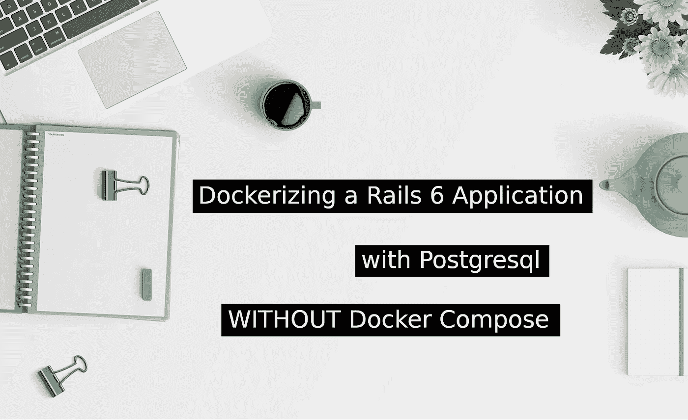
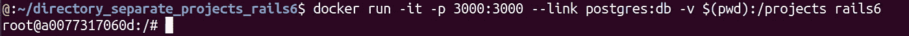
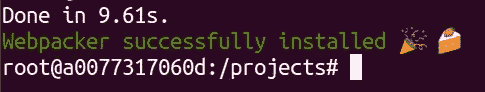
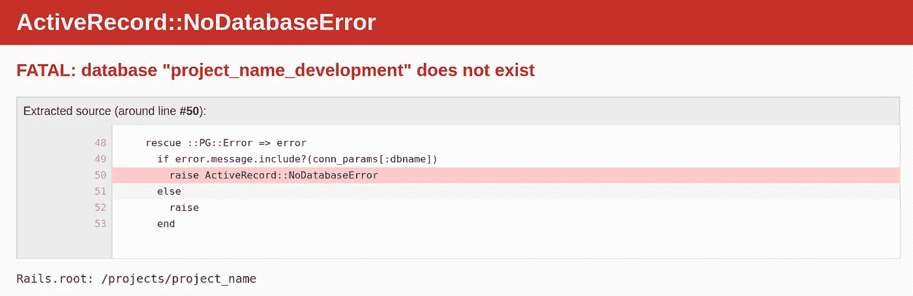
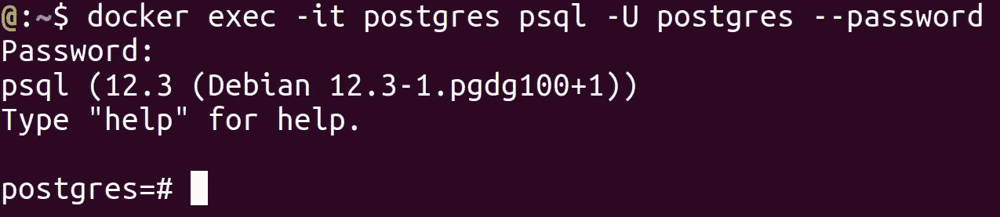
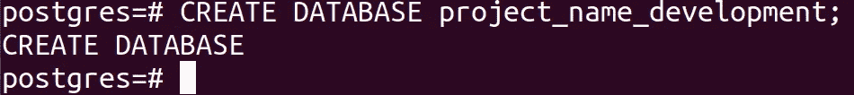
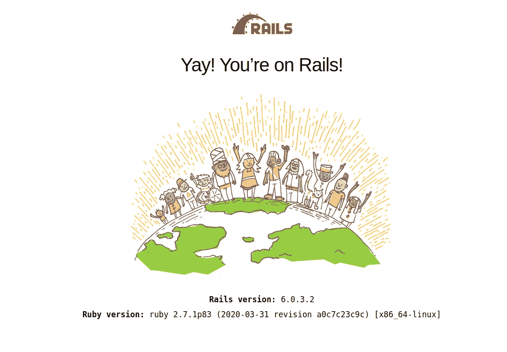

# 在没有 Docker Compose 的情况下用 Postgresql 对 Rails 6 应用程序进行 Dockerizing

> 原文：<https://blog.devgenius.io/dockerizing-a-rails-6-application-with-postgresql-without-docker-compose-1a0853956ae6?source=collection_archive---------7----------------------->



在没有 Docker Compose 的情况下用 Postgresql 对 Rails 6 应用程序进行 Dockerizing

# 介绍

在最后一个故事中，我展示了如何在 Docker 上创建自己的 rails 6 映像。

当我尝试将 Rails 与 Docker 结合使用时，另一件让我产生疑虑事情是 Rails 6 应用程序和 Postgresql 数据库之间的集成。我花了很多时间研究一种不用 DOCKER COMPOSE 的方法。

但你会问我:“为什么没有码头工人作曲？”

答案很简单。我喜欢研究理解我在做什么。使用现成映像或现成的 docker 构建器来创建我的容器并返回我的项目配置不允许我确切地了解 docker 是如何工作的。

# 创建 Postgres 容器

没错。做完这个小小的解释后，我们再来看什么事。要用 postgresql 创建一个 Rails 应用程序，我们需要打开两个 docker 容器。

首先，我们将打开一个 postgresql 容器。要使用此命令，您需要位于要添加 postgres 文件的独立文件夹中。

```
docker run --name postgres -d -e POSTGRES_PASSWORD=password_postgres -v $(pwd):/var/lib/postgresql/data postgres**Explanation*****docker run*** is a command used when you want to start up containers based on an image***--name postgres*** - define container's name (it's important to make link, I will explain after). In this case, container name is "postgres". If you don't set the name, docker will use a random funny name.***-d*** - create container on detach mode, this is make the container run in background***-e POSTGRES_PASSWORD=password_postgres*** - this flag set environment variables. In this case, the POSTGRES_PASSWORD is being set to "*password****_***postgres"***-v $(pwd):/var/lib/postgresql/data*** - this flag bind mount a volume. $(pwd) is a variable use to references the actual directory. So, we are binding the actual directory in our computer to a directory in /var/lib/postgresql/data inside the container. Everything that is added or removed from any of this two directories will happen in the other too. It is a important step, because without this step, our container can be closed and all data in our database be lost.***postgres*** - it's the image name.
```

它将返回容器 ID。


保留这个 ID，让我们进行下一步。

# 创建 Rails 容器

现在，我们需要创建我们的 rails 容器。要使用这个命令，您也需要位于一个单独的文件夹中，但是在这种情况下，该文件夹将保存您所有的 Rails 项目。

```
docker run -it -p 3000:3000 --link postgres:db -v $(pwd):/projects rails6**Explanation** *I will only explain lines that I didn't explain yet.****docker run*** - already explained***-it*** - flags used when you need a container that need to be interactive, in other words, it enables you to use the terminal inside container***-p 3000:3000*** - publish a container port to host. In this case, we are mapping the container's port 3000 to host computer's port 3000\. This is, when we use port 3000 on container, the same output will be in host computer's port 3000.***--link postgres:db*** - this is the most important parameter to this post. Basically, this flag make a link between a existent container named postgres and map with a name (db) to our rails container.***-v $(pwd):/projects*** - In this case, you have to separate a directory to put your projects. This is a important way to code a project in your favorite text editor. You will need to open the project in your computer to edit it. And the project need to be acessible by the container to be executed.***rails6*** - image name. In this case, I'm using the image created in the [last story](https://medium.com/swlh/how-to-create-a-rails-6-image-in-docker-ubuntu-18-04-76ba23555b24).
```

运行此命令，您将进入集装箱码头。



现在，你必须进入在/projects 文件夹里面的容器。

```
cd projects
```

您将开始一个新的 Rails 6 项目，其中数据库配置为 postgresql。

```
rails new project_name --database=postgresql*project_name can be changed by any valid name.*
```

Rails 将初始化您的项目。这一步可能需要一段时间。



你必须在你喜欢的文本编辑器中进入项目文件夹来开始数据库配置。

```
cd project_name*project_name will be the name of your project*
```

# 配置数据库

打开 config > database.yml

在*默认部分*，你会看到这样的内容:

```
default: &default
  adapter: postgresql
  encoding: unicode
  # For details on connection pooling, see Rails configuration guide
  # [https://guides.rubyonrails.org/configuring.html#database-pooling](https://guides.rubyonrails.org/configuring.html#database-pooling)
  pool: <%= ENV.fetch("RAILS_MAX_THREADS") { 5 } %>
```

你必须添加一些信息来配置数据库:

```
default: &default
  adapter: postgresql
  encoding: unicode
  # For details on connection pooling, see Rails configuration guide
  # [https://guides.rubyonrails.org/configuring.html#database-pooling](https://guides.rubyonrails.org/configuring.html#database-pooling)
  pool: <%= ENV.fetch("RAILS_MAX_THREADS") { 5 } %>
  host: db
  username: postgres
  password: password_postgres**Explanation*****host: db*** - host is the IP for your database. But in this case, we are using "db", because docker create this name, when we use --link in container creation.***username: postgres*** - username is your postgres username (by default it is "postgres")***password: password_postgres*** - password is your postgres password (the environment variable defined on container run)
```

如果一切顺利，当您在带有“rails server -b 0.0.0.0”的容器中运行项目时。

*使用“-b 0.0.0.0”很重要，因为这是 docker 进行端口间链接的正确 ip。*

您将看到类似这样的内容:



这是一个预期的错误，因为我们还没有创建数据库。

# 创建 postgres 数据库

为此，我们需要在其他终端中打开 postgres 容器。

```
docker exec -it postgres psql -U postgres --password
```

你必须输入你的 postgres 密码，然后会打开一个 postgres 界面:



现在，您将创建您的开发数据库。

这里有一个观察，你可以用任何名字创建数据库，但是如果你这样做，你需要在 database.yml 中配置它。

要创建数据库，请执行以下操作:

```
CREATE DATABASE project_name_development;
```



当您想退出 postgres 界面时，使用“\q”命令。

为了简化，我使用了错误页面中的名称。

现在，如果您运行项目，您将看到欢迎 Rails 6 页面。



# 结论

请记住，我们只是为开发环境配置一切。要在生产环境中做到这一点，您还必须创建生产数据库。

我希望这个故事对你有所帮助，我愿意澄清可能的疑问。

# 参考

图片取自 [PixaBay](https://pixabay.com/pt/photos/%C3%A1rea-de-trabalho-arrumar-limpa-2325627/)