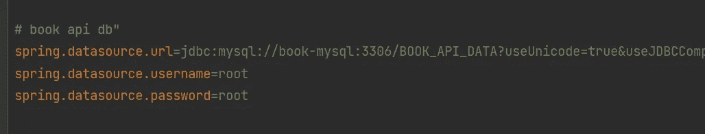

# 将 Spring Boot 的申请归档

> 原文：<https://blog.devgenius.io/dockerizing-a-spring-boot-application-b326979caf4c?source=collection_archive---------1----------------------->


[伊恩·泰勒](https://unsplash.com/@carrier_lost?utm_source=unsplash&utm_medium=referral&utm_content=creditCopyText)在 [Unsplash](https://unsplash.com/s/photos/docker?utm_source=unsplash&utm_medium=referral&utm_content=creditCopyText) 上拍照

[Docker](https://www.docker.com/) ，2013 年发布的开源项目，是一个基于**容器**构建应用的软件平台。发布之后，docker 迅速流行起来，因为它为软件部署和交付提供了可能性。它以其*简单性、快速扩展系统、灵活的软件交付和对微服务架构的支持*而闻名。它也是云计算的核心。

在开发阶段，只需创建所需的容器，就可以帮助**放弃应用程序需要的所有额外设置。通过 dockerizing 你的应用程序，你可以和任何人分享你的项目，如果他们已经安装了 docker，就可以开始了。在本文中，您将看到如何轻松地对 spring boot 应用程序进行 dockerize 和调试。所以让我们开始吧。**

# 要求

*   任何工作的弹簧靴应用
*   对 docker 的基本了解
*   已安装 [*docker 桌面*](https://docs.docker.com/get-docker/)
*   智能集成电路
*   数据库的 HeidiSQL
*   测试 API 的邮递员

# 项目构建

打开 spring boot 应用程序并构建它。这里这个项目是一个 API，从 MySQL 数据库中查询数据。任何应用程序都适用于本文，只要它能产生一个*可执行的 jar 格式*。要构建项目，您可以使用 UI maven 菜单


maven 菜单

或者你可以使用 *mvn* 命令

> mvn 全新安装


在成功构建之后，如果你用**spring-boot-maven-plugin**在**构建步骤**中查看 **pom.xml** ，它会在目标文件夹中创建一个 **jar 文件**。所以我们可以用 *java jar* *命令*运行它。打开终端并前往目标文件夹


目标文件夹

> cd 目标/
> 
> Java-jar bookAPI-1.0-sanpshot . jar


为了对我们的应用程序进行 docker 化，我们将在 docker 容器中复制并运行这个 jar。为了让 API 响应数据，我们需要启动并运行数据库，因此让我们从创建 mysql 数据库服务开始。

# Docker 撰写

由于这是一个**多容器** **应用程序**，我们将使用[***docker-compose***](https://docs.docker.com/compose/)**。**要为这个应用程序创建一个合成文件，我们需要两个服务:

*   应用程序接口
*   MySQL 数据库

转到项目的根目录，创建一个 *docker-compose.yml* 文件。


## 数据库服务

我们从定义[合成文件版本](https://docs.docker.com/compose/compose-file/compose-file-v3/)开始。合成文件由[服务、卷和网络](https://docs.docker.com/compose/compose-file/)组成。在这里，我从定义 db *服务开始。*


docker-用 mysql 数据库服务编写文件

```
**book-mysql:** service name[**image**](https://docs.docker.com/compose/compose-file/compose-file-v3/#image)**:** base image for creating the container**container_name:** name of the container[**volumes**](https://docs.docker.com/storage/volumes/#use-a-volume-with-docker-compose)**:** to persists the sql, with format hostFileLocation:containerFileLocation[**ports**](https://docs.docker.com/compose/compose-file/compose-file-v3/#ports)**:** to expose port mapping with format 
hostPort:containerPort[**environment**](https://docs.docker.com/compose/compose-file/compose-file-v3/#environment)**:** to set env variables in this service's container, here password for the mysql db[**healthcheck**](https://docs.docker.com/compose/compose-file/compose-file-v3/#healthcheck)**:** to test the container health by running a command at  specified interval for timeout
```

让我们运行并查看运行中的容器

> docker-撰写向上-d


数据库容器创建

在日志中，我们可以看到容器已经使用复制的 SQL 正确启动。当没有定义网络时，docker 为每个要加入的容器创建一个默认的[网络](https://docs.docker.com/compose/networking/)。您可以使用主机映射端口连接到 DB 容器，并按照撰写文件中的定义登录。


HeidiSQL 会话管理器


包含脚本数据的 mysql 容器

数据和执行的脚本一起添加看起来不错。现在让我们为 API 创建服务。

## API 服务

要运行任何 jar 应用程序，服务都需要一个 JDK，所以我从定义 JDK 映像开始。然后从目标文件夹中复制 jar，并使用 java jar 命令运行它，就像我们在前面的构建部分中看到的那样。因为如果没有数据库，API 就没有多大用处，所以我定义了它对数据库服务的依赖。


使用 api 服务合成文件

```
**book-api:** service name[**image**](https://docs.docker.com/compose/compose-file/compose-file-v3/#image)**:** you can create your own base image by a Dockerfile to create image or use an existing one, like the openjdk11 image here[**container_name**](https://docs.docker.com/compose/compose-file/compose-file-v3/#container_name)**:** name of the container[**volumes**](https://docs.docker.com/storage/volumes/)**:** to persists the jar inside the conatiner with format hostFileLocation:containerFileLocation[**command**](https://docs.docker.com/compose/compose-file/compose-file-v3/#command)**:** to provide a default entrypoint by run the copied jar, accepts an array of strings**ports:** to expose port mapping with format 
hostPort:containerPort[**depends_on**](https://docs.docker.com/compose/compose-file/compose-file-v3/#depends_on): specifies service dependency on book-mysql service/container, will not start book-api if mysql fails
```

现在用服务名更改 application.properties 中的 spring 数据源，以便 spring 能够找到它。



带有数据库服务名的 spring-boot application . properties

让我们构建项目并打开一个终端来测试容器。

> docker-撰写向上-d


使用默认网络创建 api 容器

由于 Intellij 中的 [*docker 插件*](https://www.jetbrains.com/help/idea/docker.html#managing-images) ，您可以在**服务选项卡**中查看容器日志。从容器日志中，我们可以看到应用程序已经正确启动。


api 容器日志

现在打开 postman 并测试我们的 API 的响应，以确保一切工作正常。


邮差中的所有图书请求

要停止并移除所有的容器，请使用撰写 [*向下*](https://docs.docker.com/compose/reference/down/) 命令

> docker-向下合成


容器移除

# 排除故障

调试是任何应用程序开发的重要部分。为了首先调试我们的 jar API，我们需要配置 JVM 来[启用调试](https://www.baeldung.com/spring-debugging)。为此，在 docker-compose 文件中使用以下命令，并添加调试端口映射。

```
command: ["java","-agentlib:jdwp=transport=dt_socket,server=y,suspend=n,address=*:debugPort","-Dspring.profiles.active=springProfile","-jar","bookapi.jar"]
ports:
  - "8080:8080"
  - "5252:5252"
```


启用调试的 docker-compose

现在用指定的调试端口在 IntelliJ 中创建一个[远程调试配置。](https://www.jetbrains.com/help/idea/tutorial-remote-debug.html#b39cbffa)


IntelliJ 远程调试配置

通过这样做，您有两个连接到调试器的选项。首先点击容器日志开始处的*“附加调试器”*


或者点击我们之前创建的 Intellij 的调试配置。


让我们通过向邮递员发出请求来调试一个断点。


IntelliJ 中的断点停止

它像预期的那样工作。我希望这能帮助你整理和调试你的 spring boot 应用程序。你可以在 [*Github*](https://github.com/dhakre/APIBook/tree/springGraphQL) 上找到这个项目。

码头作业快乐！！