# Dockerizing Spring 应用程序&用 Gradle 自动化 Docker

> 原文：<https://blog.devgenius.io/dockerizing-spring-app-with-gradle-3b6fbd650bf7?source=collection_archive---------0----------------------->

## Docker 是一个工具，旨在通过使用容器来简化应用程序的创建、部署和运行。


照片由[张秀坤·吕克曼](https://unsplash.com/@exdigy?utm_source=medium&utm_medium=referral)在 [Unsplash](https://unsplash.com?utm_source=medium&utm_medium=referral) 上拍摄

**今天我们将讲述贝娄的事情**

1.  码头工人的重要性
2.  docker 概述
3.  带有详细解释的 Dockerizing spring 应用程序
4.  Docker 各种操作，例如:图像创建和删除，容器创建和删除等等
5.  使用命令行和 docker 桌面应用程序监控 Docker 图像
6.  高级部分:docker 任务的自动化，例如:docker 构建、运行和从 Gradle 命令推送到 docker hub

**先决条件:**在开始这篇文章之前，您必须了解 spring boot 与 Gradle 依赖关系。你可以通过下面的链接了解这一点

[](https://mesukcse08.medium.com/spring-data-jpa-a-to-z-6c957ed17a66) [## 深入探讨 spring boot 和数据 JPA 实现:A 到 Z

### 根据 Spring 文档，Spring Data JPA 是更大的 Spring 数据家族的一部分，它使得轻松地…

mesukcse08.medium.com](https://mesukcse08.medium.com/spring-data-jpa-a-to-z-6c957ed17a66) 

1.  **码头工人的重要性**

*   是一种工具，旨在通过使用容器来简化应用程序的创建、部署和运行。
*   容器非常适合持续集成和持续交付(CI/CD)工作流。
*   Docker 的便携性和轻量级特性也使得动态管理工作负载变得容易，可以根据业务需求近乎实时地扩展或删除应用程序和服务。
*   Docker 是轻量级和快速的。它为基于虚拟机管理程序的虚拟机提供了一种可行且经济高效的替代方案，因此您可以利用更多计算能力来实现您的业务目标。
*   容器允许开发人员将应用程序与它需要的所有部分打包在一起，比如库和其他依赖项，然后作为一个包发送出去。因此，开发人员可以放心，应用程序将在任何其他 Linux 机器上运行，而不管该机器的任何定制设置可能与用于编写和测试代码的机器不同。
*   Docker 有点像虚拟机。但与虚拟机不同的是，Docker 不是创建一个完整的虚拟操作系统，而是允许应用程序使用与运行它们的系统相同的 Linux 内核，并且只要求应用程序附带主机上尚未运行的东西。这极大地提高了性能，并减小了应用程序的大小。
*   重要的是，Docker 是开源的。这意味着任何人都可以对 Docker 做出贡献，如果他们需要额外的功能，可以扩展 Docker 来满足他们自己的需求。

**2。docker** 概述 docker 是一个软件平台，用于构建基于*容器*的应用程序——小型轻量级的执行环境，它们共享操作系统内核，但在其他方面彼此独立运行。Docker 最初是为 Linux 开发的，现在也可以在 Windows 和 macOS 上运行。为了理解 Docker 是如何工作的，让我们来看看一些可以用来创建 Docker 容器化应用程序的组件。

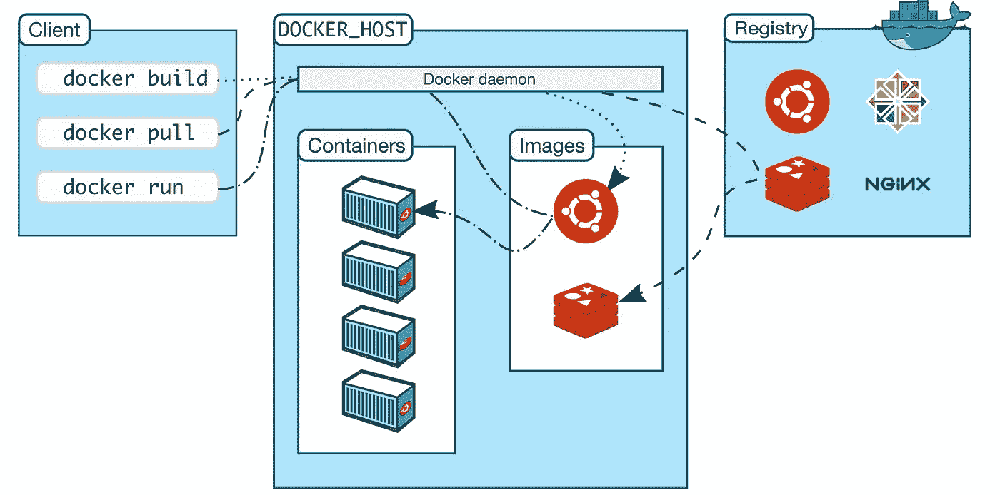

Docker 生态系统和架构

我正在解释基本术语

**Docker 图像**:

*   一个只读模板，包含创建 Docker 容器的说明。
*   文件名是 Dockerfile，放在 code 文件夹中
*   包含说明和图像相关文件
*   出于我们的目的，它将描述我们的 java 依赖项和一个 war 文件及其运行命令。
*   它管理版本，并像 docker hub 一样将其推送到注册表

**码头集装箱**

*   容器是图像的可运行实例
*   您可以使用 Docker API 或 CLI 创建、启动、停止、移动或删除容器
*   当容器被移除时，任何未存储在持久性存储中的对其状态的更改都会消失。
*   我们从 docker 映像构建一个容器，并在特定的端口运行这个容器。这些步骤需要端口映射

**Docker 注册表**

*   存储具有适当版本的 Docker 图像
*   所有著名的应用程序必须在注册表中有条目
*   Docker Hub 是一个任何人都可以使用的公共注册表，默认情况下 Docker 被配置为在 Docker Hub 上查找图像。
*   你甚至可以运行自己的私人注册。
*   docker push 和 pull 命令用于从公共注册表的

**Docker 守护进程**

*   监听 Docker API 请求并管理 Docker 对象
*   一个守护进程也可以与其他守护进程通信来管理 Docker 服务。

**Docker 客户端**

*   许多 Docker 用户与 Docker 交互的主要方式
*   它接受客户端命令并将其发送到 Docker 守护进程
*   可以与多个守护进程通信

**3。Dockerizing spring app 附详细讲解** 对于 dockerizing spring boot 应用，我们不会做多余的事情。我们只需在主目录中添加一个名为 **Dockerfile** 的文件。该文件将包含运行该应用程序的所有指令

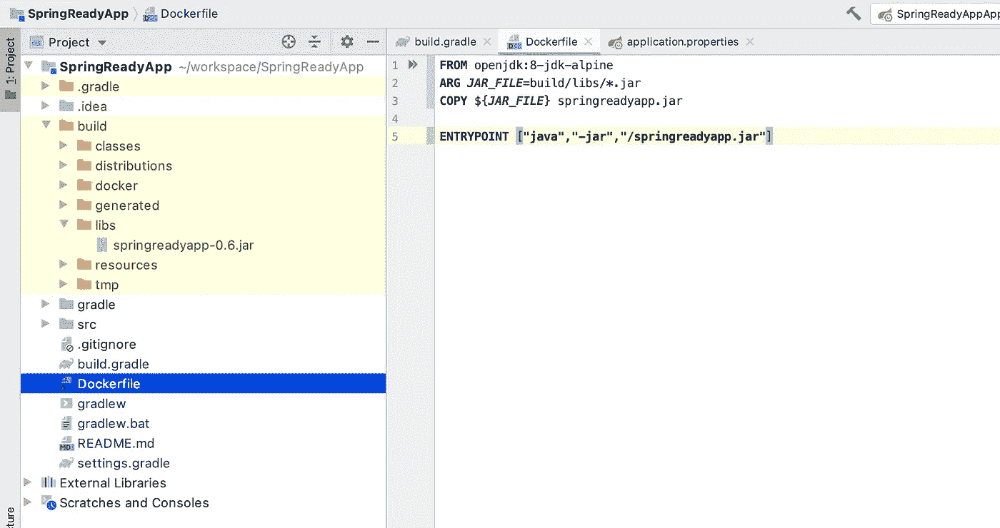

docker 文件位置和代码

我们的 docker 文件代码是

**来自:**我们正在使用 openjdk:8 alpine image 构建这张图片。JDK 有更多的图像，我们正在使用这个版本。您可以从 docker hub link
**ARG:** 查看更多图片我们将 jar path 作为 ARG 变量。这里我们的 jar 文件在**build/libs/springreadyapp . jar**中。ARG 仅在构建 Docker 映像(RUN etc)期间可用，在创建映像并从中启动容器后不可用(ENTRYPOINT，CMD)
**Copy:** 将此 jar 文件复制为 springreadyapp.jar。我们将在此 jar 文件上执行 RUN 命令，其名称为
**ENTRYPOINT:** 这将在容器启动时可执行。我们必须将它们定义为 *JSON-Array* ，因为对于一些应用程序参数，我们将结合使用*入口点*和 *CMD* 。这里我们传递 jar 文件运行命令

**4。Docker 的各种操作** 我们必须遵循以下步骤

*   使用 Gradle 命令和 Jar 创建来构建项目。
*   基于我们的 jar 文件构建 docker 映像
*   使用提供的 docker 映像运行容器
*   删除 docker 容器和 docker 图像

**构建项目** 使用 gradlew 命令可以清理并构建项目。有时它会显示一个可执行权限错误。在这种情况下，您必须允许可执行权限升级。其命令如下所示:

```
chmod 777 gradlew
./gradlew clean build -x test
```

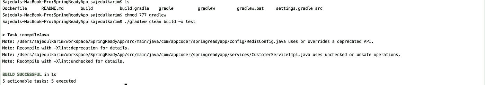

现在 jar 文件已经准备好了。我们可以开始基于 docker 文件构建图像

**构建 docker 映像** 命令从一个 Docker 文件和一个“上下文”中构建 Docker 映像。构建的上下文是位于指定的`PATH`或`URL`中的一组文件。使用此命令，它会用该上下文的指定指令和文件压缩映像。在我们的例子中，我们将从 OpenJDK 8 版本构建一个映像，从 libs 文件夹中复制 jar 并添加一个执行命令。
下面是带有标签的构建命令:

```
**Build Image**
docker image build -t springreadyapp .
**View Images** docker images
```

这里，我们用标签 **springreadyapp 构建了一个 docker 映像。**您的应用程序已经编译、打包并转换为 Docker 映像。输出如下所示

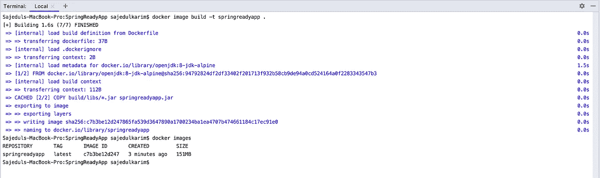

这里我们的映像构建完成了，映像 id 是: **c7b3be12d247**

**Docker 容器从映像** 运行现在我们必须从我们的映像 **c7b3be12d247 运行一个容器。**为此，我们还必须进行端口映射。下面是命令

```
**Run command**
docker run -d -p 8081:8081 **c7b3be12d247****Container List**
docker container ps
```

这里，-d 表示分离模式， **-p 8081:8081** 表示外部端口 is 8081 与内部端口 8081 映射。这里，您必须确保外部端口必须是空闲的。这里，定义端口映射很重要，它将主机(8081)上的端口映射到 Docker (8081)内部的端口，这是我们在 Spring Boot 应用程序的属性中定义的端口。输出如下所示

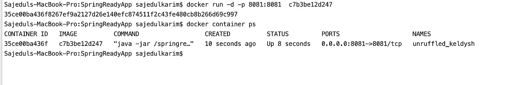

容器正在运行，容器 id 为: **c7b3be12d247。**

**5。监控 docker 洞察** 我们可以使用命令行和 docker 桌面 UI 工具来监控 docker 容器洞察。

```
**Insights the docker container**
docker exec -it 804c6b86d49a /bin/sh
Using exec command you entered the docker containe. Now you can execute all your necessary command here
```

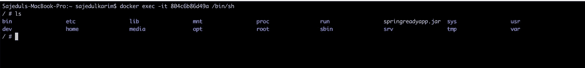

你也可以使用 Docker 桌面来实现。这就像贝娄的形象

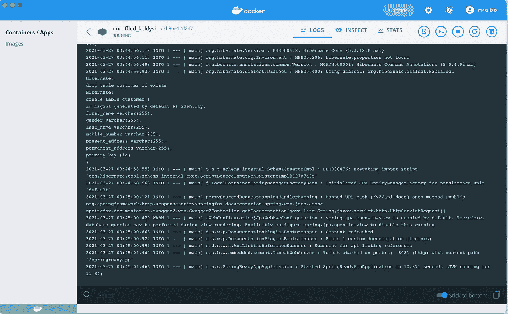

现在您的应用程序正在运行，它运行在永恒端口 8081 上。您可以从这里检查输出

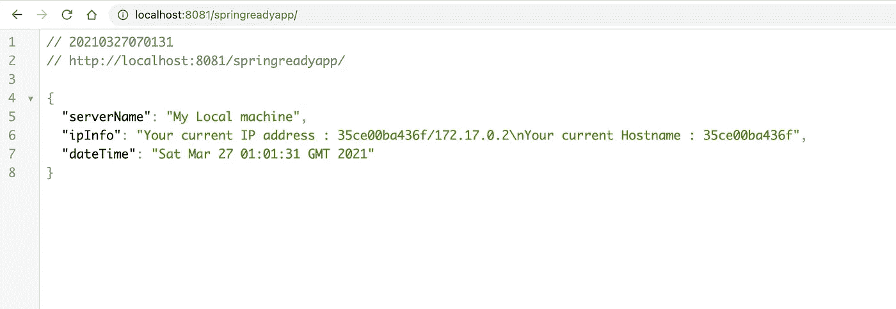

**容器和图像控制**

```
**Docker container stop**
docker container stop **35ce00ba436f** Here, **35ce00ba436f** is the container id
**Docker container removed** docker container rm -f **35ce00ba436f** Here, -f means forcefully removing the container. This is optional
```

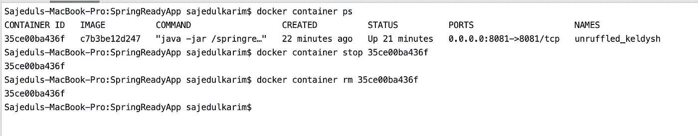

**Docker 图像删除**

docker image RM**c 7 B3 be 12d 247**这里的 **c7b3be12d247** 是 docker image id。

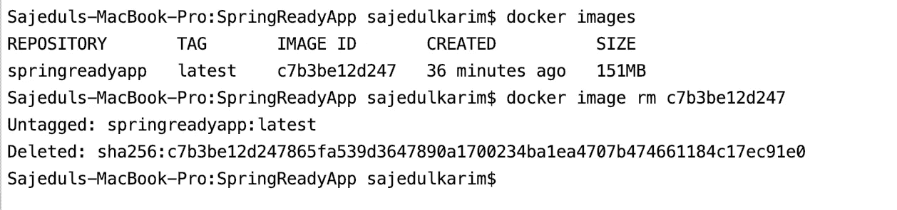

**6。高级部分:Automotion** 现在，您可能希望在 gradle 项目中使用 Gradle 命令构建 docker 映像、运行容器并将映像推送到 docker hub。我们将使用 [*Palantir Docker 插件*](https://plugins.gradle.org/search?term=com.palantir.docker) 进行 Docker 自动化。为了实现这一点，我们必须在 build.gradle 文件上执行 dome 步骤。这是格雷尔的档案

这里我只添加了与自动化相关的变化。我们需要 docker 和 docker-run 这两个插件。在 **docker** 闭包中，我添加了 Dockerfile 路径和文件访问指令。在 **dockerRun** 闭包中，我添加了从 docker 映像运行 docker 容器的指令。

```
**Docker push image to docker hub** It’s command is : ./gradlew dockerPushDockerHub
Using this command, this new version of image will push to docker hub account. 
Here, my repository path is 
tag **'DockerHub'**, **"mesuk08/springreadyapp:**$**{**project.version**}"** in docker closure
```

在从命令行执行 docker 推/拉操作期间，您可能需要从终端登录和注销。登录和注销命令如下

```
docker logout
docker login
```

**如何使用 docker 映像** 其他用户将从 docker hub 中提取带有标签号的映像，然后将该映像运行到他们的房屋中。现在这里我们的标签是:0.7 它的命令是这样的:
**docker pull mesuk 08/springreadyapp:0.7**

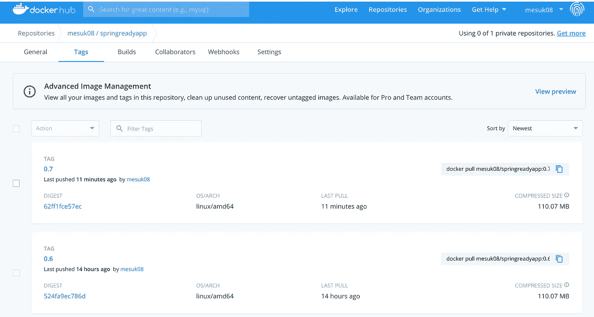

你可以在这个 [GitHub 库](https://github.com/mesuk/SpringReadyApp)中获得完整的源代码。
**Swagger 网址**:[http://localhost:8081/springreadyapp/Swagger-ui . html #/](http://localhost:8081/springreadyapp/swagger-ui.html#/)

感谢阅读:)