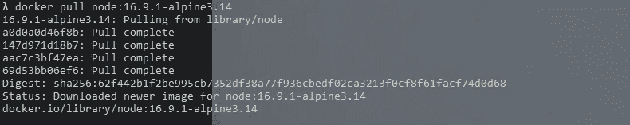
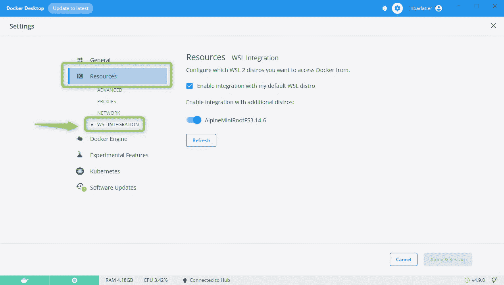
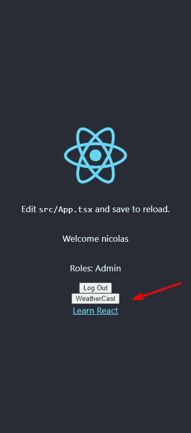
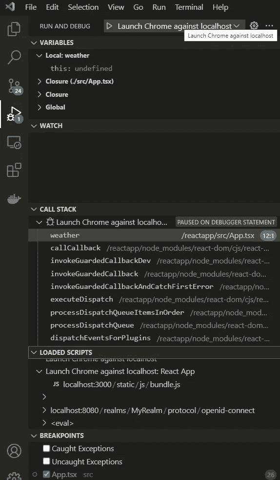

# 第一部分在 Windows 10 上用 NodeJS 与 NGINX 对接 TypeScript React 应用程序

> 原文：<https://blog.devgenius.io/dockerizing-the-typescript-react-app-with-nodejs-vs-nginx-with-wsl2-alpine-linux-on-windows-10-8dddd447f43a?source=collection_archive---------3----------------------->

**第一部分:** **与 **NodeJS** 一个**类型脚本 React** 应用程序由 **Keycloak 使用 WSL2 和发行版 Alpine Linux** 保护**

版本 1.0
日期 2022/07/04
作者 Nicolas Barlatier

**重要提示:**本文也可以用于你的任何 React App。
所以请继续阅读**😎**


# **简介**

这是**第一部分**:**dockering**a**TypeScript React App**with**Node**使用**Alpine Linux**with**Windows 10 通过 WSL2** 。

在这里，我们将重点关注如何使用 **NodeJS 从我们的 **React 应用程序**代码库制作一个 **docker 映像**。**

**为什么使用节点？**有了 Node，我们将能够从 Docker 容器中使用我们的 **VS 代码 IDE** 和**处理我们的代码**，这将实时反映我们的代码变化！

通过 Docker 映像开发 React 应用程序是一种非常方便的方式，你不觉得吗？:) 👌😎

本文将分为以下几个部分:

*   如何启动我们的开发环境: **WSL 2** 使用 **Linux Alpine 发行版**然后使用来自 Linux Alpine 的 **Windows VS Code IDE** 打开 React 项目
*   解释为什么使用 **Docker** 以及如何使用 **Dockerfile** 创建我们的 React 应用程序 Docker 映像
*   如何通过 Windows docker 桌面用 WSL2 Alpine Linux 中的 Docker 文件构建我们的 React **docker 映像**
*   如何**运行**我们的**将 Docker 映像**与**节点**和**同步**与**VS 代码**中的任何代码变化

唷！我相信你会学到很多东西😁👍

也许一开始我们会像这只可怜的狗一样！😂😁


但是你不要担心，我们所要做的就是从头到尾沿着这条路走下去。就像我们滑雪时的一个很长的斜坡，完美的图像说明了这一点:


你不必阅读所有的链接，但它们有助于你理解我们为什么这样做。

在本文中，我们将继续构建我们的解决方案，它由一个由 **Keycloak** 保护的 **React 应用程序组成，并使用一个**访问 JWT** 来访问由 JWT** 保护的 **REST Web API。**

**👀重要提示:**本文也可用于任何用 Javascript 或 TypeScript 制作的 React App。所以请继续读下去😎我会用这双眼睛来突出👀当它告诉你细节的时候👀

要使用由 Keycloak 保护的 React 应用程序，请找到文章和 github 源代码:

[第一部分:用 Docker 和 Administration 安装 key cloak](https://medium.com/p/1d076777a979)

[第二部分:保护前端 React 应用](https://medium.com/@barlatiernicolas/security-in-react-and-webapi-in-asp-net-core-c-with-authentification-and-authorization-by-keycloak-89ba14be7e5a)

[第三部分:保护 ASP.NET 核心 C# REST Web](https://medium.com/@barlatiernicolas/security-in-react-and-webapi-in-asp-net-core-c-with-authentification-and-authorization-by-keycloak-f890d340d093)

[第四部分:使用访问 JWT 令牌载体授权从 React SPA 调用受保护的 Web API](https://medium.com/@barlatiernicolas/part-four-security-in-react-and-webapi-in-asp-net-b6dffd3b7624)

包含 React 和 Web API 项目的 GitHub 存储库

*   **使用类型脚本对 18.1.0 版做出反应**
*   **采用 ASP.NET 核心 5.0 的网络应用编程接口**

[](https://github.com/nicoclau/reactwebapiaspnetcorekeycloak) [## GitHub—nicoclau/reactwebapiaspnetcorekeycloak:React 和 REST 受 keycloak 保护的 Web API 与…

### React 和 REST Web API 由带有授权代码流和 JWT 令牌的 Keycloak 保护— GitHub …

github.com](https://github.com/nicoclau/reactwebapiaspnetcorekeycloak) 

第一次提交**包含:**

*   由 keycloak 服务器保护的 React SPA
*   Web API 由访问令牌保护，使用来自 keycloak 服务器的公钥进行验证

这两个应用程序还没有通信，它们只是受到保护。

第二次提交包含:

*   React SPA 使用 JWT 令牌与 Web API 通信，并处理 CORS 策略

第三次提交包含:

*   React 应用程序的 Docker 文件

# 1 先决条件

我在 Windows 10 Pro 上。我不能涵盖所有的情况，否则这篇文章就不可能完成😁现在让我们看看我们需要什么！

# 1–1 Docker 桌面

首先我们在 Windows 10 上下载 **Docker 桌面。**

在每个环境的链接下方:

[](https://docs.docker.com/desktop/windows/install/) [## 在 Windows 上安装 Docker 桌面

### 更新 Docker 桌面条款 Docker 桌面在大型企业(超过 250 名员工或…

docs.docker.com](https://docs.docker.com/desktop/windows/install/) [](https://docs.docker.com/desktop/mac/install/) [## 在 Mac 上安装 Docker 桌面

### 预计阅读时间:7 分钟更新到 Docker 桌面条款 Docker 桌面的商业用途在更大…

docs.docker.com](https://docs.docker.com/desktop/mac/install/) [](https://docs.docker.com/desktop/linux/install/) [## 在 Linux 上安装 Docker 桌面

### 欢迎来到 Docker 桌面 Linux 版。本页包含有关系统要求、下载 URL 和…

docs.docker.com](https://docs.docker.com/desktop/linux/install/) 

在 windows 10 Pro 上，我使用了第一个链接。现在我们有了 Docker 桌面。

在我们继续之前，让我们回忆一下在以前的文章中我们是如何构建 React 应用程序的。

**我用 NodeJs 和 npm** 使用助手工具:创建 React app:

> λ node -v
> v16.9.0
> 
> λ npm -v
> 6.14.4

下面我们可以找到下载 Node.js 和 npm 的官方链接:

[](https://nodejs.org/en/) [## 节点. js

### Node.js 是基于 Chrome 的 V8 JavaScript 引擎构建的 JavaScript 运行时。

nodejs.org](https://nodejs.org/en/) 

如果你想用我用过的版本:

 [## /dist/v16.9.0/的索引

### docs/07-Sep-2021 08:24-win-x64/07-Sep-2021 07:51-win-x86/07-Sep-2021 07:52-shasums 256 . txt 07-Sep-2021 10:06…

nodejs.org](https://nodejs.org/dist/v16.9.0/) 

对于 windows，我们有节点安装程序

最新的 LTS 版本是: **16.15.1(包括 npm 8.11.0) (2022 年 7 月 3 日)**

现在，我们注意到我们的 React 应用程序开发中使用的 NodeJS 版本是 16.9.0，所以我们可以稍后在 **Linux** 上将它添加到 Docker 容器中。

我们不需要在我们的 Windows 操作系统上安装 NodeJS(这就是 Docker 的妙处)

== >我们将使用 **Linux Docker 来构建和运行 React 应用程序的容器**。< ==

我使用的是 Windows 10，但在 Linux 上使用 WSL2 很容易，wsl 2 当然代表 Linux 的 Windows 子系统！现在我们可以选择任何一个 Linux 发行版(或者几乎是)😊

# 1–2 WSL 2

Windows 10 基于 Windows NT 内核，从一开始就可以托管多个子系统！

微软就是这么想的，Linux 用得越来越多，为什么不提供 Linux 作为子系统呢？绝妙的主意:WSL2 来了。

下面是关于 WSL 2 的总结:

> WSL 2 发布了一个轻量级的**虚拟机，带有一个完整的 Linux 内核，具有**快速的启动时间，很小的资源占用，并且完全没有 VM 配置或管理。
> 
> = >一个完整的 Linux 内核在这个 VM 中被虚拟化
> = >对于一个真正的 Linux 内核，WSL 2 现在提供了完整的系统调用兼容性
> 
> 我们会看到这个 Linux 内核叫做: **WSL2-Linux-Kernel**

这样我们就可以一直使用 Linux。

> 我们将在 WSL2 和发行版 Alpine 中使用 Docker 桌面。

在 Windows 10 上启用 WSL2 需要遵循一些步骤。

这两个链接会对你有帮助。

[](https://pureinfotech.com/install-windows-subsystem-linux-2-windows-10/) [## 如何在 Windows 10 上安装 wsl 2(Linux 2 的 Windows 子系统)——pure infotech

### wsl 2(Windows Subsystem for Linux version 2)是该架构的一个新版本，它允许您在

pureinfotech.com](https://pureinfotech.com/install-windows-subsystem-linux-2-windows-10/) [](https://docs.microsoft.com/en-us/windows/wsl/install) [## 安装 WSL

### 本指南将向您展示如何安装 Linux 发行版(如 Ubuntu、OpenSUSE、Kali、Debian、Arch Linux 和…

docs.microsoft.com](https://docs.microsoft.com/en-us/windows/wsl/install) 

我将在下一节解释如何使用 Alpine Linux 发行版。

***现在 WSL 2 也被 Docker 桌面使用！*** 让我们看看为什么和如何。

# 1–3 Docker 桌面 WSL 2 后端

我们将在 Windows 上使用带有 WS2 引擎 的 ***Docker Deskop，它比传统的 Hyper-V 后端具有更好的性能。
下面我们可以看到“使用基于 WSL 2 的引擎”选项。***


> Windows Subsystem for Linux (WSL) 2 引入了一个重要的体系结构变化，因为它是由微软构建的完整 Linux 内核，允许 Linux 发行版无需管理虚拟机即可运行
> 
> WSL 2 增加了一个完整的 Linux 环境，包括文件系统、环境变量和网络资源的自动共享

下面你可以看到使用 WSL VM 架构的 Docker 桌面:


您可以在这里找到关于该架构的完整文章:

[](https://code.visualstudio.com/blogs/2020/03/02/docker-in-wsl2) [## 在 Windows for Linux 子系统(WSL) 2 中使用 Docker

### 2020 年 3 月 2 日 Matt Hernandez，@ fiveisprime 去年 6 月，Docker 团队宣布他们将投资于…

code.visualstudio.com](https://code.visualstudio.com/blogs/2020/03/02/docker-in-wsl2) 

daemon DockerD(容器的自给自足的运行时)直接在 WSL 中运行，因此不需要 Hyper-V VM，所有 Linux 容器都在 Windows 上的 Linux 用户空间中运行，以提高性能和兼容性！

[](https://docs.docker.com/desktop/windows/wsl/) [## Docker 桌面 WSL 2 后端

### 预计阅读时间:9 分钟更新到 Docker 桌面条款 Docker 桌面的商业用途在更大…

docs.docker.com](https://docs.docker.com/desktop/windows/wsl/) 

下面是一篇更详细的文章，解释了 Docker 用来与 WSL2 集成的架构:

[](https://blog.oio.de/2020/10/02/seamless-integration-of-docker-on-windows-using-wsl-2/) [## 使用 WSL 2 无缝集成 Windows 上的 Docker？

### 在这篇文章中，我给出了一个在 Windows 上使用 Docker 的简短总结，并对最新的 Docker 桌面进行了更详细的介绍…

博客. oio.de](https://blog.oio.de/2020/10/02/seamless-integration-of-docker-on-windows-using-wsl-2/) 

下图显示了 WSL2 和 Linux 发行版中使用的组件:


下图显示了 Docker Desktop 如何使用 WSL2:

我们可以看到发行版(Alpine Linux)需要一个代理来与 VM 中运行的 Docker 通信(我们将看到如何启用这个代理)


> WSL 文件系统在虚拟硬盘(VHD)上也变成了 *ext4* 格式。这使得 WSL 2 文件系统中的文件 IO 速度更快，因为不再需要翻译层
> 
> *共享文件/文件夹是通过使用 9P 协议的文件系统桥来完全维护的，所以 WSL 2 可以看到所有的 Windows 文件和文件夹，你也可以从 Windows 看到你的 Linux 挂载。
> WSL 2 中现在有一个网卡。我们使用我们的 NAT 网络模式，以便网卡完全由主机管理和协调，但它有自己的 IP 地址*

**我们将在 WSL 中使用 Linux Alpine 发行版，因为 Alpine 是最轻的发行版**

> 小。简单。安全。Alpine Linux 是基于 musl libc 和 busybox 的面向安全的轻量级 Linux 发行版。

[](https://www.makeuseof.com/alpine-linux-explained/) [## Alpine Linux:轻量级 Linux 发行版讲解

### Linux 很有趣，但有时你会因为当前的发行版而碰壁，想要一些不同的东西。另外，似乎…

www.makeuseof.com](https://www.makeuseof.com/alpine-linux-explained/) 

也请阅读下面的链接，它详细解释了为什么 **Alpine** 是今天与 docker 合作的最佳选择。

[](https://nickjanetakis.com/blog/the-3-biggest-wins-when-using-alpine-as-a-base-docker-image) [## 使用 Alpine 作为基本 Docker 图像的 3 大优势

### 众所周知，Docker 大量使用 Alpine 作为官方 Docker 图片的基础图片。这个动作…

nickjanetakis.com](https://nickjanetakis.com/blog/the-3-biggest-wins-when-using-alpine-as-a-base-docker-image) 

因为我们在项目中使用了 16.9.0 版本的 Node，而官方容器 Node 16.9.0 使用的是 Alpine 3.14，所以我们也将使用 Alpine 3.14 在 Windows 机器上工作。

**我们使用架构 *x86_64 的 PC。***

要了解计算机处理器架构，请运行以下命令:

```
λ uname -m
x86_64
```

如果‘uname’未被识别为内部或外部命令，
可操作程序或批处理文件。请对窗口使用带有 Git 的工具 **cmder，而不是通常的窗口 cmd:**

[](https://cmder.net/) [## 控制台模拟器

### 用于 Windows Cmder 的便携式控制台仿真器是一个软件包，它完全是由于缺少…

cmder.net](https://cmder.net/) 

要享受所有的工具，请使用包含 Git for Window 的完整版本

[https://github . com/cmder dev/cmder/releases/download/v 1 . 3 . 19/cmder . zip](https://github.com/cmderdev/cmder/releases/download/v1.3.19/cmder.zip)

我们可以在下面找到使用 x86_64 架构的版本 3.14.0 的发布列表:

 [## /alpine/v3.14/releases/x86_64/的索引

### netboot/2022 年 4 月 4 日 16:09-netboot-2021 年 6 月 15 日 14:36-netboot-2021 年 8 月 5 日 12:27 - netboot-3.14.2/…

dl-cdn.alpinelinux.org](https://dl-cdn.alpinelinux.org/alpine/v3.14/releases/x86_64/) 

# 迷你根文件系统

阿尔卑斯山分为不同的类型


我们将使用迷你根文件系统:


它适用于集装箱和小型集装箱。

应该够了吧！

> 正如安德鲁·迈克菲在《少花钱多办事》一书中所说:我们可以用更少的资源做更多的事:)

首先从具有预期版本和处理器架构的 Alpine 版本列表中下载适用于我们的 x86_64 架构的最低版本 minirootfs Alpine:

[https://dl-cdn . alpinelinux . org/alpine/v 3.14/releases/x86 _ 64/alpine-minirootfs-3 . 14 . 0-x86 _ 64 . tar . gz](https://dl-cdn.alpinelinux.org/alpine/v3.14/releases/x86_64/alpine-minirootfs-3.14.0-x86_64.tar.gz)

我们使用 WSL cli 命令将发行版导入到我们的 WSL2 中:

```
λ wsl --import AlpineMiniRootFS3.14-6 alpinewsl alpine-minirootfs-3.14.6-x86_64.tar.gz
```

我们传递这样的论点:

*   发行版的名称(我们称之为 alpineminirootfs 3.14–6)
*   我们存储发行版的目录名(我们创建了目录 alpinewsl)
*   阿尔卑斯山的压缩文件。

我们检查我们的 alpine 发行版 alpineminirootfs 3.14–6 是否已列出:

```
λ wsl -l -v
  NAME                      STATE           VERSION
* docker-desktop            Running         2
  docker-desktop-data       Running         2
  ***AlpineMiniRootFS3.14-6    Stopped         2***
```

Alpine 发行版是停止的，默认不选择(见星号*设置为 Ubuntu)。

我们可以看到 Alpine 使用 WSL version 2，它在文件系统和 Linux 内核系统调用的兼容性方面有更好的性能。

首先让我们确保我们可以使用我们的发行版。

使用命令:

wsl-d alpineminirootfs 3.14–6

我们使用 Alpine 作为发行版来打开 WSL:

```
λ wsl -d AlpineMiniRootFS3.14-6
xxxx:/mnt/c/Tutorial#xxxx:/mnt/c/Tutorial# uname -r
5.10.102.1-microsoft-standard-WSL2xxxx:/mnt/c/Tutorial# cat /proc/version
Linux version 5.10.102.1-microsoft-standard-WSL2 (oe-user@oe-host) (x86_64-msft-linux-gcc (GCC) 9.3.0, GNU ld (GNU Binutils) 2.34.0.20200220) #1 SMP Wed Mar 2 00:30:59 UTC 2022xxxx:/mnt/c/Tutorial# cat /etc/os-release
NAME="Alpine Linux"
ID=alpine
VERSION_ID=3.14.6
PRETTY_NAME="Alpine Linux v3.14"
HOME_URL="[https://alpinelinux.org/](https://alpinelinux.org/)"
BUG_REPORT_URL="[https://bugs.alpinelinux.org/](https://bugs.alpinelinux.org/)"
```

我们可以从 Windows 中使用 Alpine:)

所以我们检查了两点:

*   我们使用 alpine Linux 发行版
*   我们在幕后使用微软 linux 内核(5 . 10 . 102 . 1-微软标准-WSL2)

下面是微软支持的 WSL2 使用的 Linux 内核 GitHube:

[](https://github.com/microsoft/WSL2-Linux-Kernel) [## GitHub-Microsoft/wsl 2-Linux-Kernel:Windows 子系统中使用的 Linux 内核的源代码…

### WSL2-Linux-Kernel repo 包含 WSL2 内核的内核源代码和配置文件。如果你发现…

github.com](https://github.com/microsoft/WSL2-Linux-Kernel) 

现在我们确信可以使用 Alpine 了，让我们用下面的命令将它设为默认发行版

```
wsl -s AlpineMiniRootFS3.14–6
```

我们得到了结果:

```
λ wsl -s AlpineMiniRootFS3.14-6λ wsl -l -v
  NAME                      STATE           VERSION
* AlpineMiniRootFS3.14-6    Running         2
  docker-desktop            Running         2
  docker-desktop-data       Running         2λ wsl
xxxx:/mnt/c/Tutorial# cat /etc/alpine-release
3.14.6xxxx:/mnt/c/Tutorial# cat /etc/os-release
NAME="Alpine Linux"
ID=alpine
VERSION_ID=3.14.6
PRETTY_NAME="Alpine Linux v3.14"
HOME_URL="[https://alpinelinux.org/](https://alpinelinux.org/)"
BUG_REPORT_URL="[https://bugs.alpinelinux.org/](https://bugs.alpinelinux.org/)"
```

现在，当我们不带任何参数只运行 wsl 命令时，我们使用 alpine:)

您也可以在 Windows 中打开以下窗口来查看 alpine 发行版的所有文件:

```
\\wsl$\AlpineMiniRootFS3.14–6
```


现在我们有了 WSL2 和 Alpine Linux 发行版，它们可以很好地协同工作。
让我们用 VS 代码在 Alpine Linux 上工作吧！

# 1–4 运行来自 Alpine Linux 的 VS 代码

在我们的 **Windows 版本 VS 代码**中创建 Dockerfile 之前，让我们看看如何从 Alpine Linux 中打开 VS 代码。是的，你没看错，我们可以从 Linux 上打开 Windows 应用程序。

让我们看看我们是否真的可以用来自 Alpine WSL2 的 VS 代码打开我们的 React 项目。

首先，我们进入项目目录，您的路径必须不同，但它必须以/mnt/c/…开头。

```
xxxx:/mnt/c/Tutorial/# cd **/mnt/c/Tutorial/keycloak/reactwebapikeycloak/**xxxx:/mnt/c/Tutorial/keycloak/reactwebapikeycloak#
```

让我们从带有点的命令所在的位置打开我们的可视代码。最后

```
> code ***.***
```

圆点表示从当前目录打开我与代码。

```
xxxx:/mnt/c/Tutorial/keycloak/reactwebapikeycloak/# code .
WARNING: Ignoring [https://dl-cdn.alpinelinux.org/alpine/v3.14/main](https://dl-cdn.alpinelinux.org/alpine/v3.14/main): No such file or directory
WARNING: Ignoring [https://dl-cdn.alpinelinux.org/alpine/v3.14/community](https://dl-cdn.alpinelinux.org/alpine/v3.14/community): No such file or directory
libstdc++ is required to run the VSCode Server:
Please open an Alpine shell and run 'apk update && apk add libstdc++'
```

我们注意到 **libstdc++** 缺失，VSCode 服务器需要它来打开 Alpine 通过 WSL2 运行的可视代码。

‼也 **Alpine Linux** 默认使用[**musl libc**](https://musl.libc.org/)**但是我们需要安装 [**glibcc**](https://www.etalabs.net/compare_libcs.html) 来在我们的终端上运行来自 Alpine Linux 发行版的 Docker。‼**

**我们将安装依赖于[**glibcc**](https://www.etalabs.net/compare_libcs.html)**的 **libstdc++，所以我们将一次安装两个:******

****

**libstdc++依赖于 libgcc**

****

**我们在阿尔卑斯山看到的 libgcc 是由 musl 创造的！它应该是一个 musl 的包装。**

**[](https://code.visualstudio.com/docs/remote/linux) [## Visual Studio 代码远程开发的 Linux 先决条件

### VS 代码远程 SSH、远程容器和远程 WSL 的 Linux 先决条件

code.visualstudio.com](https://code.visualstudio.com/docs/remote/linux) 

在本文中，您可以看到在远程开发中使用 Visual Studio 代码的先决条件。

事实上，我们的项目和 VS 代码存储在 windows 文件系统中。我们在 linux 文件系统上工作。

如果您需要了解有关 Visual Studio 代码远程开发的更多信息:

[](https://code.visualstudio.com/docs/remote/remote-overview) [## Visual Studio 代码远程开发

### Visual Studio 代码远程开发允许您使用容器、远程机器或用于 Linux 的 Windows 子系统…

code.visualstudio.com](https://code.visualstudio.com/docs/remote/remote-overview) 

> Visual Studio 代码远程开发允许您使用容器、远程机器或 Linux 的 Windows 子系统作为一个全功能的开发环境。
> 
> Visual Studio 代码远程开发对您将连接到的特定主机/容器/ WSL 分发有先决条件。

下面的链接详细说明了如何使用 VS 代码从 WSL 工作:

[](https://code.visualstudio.com/docs/remote/wsl-tutorial) [## 使用 Visual Studio 代码在 Linux 的 Windows 子系统中工作

### 本教程将带您了解如何启用 Windows Subsystem for Linux (WSL ),以及如何使用…

code.visualstudio.com](https://code.visualstudio.com/docs/remote/wsl-tutorial) 

所以让我们来解决这个问题。libstdc++包可从以下网址获得:


Alpine Linux 软件包


我们可以检查它是否可用。让我们安装:

```
xxxx:/mnt/c/Tutorial/keycloak/reactwebapikeycloak# apk update && apk add libstdc++
fetch [https://dl-cdn.alpinelinux.org/alpine/v3.14/main/x86_64/APKINDEX.tar.gz](https://dl-cdn.alpinelinux.org/alpine/v3.14/main/x86_64/APKINDEX.tar.gz)
fetch [https://dl-cdn.alpinelinux.org/alpine/v3.14/community/x86_64/APKINDEX.tar.gz](https://dl-cdn.alpinelinux.org/alpine/v3.14/community/x86_64/APKINDEX.tar.gz)
v3.14.6-77-gc88baf16ee [[https://dl-cdn.alpinelinux.org/alpine/v3.14/main](https://dl-cdn.alpinelinux.org/alpine/v3.14/main)]
v3.14.6-75-g95d33475fe [[https://dl-cdn.alpinelinux.org/alpine/v3.14/community](https://dl-cdn.alpinelinux.org/alpine/v3.14/community)]
OK: 14961 distinct packages available
(1/2) Installing libgcc (10.3.1_git20210424-r2)
(2/2) Installing libstdc++ (10.3.1_git20210424-r2)
OK: 7 MiB in 16 packages
```

很简单，对吗？！让我们检查一下关于 libstdc++的版本信息

```
xxxx:/mnt/c/Tutorial/keycloak/reactwebapikeycloak/reactonlywithkeycloak/myapp# **apk info libstdc++**
libstdc++-10.3.1_git20210424-r2 description:
GNU C++ standard runtime librarylibstdc++-10.3.1_git20210424-r2 webpage:
[https://gcc.gnu.org](https://gcc.gnu.org)libstdc++-10.3.1_git20210424-r2 installed size:
1664 KiB
```

我们可以看到它比网站上的要老。
咱们再开 VS 码:

```
xxxx:/mnt/c/Tutorial/keycloak# code .
Installing VS Code Server for Alpine (dfd34e8260c270da74b5c2d86d61aee4b6d56977, linux-alpine)
Connecting to update.code.visualstudio.com (51.144.164.215:443)
Connecting to az764295.vo.msecnd.net (152.199.19.160:443)
saving to '/root/.vscode-server/bin/dfd34e8260c270da74b5c2d86d61aee4b6d56977-1656252937.tar.gz'
dfd34e8260c270da74b5 100% |**********************************************************************************************************************************************************************************************| 53.1M  0:00:00 ETA '/root/.vscode-server/bin/dfd34e8260c270da74b5c2d86d61aee4b6d56977-1656252937.tar.gz' saved
Unpacking: 100%
Unpacked 2341 files and folders to /root/.vscode-server/bin/dfd34e8260c270da74b5c2d86d61aee4b6d56977.
```

我们可以看到，用于 Alpine 的 VS 代码服务器是在第一次发布时安装的。

我们可以看到在/root/中安装和解压了很多文件。vs code-服务器/

```
xxx:/mnt/c/Tutorial/keycloak/reactwebapikeycloak# ls -last /root/.vscode-server/
total 20
     4 drwx------    6 root     root          4096 Jun 26 14:15 data
     4 drwx------    3 root     root          4096 Jun 26 14:15 extensions
     4 drwxr-xr-x    5 root     root          4096 Jun 26 14:15 .
     4 drwxr-xr-x    3 root     root          4096 Jun 26 14:15 bin
     4 drwx------    5 root     root          4096 Jun 26 14:15 ..
```

当我们再次开始 VS 来自 Alpine 的代码时:

VS 代码顺利打开:


我们注意到两件事:

*   VS 代码显示我们使用 WSL 和 Alpine(绿色)
*   从 WSL 启动的 VS 代码检测到我们的 React 应用程序的工作区在 Windows 文件系统上(通过根路径/mnt/ for mount 检测到)。它建议我们将这个位置移到 Linux 文件系统的位置 **~** /home，以获得更好的性能

== >我们将**将**我们的项目从**位置移动到 Windows 文件系统**到 **Alpine Linux 文件系统位置**(系统符号 **~** 在 Linux 上有不同的含义:参见[https://www.baeldung.com/linux/tilde-bash](https://www.baeldung.com/linux/tilde-bash))

我们将在后面的章节中完成这个步骤:**2–1–1 在 Linux 文件系统中用 VS 代码打开我们的 React 项目**

# 1–5 VS 代码扩展:

# 在 VS 代码中，我们还需要安装两个扩展:

extension **Remote — WSL 扩展，这样我们可以很容易地从 VS 代码中调试 Linux 文件系统中的项目。**

> 将 VS 代码和 **Remote — WSL 扩展**结合起来，VS 代码的 UI 在 Windows 上运行，所有的命令、扩展甚至终端都在 Linux 上运行。通过安装在 Linux 上的工具和编译器，您可以获得完整的 VS 代码体验，包括自动完成和调试。


扩展 **Remote — Containers** 对于在 Linux 上开发我们的容器非常有用。


最后，我们在 Alpine 发行版上安装了以下内容:

```
xxxx:/mnt/c/Tutorial#
musl
busybox
alpine-baselayout
alpine-keys
libcrypto1.1
libssl1.1
ca-certificates-bundle
libretls
ssl_client
zlib
apk-tools
scanelf
musl-utils
libc-utils
libgcc
libstdc++
ca-certificates
brotli-libs
nghttp2-libs
libcurl
expat
pcre2
git
docker-cli
c-ares
nodejs
npm
libblkid
blkid
libcap-ng
setpriv
libmount
libsmartcols
findmnt
mcookie
ncurses-terminfo-base
ncurses-libs
hexdump
lsblk
libuuid
libfdisk
sfdisk
cfdisk
partx
flock
logger
uuidgen
libeconf
util-linux
libseccomp
runc
containerd
libmnl
libnftnl-libs
iptables
ip6tables
tini-static
device-mapper-libs
docker-engine
docker
libbz2
libffi
gdbm
xz-libs
mpdecimal
readline
sqlite-libs
python3
py3-ordered-set
py3-appdirs
py3-parsing
py3-six
py3-packaging
py3-setuptools
py3-cached-property
py3-certifi
py3-chardet
py3-distro
dockerpy-creds
py3-cparser
py3-cffi
py3-idna
py3-asn1crypto
py3-cryptography
py3-ipaddress
py3-urllib3
py3-requests
py3-websocket-client
docker-py
py3-dockerpty
py3-docopt
py3-pyrsistent
py3-attrs
py3-jsonschema
py3-asn1
py3-bcrypt
py3-pynacl
py3-paramiko
py3-pysocks
py3-dotenv
yaml
py3-yaml
py3-texttable
docker-compose
```

这样，如果您遇到问题，您可以检查是否遗漏了任何工具。

以下是记住 Docker Destop 如何工作的模式:

我们有一个在 Windows 上运行的 CLI，一个运行 T2 Docker 守护进程 T3 的虚拟机 T0。


**为什么使用 linux，因为大多数生产服务器都使用 Linux。当我们使用 Kubernetes 内部部署或云时，情况会更糟！**

我们的应用程序可以通信，可以在任何本地机器、服务器或虚拟机上运行，只要确保机器/服务器/虚拟机可以到达 keycloak。

对了，Keycloak 服务器已经用 Docker 运行了！

在运行 React 和 Web Api 之前，您需要先运行 Keycloak。

请记住，我们使用了 docker 图像:

> quay.io/keycloak/keycloak:18.0.0


Docker Keycloak 正在运行

我们稍后将使用 **Docker Compose** 来确保我们的应用程序在它们的 Docker 实例中运行良好，并且可以通过**网络**进行良好的通信。

[](https://docs.docker.com/compose/) [## Docker 编写概述

### 寻找撰写文件参考？在此处找到最新版本。Compose 是一个定义和运行…

docs.docker.com](https://docs.docker.com/compose/) 

# 2 为什么使用 Docker？

现在我们可以问为什么我们的 react 和 web api 应用程序使用 docker？
为什么我们也使用 docker 来运行我们的 dev keycloak 服务器？

好问题！

Docker 是打包我们需要的所有应用程序代码、依赖项和配置的最佳方式。它们可以在任何安装了 Docker 并使用 linux 的地方运行，就像我们的容器映像一样。

Docker 容器启动非常快。

它们可以很容易地在不同机器的集群中使用:VM、服务器、云等等，使用像 Kubernetes 这样的 orchestrator，这将是我们未来的主题。

# 2–1 将我们的 React 应用归档

我不会回到 Docker 基础，你应该知道什么是 Docker，Docker 图像和 Docker 容器。

否则，您可以播放这段 20 分钟的简短介绍来快速上手:

如何开始使用 Docker:视频 27 分钟

> 使用 Docker 可以更容易地捆绑我们所有的应用程序代码，支持二进制文件和配置，并且只需要做一次

请记住，我们的 React 应用程序非常基础，因为我们的重点不是 React 开发，而是如何通过身份验证和授权来保护它。

但是我们会做一些改进😃✔

但是首先，让我们将 Dockerfile 添加到 VS 代码中 React 解决方案的根位置

# **2–1–1 在 Linux 文件系统中用 VS 代码打开我们的 React 项目:**

**我们有两种可能性:**

**-用 VS 代码
从 Windows 文件系统打开我们的 React 项目-直接从 Linux 文件系统打开它**

**最好用 Linux。我们来看看为什么。**

**当我们从 Linux 进入 Windows 文件系统时(我们可以用/mnt/c/…看到它)。)**

```
C:\Tutorial\keycloak\reactwebapikeycloak\reactonlywithkeycloak\myapp (main -> origin)
λ wsl
xxxx:/mnt/c/Tutorial/keycloak/reactwebapikeycloak/reactonlywithkeycloak/myapp# code .
xxxx:/mnt/c/Tutorial/keycloak/reactwebapikeycloak/reactonlywithkeycloak/myapp#
```

**我们看到了警告:**

****

**它说这个工作区在 windows 文件系统(/mnt)上。最好在 Linux 文件系统中使用我们的项目，以拥有一个完美的工作流程。**

**您可以将 react 文件夹移动到我们发行版的**主目录中:****

```
xxx:/mnt/c/Tutorial/keycloak/reactwebapikeycloak/reactonlywithkeycloak/myapp# echo **$HOME**
**/root**
```

**从 C:\Tutorial\keycloak 复制并粘贴(在 node_module 文件夹之前删除，因为它包含超过 40 000 个文件，并且可以在以后用 npm i 安装)**

****

**到以下位置:**

```
\\wsl$\AlpineMiniRootFS3.14-6\root\reactwebapikeycloak
```

**请注意路径的开头是\\wsl$**

**我们应该得到:**

****

**请注意，让我们带着我们的 Linux 终端去那里:**

```
C:\Tutorial\keycloak\reactwebapikeycloak\reactonlywithkeycloak\myapp (main -> origin)
λ wsl
xxxx:/mnt/c/Tutorial/keycloak/reactwebapikeycloak/reactonlywithkeycloak/myapp# **cd ~/reactwebapikeycloak/**
xxxx:~/reactwebapikeycloak#xxxx:~/reactwebapikeycloak# ls -last
total 24
     4 drwxr-xr-x    3 root     root          4096 Jul  3 19:13 reactwebapikeycloak
     4 drwxr-xr-x    5 root     root          4096 Jul  3 19:11 .
     4 drwxr-xr-x    9 root     root          4096 Jul  3 19:11 MyWebApi
     4 drwxr-xr-x    7 root     root          4096 Jul  3 19:11 .git
     4 drwx------    9 root     root          4096 Jul  3 12:13 ..
     4 -rw-r--r--    1 root     root            36 Jun 12 15:25 README.md
```

**我们有两个项目:React 和 ASP.NET 核心 Web API。**

**让我们转到文件夹“reactwebapikeycloak”:**

```
xxxx:~/reactwebapikeycloak# cd reactwebapikeycloak/
xxxx:~/reactwebapikeycloak/reactwebapikeycloak# ls -last
total 52
     4 drwxr-xr-x    3 root     root          4096 Jul  3 19:13 .
     4 drwxr-xr-x    3 root     root          4096 Jul  3 19:13 reactonlywithkeycloak
     4 drwxr-xr-x    5 root     root          4096 Jul  3 19:11 ..
    36 -rw-r--r--    1 root     root         35823 Jun  7 07:03 LICENSE
     4 -rw-r--r--    1 root     root           160 Jun  7 07:03 README.md
```

**最后，我们找到了我们的源代码:**

```
xxxx:~/reactwebapikeycloak/reactwebapikeycloak# cd reactonlywithkeycloak/myapp/
xxxx:~/reactwebapikeycloak/reactwebapikeycloak/reactonlywithkeycloak/myapp# ls -last
total 548
     4 drwxr-xr-x    5 root     root          4096 Jul  3 19:13 .
     4 drwxr-xr-x    3 root     root          4096 Jul  3 19:13 ..
     4 drwxr-xr-x    3 root     root          4096 Jul  3 19:13 build
     4 drwxr-xr-x    2 root     root          4096 Jul  3 19:13 public
     4 drwxr-xr-x    4 root     root          4096 Jul  3 19:13 src
     4 -rw-r--r--    1 root     root          1063 Jul  2 21:46 package.json
   504 -rw-r--r--    1 root     root        512124 Jun 15 16:28 package-lock.json
     4 -rw-r--r--    1 root     root           547 May 29 08:28 tsconfig.json
     4 -rw-r--r--    1 root     root           310 Oct 26  1985 .gitignore
     4 -rw-r--r--    1 root     root          2117 Oct 26  1985 README.md
```

**让我们打开 VS 代码:**

```
xxxx:~/reactwebapikeycloak/reactwebapikeycloak/reactonlywithkeycloak/myapp# Code .
xxxx:~/reactwebapikeycloak/reactwebapikeycloak/reactonlywithkeycloak/myapp#
```

**我们得到:**

****

**我们显然可以信任作者😁点击是！**

**我们让 VS 代码顺利工作耶！😎👍👌**

****

**现在我们看不到任何警告，我们 100%在 Linux 文件系统中工作，在 Windows 文件系统上使用 VS 代码进行远程开发。有多疯狂！**

# **2–1–2 创建我们的 docker 文件**

**右键单击我们解决方案的浏览器根目录，然后单击“新建文件”**

**让我们将新文件命名为: **Dockerfile****

****

**请注意，我们需要用正确的拼写和大小写来输入名称 Dockerfile，并且没有任何文件扩展名。**

**为什么这样因此，当我们使用 Docker CLI 时，它会检测文件，而不需要我们给出文件名和扩展名。**

**在编写 docker 文件之前，我们需要另一个名为。dockerignore(像 git 中的 ignore)来避免在构建 docker 映像时复制 npm 依赖项(太慢了！)**

**我们可以马上添加下面的代码。dockerignore:**

**它基本上告诉 Docker CLI 忽略这些文件:**

*   **Dockerfile 文件**
*   **。dockerignore**
*   **。gitignore(我们现在不使用它)**
*   **README.md**

**文件夹:**

*   **构建(包含生产构建的 react 应用程序的目录，我们现在没有)**
*   **node_modules(我提到的依赖项)**

**所以我们有:**

****

**注意我们的 VS 代码也检测 dockerfiles et。dockerignore 文件，我们自动在文件名前面加上 Docker 标志。**

**现在我们已经准备好使用新的 docker 文件了！**

**但是首先我们需要问自己:我们如何在 Docker 容器中托管我们的 React 应用程序？**

**我们如何在 Docker 容器中部署 React 应用程序？**

# **我们有两种方法:**

# **-使用 NodeJS 的开发服务器，如果我们需要能够从我们的容器中开发我们的 React 应用程序**

# **-使用 NGINX 服务于 React 应用的生产构建。**

**现在让我们从第一个选项开始，用 NodeJS 为开发模式构建 React 应用程序容器！**

# **2–2 使用节点和开发服务器构建 React 应用程序 Docker 映像**

**现在我们只需要一件事:找到正确的 docker 映像，我们将从这个映像构建 react 应用程序 docker 映像。**

**我们知道我们需要 NodeJs 和 npm。**

**我们去 docker 官方图像中心搜索“节点”:**

 **[## Docker Hub 容器图像库|应用容器化

### 编辑描述

hub.docker.com](https://hub.docker.com/)** ****

**让我们点击 Node 的官方 docker 图片**

****

**你可以找到很多不同的版本和标签。**

**因为我的机器使用节点 16.9，我们可以使用相同的版本和标签。**

**有了链接[https://hub.docker.com/_/node?tab=tags&page = 1&name = 16.9](https://hub.docker.com/_/node?tab=tags&page=1&name=16.9)我们可以更好地过滤**

****

**我们有很多选择。**

**文档中有解释:**

> **`node:<version>`**
> 
> **这是事实上的图像。如果你不确定你的需求是什么，你可能想用这个。它被设计成既可以作为一个一次性容器(挂载你的源代码并启动容器来启动你的应用程序)，也可以作为构建其他图像的基础。**
> 
> **这些标签中的一些可能具有诸如牛眼、巴斯特或伸展之类的名称。这些是 [Debian](https://wiki.debian.org/DebianReleases) 发行版的套件代码名称，并指出镜像基于哪个发行版。如果你的镜像需要安装镜像之外的任何额外的包，当有新的 Debian 版本时，你可能想要明确地指定其中的一个来最小化破坏。**
> 
> **该标签基于`[buildpack-deps](https://hub.docker.com/_/buildpack-deps/)`。`buildpack-deps`是为 Docker 的普通用户设计的，他们的系统中有许多图像。按照设计，它有大量极其常见的 Debian 包。这减少了从它派生的映像需要安装的包的数量，从而减少了系统上所有映像的总大小。**
> 
> **`node:<version>-alpine`**
> 
> **这张图片基于流行的 [Alpine Linux 项目](https://alpinelinux.org/)，可在`[alpine](https://hub.docker.com/_/alpine)`[官方图片](https://hub.docker.com/_/alpine)中获得。Alpine Linux 比大多数发行版基础映像要小得多(大约 5MB)，因此一般来说映像也要小得多。**
> 
> **当最终图像尺寸尽可能小是您的首要考虑时，这种变体非常有用。需要注意的主要警告是，它确实使用了 [musl libc](https://musl.libc.org/) 而不是 [glibc 和 friends](https://www.etalabs.net/compare_libcs.html) ，所以软件经常会遇到问题，这取决于它们的 libc 需求/假设的深度。参见[这篇黑客新闻评论文章](https://news.ycombinator.com/item?id=10782897)以获得更多关于使用基于 Alpine 的图像可能出现的问题和一些利弊比较的讨论。**
> 
> **为了最小化图像大小，在基于 Alpine 的图像中包含额外的相关工具(如`git`或`bash`)并不常见。以此镜像为基础，在自己的 docker 文件中添加自己需要的东西(如果不熟悉，如何安装包的例子见`[alpine](https://hub.docker.com/_/alpine/)` [镜像描述](https://hub.docker.com/_/alpine/))。**
> 
> **`node:<version>-slim`**
> 
> **这个映像不包含默认标签中包含的普通包，只包含运行`node`所需的最小包。除非您在一个只部署*和`node`映像的环境中工作，并且您有空间限制，否则我们强烈建议您使用这个存储库的默认映像。***

**‼也 **Alpine Linux** 默认使用[**musl libc**](https://musl.libc.org/)**但是我们需要安装 [**glibcc**](https://www.etalabs.net/compare_libcs.html) 来在我们的终端上运行来自 Alpine Linux 发行版的 Docker。‼
它是用 libstdc++安装的，在**部分运行来自 Alpine** 的 VS 代码****

****我们没有特殊的需求，工具。所以我们可以尝试 alpine 版本，因为 alpine 是一个非常流行的 Linux。****

********

****我们将使用我们能找到的带有 alpine 的节点 16.9.1 的最新版本:alpine 版本 3.14。****

 ****[## 码头枢纽

### 编辑描述

hub.docker.com](https://hub.docker.com/layers/node/library/node/16.9.1-alpine3.14/images/sha256-c5d471d474fc25ed664f0da838eb4f7a08939e2e3f66655af95e9dca586f752a?context=explore)**** 

****让我们试着看看我们是否能得到这个 docker 图像:****

********

****地点是:docker.io/library/node:16.9.1-alpine3.14****

****现在让我们一步一步地建立我们的 docker 文件。****

# ****使用 Alpine 从节点构建 docker 文件****

****这是档案****

****现在让我们看看使用的不同命令。****

# ****2–2–1 来自****

```
*****FROM node:16.9.1-alpine3.14*****
```

****是我们的基础码头形象，我们将从这里开始建立自己的形象****

****此基础 docker 图像基于 Alpine 的基础 docker 图像。****

 ****[## 阿尔卑斯山-官方图片|码头中心

### 一个基于 Alpine Linux 的最小 Docker 镜像，有完整的包索引，大小只有 5 MB！

hub.docker.com](https://hub.docker.com/_/alpine)**** 

****让我们看看 alpine 3.14 是如何作为 docker 映像创建的:****

****[](https://github.com/alpinelinux/docker-alpine/tree/v3.14) [## 3.14 版的 GitHub-alpinelinux/docker-alpine

### 此时您不能执行该操作。您已使用另一个标签页或窗口登录。您已在另一个选项卡中注销，或者…

github.com](https://github.com/alpinelinux/docker-alpine/tree/v3.14) 

根据我们机器的结构，我们可以看到几个图像。
让我们使用以下带有 WSL 的 linux 命令来检查我们的 Windows 计算机的架构:

```
λ uname -m
x86_64
```

所以我们使用版本 [docker-alpine](https://github.com/alpinelinux/docker-alpine/tree/v3.14) /x86_64/

[https://github . com/alpinelinux/docker-alpine/tree/v 3.14/x86 _ 64](https://github.com/alpinelinux/docker-alpine/tree/v3.14/x86_64)

用下面的 Dockerfile 从**开始*划掉*** 。

```
FROM **scratch**
ADD alpine-minirootfs-3.14.6-x86_64.tar.gz /
CMD ["/bin/sh"]
```

当 ADD 与压缩的文件一起使用时，Docker 会自动解压缩。

我们有以下文件:


> 我们必须记住:
> 
> Linux 映像可以在 Linux 主机和 Windows 主机上运行(到目前为止使用的是 Hyper-V Linux VM)，其中 host 表示服务器或 VM。

然后启动 shell。

然后，我们有一个 shell 运行 Alpine Linux，并使用我们虚拟机的 Linux 内核。我们可以在完成容器并使用以下命令启动后进行检查:

```
/ # cat /etc/os-release
NAME="Alpine Linux"
ID=alpine
VERSION_ID=3.14.2
PRETTY_NAME="Alpine Linux v3.14"
HOME_URL="[https://alpinelinux.org/](https://alpinelinux.org/)"
BUG_REPORT_URL="[https://bugs.alpinelinux.org/](https://bugs.alpinelinux.org/)"
```

# 2–2–2 工作方向

```
***WORKDIR /reactapp***
```

> 为`Dockerfile.` 中跟在其后的`RUN`、`CMD`、`ENTRYPOINT`、`COPY`和`ADD`指令设置工作目录，如果`WORKDIR directory`不存在，即使在后续的`Dockerfile`指令中没有使用，也会创建工作目录。

这条指令很重要，它将确保我们不会在根目录覆盖操作系统的任何重要文件！

目录的名称可以是您喜欢的任何名称。

# 2–2–3 副本

然后我们有复制命令:

> 复制指令从<src>复制新的文件或目录，并将它们添加到路径<dest>的容器文件系统中</dest></src>

```
**COPY package.json ./
COPY package-lock.json ./**
```

> package-lock.json 提供了一个不可变版本的 package.json，因此，例如，您可以提取一个旧版本的代码(包含 package-lock.json ),并以相同的 node_modules 文件夹结束。
> 
> 通过使用 *npm ci* 命令，package-lock.json 使 node_modules 具有确定性。
> 
> 在 package-lock.json 上运行 *npm ci* 将总是生成相同的 node_modules 文件夹。
> 我们告诉 docker 将 json 文件从我们当前的位置复制到 WORKDIR 位置。

这些 json 文件将帮助下载 react 应用程序的所有依赖项。

现在我们需要安装 React 应用程序的依赖项。为此，我们需要运行命令

# 2–2–4 轮

> `RUN`指令将执行当前图像顶部的**新层中的任何命令，并提交结果。最终提交的图像将用于`Dockerfile`中的下一步**

这里我们只需要一个命令:在静默模式下安装我们的依赖项。

```
RUN npm install --silent
```

这就是我们所需要的，现在我们可以用

**npm 启动**

# 2–2–5 厘米深

我们将使用名为 **CMD** 的特殊指令

当从映像启动容器时，CMD 给出可执行文件 un。容器**是为运行特定任务和进程**而设计的，而不是为托管操作系统而设计的。

我们还有命令入口点。

CMD 与入口点

如果您需要用户可以轻松覆盖的默认命令，CMD 是最好的指令。
另一方面，当你想用一个特定的可执行文件定义一个容器时，**入口点**是首选。除非添加了`**--entrypoint**`标志，否则在启动容器时不能覆盖入口点。

我们使用的格式是:CMD ["executable "，" param1 "，" param2"]

这里我们有:

```
CMD ["npm","start"]
```

**如果你需要一个带有指定的可执行文件和默认参数的容器，我们可以把 ENTRYPOINT 和 CMD** 结合起来。

就是这样！有了这个文档和。我们已经准备好构建 docker 映像，它将能够在开发模式下启动我们的 React 应用程序，并且我们可以从我们的 VS 代码中使用它。

现在让我们看看如何在 WSL2 中从我们的 Alpine Linux 运行 Docker。

我们必须检查 Docker 桌面上的两点

# 2–3 在 alpine 发行版中集成 Docker Desktop 和 WSL2

我们知道 Docker Destkop 现在默认使用 WSL2。

您可以通过查看以下内容来检查这一点:


‼也默认使用 Alpine Linux 的[musl libct26】t27】但是我们需要安装](https://musl.libc.org/)[t29】glibcct31】来在我们的终端上运行 Alpine Linux 发行版的 Docker。‼
它安装了 **libstdc++** 在**段运行来自阿尔卑斯**的 VS 代码](https://www.etalabs.net/compare_libcs.html)

现在我们需要使用我们的**发行版 Alpine Linux** 与 Docker 守护进程通信:



确保“启用与我的默认 WSL 发行版的集成”已启用。
你可以在列表中看到名为“alpineminirootfs 3.14–6”的定制阿尔卑斯发行版。

一旦我们能确保从阿尔卑斯山码头到达码头:

我们可以在 Windows 文件系统上运行 com.docker.cli 可执行文件，以确保我们的发行版可以通信:

```
C:\Tutorial\keycloak (main -> origin)
**λ wsl
xxxx:/mnt/c/Tutorial/keycloak#** com.docker.cli.exe images my*
REPOSITORY   TAG       IMAGE ID       CREATED      SIZE
myreact      1         05e93e4a4dcd   5 days ago   476MB
myreact      latest    05e93e4a4dcd   5 days ago   476MB
```

我们用命令“wsl”发射了我们的 Alpine。
然后我们调用 docker CLI:com.docker.cli.exe，并使用命令“images”列出我们的 docker 图像。

我们用我的*过滤 docker 图像

您可以看到我已经为我们的 React 应用程序制作的 docker 图像。

我们准备在 WSL 2 上从 Alpine Linux 构建 React 应用程序 Docker 映像。

好了，现在我们需要在 Alpine Linux 上安装 docker 和 docker compose。
我们只需要安装 docker cli，因为 docker 引擎已经通过 Docker Desktop/安装在虚拟机中

```
xxxx:/mnt/c/Tutorial# apk add docker-cli docker-composexxxx:/mnt/c/Tutorial# apk list docker-cli
docker-cli-20.10.11-r1 x86_64 {docker} (Apache-2.0) [installed]
```

让我们使用 Alpine Linux 的 Docker 来检查它现在是否工作正常:

```
xxxx:/mnt/c/Tutorial# docker -v
Docker version 20.10.11, build dea9396e184290f638ea873c76db7c80efd5a1d2
xxxx:/mnt/c/Tutorial# docker info
Client:
 Context:    default
 Debug Mode: false
 Plugins:
  buildx: Docker Buildx (Docker Inc., v0.8.2)
  compose: Docker Compose (Docker Inc., v2.6.0)
  sbom: View the packaged-based Software Bill Of Materials (SBOM) for an image (Anchore Inc., 0.6.0)
  scan: Docker Scan (Docker Inc., v0.17.0)Server:
 Containers: 36
  Running: 35
  Paused: 0
  Stopped: 1
 Images: 26
 Server Version: 20.10.16
 Storage Driver: overlay2
  Backing Filesystem: extfs
  Supports d_type: true
  Native Overlay Diff: true
  userxattr: false
 Logging Driver: json-file
 Cgroup Driver: cgroupfs
 Cgroup Version: 1
 Plugins:
  Volume: local
  Network: bridge host ipvlan macvlan null overlay
  Log: awslogs fluentd gcplogs gelf journald json-file local logentries splunk syslog
 Swarm: inactive
 Runtimes: runc io.containerd.runc.v2 io.containerd.runtime.v1.linux
 Default Runtime: runc
 Init Binary: docker-init
 containerd version: 212e8b6fa2f44b9c21b2798135fc6fb7c53efc16
 runc version: v1.1.1-0-g52de29d
 init version: de40ad0
 Security Options:
  seccomp
   Profile: default
 Kernel Version: 5.10.102.1-microsoft-standard-WSL2
 Operating System: Docker Desktop
 OSType: linux
 Architecture: x86_64
 CPUs: 4
 Total Memory: 12.43GiB
 Name: docker-desktop
 ID: SCSM:65FB:UTGI:K4TM:PRE4:NWHR:3TQW:YDJX:TEBK:XXL7:NFFE:7DYU
 Docker Root Dir: /var/lib/docker
 Debug Mode: false
 HTTP Proxy: http.docker.internal:3128
 HTTPS Proxy: http.docker.internal:3128
 No Proxy: hubproxy.docker.internal
 Registry: [https://index.docker.io/v1/](https://index.docker.io/v1/)
 Labels:
 Experimental: false
 Insecure Registries:
  hubproxy.docker.internal:5000
  127.0.0.0/8
 Live Restore Enabled: falseWARNING: No blkio throttle.read_bps_device support
WARNING: No blkio throttle.write_bps_device support
WARNING: No blkio throttle.read_iops_device support
WARNING: No blkio throttle.write_iops_device support
```

我们可以忽略在指标中使用的 blkio 警告:

[](https://docs.docker.com/config/containers/runmetrics/) [## 运行时指标

### 您可以使用 docker stats 命令实时传输容器的运行时指标。该命令支持 CPU、内存…

docs.docker.com](https://docs.docker.com/config/containers/runmetrics/) 

好消息，我们已经准备好了，我们的 WSL2 可以很好地与 Docker 桌面一起工作，我们的 Alpine Linux 发行版可以顺利地与 Docker 守护进程通信。😉

# 3 构建我们的 React 应用程序的 Docker 映像

我们转到 react 项目，确保我们有两个文件:


让我们建立自己的码头工人形象:

```
> docker build . -t myreact:1
```

我们得到了建筑:


之所以这么快，是因为我已经这样做了，当中间没有任何变化时，Docker 会使用缓存。

现在让我们运行我们的 Docker 容器，下面是关于如何运行我们的容器的完整参考

[](https://docs.docker.com/engine/reference/run/) [## 码头运行参考

### Docker 在隔离的容器中运行进程。容器是在主机上运行的进程。主机可能是本地的，也可能是…

docs.docker.com](https://docs.docker.com/engine/reference/run/) 

```
xxxx:/mnt/c/Tutorial/keycloak/reactwebapikeycloak/reactonlywithkeycloak/myapp# docker run -d -p 3000:3000 myreact:1
```

在 docker CLI 中，我们使用了命令“run”

我们添加了选项:

**-d** 在分离模式下启动一个容器，我们这样做是为了让我们的 shell 不被绑定到正在运行的容器
**-p 3000:3000** 用于**将正在运行的容器的端口**暴露给主机的端口。分隔符之前的第一部分:是主机端口，第二部分是容器端口。

然后我们给 docker 图像名称加上标签:myreact 加上标签 1。

我们看到以下内容:

```
# docker run -d -p 3000:3000 myreact:1
cdd21335461b1449018689e0b0d3cab9b7af4996b421315a039c03c466265c06
```

您将得到不同的结果，因为它是运行容器的 id。

让我们检查 Docker 桌面 UI 中的运行容器:


我们可以看到它运行顺畅，我们可以看到 id 和容器的随机名称(我们可以提供名称)。

让我们看看日志:

单击随机名称(您的名称会有所不同):


我们将看到以下日志:


酷，我们可以看到 npm 正确地启动了开发服务器。

您还会看到:

> 请注意，开发构建并没有优化。
> 要创建生产版本，请使用 npm 运行版本。

这将是下一篇文章的一部分！

现在，让我们通过单击打开 react 应用程序


酷，我们可以达到我们的应用反应！

👀通常，如果您从头开始创建 React 应用程序，您应该会看到欢迎页面。👀

但是在这里我们看到了两件事:

*   我们从位于 uri:[http://localhost:3000](http://localhost:3000)(使用选项-p 设置的端口)的 React 应用程序转到位于 uri:[http://localhost:8080](http://localhost:8080)的 Keycloak 服务器
*   **Keycloak 说它不能识别 React 应用程序的 uri，一旦认证通过(这是一种安全措施)，它应该重定向到那里**

👀下一部分特定于我们受 Keycloak 保护的 React 应用程序。👀

让我们回到使用 Docker 运行的 Keycloak UI:


我们打开浏览器，点击管理控制台


对于领域和客户端:


我们必须将运行在容器中的 React 应用程序的 uri 添加到有效的重定向 URIs 和 Web 源中:

我们得到:


一旦我们保存并返回到我们的 Reap 应用程序，我们会得到:


登录后，我们会看到 React 欢迎页面:


如果我们单击 WeatherCast，我们会得到错误消息:


这是因为我们的 ASP.NET 核心后端服务没有运行。在本系列的第 3 部分中，我们将看到如何从 ASP.NET 核心 Web API 服务中创建一个 Docker！

现在，我们如何将 linux 文件系统中的本地代码与运行中的容器同步呢？借助 Docker 中的**卷**！

# 2–4 从 VS 代码和 Alpine Linux 调试我们正在运行的 React Linux 容器

我们将使用卷来链接在我们的 VS 代码中打开的源代码和正在运行的容器。
在运行容器之前，不要忘记做:

```
xxxx:~/reactwebapikeycloak/reactwebapikeycloak/reactonlywithkeycloak/myapp# **npm i**
```

它将在我们的本地 linux 文件系统中安装所有必需的脚本和依赖项。

如果我们不这样做，我们将无法运行容器，因为它将无法找到启动服务器所需的依赖项和脚本。

让我们运行以下命令:

```
xxxx:~/reactwebapikeycloak/reactwebapikeycloak/reactonlywithkeycloak/myapp# **docker run** -it --rm **-v $(pwd):/reactapp**  -p 3000:3000 myreact:1
```

我们添加了选项 **-v** ，将本地 react 项目与容器的工作目录链接起来。
$(pwd)只是用来表示当前目录(包含我们在 VS Code 中使用的所有源代码)
在 Docker 中卷的呈现下面

[](https://docs.docker.com/storage/volumes/) [## 使用卷

### 卷是保存 Docker 容器生成和使用的数据的首选机制。当绑定挂载时…

docs.docker.com](https://docs.docker.com/storage/volumes/) 

下面是关于 Docker 卷的完整参考

[](https://docs.docker.com/engine/reference/commandline/volume/) [## docker 卷

### docker 卷:管理卷。您可以使用子命令来创建、检查、列出、删除或清理卷。

docs.docker.com](https://docs.docker.com/engine/reference/commandline/volume/) 

我们得到了

```
Compiled successfully!You can now view myapp in the browser.Local:            [http://localhost:3000](http://localhost:3000)
  On Your Network:  [http://xxxx:3000](http://172.17.0.3:3000)Note that the development build is not optimized.
To create a production build, use npm run build.webpack compiled successfully
No issues found.
```

现在让我们看看浏览器中发生了什么:

👀下一部分特定于我们受 Keycloak 保护的 React 应用程序。👀
如果您使用简单的 react 应用程序，您将直接看到欢迎页面。


我们需要向奇洛克认证。

我们的集装箱运行良好。


认证后，我们会看到:


好了，我们从 VS 代码中更新我们的页面:

```
xxxx:~/reactwebapikeycloak/reactwebapikeycloak/reactonlywithkeycloak/myapp# code .
```


让我们修改消息“编辑`src/App.tsx`并保存以重新加载”并实时查看浏览器:


是的，我们成功了！

现在让我们试着调试我们正在运行的容器😉


我们得到:


让我们修复 launch.json 中的 url:


然后点选绿色>(或按 F5)


它将推出我们的 chrome。

要进行调试，请在 chrome 上按 F12，转到“Sources”选项卡，找到 App.tsx，然后我们可以插入一个断点，例如单击第 12 行:


让我们点击“天气预报”按钮



我们可以看到它停在 12 号线上。

在 VS 代码中，我们可以看到一切:


变量、调用堆栈、断点等..黄色的灯 12



我们还可以看到加载的所有 JS 脚本。

# 3 结论

感谢你阅读这篇文章，我希望它能帮助你✔👌

我们看到了如何从 Windows 10 Pro 通过 WSL2 在 Linux 容器中使用 Alpine Linux 操作、构建、开发甚至调试我们的 React 应用程序。

下一次，我们将看到如何在 NGNIX 的帮助下，为生产准备 React 应用程序 Linux 容器。

下次见，和 Covid 一起注意安全。
小心。

# 参考

码头工人

[](https://docs.docker.com/desktop/windows/install/) [## 在 Windows 上安装 Docker 桌面

### 更新 Docker 桌面条款 Docker 桌面在大型企业(超过 250 名员工或…

docs.docker.com](https://docs.docker.com/desktop/windows/install/) [](https://docs.docker.com/desktop/mac/install/) [## 在 Mac 上安装 Docker 桌面

### 预计阅读时间:7 分钟更新到 Docker 桌面条款 Docker 桌面的商业用途在更大…

docs.docker.com](https://docs.docker.com/desktop/mac/install/) [](https://docs.docker.com/desktop/linux/install/) [## 在 Linux 上安装 Docker 桌面

### 欢迎来到 Docker 桌面 Linux 版。本页包含有关系统要求、下载 URL 和…

docs.docker.com](https://docs.docker.com/desktop/linux/install/) 

节点 JS NPM

[](https://nodejs.org/en/) [## 节点. js

### Node.js 是基于 Chrome 的 V8 JavaScript 引擎构建的 JavaScript 运行时。

nodejs.org](https://nodejs.org/en/)  [## /dist/v16.9.0/的索引

### docs/07-Sep-2021 08:24-win-x64/07-Sep-2021 07:51-win-x86/07-Sep-2021 07:52-shasums 256 . txt 07-Sep-2021 10:06…

nodejs.org](https://nodejs.org/dist/v16.9.0/) [](https://code.visualstudio.com/docs/remote/linux) [## Visual Studio 代码远程开发的 Linux 先决条件

### VS 代码远程 SSH、远程容器和远程 WSL 的 Linux 先决条件

code.visualstudio.com](https://code.visualstudio.com/docs/remote/linux) [](https://pureinfotech.com/install-windows-subsystem-linux-2-windows-10/) [## 如何在 Windows 10 上安装 wsl 2(Linux 2 的 Windows 子系统)——pure infotech

### wsl 2(Windows Subsystem for Linux version 2)是该架构的一个新版本，它允许您在

pureinfotech.com](https://pureinfotech.com/install-windows-subsystem-linux-2-windows-10/) 

WSL

[](https://docs.microsoft.com/en-us/windows/wsl/install) [## 安装 WSL

### 本指南将向您展示如何安装 Linux 发行版(如 Ubuntu、OpenSUSE、Kali、Debian、Arch Linux 和…

docs.microsoft.com](https://docs.microsoft.com/en-us/windows/wsl/install) [](https://code.visualstudio.com/blogs/2020/03/02/docker-in-wsl2) [## 在 Windows for Linux 子系统(WSL) 2 中使用 Docker

### 2020 年 3 月 2 日 Matt Hernandez，@ fiveisprime 去年 6 月，Docker 团队宣布他们将投资于…

code.visualstudio.com](https://code.visualstudio.com/blogs/2020/03/02/docker-in-wsl2) [](https://docs.docker.com/desktop/windows/wsl/) [## Docker 桌面 WSL 2 后端

### 预计阅读时间:9 分钟更新到 Docker 桌面条款 Docker 桌面的商业用途在更大…

docs.docker.com](https://docs.docker.com/desktop/windows/wsl/) [](https://blog.oio.de/2020/10/02/seamless-integration-of-docker-on-windows-using-wsl-2/) [## 使用 WSL 2 无缝集成 Windows 上的 Docker？

### 在这篇文章中，我给出了一个在 Windows 上使用 Docker 的简短总结，并对最新的 Docker 桌面进行了更详细的介绍…

博客. oio.de](https://blog.oio.de/2020/10/02/seamless-integration-of-docker-on-windows-using-wsl-2/) 

WSL2 的 Linux 内核

[](https://github.com/microsoft/WSL2-Linux-Kernel) [## GitHub—Microsoft/wsl 2-Linux-Kernel:在 Windows 子系统中使用的 Linux 内核的源代码…

### WSL2-Linux-Kernel repo 包含 WSL2 内核的内核源代码和配置文件。如果你发现…

github.com](https://github.com/microsoft/WSL2-Linux-Kernel) 

阿尔卑斯 Linux

[](https://www.makeuseof.com/alpine-linux-explained/) [## Alpine Linux:轻量级 Linux 发行版讲解

### Linux 很有趣，但有时你会因为当前的发行版而碰壁，想要一些不同的东西。另外，似乎…

www.makeuseof.com](https://www.makeuseof.com/alpine-linux-explained/) [](https://nickjanetakis.com/blog/the-3-biggest-wins-when-using-alpine-as-a-base-docker-image) [## 使用 Alpine 作为基本 Docker 图像的 3 大优势

### 众所周知，Docker 大量使用 Alpine 作为官方 Docker 图片的基础图片。这个动作…

nickjanetakis.com](https://nickjanetakis.com/blog/the-3-biggest-wins-when-using-alpine-as-a-base-docker-image) 

CMDER

[](https://cmder.net/) [## 控制台模拟器

### 用于 Windows Cmder 的便携式控制台仿真器是一个软件包，它完全是由于缺少…

cmder.net](https://cmder.net/) 

VS 代码和远程开发

[](https://code.visualstudio.com/docs/remote/remote-overview) [## Visual Studio 代码远程开发

### Visual Studio 代码远程开发允许您使用容器、远程机器或用于 Linux 的 Windows 子系统…

code.visualstudio.com](https://code.visualstudio.com/docs/remote/remote-overview) [](https://code.visualstudio.com/docs/remote/linux) [## Visual Studio 代码远程开发的 Linux 先决条件

### VS 代码 Remote — SSH、Remote — Containers 和 Remote — WSL 的 Linux 先决条件

code.visualstudio.com](https://code.visualstudio.com/docs/remote/linux) [](https://code.visualstudio.com/docs/remote/wsl-tutorial) [## 使用 Visual Studio 代码在 Linux 的 Windows 子系统中工作

### 本教程将带您了解如何启用 Windows Subsystem for Linux (WSL ),以及如何使用…

code.visualstudio.com](https://code.visualstudio.com/docs/remote/wsl-tutorial) 

DOCKER 撰写

[](https://docs.docker.com/compose/) [## Docker 编写概述

### 正在寻找撰写文件参考？在此处找到最新版本。Compose 是一个定义和运行…

docs.docker.com](https://docs.docker.com/compose/) 

码头工人

 [## Docker Hub 容器图像库|应用容器化

### 编辑描述

hub.docker.com](https://hub.docker.com/) [](https://docs.docker.com/engine/reference/commandline/build/) [## 码头工人建造

### 从 docker 文件构建映像参考选项部分，了解此命令可用的概述。码头工人…

docs.docker.com](https://docs.docker.com/engine/reference/commandline/build/) [](https://docs.docker.com/engine/reference/run/) [## 码头运行参考

### Docker 在隔离的容器中运行进程。容器是在主机上运行的进程。主机可能是本地的，也可能是…

docs.docker.com](https://docs.docker.com/engine/reference/run/) 

ALPINE LINUX DOCKER 映像

[](https://github.com/alpinelinux/docker-alpine/tree/v3.14) [## GitHub-alpinelinux/docker-alpine 3.14 版

### 此时您不能执行该操作。您已使用另一个标签页或窗口登录。您已在另一个选项卡中注销，或者…

github.com](https://github.com/alpinelinux/docker-alpine/tree/v3.14) 

视频(我在我文章的最后看了，我很高兴看到彼得走了同样的路，他用 ubuntu 而不是 Alpine)******