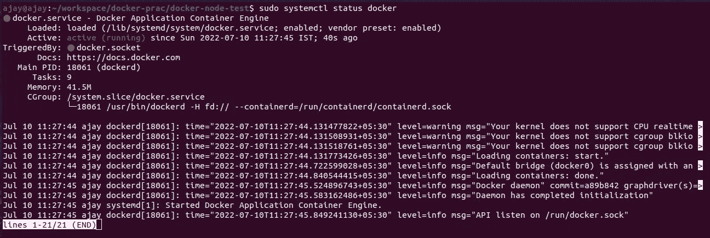
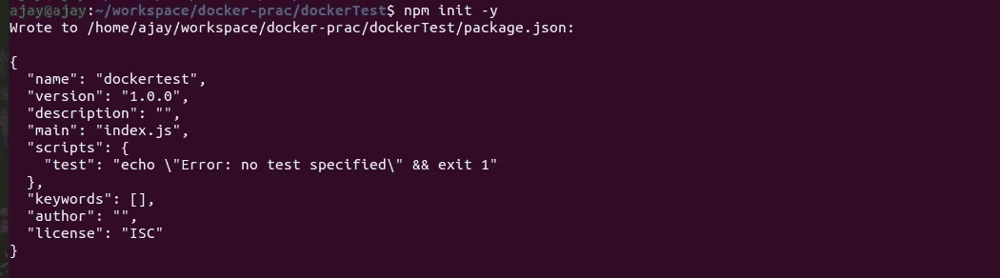

# 将 NodeJS 应用程序归档

> 原文：<https://blog.devgenius.io/dockerizing-your-nodejs-applications-71ae8b9ca913?source=collection_archive---------6----------------------->


Pic Credit @globenewswire

点击这个链接在你的机器上安装 docker。我正在使用 Ubuntu，所以你也可以在这里找到另一个操作系统安装指南。

确保您已经正确地按照上面的链接在您的系统上安装 Docker。

您可以键入以下命令来检查 docker 是否正在运行

```
sudo systemctl status docker
```

您将获得以下输出



Docker 状态图像

如果你在安装过程中遇到任何困难，欢迎在评论中提问。

# 创建 NodeJS 项目

首先为本教程创建一个单独的目录。我正在创建一个名为 dockerTest 的目录，你也可以用相同的名字创建目录，或者你可以命名任何你喜欢的名字

```
mkdir dockerTest
```

现在去那个目录

```
cd dockerTest
```

创建一个节点项目

```
npm init -y
```



现在让我们在 package.json 中添加 start 命令，我们将添加 index.js 作为我们的主文件。您的整个 package.json 文件将如下所示

```
{
  "name": "dockertest",
  "version": "1.0.0",
  "description": "",
  "main": "index.js",
  "scripts": {
    "start": "node index.js",
    "test": "echo \"Error: no test specified\" && exit 1"
  },
  "keywords": [],
  "author": "",
  "license": "ISC"
}
```

现在让我们安装 ExpressJS 作为依赖项并创建 index.js 文件

```
npm install express --save
touch index.js
```

在 index.js 文件中添加以下代码以运行节点服务器

```
const express = require("express");
const port = 3000;const app = express();app.get("/", (req, res) => {
    res.send("Hello Docker!");
});app.listen(port, () => {
    console.log(`App listening to port ${port}`);
})
```

现在运行 npm start 来检查您的应用程序是否正在运行。

# 为 NodeJS 应用程序创建 Dockerfile

`Dockerfile`是一个文本文档，包含用户可以在命令行上调用的所有命令，以组合一个图像。当我们告诉 Docker 通过执行`docker build`命令来构建我们的映像时，Docker 将读取这些指令并逐个执行它们，结果创建一个 Docker 映像。

让我们为我们的应用程序创建一个`Dockerfile`。在工作目录的根目录下，创建一个名为`Dockerfile`的文件，并在文本编辑器中打开这个文件。

```
FROM node:11-alpine
WORKDIR /appCOPY package.json package.jsonCOPY package-lock.json package-lock.jsonRUN npm installCOPY . .CMD ["npm", "run", "start"]
```

我会详细解释给你听，上面的代码是什么意思

```
FROM node:11-alpine
```

Docker 图像可以从其他图像继承。因此，我们将使用官方的 Node.js 映像，而不是创建自己的基本映像，该映像已经包含了运行 Node.js 应用程序所需的所有工具和软件包。当我们使用`FROM`命令时，我们告诉 docker 在我们的映像中包含`node:11-alpine image`的所有功能

```
WORKDIR /app
```

这指示 Docker 使用该路径作为所有后续命令的默认位置。这样，我们不必输入完整的文件路径，而是可以使用基于工作目录的相对路径。

```
COPY package.json package.jsonCOPY package-lock.json package-lock.json
```

在运行 npm 安装之前，我们需要将我们的`package.json`和`package-lock.json file`放入我们的映像中。我们将使用`COPY`命令来做到这一点。

```
RUN npm install
```

一旦我们在映像中有了 package.json 文件，我们就可以使用`RUN`命令来执行命令`npm install`。这与我们在本地机器上运行 npm install 完全相同，但是这次这些节点模块将被安装到我们的映像中的 node_modules 目录中。

```
COPY . .
```

此时，我们有了一个映像，并且已经安装了依赖项。我们需要做的下一件事是将我们的源代码添加到图像中。我们将使用 COPY 命令，就像我们在上面使用 package.json 文件一样。

```
CMD ["npm", "run", "start"]
```

此复制命令将获取当前目录中的所有文件，并将它们复制到映像中。现在我们所要做的就是告诉 Docker 当我们的映像在容器中运行时我们想要运行什么命令。我们使用 CMD 命令来实现这一点。

# 建筑图像

现在我们已经创建了 docker 文件，让我们来构建我们的映像。为此，我们使用 docker build 命令。`docker build`命令从 Docker 文件构建 Docker 映像。

build 命令可以选择使用–tag 或-t 标志。标签用于设置图像的名称和一个格式为“name:tag”的可选标签。为了简化事情，我们暂时不考虑可选的“标签”。如果您没有传递标签，docker 将使用“latest”作为它的默认标签。您将在构建输出的最后一行看到这一点。

让我们建立自己的码头工人形象

```
ajay@ajay ~/w/d/dockerTest [1]> docker build  -t node_api .
Sending build context to Docker daemon  2.416MB
Step 1/7 : FROM node:11-alpine
 ---> f18da2f58c3d
Step 2/7 : WORKDIR /app
 ---> Running in 0d7a6a65877f
Removing intermediate container 0d7a6a65877f
 ---> 820672d1fd2a
Step 3/7 : COPY package.json package.json
 ---> a19fa22366c4
Step 4/7 : COPY package-lock.json package-lock.json
 ---> 9a1ffd1c7ec6
Step 5/7 : RUN npm install
 ---> Running in 922d945558b3up to date in 0.862s
found 0 vulnerabilitiesRemoving intermediate container 922d945558b3
 ---> 18005269ff51
Step 6/7 : COPY . .
 ---> d72f51689d5d
Step 7/7 : CMD ["npm", "run", "start"]
 ---> Running in 5b12f51f1331
Removing intermediate container 5b12f51f1331
 ---> 04da2371794a
Successfully built 04da2371794a
Successfully tagged node_api:latest
```

# 查看本地图像

要列出图像，只需运行`images`命令。

```
ajay@ajay ~/w/d/dockerTest> docker images
REPOSITORY   TAG         IMAGE ID       CREATED          SIZE
node_api     latest      04da2371794a   34 minutes ago   77.6MB
node         11-alpine   f18da2f58c3d   3 years ago      75.5MB
```

# 运行 docker 容器

容器是一个正常的操作系统进程，只是这个进程是独立的，因为它有自己的文件系统、自己的网络和自己独立于主机的进程树。

为了在容器内部运行图像，我们使用 docker run 命令。`docker run`命令需要一个参数，那就是图像名。

启动容器，将端口 3000 暴露给主机上的端口 3000。

```
ajay@ajay ~/w/d/dockerTest> docker run -p 3000:3000  -t node_api> dockertest@1.0.0 start /app
> node index.jsApp listening to port 3000
```

现在您可以打开 localhost:3000，您将看到 NodeJS 应用程序正在运行。

你喜欢这篇文章吗？如果有，通过 [**订阅解码获得更多类似内容，我们的 YouTube 频道**](https://www.youtube.com/channel/UCvEB7wXUEXGFE9lCx0USR3Q) **！**

感谢阅读。同样的职位也可以在[http://ajaykrp.me/](http://ajaykrp.me/)上找到。