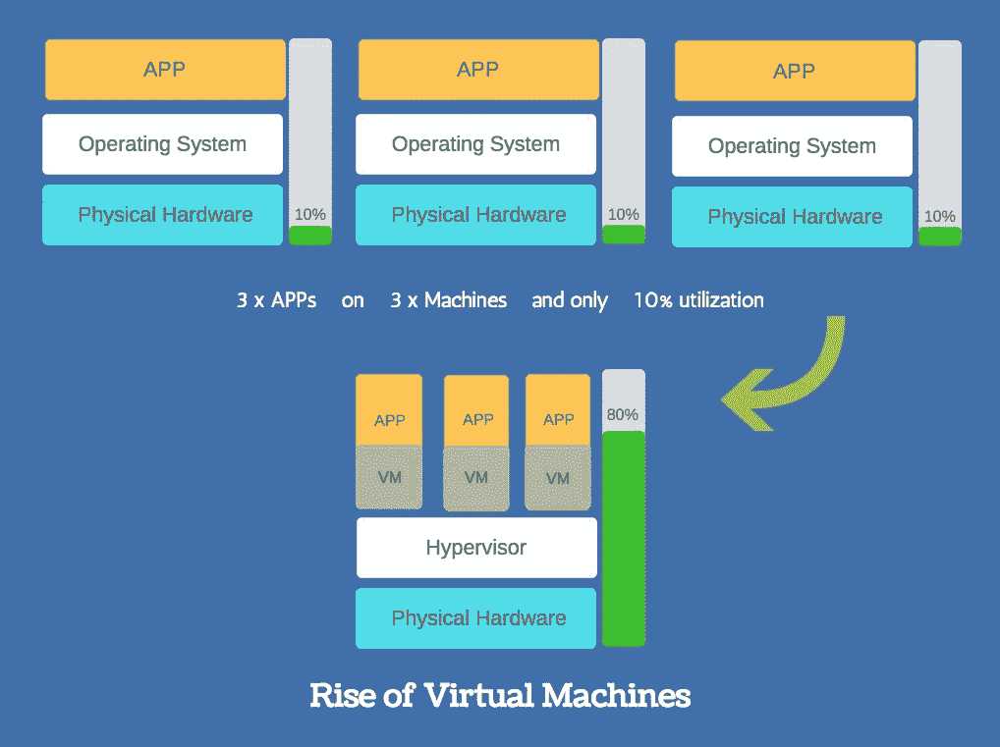
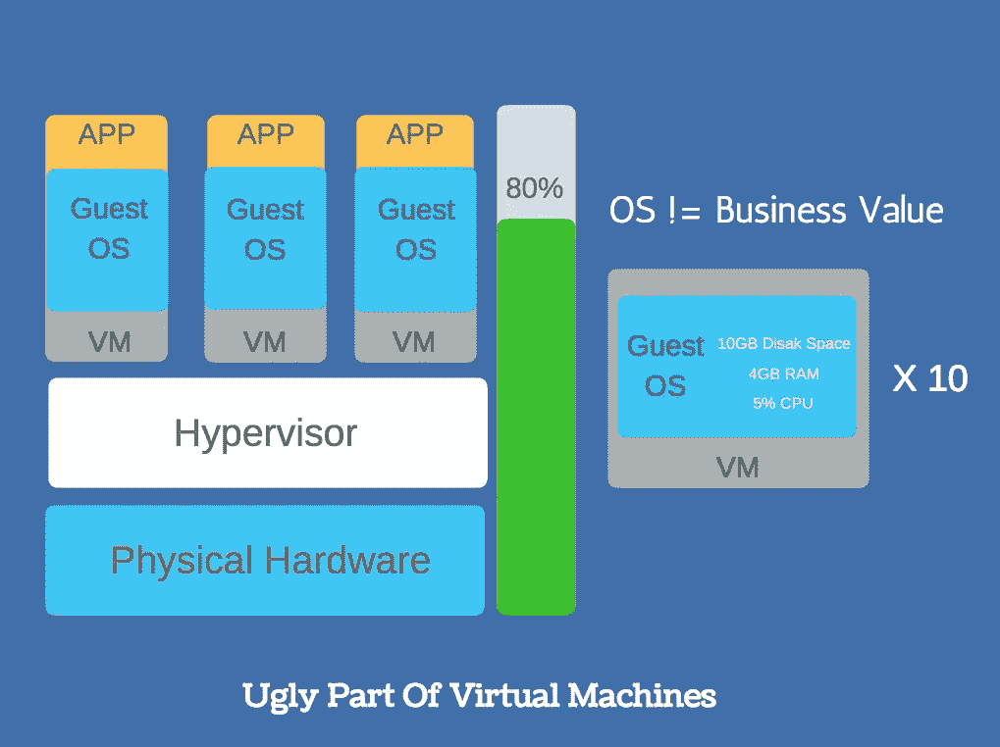
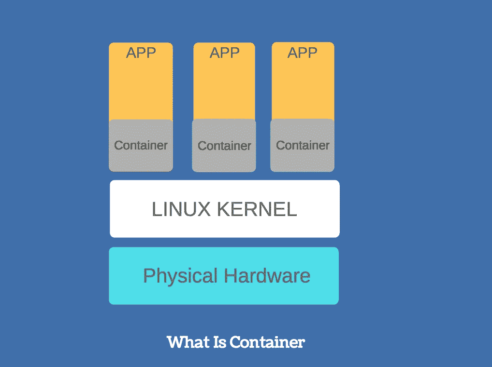
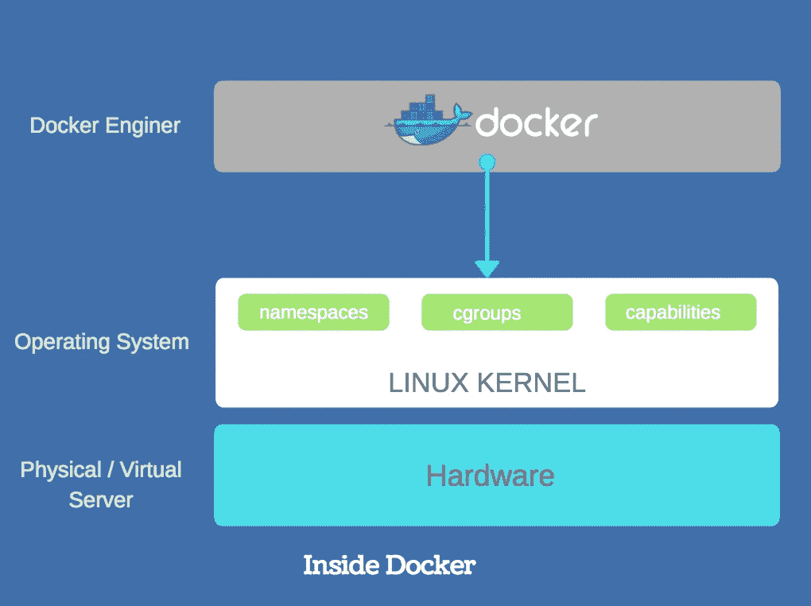

# 停靠码头集装箱—第 1 部分

> 原文：<https://blog.devgenius.io/docking-a-docker-container-part-1-6d67d51543c3?source=collection_archive---------2----------------------->

hy docker 的存在以及它如何为运行在云服务器或任何小型/中型/大型服务器上的应用程序解决问题。应用程序可以是低级的(系统编程)到高级的(web-apps)，这一点都不重要。

这是一种快速而肮脏的 docker 入门方式，所以请多包涵。

## **虚拟机的崛起**

使用传统硬件和软件的公司很久以前就解决了虚拟机管理程序或虚拟化问题，但只是为了满足他们自己的需求和应用程序。这种遗留的硬件或软件永远不会对其他人开放使用/利用，坦率地说，它从来没有打算这样做——我说的是一个偏执的封闭时代。(例:很多网络公司)。网络公司有一个非常合适的硬件+软件组合，可以在一个强大的分布式机箱上创建大量的 VPN 和硬件虚拟化。

但是后来，虚拟化领域的公司创建了一个环境，在这个环境中，主机操作系统可以允许来宾操作系统在其上运行。这更像是将一个完整的操作系统放在另一个之上。

他们解决的问题是，在整个系统上单独运行的应用程序几乎不使用 10%的系统资源，现在随着计算转向云，云提供商不可避免地无法向其客户提供完整的专用硬件。客户受其应用程序需求的驱动，他们很难一直充分利用这种专用资源，因此这对他们来说毫无用处，但仍然需要为完整的服务器/硬件付费。但是，当应用程序扩展时，他们需要附加资源，并希望动态地像“随用随付”一样。但是，对于现有的云基础设施，现收现付服务几乎是不可能的，而云提供商的资本支出和运营支出将是巨大而难以承受的。

因此，为了解决迫切的需求，公司提出了快速的虚拟机管理程序解决方案，但他们知道他们提供的只是变通办法，而不是完整的解决方案，因为仍有大量系统资源被浪费在日常管理中。因为创造云的整个前提是:

> **“应用软件==商业价值，其他的都是开销”**

## 虚拟机丑陋的一面

## 什么是容器？

Docker 是一个容器，它为给定的应用程序创建一个执行环境，以最小化系统访问和资源隔离的方式运行。我再重申一次，容器意味着隔离的完整执行环境。

## 码头内部

Dockers 是一个容器“运行时”。还有许多其他公司生产集装箱，但是 docker 现在已经成为事实上的标准。如果我打个比方——就像 *RedHat 和 Ubuntu 之于 linux* *内核*——类似的， *Docker 之于容器*。

Docker 提供了一个标准的运行时，意味着一个应用程序需要运行和执行的环境。应用程序需要设备、文件系统、特权、变量、函数、API 等资源，而不是完整的操作系统。这意味着开发人员可以在他们的笔记本电脑上的 docker 容器中编写他们的应用程序，然后将它们“按原样”放到 AWS、Azure 或任何地方，只要 docker 引擎或 docker 守护程序正在运行并且应用程序将工作。正如他们所说的*“建造、运输和运营它…”*

Docker 完成了创建容器的所有艰苦工作，其中实例化容器需要所有的名称空间、cgroups 和功能。Docker 具有客户端-服务器架构，因此客户端-服务器可以在同一台机器上，也可以在不同的机器上，并通过网络进行对话，docker 守护程序也称为 docker 引擎。

运行一个应用程序的整个想法是获得内核的一些非常具体的功能，而不是完整的操作系统。Docker 通过使用内核特性和创建 APP 运行的环境来实现这一点。这种访问是由 LXC (Linux 容器——Linux 执行驱动程序)提供的，但 docker 希望保持对所有功能的独立控制，创建了 *libcontainer* 库。 *libcontainer* 允许 docker 跨平台(这意味着 Linux、windows 等)而不依赖于 LXC，并独立进行 *libcontainer* 库特性开发。

**以下是 LXC 或 *libcontainer* 为 docker 创建可执行环境提供的高级特性:**

1.  [**命名空间**](https://en.wikipedia.org/wiki/Linux_namespaces) :独立进程树、网络栈、IP 表等。
2.  [**cgroups**](https://en.wikipedia.org/wiki/Cgroups) :资源限制、优先级、会计、控制
3.  [**能力**](https://en.wikipedia.org/wiki/Capability-based_security) :访问和特权，即 SELinux。

现在，Docker 不仅仅是一个容器，更像是一个平台。

1.  图像形式
2.  容器
3.  登记处
4.  使聚集
5.  编排:服务发现
6.  覆盖网络

在[下一个](https://medium.com/@tomdeore/docking-a-docker-container-part-2-c1206e7c6677#.5wjsezzgw)部分，我们将详细介绍其中的每一项，并获得一些动手操作的机会。敬请期待！

**可以在|**[**LinkedIn**](https://www.linkedin.com/in/mdeore/)**|**[**网站**](https://tomdeore.wixsite.com/epoch)**|**[**Github**](https://github.com/milinddeore)**|**