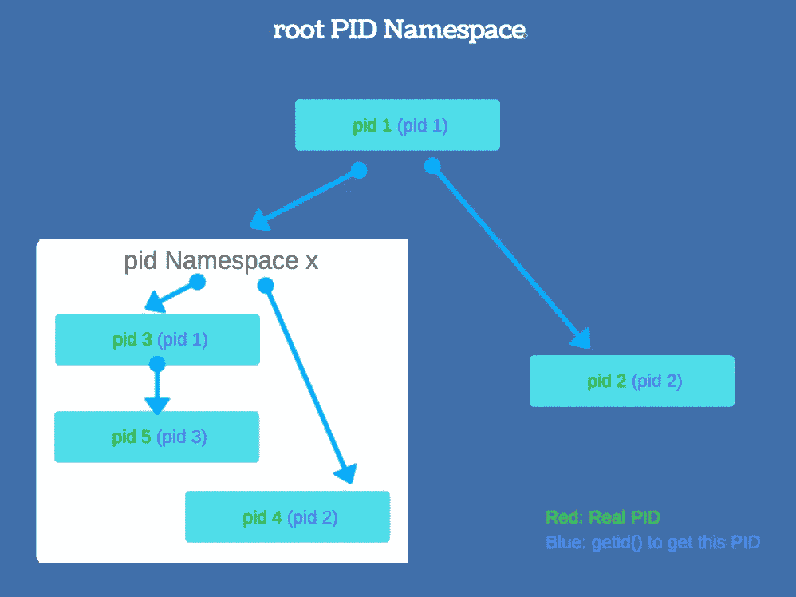

# 停靠 Docker 容器—第 2 部分:名称空间，cgroup

> 原文：<https://blog.devgenius.io/docking-a-docker-container-part-2-c1206e7c6677?source=collection_archive---------1----------------------->

[本系列的上一篇](https://medium.com/@tomdeore/docking-a-docker-container-part-1-6d67d51543c3#.gqlb01rmm)博客。

> 帮助弱者！打击网络犯罪[了解如何](https://forms.gle/JWAPHzf2gd7jGq2YA)。

在我的上一篇文章中，我总结说 docker 是一个平台，所以让我们理解一下，以及如何在设计中使用 docker。但是，在我们进入 docker 的使用部分之前，有必要看看它的内部，因为这使我们能够更好地讨论任何应用程序的设计。

Docker 是一个轻量级软件，它为应用程序创建了一个隔离的执行环境，其中没有两个应用程序可以相互干扰，但每个应用程序都认为它们是单独运行在整个系统上的。Docker 不是一个虚拟机，而是一堆具有特殊属性的进程，运行在普通的 linux 内核上，比虚拟机更透明。Docker 并不驻留在内核中，但是“namespace”和“cgroups”驻留在内核中，docker 使用它们创建了一个叫做 container 的舒适的小环境。听起来是不是很有趣？所以让我们进入内部，它利用现有 linux 资源的方式，特别是 ***名称空间*** 。这篇文章讨论了如何在 Linux 上创建这样一个环境。

# Linux 名称空间和 Docker 隔离

为什么需要隔离？简而言之:安全性、高可用性、避免依赖性、可测试性、部署等。该需求还要求对应用程序进行更好的控制，这是通过将应用程序分解成小的逻辑子系统(在每个容器中)来实现的，这样就可以独立、方便地对它们进行监控。但是不要因为把应用程序分解得太小而忘乎所以，这样会增加容器本身的延迟和开销。顺便说一下，这样将一个大的应用程序分解成小的逻辑部分叫做 [***微服务***](https://en.wikipedia.org/wiki/Microservices) 。

现在真正重要的是如何隔离容器？这是通过在“容器”中运行流程来实现的。“没错！”在 docker 容器中运行 UNIX 进程就像在虚拟机中运行它们一样。虚拟机(VM)通常通过在主机操作系统上运行来宾操作系统来模拟硬件，以创建进程隔离，因此 VM 非常重。而 Docker 容器使用很少的操作系统特性(包括名称空间)并创建轻量级隔离。

## Linux 名称空间

随着 Linux [名称空间](https://en.wikipedia.org/wiki/Linux_namespaces)的引入，“嵌套”进程树成为可能，这意味着每个进程都可以拥有自己独立的进程树以及系统资源，如(进程 id、主机名、用户 id、网络访问、[进程间通信](https://en.wikipedia.org/wiki/Interprocess_communication)和[文件系统](https://en.wikipedia.org/wiki/Filesystem))。现在，来自不同进程树的进程不能检查/终止另一个进程树中的进程。



每次系统启动时，PID1(也称为“init”或 root)进程都会启动，树中该进程下的所有其他进程都会启动。使用 PID 命名空间隔离，子命名空间中的进程无法知道父进程的存在。但是，父命名空间中的进程拥有子命名空间中进程的完整视图，就像它们是父命名空间中的任何其他进程一样。

*   为容器创建一个新的命名空间，并在 for [clone](https://linux.die.net/man/2/clone) ()系统调用中定义特定的标志。

```
/* **CLONE_NEWPID** would create new PID namespace */
clone(cb, *stack, **CLONE_NEWPID** | SIGCLD, NULL); 
```

*   同样，每个容器可以有自己的网络名称空间。这实质上意味着每个容器都有自己的网络堆栈(设备接口、TCP/IP 协议栈、IP 表、防火墙规则、目录树等)

```
/* **CLONE_NEWNET** would create new network namespace */
clone(cb, *stack, CLONE_NEWPID | **CLONE_NEWNET** | SIGCLD, NULL);
```

*   所有进程都存在于挂载命名空间中，启用该特性的标志是 CLONE_NEWNS

```
/* **CLONE_NEWNS** would create new mount namespace */
clone(cb, *stack, CLONE_NEWPID | CLONE_NEWNET | **CLONE_NEWNS** | SIGCLD, NULL);
```

*   进程间通信( **IPC** )，UNIX 分时系统( **UTS** )，用户 ID:

```
/* **CLONE_NEWUTS | CLONE_NEWIPC** would create new PID namespace */
clone(cb, *stack, CLONE_NEWPID | CLONE_NEWNET | CLONE_NEWNS | **CLONE_UTS | CLONE_NEWIPC** | SIGCLD, NULL);
```

到目前为止，我们已经了解了如何在一个系统中隔离容器，为它们提供运行所需的所有流程级基础设施。现在，问题来了，如果这些容器的管理是为了忠实的系统利用率，或者某种方式来控制基于容器的系统以获得更好的系统资源利用率，会怎么样呢？幸运的是，这个谜团可以通过另一个名为 [**cgroups**](https://wiki.archlinux.org/index.php/Cgroups) **(控制组)的 linux 特性来解决。**

# 控制组:组

cgroups 本质上是资源管理器，可以控制系统中每个进程组的下列物理资源:

**配置资源分配:**

*   CPU 消耗
*   内存消耗
*   桌面 I/O 消耗
*   网络消费
*   设备限制

**聚会:**

*   资源会计。

有两种不同的控制参数/规则可以应用于一个组:

1.  极限:就像绝对值，就像一个进程可以消耗多少字节的内存。
2.  优先级:进程从给定资源的桶中获得的份额。默认情况下，所有优先级开关都设置为平衡，即系统中的所有资源都平均分配给组中的所有进程，包括 CPU 和磁盘 IO。但是，根据应用程序的要求，有时某些组的资源分配需要改变。

**限制内存**

与限制 CPU 相比，限制内存很容易。限制可以有两种类型:硬限制和软限制。**硬** **限制** —如果系统超过硬限制，随机进程将被终止。但是如果 docker 容器超出了硬限制，那么容器进程就会被终止，而不是任何随机容器。这是每个容器有一个服务的另一个原因。**软**事实上，现在有了 [oom-notifier](http://tree.celinuxforum.org/CelfPubWiki/ELC2009Presentations?action=AttachFile&do=get&target=celf_mem_notify.pdf) (避免 oom 杀手)，我们可以在达到限制时在 cgroup 中设置通知:冻结组中的所有进程，通知用户空间，取消/提高限制/迁移容器，当系统的内存限制清除时，解冻组中的所有进程。

```
**Brief summary of control files (**[**details**](https://www.kernel.org/doc/Documentation/cgroup-v1/memory.txt)**).** 
 **tasks**				 # attach a task(thread) and show     list of threads
 **cgroup.procs**			 # show list of processes
 **cgroup.event_control**		 # an interface for event_fd()
 **memory.usage_in_bytes**		 # show current usage for memory
 **memory.memsw.usage_in_bytes**	 # show current usage for memory+Swap
 **memory.limit_in_bytes**		 # set/show limit of memory usage
 **memory.memsw.limit_in_bytes**	 # set/show limit of memory+Swap usage
 **memory.failcnt** 		 # show the number of memory usage hits limits
 **memory.memsw.failcnt**		 # show the number of memory+Swap hits limits
 **memory.max_usage_in_bytes**	 # show max memory usage recorded
 **memory.memsw.max_usage_in_bytes** # show max memory+Swap usage recorded
 **memory.soft_limit_in_bytes**	 # set/show soft limit of memory usage
 **memory.stat**			 # show various statistics
 **memory.use_hierarchy**		 # set/show hierarchical account enabled
 **memory.force_empty**		 # trigger forced move charge to parent
 **memory.pressure_level**		 # set memory pressure notifications
 **memory.swappiness**		 # set/show swappiness parameter of vmscan
 **memory.move_charge_at_immigrate** # set/show controls of moving charges
 **memory.oom_control**		 # set/show oom controls.
 **memory.numa_stat**		 # show the number of memory usage per numa node
 **memory.kmem.limit_in_bytes**      # set/show hard limit for kernel memory
 **memory.kmem.usage_in_bytes**      # show current kernel memory allocation
 **memory.kmem.failcnt**             # show the number of kernel memory usage hits limits
 **memory.kmem.max_usage_in_bytes**  # show max kernel memory usage recorded

 **memory.kmem.tcp.limit_in_bytes**  # set/show hard limit for tcp buf memory
 **memory.kmem.tcp.usage_in_bytes**  # show current tcp buf memory allocation
 **memory.kmem.tcp.failcnt**            # show the number of tcp buf memory usage hits limits
 **memory.kmem.tcp.max_usage_in_bytes** # show max tcp buf memory usage recorded
```

**限制 CPU**

这将在整个 cgroup 的粒度上检查 CPU 的使用情况。它跟踪以下内容:

*   跟踪用户/系统 CPU 时间。
*   跟踪每个 CPU 的使用情况。
*   允许设置权重(CPU 的份额)。
*   不能设限:这里有个取舍！比方说，如果您设置了少量的 CPU 百分比，并且有大量的 CPU 周期可用，那么大多数现代 CPU 将降低时钟速度，然后降低常规速度，这会降低所有速度，但现在您的应用程序需要更多的 CPU 百分比，同样，这也成为了一个第 22 条军规的情况。因此，我们可以尝试给定 CPU 周期，但同样，处理器是 RISC 而不是 CISC，很难知道您的应用程序将在这些 CPU 上进行的优化类型，因此计算指令数量也没有意义。在这种情况下，您可以设置 CPU 的百分比更好。这就是 cgroup 引入“权重”或“CPU 份额”的原因。这是一篇关于 cgroup 用法的非常好的文章。

CPU 限制有两种类型:

1.特定 CPU 内核上的 cgroups:有时应用程序需要一组任务在特定的 CPU 内核上运行。

2.限制实际使用:当一个特定的任务需要更多的 CPU 份额来执行时。

```
**Brief summary of control files (**[**details**](https://docs.fedoraproject.org/en-US/Fedora/17/html-single/Resource_Management_Guide/index.html#ch-Subsystems_and_Tunable_Parameters)**):****cpu.shares**                       # Specify a relative share of CPU time available to the tasks in a cgroup.
**cpuset.cpus**                      # list of CPUs in that cpuset
**cpuset.mems**                      # list of Memory Nodes in that cpuset 
**cpuset.memory_migrate**            # if set, move pages to cpusets nodes
**cpuset.cpu_exclusive **            # is cpu placement exclusive?
**cpuset.mem_exclusive**             # is memory placement exclusive?
**cpuset.mem_hardwall**              # is memory allocation hardwalled
**cpuset.memory_pressure**              # measure of how much paging pressure in cpuset
**cpuset.memory_spread_page**        # if set, spread page cache evenly on allowed nodes
**cpuset.memory_spread_slab**        # if set, spread slab cache evenly on allowed nodes
**cpuset.sched_load_balance**        # if set, load balance within CPUs on that cpuset
**cpuset.sched_relax_domain_level**  # the searching range when migrating tasks
**cpuset.memory_pressure_enabled**   # compute memory_pressure?
```

**限位块 IO**

也有一些用于控制块 IO 的开关，但是它们类似于 CPU 参数，因此将不涉及它们，而是留给您这个[文档](https://access.redhat.com/documentation/en-US/Red_Hat_Enterprise_Linux/6/html/Resource_Management_Guide/ch-Subsystems_and_Tunable_Parameters.html#sec-blkio)。

# **下一步**

docker 容器到容器的联网是如何发生的，[接下来](https://medium.com/@tomdeore/docking-a-docker-container-part-3-networking-edd779f068cb#.ak1agqiz0)...

**你可以在|**[**LinkedIn**](https://www.linkedin.com/in/mdeore/)**|**[**网站**](https://tomdeore.wixsite.com/epoch)**|**[**Github**](https://github.com/milinddeore)**|**