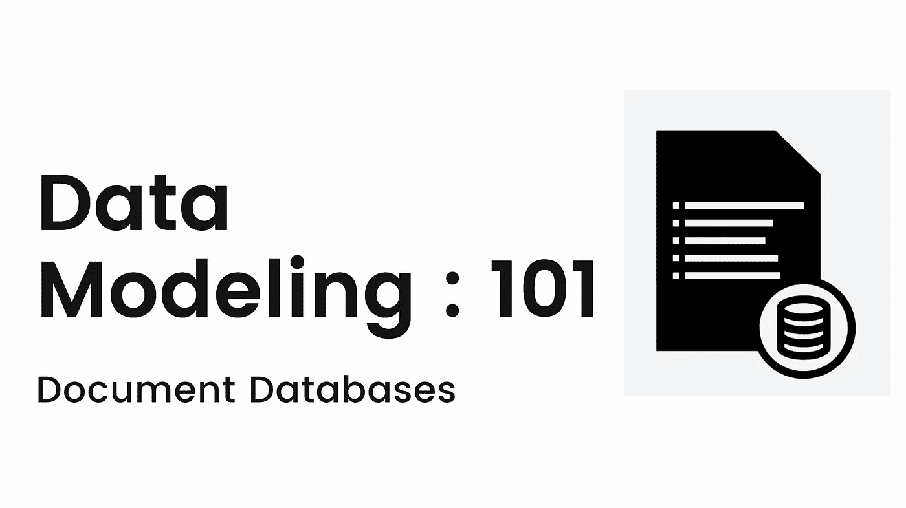
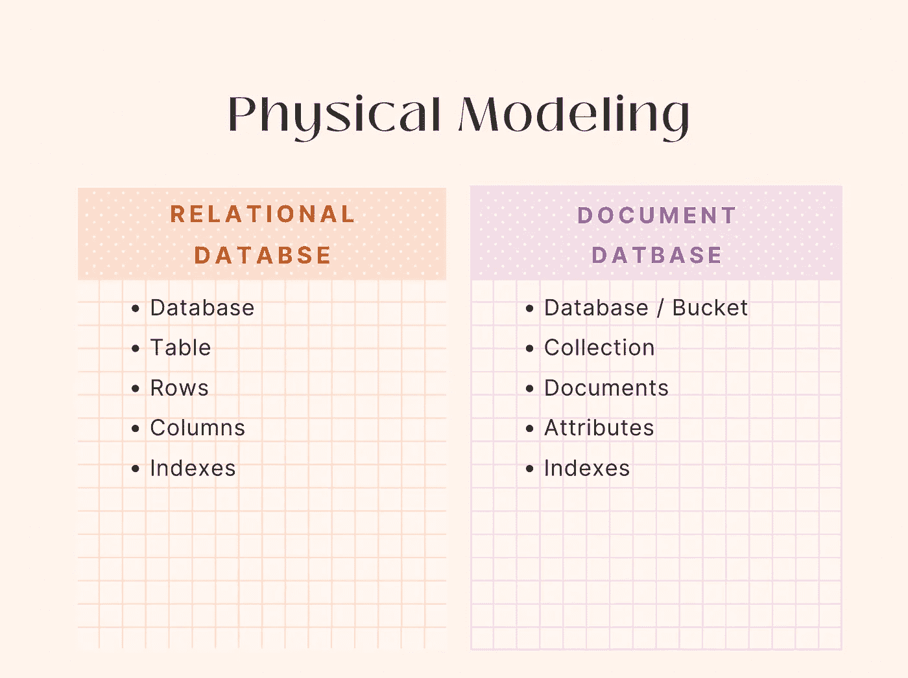

# 文档数据库的数据建模:101

> 原文：<https://blog.devgenius.io/document-dbs-data-modeling-101-7df06a6da21e?source=collection_archive---------2----------------------->

这篇博客是我们从零开始讨论 101 个概念的系列文章的一部分，读者的入门知识有限。这篇文章属于 ***中级*** 系列，因为它涉及到对文档数据库**中**数据建模**的理解。**与传统的 SQL 数据库相比，文档数据库为开发人员提供了更大的灵活性和可伸缩性，已经成为分布式应用程序的流行选择。

101 系列中的一些早期博客如下:

[**数据库复制 101**](/database-replication-101-d148514598a7) [**数据库分片 101**](/database-sharding-101-4ef36046c29c) [**缓存策略 101**](/caching-strategy-101-3bc974d2a6cd)**[**断路器 101**](/circuit-breaker-pattern-101-be2d7fdb656) [**异步通信 101**](/async-communication-101-b04d5c95333a)[**数据库设计**](/database-design-101-7c019d69b97f)**

****

# **什么是文档数据库？**

**文档数据库是 [**NoSQL**](https://en.wikipedia.org/wiki/NoSQL) 数据库的子集，它以 *json 类文档*的形式存储数据，不像表格行和列的定义模式。与 SQL 数据库不同，DB 实例中的不同文档在存储字段上可能有所不同，因此很容易满足业务需求的新数据需求。**

**每个文档都由一个唯一的关键字引用，通常是系统生成的值。此外，给定的应用程序代码可以围绕文档中的字段建模，而不是使用复杂的 SQL 查询，这有助于提高开发人员的整体生产力。**

# **什么是数据建模？**

****数据建模**决策主要围绕应用程序的访问模式，即*需要一起访问的字段需要存储在单个文档中*。**

**与关系数据库不同，在将文档存储到集合中之前，固定的数据模型不是强制性的。但是，建议添加每个文档类型所需的最少字段的数据验证。不经常访问的字段可以使用 [**数据库引用**](https://www.mongodb.com/docs/manual/reference/database-references/) **链接到单独的文档中。****

## **逻辑数据建模**

**该步骤包括定义文档的逻辑元素，即**实体键、实体属性和实体关系**。**

*   **实体键是引用文档的唯一键/键集。例如: *_id 是 mongodb* 中默认的主键。**
*   **实体属性可以是数据类型的组合，如*字符串、布尔值、数组等***
*   **根据文档之间的关系，实体关系可以是**一对一、一对多或多对多关系****

## **物理数据建模**

**这一步涉及物理容器的定义，以存储被定义为逻辑建模一部分的实体和文档。**

****

# **文档设计—实体关系**

**文档的 JSON 结构允许使用**嵌入**(嵌套结构)或使用主键创建相关文档的**引用**来定义关系。**

*   **一个完全 [**规范化的数据模型**](https://hevodata.com/learn/mongodb-data-modeling/) 将每个实体存储为一个单独的文档，实体关系使用引用来定义。这类似于关系数据库模式，使用这种模式妨碍了固有的灵活性。**
*   **在另一个极端**反规范化**端，所有相关的实体都可以存储在一个大文档中。然而，这将导致实体重复以及扩展的存储需求。**

## **一对一的关系**

**一对一关系是整体数据建模中两个不同实体之间的单一关联。对于这种模式，最好是**在同一个文档中嵌入实体**。**

*****员工与身份证的前关系。*****

## **一对多关系**

**一对多关系是指一种类型的实体与另一种类型的多个实体相关。为了决定是引用还是嵌入**

*   **如果关系的基数较小，并且需要一起访问数据，那么最好将实体嵌入到单个文档中。 ***前任——员工和工作项目。*****
*   **但是，如果数据访问不频繁或者基数随时间变化，那么引用相关实体是首选。**

## **多对多关系**

**在多对多关系中，关键的决策指南是相关实体的上限基数/界限**

*   **当被引用实体的基数是静态的时， [**子引用**](https://www.mongodb.com/docs/manual/tutorial/model-tree-structures-with-child-references/) 是首选。父文档本身可以引用其父文档中的所有相关子文档。**
*   **[**当被引用实体的基数增长时，建议使用父引用**](https://www.mongodb.com/docs/manual/tutorial/model-tree-structures-with-parent-references/) 。每个新的子文档都可以添加对父文档主键的引用。**

# **摘要**

**NoSQL 数据库中的数据建模决策通常是基于从客户流量中观察到的数据访问模式而发展的。json 数据结构的*灵活性加上文档的版本控制*可以作为关系数据库中模式设计的一个很好的进步。然而，它们的主要缺点是不支持数据库事务的 ACID 规则。**

**大多数云产品，如 **AWS、Azure**等，都以 PAAS 的形式提供文档数据库。[**AWS document db**](https://aws.amazon.com/documentdb/)**，**[**Azure Cosmos**](https://azure.microsoft.com/en-in/services/cosmos-db/)**等是工程团队常用的数据库选择**。**

***如需反馈，请留言至****Amit[dot]894[at]Gmail[dot]com****或联系*[*https://about.me/amit_raj*](https://about.me/amit_raj)*的任何链接。***