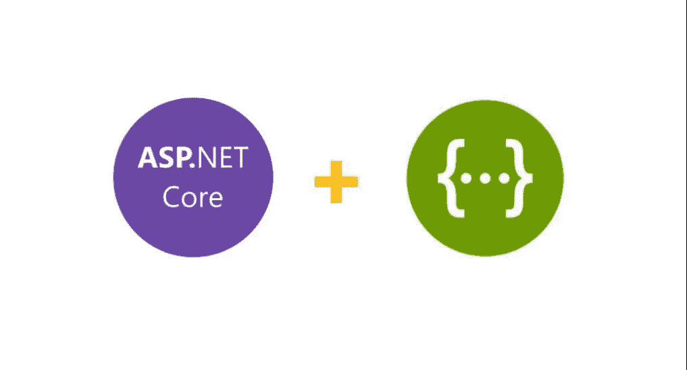
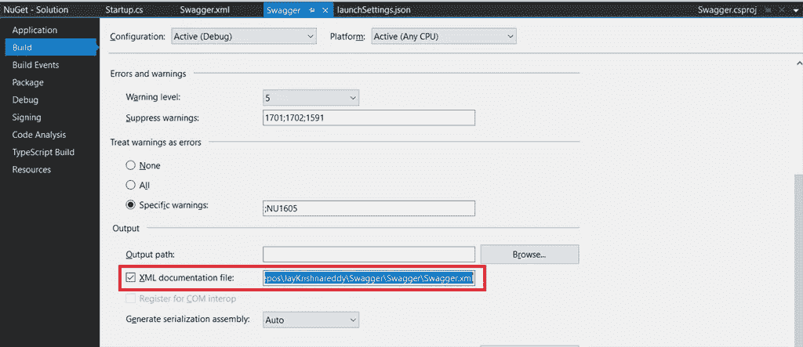

# 在 ASP.NET 核心文件中记录您现有的 API 和(开放 API)规范

> 原文：<https://blog.devgenius.io/document-your-existing-apis-with-open-api-specification-in-asp-net-core-a4a2bf1910d8?source=collection_archive---------2----------------------->

应用程序接口📗时髦的

***I*** *n* 这篇文章，我们将学习如何用。净 and.Net 核心。许多开发人员绝对不喜欢写文档。用手工写的方式把这些东西都放在一个文档里很无聊。为了克服这一点，我们不得不大摇大摆地实现文档，这是一个开源的 API 文档工具。

配置 Swagger 所需的包，

1.  Swashbuckle。AspNetCore(最新版本)——这个包增加了 Swagger 和 Swagger UI 以及其他库，让我们可以轻松地创建 API 文档。

***第一步***

将软件包安装到相应的项目后，如果你是 ASP.Net 核心的 Swagger 新手，我在这里分享截图供你参考

图一

***步骤 2-设置***

我们需要使我们的项目能够生成 XML 注释。这些注释来自整个代码中的三重斜杠(///)注释。

首先，在项目属性中，选中标记为“生成 XML 文档”的框

右键单击解决方案，然后单击属性

图二

您可能还想取消警告 1591，它现在会对任何没有三斜线注释的方法、类或字段给出警告。

图三

***第三步*** *-* ***配置霸气***

*Startup.cs*

*launchSettings.json*

***XML 注释***

在方法的 XML 注释中。

*天气控制器. cs*

以下是正在使用的 XML 节点:

*   总结:对我们的方法/类/字段是什么或做什么的高层次总结。
*   备注:关于方法/类/字段的其他详细信息
*   param:方法的参数，以及它所代表的内容
*   returns:对方法返回内容的描述。

***输出—查看摆动***

图 4

下面是对 Swagger UI 中什么是什么的清晰描述

图五

 [## JayKrishnareddy/Swagger

### 在 ASP.Net Core-JayKrishnareddy/Swagger 中使用 Swagger 记录您现有的 API

github.com](https://github.com/JayKrishnareddy/Swagger) 

感谢您的阅读，请在评论区告诉我您的问题、想法或反馈。感谢您的反馈和鼓励。

> 通过[雇佣熟练且经验丰富的 ASP.NET 核心开发人员](https://www.bacancytechnology.com/dot-net-core-developer)，让你的项目更上一层楼。

不断学习和探索…！！！