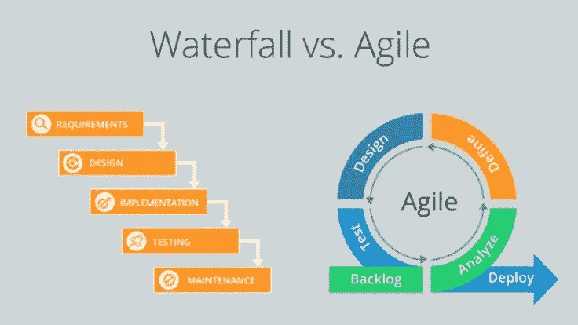
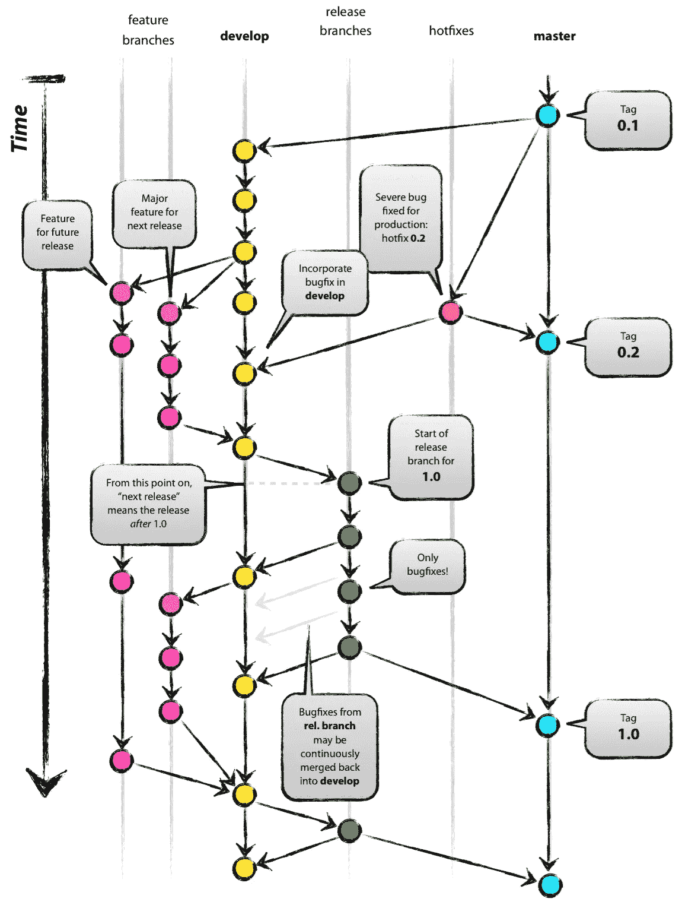
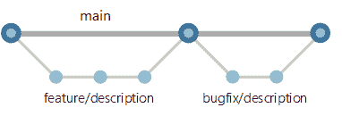
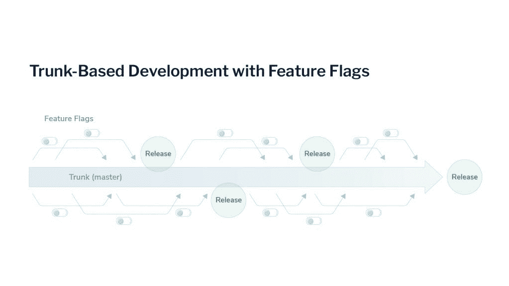

# GitFlow 适合敏捷团队吗？

> 原文：<https://blog.devgenius.io/does-gitflow-fit-in-an-agile-team-b3cb85fbdbc6?source=collection_archive---------12----------------------->

图片来自穆罕默德·哈桑:“[https://pxhere.com/en/photo/1444193](https://pxhere.com/en/photo/1444193)

无论你是在 CS 入门课程中构建一个团队项目，还是在一个经验丰富的 DevOps 团队中工作，建立有效的方法来合并不同的代码库并推出项目/功能是最重要的；简单来说，所有的软件开发者都需要某种*版本控制系统*和协同*工作流*。在 DevOps 世界里，你经常听到的两个短语是 *GitFlow* 合并策略和*敏捷*工作流。两者都承诺保持开发团队的适应性、通用性和长期可持续性。难怪您会经常看到这两者同时实现。然而，对这种模式的批评近年来越来越多，而且理由充分。所以我们问这个问题，“【GitFlow 真的适合敏捷团队吗？”。

## 敏捷工作流概述

总之，敏捷提倡*增量*和*迭代*开发。传统的项目生命周期是在最后一个阶段完成后才经历每个阶段(*设计/实现/测试/部署*),与之不同的是，敏捷提倡团队将项目分成更小的“片段”或任务，并经历每个片段的整个生命周期，不断推出功能，而不是一次性完成。

图 1:敏捷项目生命周期与传统项目生命周期的对比"[https://www . trust radius . com/buyer-blog/difference-between-Agile-vs-fault](https://www.trustradius.com/buyer-blog/difference-between-agile-vs-waterfall)"

## GitFlow 简评

在一个项目中处理不同特性的开发人员需要一种方法来将所有这些不同的源代码组合成一个代码库。此外，合并一个代码库不应该干扰其他部分(开发人员协作的恐怖故事永远不会停止！).GitFlow，正如它的创建者 Vincent Driessen 所描述的，是一个“分散但集中”的存储库设置。

每个存储库至少有两个版本:在“主分支”上的版本和在“开发分支”上的版本。开发人员从不直接在主分支之外工作。此外，通过将开发分支上的代码版本复制到实际设计/实现源代码的新“功能分支”来创建新功能。一旦特性被测试和批准，所有反映在开发分支上的变更可以替换主分支并被部署。

这种直观的策略允许开发团队 **1。**跟踪项目时间表中的所有变更， **2。**轻松回滚到先前版本代码库的更改，以及 **3 .**一次同时处理不同的功能。

**如果您有兴趣了解更多关于 GitFlow 的信息，请查看 Vincent Driessen 的原创* [*博客文章*](https://jhall.io/archive/2021/03/09/gitflow-is-anti-agile/) *解释 GitFlow 分支和合并策略***

## 评论已经出来了，但还没有达成一致…

在敏捷团队中使用 GitFlow 的问题与任何一个单独的策略都没有什么关系。两者的原理都相对简单，并且易于集成到现有的 DevOps 团队中。一些有声望的公司，像 [Atlassian](https://www.atlassian.com/agile/software-development/git) ，发誓在他们的敏捷团队中使用 GitFlow。但这远不是一个行业标准。主要的问题是，GitFlow 在高层逻辑上与敏捷的轻量级和迭代过程相矛盾。

看看 GitFlow 原型模型:

图 2:文森特·德里森"[https://nvie.com/posts/a-successful-git-branching-model](https://nvie.com/posts/a-successful-git-branching-model/)/"

乍一看，它是如何工作的并不十分明显，是吗？

## GitFlow 令人困惑

不清楚实施或部署的点在哪里。更不用说，你甚至可能花了一段时间才找到开发分支在哪里(它是黄色的分支)。随着特性和分支的增加，GitFlow 变得越来越复杂和混乱。古语有云:“亲**亲**:**K**eep**I**t**S**imple， **S** tupid”。随着应用程序变得更加复杂，DevOps 团队变得更加远程和自主，以及像[微服务](https://microservices.io/)这样的设计更加流行，GitFlow 的价值迅速下降。这很容易出错，而且很难看出敏捷方法适合在哪里。

## GitFlow 对敏捷来说是矛盾的

对于敏捷方法来说，团队的工作流程必须是增量的和迭代的。然而，GitFlow 违背了这些基本原则。如果您在* *图 2** 中跟踪 GitFlow 模型中的开发分支，您将会看到一个新的特性分支被添加到项目周期的开始。然后，在开发部门(所有的**开发人员都在这里工作)实施之前，它会经过一个完整的设计阶段，这样测试和错误修复就可以开始了。被批准的特性最终被部署并与主分支合并。**

尽管这个过程听起来非常类似于敏捷，但它实际上是项目管理的瀑布方法**参见图 1*。如果开发人员不断被鼓励去“完成”一个特性，保持持续的部署是非常困难的；合并这一特性意味着将开发分支上的所有变更手动推送到主分支进行部署。这种过程没有任何增量。*

## 如果 GitFlow 出来了，那里面是什么？

完全忽视 GitFlow 可能为时过早。正如本博客开头所述，一些公司发现这种类型的设置很有价值。然而，如果您的敏捷团队正在使用 GitFlow，并且之前的担忧引起了您的共鸣，那么下面是一些行业专业人士正在转向的替代方案:

**特征分支**

图 3:“[https://docs . Microsoft . com/en-us/azure/devo PS/repos/git/git-branching-guidance？view=azure-devops](https://docs.microsoft.com/en-us/azure/devops/repos/git/git-branching-guidance?view=azure-devops)

这个策略将分支流程简化为两个分支:一个主流程和一个功能流程。在销毁分支并开始下一个功能之前，会创建、完成和部署一个功能。它坚持保持分支*短暂并且相互隔离*的原则(避免过程中的合并冲突)。

这种策略的缺点是，在主分支被合并之前，您永远无法确定您的特性代码是否仍然与主分支兼容。它还需要开发人员之间更好的协调和依赖，以避免合并冲突，并决定以什么顺序实现哪些功能。

**基于主干的开发**

图 4:"[https://launch darky . com/blog/introduction-to-trunk-based-development/](https://launchdarkly.com/blog/introduction-to-trunk-based-development/)"

对于经验丰富的 DevOps 团队来说，这种策略包括直接在主分支上进行变更，并在整个项目生命周期中不断地将小的变更或特性标志推送到主分支。在使用短命分支方面，它甚至比特性分支更好。此外，开发人员有更多的自由将不完整的特性合并到代码库中，满足了增量敏捷原则。

直接在主分支之外工作本身就有风险，所以初级开发人员可能不应该尝试基于主干的策略。不仅暴露了项目的生命线，而且很难配置一个在部署后对最终用户隐藏不完整特性的过程。开发人员也需要经验和更强的意识来组织特性标志，并在它们开始构建之前解决它们。

## 有没有对每个人都有效的灵丹妙药？

不幸的是，没有“最佳分支策略”。无论您的团队实施什么策略，都高度依赖于您的特定需求。如果您正在选择要实施的策略，请记住以下问题:

1.  这种分支策略会解决什么问题？
2.  会产生什么问题？
3.  你的团队喜欢如何发布代码？*一天多次？一个月一次？准备好了吗？*
4.  合并这个策略将如何改变你的团队的开发行为？